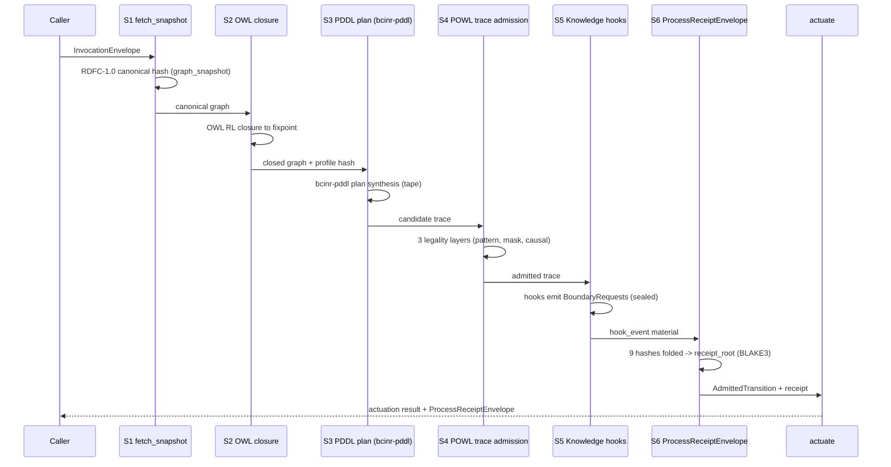

# AB-01 — Pipeline Sequence (S1–S6, As Built)

| Facet | Value |
|---|---|
| Invariant | Receipts are computed (BLAKE3) from canonical material, never asserted; no wall clock in S1–S6 |
| Information-Loss Risk | Stage outputs not bound into receipt_root would be unauditable; every stage hash is folded into S6 |
| TPS Purpose | One-piece flow: each envelope passes all six stations in order, no rework loops |
| DfLSS CTQ | Byte-identical receipt_root for identical InvocationEnvelope inputs |
| CENG Boundary | actuate() accepts only AdmittedTransition; nothing bypasses S4 admission |

