# AB-02 — Refusal Taxonomy by Emitting Stage (As Built)

| Facet | Value |
|---|---|
| Invariant | Every error is a typed Refusal variant; no panics or silent defaults anywhere in the pipeline |
| Information-Loss Risk | A catch-all error would erase which stage and which law refused; each variant names its cause |
| TPS Purpose | Andon cord: any station can stop the line with a named, traceable defect signal |
| DfLSS CTQ | 100% of Refusal variants have at least one end-to-end negative test |
| CENG Boundary | Refusals are terminal at their emitting stage; downstream stages never see refused work |

```mermaid
flowchart TD
    R[Refusal ~29 variants]

    R --> B[Boundary]
    B --> B1[UnknownVocabulary]
    B --> B2[UnsupportedFeature]
    B --> B3[MalformedEnvelope]
    B --> B4[SealedRequestViolation]

    R --> T8[Triple8]
    T8 --> T1[UniverseOverflow term 257]
    T8 --> T2[UnknownTerm]
    T8 --> T3[ProjectionHashMismatch]
    T8 --> T4[FenceViolation]

    R --> A[Admission]
    A --> A1[RequiredMaskUnmet]
    A --> A2[ForbiddenMaskHit]
    A --> A3[IllegalTransition]
    A --> A4[TraceLegalityFailure]

    R --> RT[Routing]
    RT --> R1[ConstraintBudgetExceeded]
    RT --> R2[N3QuarantineActuation]
    RT --> R3[LerEscalationRefused]
    RT --> R4[ColdPathUnavailable]

    R --> I[Integrity]
    I --> I1[ReplayMismatch per-field]
    I --> I2[ReceiptRootMismatch]
    I --> I3[SnapshotHashMismatch]
    I --> I4[NonCanonicalMaterial]

    R --> AG[Agents]
    AG --> G1[UnknownAgent]
    AG --> G2[HookSchedulingCycle]
    AG --> G3[UnauthorizedBoundaryRequest]

    R --> TO[Type-Ownership]
    TO --> O1[ForeignTypeConstruction]
    TO --> O2[WrapperBypass]
    TO --> O3[OwnershipBoundaryCrossing]
```

