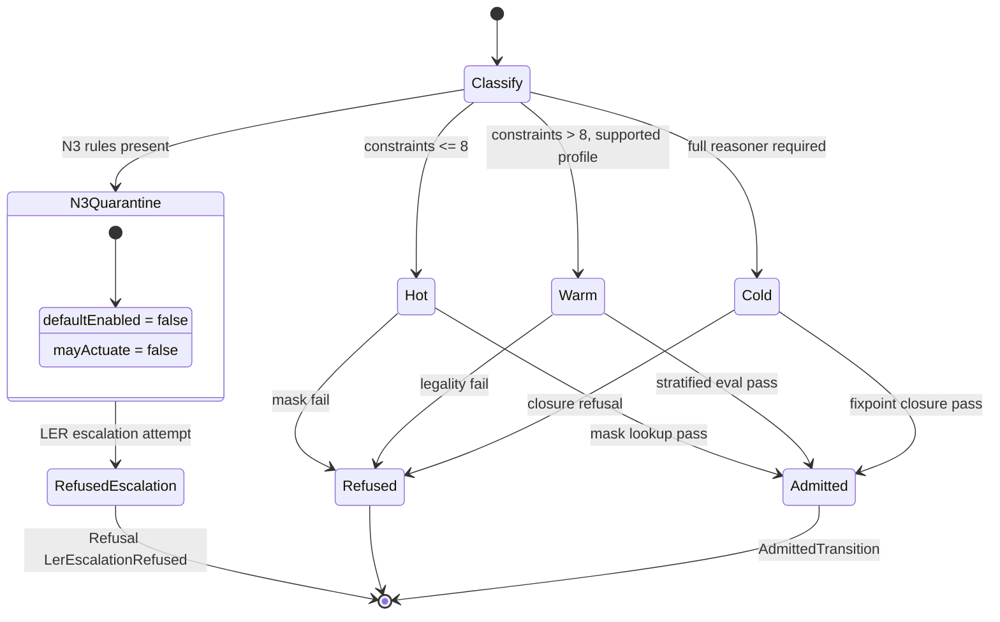

# AB-03 — Routing State Machine (Hot / Warm / Cold, N3 Quarantine)

| Facet | Value |
|---|---|
| Invariant | Route decision hash is receipt material; routing is deterministic from constraint count and profile |
| Information-Loss Risk | Silent tier fallthrough would hide why a plan ran slow; every transition is a recorded decision |
| TPS Purpose | Heijunka: workload leveled across tiers by measured constraint budget, not by guesswork |
| DfLSS CTQ | Hot path serves all plans with <= 8 constraints; quarantined N3 never actuates |
| CENG Boundary | N3 quarantine has defaultEnabled false and mayActuate false; LER escalation is refused, not queued |

