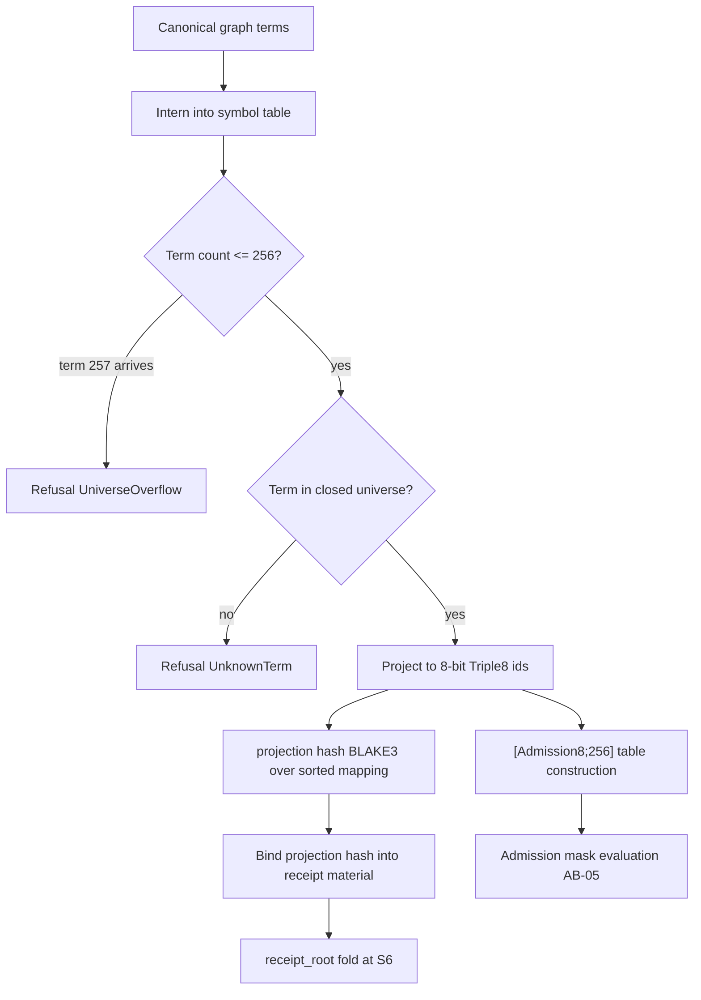

# AB-04 — Triple8 Universe Flow (256-Term Fence)

| Facet | Value |
|---|---|
| Invariant | Closed vocabulary: the Triple8 universe is exactly 256 terms; term 257 and unknown terms are refused by name |
| Information-Loss Risk | Projection into 8-bit space is lossy by construction; the projection hash binds it to the source graph |
| TPS Purpose | Poka-yoke: the 256-term fence makes an out-of-universe term physically unrepresentable downstream |
| DfLSS CTQ | Zero silent truncation — every over-fence input yields UniverseOverflow, never a wrapped index |
| CENG Boundary | Only fenced, projected terms enter the [Admission8;256] table; raw IRIs never cross this line |

