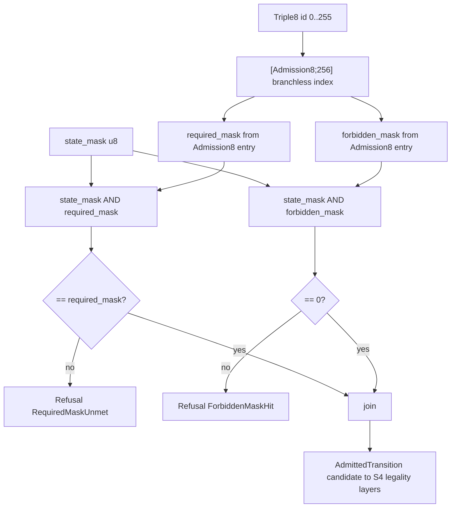

# AB-05 — Admission Mask Flow (Branchless [Admission8;256] Lookup)

| Facet | Value |
|---|---|
| Invariant | Admission is pure bit arithmetic over a fixed table — O(1) per transition, no data-dependent branches |
| Information-Loss Risk | Mask semantics compress legality to bits; the admission_table hash preserves the full table for audit |
| TPS Purpose | Standard work: one fixed lookup procedure for every transition, identical cycle time |
| DfLSS CTQ | required and forbidden masks both checked on every transition; no partial admission |
| CENG Boundary | The table is built once from the fenced universe (AB-04); admission never consults the raw graph |

