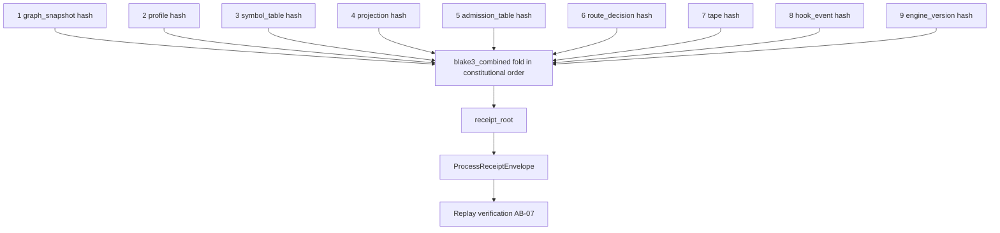

# AB-06 — Receipt Material Flow (9 Hashes in Constitutional Order)

| Facet | Value |
|---|---|
| Invariant | All receipt material sorted/canonical before hashing; BLAKE3 only; hash order is constitutional and fixed |
| Information-Loss Risk | Omitting any of the 9 fields would make that facet unreplayable; the fold order itself is part of the law |
| TPS Purpose | Traceability kanban: every station's output is a card folded into one final ticket |
| DfLSS CTQ | receipt_root byte-identical across replays; any single-field change flips the root |
| CENG Boundary | receipt_root is computed only inside ProcessReceiptEnvelope; no caller may assert or patch it |

