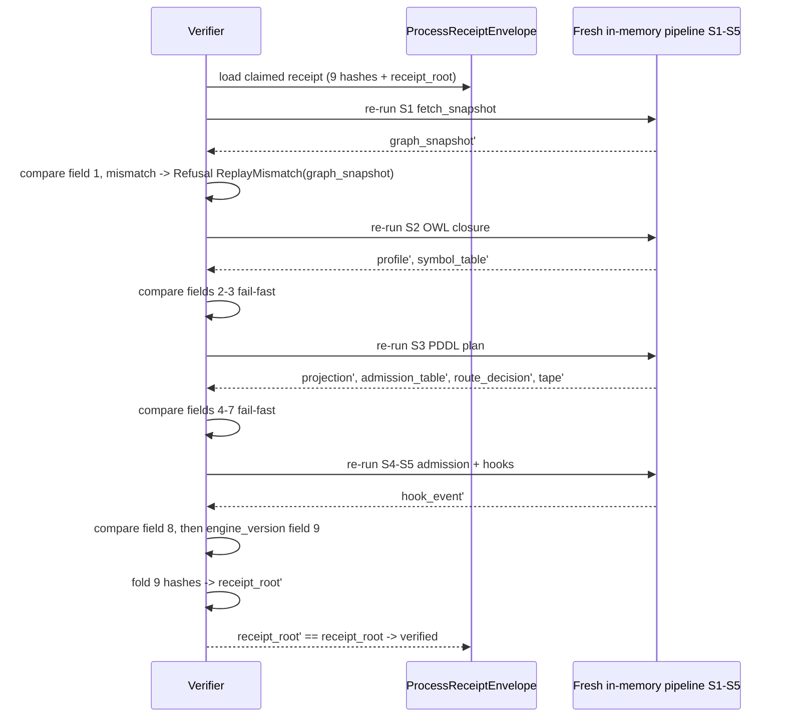

# AB-07 — Replay Verification Sequence (Fail-Fast Per-Field)

| Facet | Value |
|---|---|
| Invariant | Deterministic under fixed inputs: a fresh in-memory re-run of S1–S5 must reproduce every hash byte-identically |
| Information-Loss Risk | A whole-root-only check would hide which stage diverged; per-field ReplayMismatch names the first bad field |
| TPS Purpose | Jidoka: the verifier stops at the first defective field instead of passing it down the line |
| DfLSS CTQ | First divergent field identified in every failed replay; zero false-pass replays |
| CENG Boundary | Replay runs fully in memory against the same envelope; it never actuates and never mutates state |

