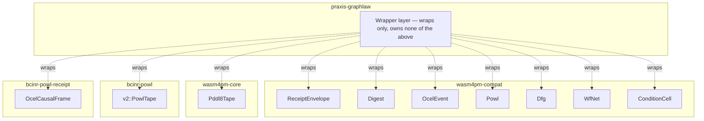

# AB-08 — Type-Ownership Boundary Map

| Facet | Value |
|---|---|
| Invariant | Each core type has exactly one owning crate; praxis-graphlaw wraps foreign types, never redefines them |
| Information-Loss Risk | Duplicate type definitions would fork semantics silently; single ownership keeps one authoritative shape |
| TPS Purpose | Cellular layout: each crate is a cell owning its parts; no cross-cell part fabrication |
| DfLSS CTQ | Zero foreign-type constructions outside the owning crate (compile-level enforcement) |
| CENG Boundary | Ownership crossings go through wrappers only; direct construction across the boundary is a Refusal/compile error |

