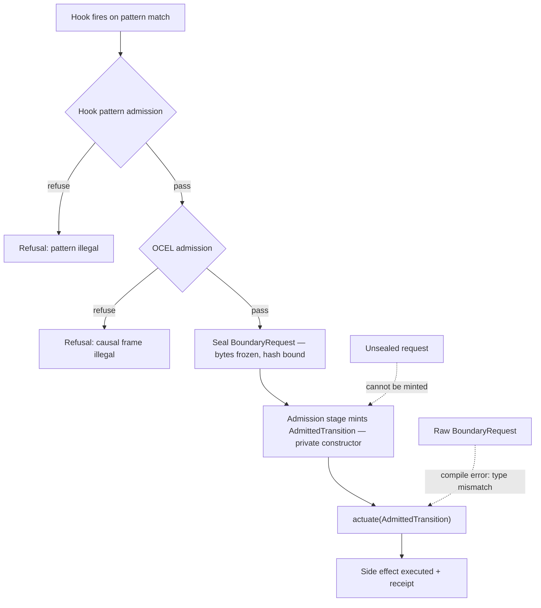

# AB-09 — Hook / Actuation Gate (Compile-Level Law)

| Facet | Value |
|---|---|
| Invariant | actuate() accepts only AdmittedTransition — the type system, not runtime checks, enforces the gate |
| Information-Loss Risk | Unsealed requests could be mutated between admission and actuation; sealing freezes the audited bytes |
| TPS Purpose | Successive check gates: pattern, OCEL, seal — each gate inspects the prior gate's output only |
| DfLSS CTQ | Zero actuations of non-admitted work; unsealed or foreign BoundaryRequests cannot reach actuate |
| CENG Boundary | AdmittedTransition is constructible only by the admission stage; no other module can forge one |

