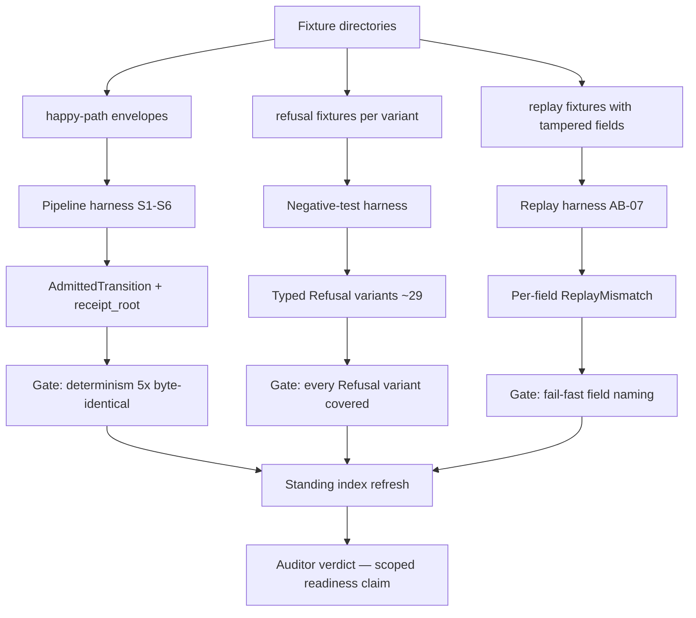

# AB-10 — Acceptance Traceability (Fixtures to Auditor Verdict)

| Facet | Value |
|---|---|
| Invariant | Error paths tested as rigorously as happy paths — every Refusal variant traces to a fixture and a gate |
| Information-Loss Risk | An untraced test is unauditable evidence; the chain fixture -> harness -> variant -> gate is explicit |
| TPS Purpose | Genchi genbutsu: the auditor's verdict is grounded in re-runnable fixtures, not summaries |
| DfLSS CTQ | Every gate cites the exact command run this session; no verdict from hearsay |
| CENG Boundary | The auditor consumes only gate outputs and the standing index — never prior-agent claims |

