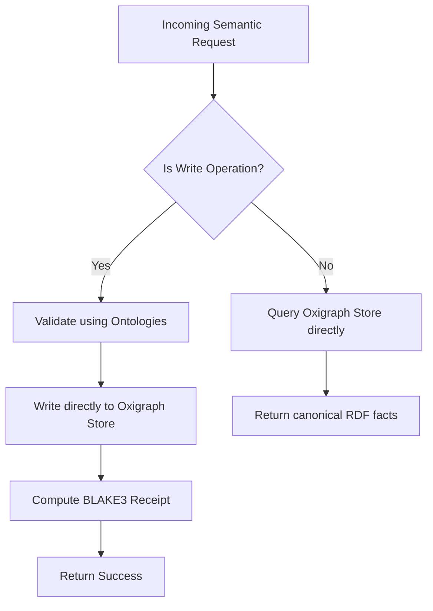
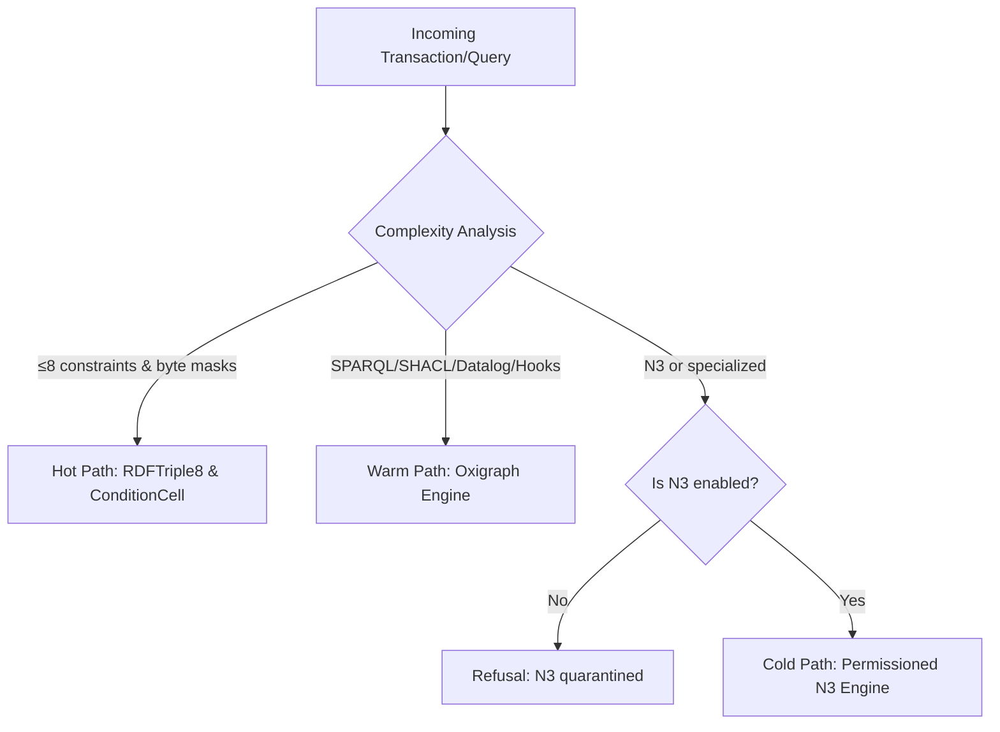
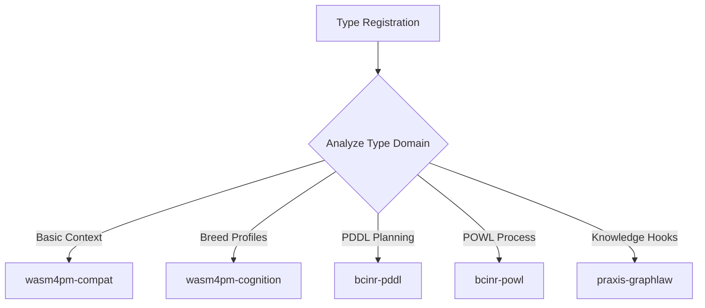
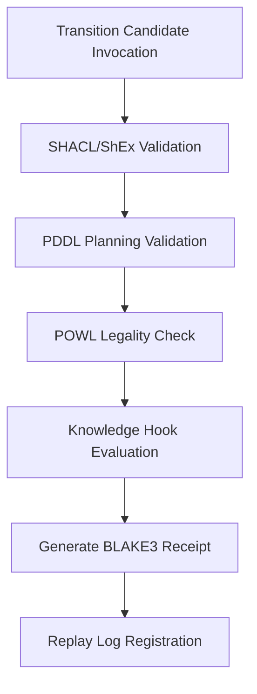
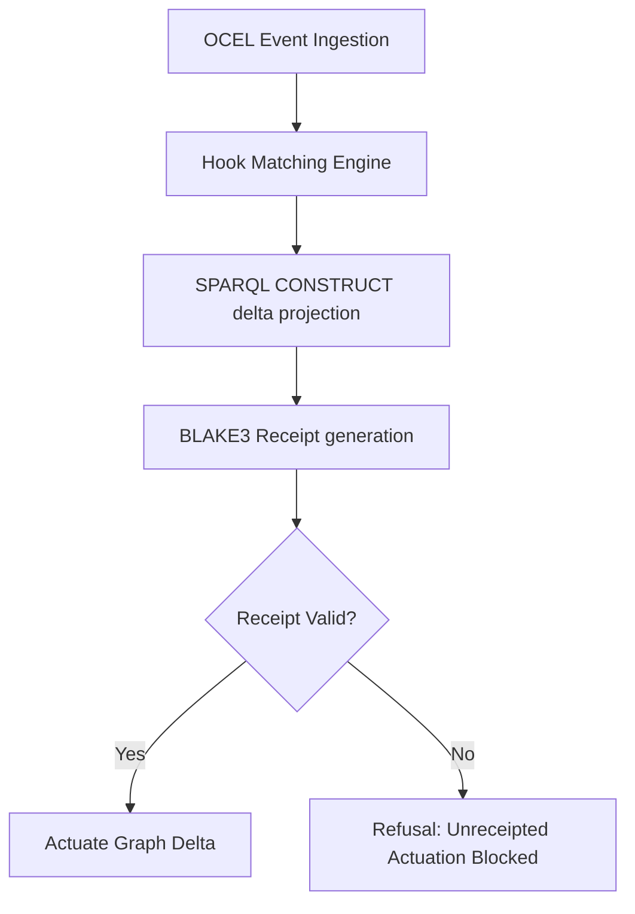
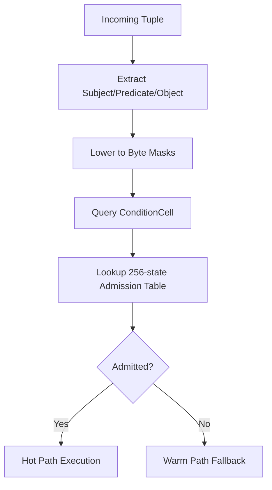
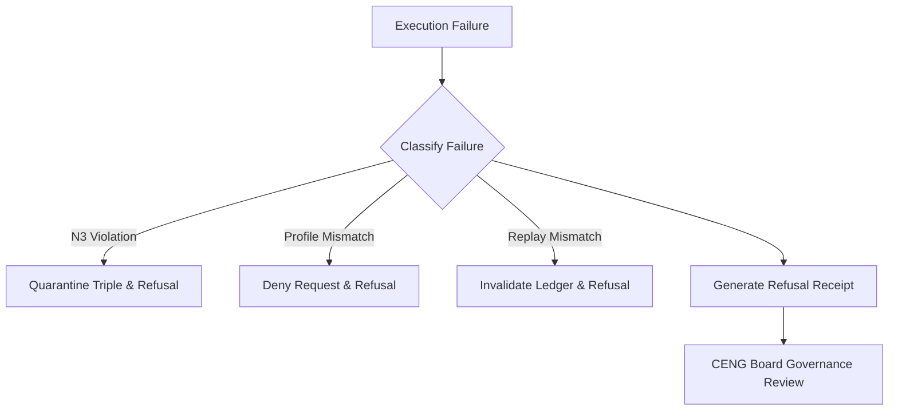
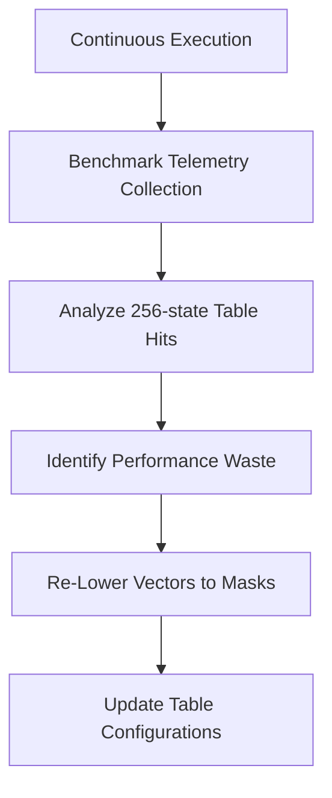

# Flowchart Diagram Family

This document contains exactly 8 flowchart diagrams mapping the Chatman Engine across its 8 projection lenses, preserving key architectural invariants under Design for Combinatorial Maximalism.

## Diagrams

### FLOWCHART-L1: Semantic Authority

Diagram ID: FLOWCHART-L1
Diagram family: Flowchart
Projection lens: Semantic Authority
Architectural invariant preserved: RDF/Oxigraph is the sole semantic source of truth; all read and write transactions must bind directly to the Oxigraph store.
Information-loss risk if omitted: Developers might query local cached variables (like RDFTriple8) directly for semantic reasoning, leading to stale reads and out-of-sync triple state.
TPS visual-control purpose: Visualizing memory and transaction boundaries to eliminate the waste of "stale data cache invalidation" loops.
DfLSS CTQ protected: Zero semantic shadow copies (all reads verified against canonical Oxigraph).
CENG ticket or boundary constrained: Bound by CENG-410-FINAL (securing the final state boundaries).
Why this diagram is non-redundant: It defines the high-level semantic ingress/egress boundaries, while others deal with execution/routing.

---

### FLOWCHART-L2: Routing Constitution

Diagram ID: FLOWCHART-L2
Diagram family: Flowchart
Projection lens: Routing Constitution
Architectural invariant preserved: Least-expressive-power routing; queries must execute on the lowest possible path complexity (Hot, Warm, or Cold).
Information-loss risk if omitted: High-expressivity paths (like SPARQL or N3) could be executed for simple hot-path checks, wasting CPU and increasing latency.
TPS visual-control purpose: Exposing routing waste by tracking query complexity classification at the entry gate.
DfLSS CTQ protected: Path selection optimization matching rule complexity.
CENG ticket or boundary constrained: CENG-410-M1 (routing gating accepted).
Why this diagram is non-redundant: Focuses specifically on path classification and N3 quarantine enforcement.

---

### FLOWCHART-L3: Type Kernel Ownership

Diagram ID: FLOWCHART-L3
Diagram family: Flowchart
Projection lens: Type Kernel Ownership
Architectural invariant preserved: Single crate ownership for every canonical type to prevent duplicate definition.
Information-loss risk if omitted: Redundant type definitions created across crates, leading to compile-time type mismatch and serialization errors.
TPS visual-control purpose: Defect prevention by ensuring strict compile/runtime mapping of kernels.
DfLSS CTQ protected: Single source of type definition.
CENG ticket or boundary constrained: Bound by CENG-411 (design-only, implementation blocked).
Why this diagram is non-redundant: Visualizes compile-time crate boundaries and type mapping.

---

### FLOWCHART-L4: Transition Lifecycle

Diagram ID: FLOWCHART-L4
Diagram family: Flowchart
Projection lens: Transition Lifecycle
Architectural invariant preserved: Linear state progression of transition candidates through all validation gates.
Information-loss risk if omitted: Bypassing workflow legality or validation checks, corrupting the global engine state.
TPS visual-control purpose: Ensuring sequence flow and WIP reduction (process gating).
DfLSS CTQ protected: Process capability and zero unvalidated admissions.
CENG ticket or boundary constrained: CENG-410-FINAL (boundary checks).
Why this diagram is non-redundant: Traces the temporal progression of a single transition candidate rather than compile-time or routing relationships.

---

### FLOWCHART-L5: Event / Hook / Actuation

Diagram ID: FLOWCHART-L5
Diagram family: Flowchart
Projection lens: Event / Hook / Actuation
Architectural invariant preserved: Knowledge hooks must generate valid BLAKE3 receipts before actuating graph deltas.
Information-loss risk if omitted: Unreceipted hook actions executing side effects without cryptographic proof.
TPS visual-control purpose: Jidoka (autonomation) - halting execution on receipt failure.
DfLSS CTQ protected: Receipted actuation (100% cryptographic coverage).
CENG ticket or boundary constrained: CENG-412 (design-only, auditing).
Why this diagram is non-redundant: Visualizes the actuation dependency loop and delta projections.

---

### FLOWCHART-L6: Performance / 8-Constraint Hot Path

Diagram ID: FLOWCHART-L6
Diagram family: Flowchart
Projection lens: Performance / 8-Constraint Hot Path
Architectural invariant preserved: Vector-to-mask lowering on the hot path utilizing ConditionCell<BITS> and 256-state tables.
Information-loss risk if omitted: Non-deterministic performance on the hot path due to dynamic hash-map lookups.
TPS visual-control purpose: Eliminating processing waste (vector-to-mask lowering).
DfLSS CTQ protected: Hot-path latency ≤ threshold.
CENG ticket or boundary constrained: CENG-410-M1 (accepted).
Why this diagram is non-redundant: Visualizes low-level byte-mask filtering.

---

### FLOWCHART-L7: Refusal / Risk / Governance

Diagram ID: FLOWCHART-L7
Diagram family: Flowchart
Projection lens: Refusal / Risk / Governance
Architectural invariant preserved: Typed refusal taxonomy for all failure modes, preventing generic panics.
Information-loss risk if omitted: Untyped panics or unhandled errors crashing the system or leaking information.
TPS visual-control purpose: Poka-Yoke (error proofing) through uniform error classifications.
DfLSS CTQ protected: Complete refusal coverage (zero unclassified failures).
CENG ticket or boundary constrained: CENG-410-FINAL.
Why this diagram is non-redundant: Focuses strictly on the error/exception paths and governance board audits.

---

### FLOWCHART-L8: TPS / DfLSS / Continuous Improvement

Diagram ID: FLOWCHART-L8
Diagram family: Flowchart
Projection lens: TPS / DfLSS / Continuous Improvement
Architectural invariant preserved: Continuous benchmark feedback loops to tune routing admission tables.
Information-loss risk if omitted: Performance degradation over time due to rule volume increase.
TPS visual-control purpose: Kaizen (continuous improvement) based on benchmark telemetry.
DfLSS CTQ protected: Continuous performance optimization (reduction in variation).
CENG ticket or boundary constrained: CENG-416A-F (design-only).
Why this diagram is non-redundant: Shows the feedback loop of metrics to optimization.

