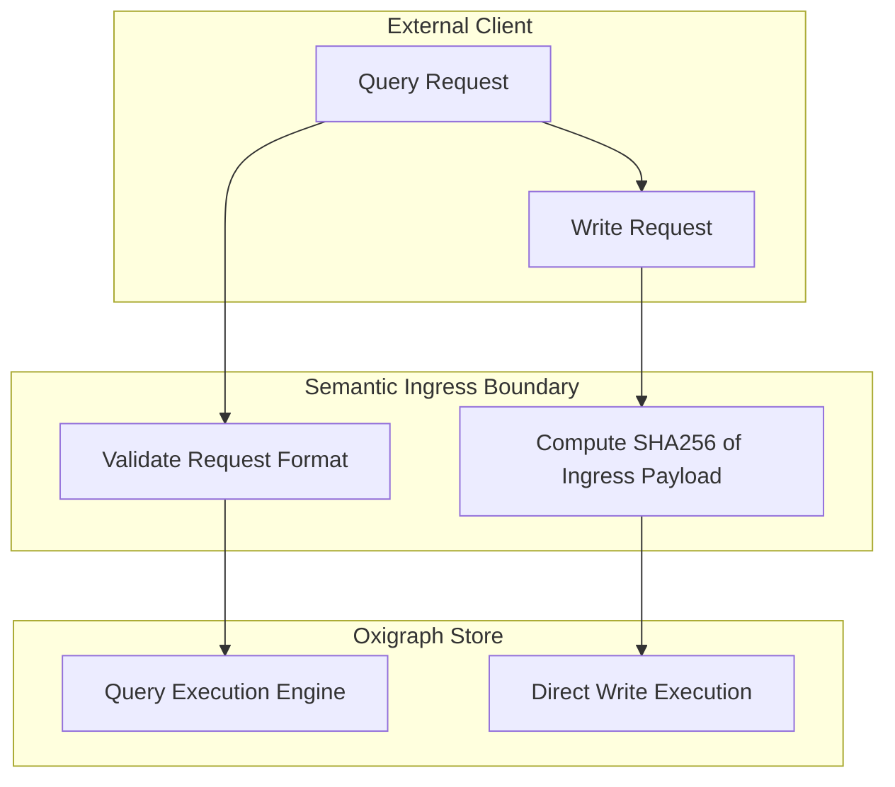
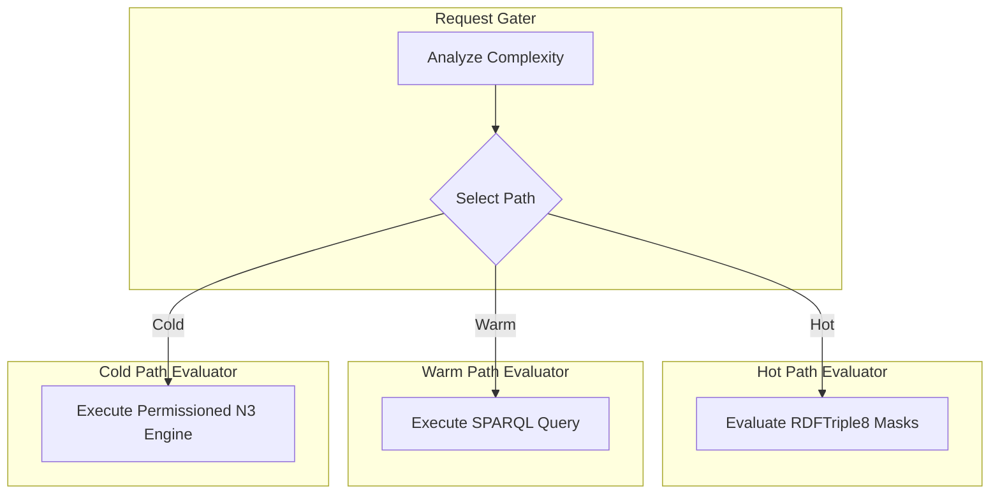
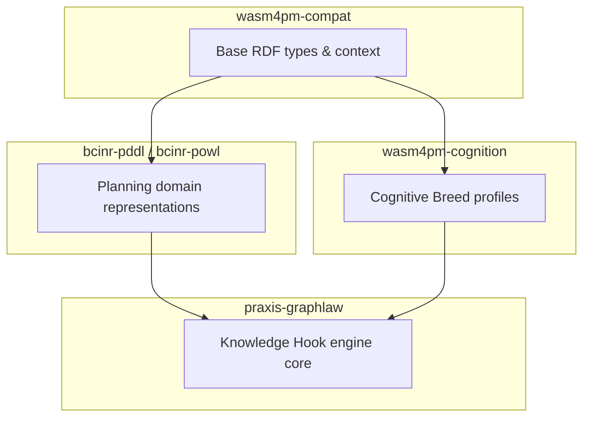
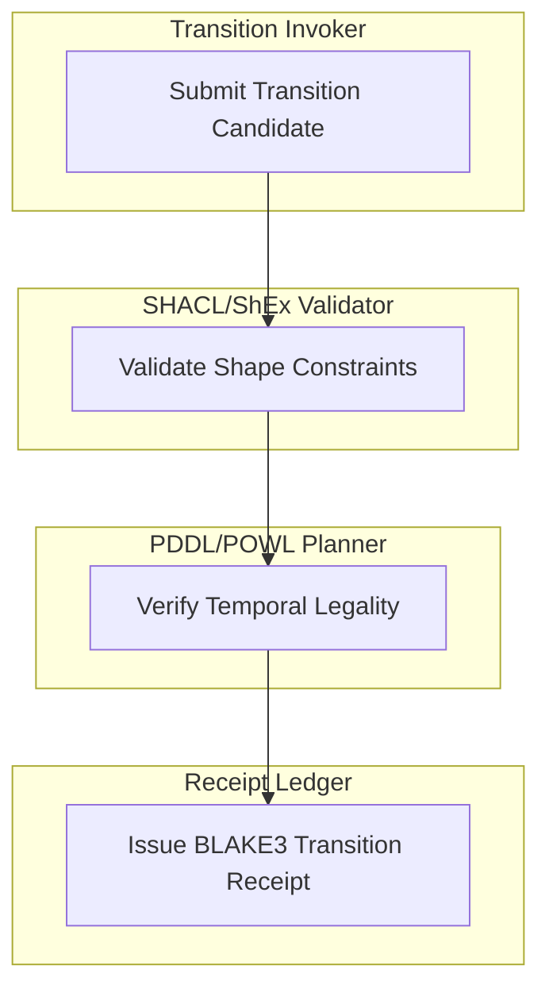
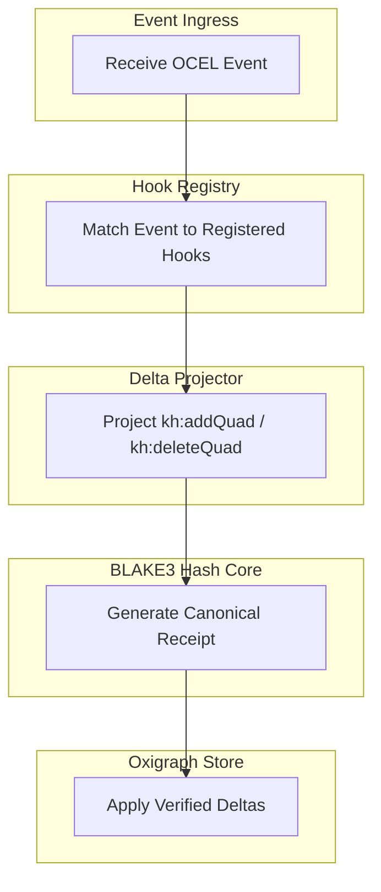
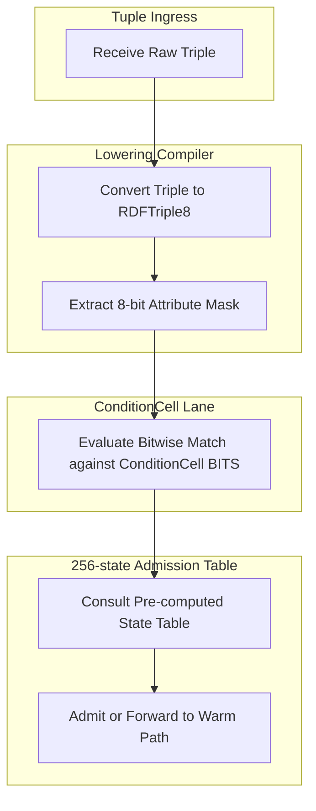
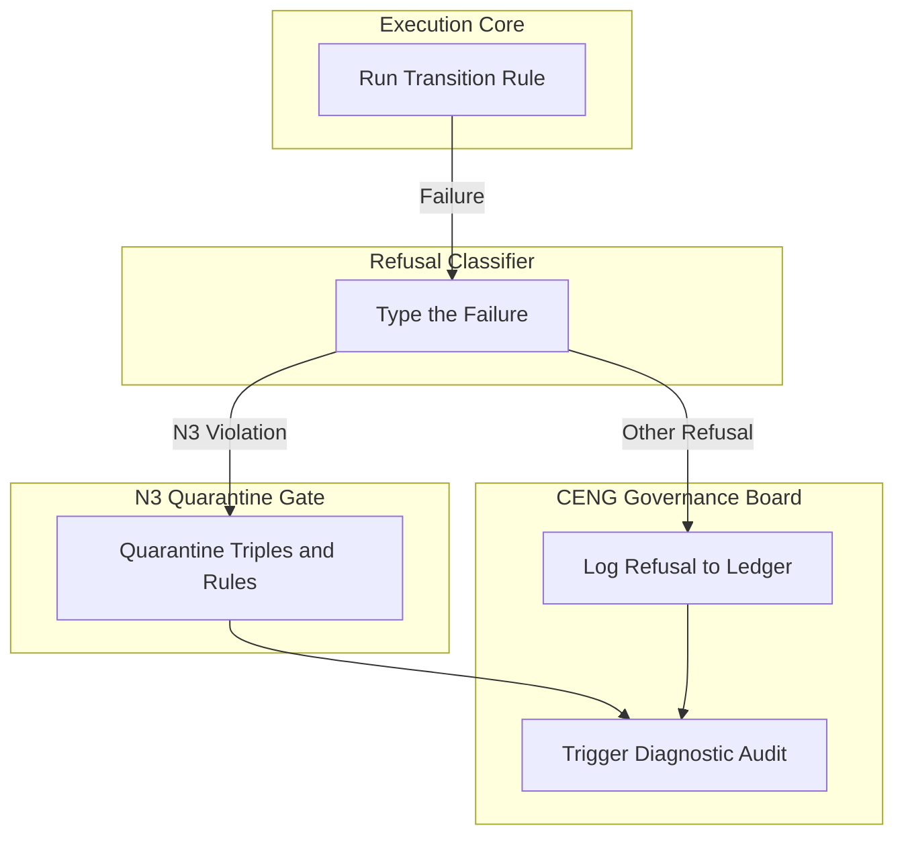
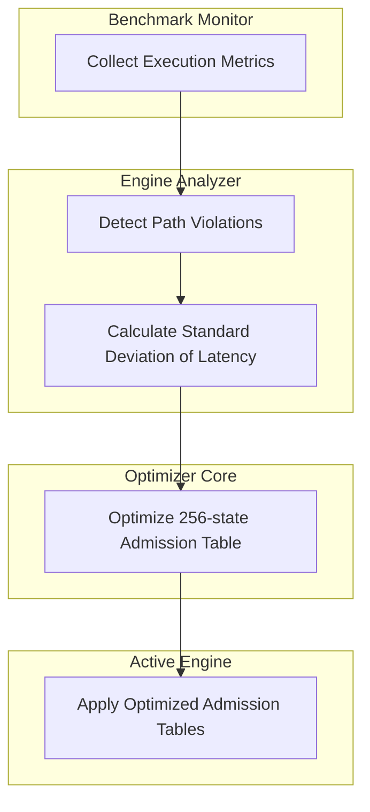

# Swimlanes Diagram Family

This document contains exactly 8 swimlane diagrams (implemented via Mermaid flowchart subgraphs representing lanes) mapping the Chatman Engine across its 8 projection lenses, preserving key architectural invariants under Design for Combinatorial Maximalism.

## Diagrams

### SWIMLANES-L1: Semantic Authority

Diagram ID: SWIMLANES-L1
Diagram family: Swimlanes
Projection lens: Semantic Authority
Architectural invariant preserved: RDF/Oxigraph remains the sole semantic source of truth; no client or ingress gate may store shadow copies of the triple data.
Information-loss risk if omitted: Ingress gates caching read requests or keeping local states, resulting in dirty reads or inconsistent semantic states between the gateway and Oxigraph.
TPS visual-control purpose: Visualizing structural boundaries between the client, ingress validation, and core semantic storage to prevent data replication waste.
DfLSS CTQ protected: Zero semantic shadow copies and absolute transactional isolation.
CENG ticket or boundary constrained: Bound by CENG-410-FINAL.
Why this diagram is non-redundant: Visualizes runtime process boundaries across ownership lanes, which is not captured by simple flowcharts.

---

### SWIMLANES-L2: Routing Constitution

Diagram ID: SWIMLANES-L2
Diagram family: Swimlanes
Projection lens: Routing Constitution
Architectural invariant preserved: Safe routing isolation; cold path (N3) is quarantined unless explicitly enabled.
Information-loss risk if omitted: Dynamic execution bypasses the request gater, running unverified N3 rules on warm or hot paths and causing system security breaches.
TPS visual-control purpose: Visualizing segregation of execution environments to eliminate safety defects.
DfLSS CTQ protected: Under-execution/over-execution routing path mapping.
CENG ticket or boundary constrained: CENG-410-M1.
Why this diagram is non-redundant: Represents routing decisions specifically partitioned by execution engines.

---

### SWIMLANES-L3: Type Kernel Ownership

Diagram ID: SWIMLANES-L3
Diagram family: Swimlanes
Projection lens: Type Kernel Ownership
Architectural invariant preserved: Separation of concerns and kernel definition boundaries; no module may cross-compile another module's types.
Information-loss risk if omitted: Circular dependencies between `praxis-graphlaw` and `wasm4pm-cognition`, breaking compilation.
TPS visual-control purpose: Exposing dependency and duplication waste across compilation boundaries.
DfLSS CTQ protected: Crate-level type isolation and zero-copy kernel mappings.
CENG ticket or boundary constrained: CENG-411 (design-only).
Why this diagram is non-redundant: Shows ownership lanes of data structures at the compile/crate level.

---

### SWIMLANES-L4: Transition Lifecycle

Diagram ID: SWIMLANES-L4
Diagram family: Swimlanes
Projection lens: Transition Lifecycle
Architectural invariant preserved: Multi-stage admission gate sequence (Validation -> Planning -> Legality -> Receipting).
Information-loss risk if omitted: Execution of state transitions without validation, corrupting history or workflow integrity.
TPS visual-control purpose: Visualizing quality gates in the processing line to prevent defective transitions.
DfLSS CTQ protected: 100% verification rate for all transition candidates.
CENG ticket or boundary constrained: CENG-410-FINAL.
Why this diagram is non-redundant: Maps stages of transition processing to dedicated engine actors.

---

### SWIMLANES-L5: Event / Hook / Actuation

Diagram ID: SWIMLANES-L5
Diagram family: Swimlanes
Projection lens: Event / Hook / Actuation
Architectural invariant preserved: Pure SPARQL CONSTRUCT delta projection; zero side-effects outside of graph delta receipts.
Information-loss risk if omitted: Hooks executing side-effects directly during matching phase, violating transactional rollback constraints.
TPS visual-control purpose: Jidoka (stopping flow on unreceipted actuation attempt).
DfLSS CTQ protected: 100% receipted and verified hook actuations.
CENG ticket or boundary constrained: CENG-412 (design-only).
Why this diagram is non-redundant: Details the event-to-actuation lifecycle across distinct architectural subsystems.

---

### SWIMLANES-L6: Performance / 8-Constraint Hot Path

Diagram ID: SWIMLANES-L6
Diagram family: Swimlanes
Projection lens: Performance / 8-Constraint Hot Path
Architectural invariant preserved: RDFTriple8 binary lowering and execution on the 8-constraint hot path.
Information-loss risk if omitted: Compiling hot path queries into generalized warm-path queries, causing CPU cache misses and high execution latency.
TPS visual-control purpose: Minimizing execution path length (visualizing waste removal).
DfLSS CTQ protected: Hot-path processing latency ≤ threshold.
CENG ticket or boundary constrained: CENG-410-M1.
Why this diagram is non-redundant: Isolates low-level data structures (RDFTriple8, ConditionCell) from high-level services.

---

### SWIMLANES-L7: Refusal / Risk / Governance

Diagram ID: SWIMLANES-L7
Diagram family: Swimlanes
Projection lens: Refusal / Risk / Governance
Architectural invariant preserved: Isolated quarantine of invalid state candidates; all failures are typed Refusals.
Information-loss risk if omitted: Untrusted N3 rules leaking or modifying core system states without containment.
TPS visual-control purpose: Visualizing safety gates and containment areas (Poka-Yoke).
DfLSS CTQ protected: Zero untyped failures or unlogged refusals.
CENG ticket or boundary constrained: CENG-410-FINAL.
Why this diagram is non-redundant: Visualizes quarantine and governance loops which are strictly excluded in standard operational views.

---

### SWIMLANES-L8: TPS / DfLSS / Continuous Improvement

Diagram ID: SWIMLANES-L8
Diagram family: Swimlanes
Projection lens: TPS / DfLSS / Continuous Improvement
Architectural invariant preserved: Continuous monitoring and reconfiguration loops based on benchmark outputs.
Information-loss risk if omitted: Failure to detect performance drift, leading to slow accumulation of latency regressions.
TPS visual-control purpose: Continuous improvement cycle (Kaizen) for performance optimization.
DfLSS CTQ protected: Zero-drift execution latency.
CENG ticket or boundary constrained: CENG-416A-F (design-only).
Why this diagram is non-redundant: Captures the optimization cycle feedback loop across system actors.

