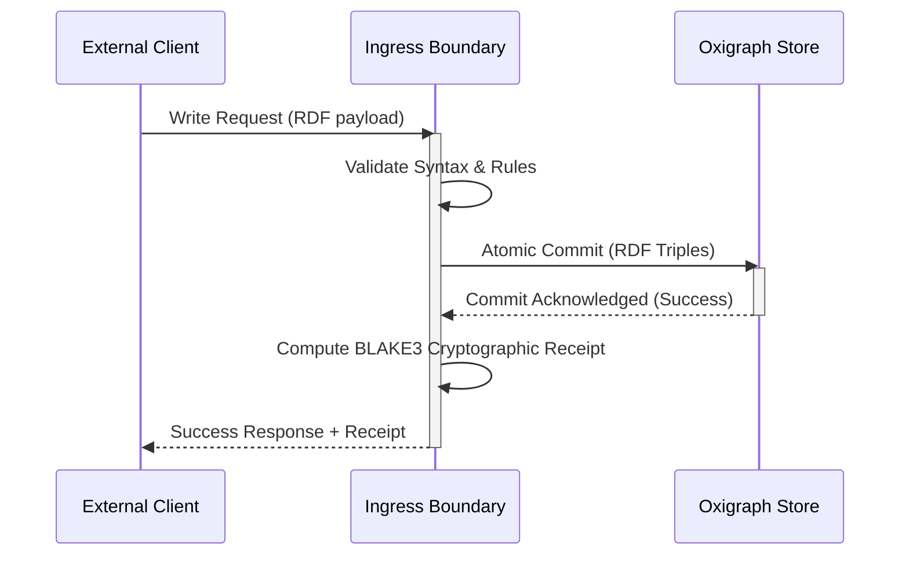
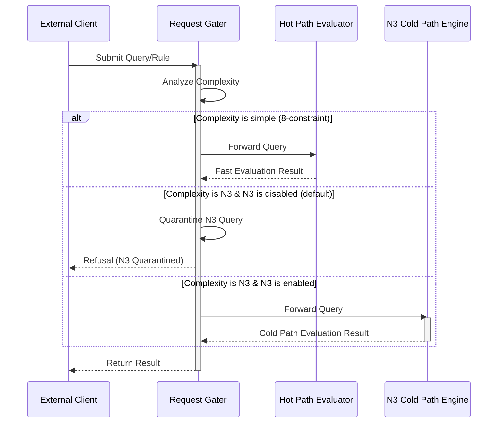
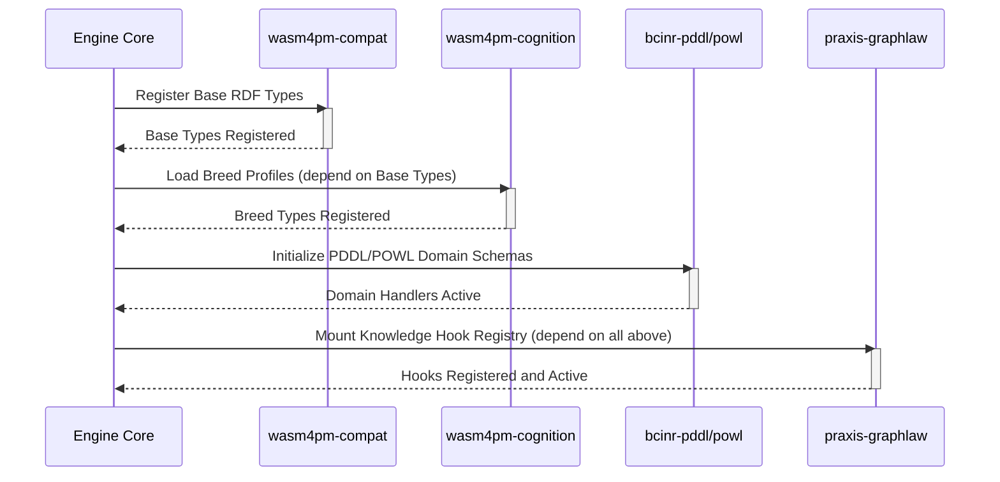
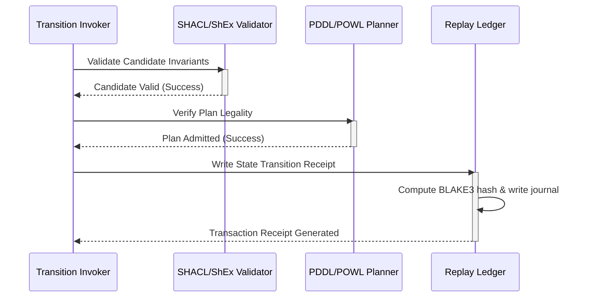
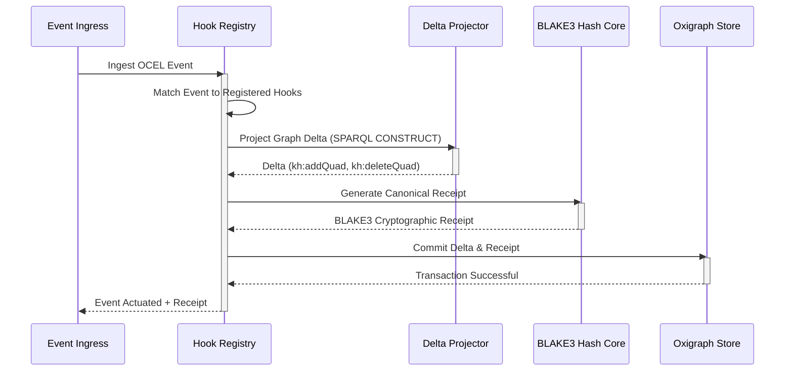
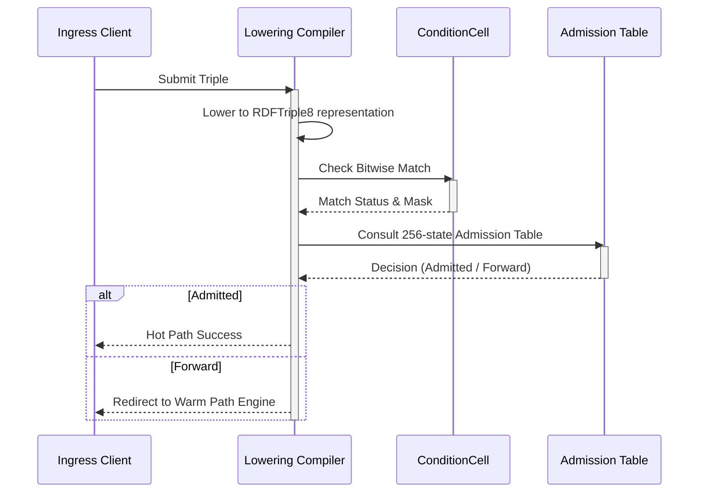
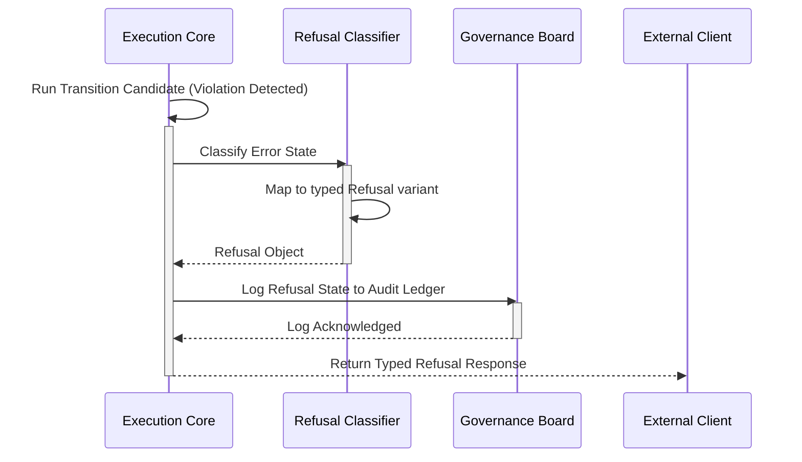
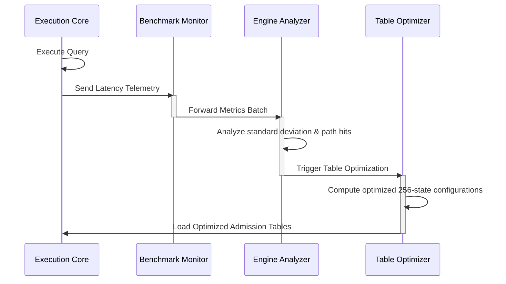

# Sequence Diagram Family

This document contains exactly 8 sequence diagrams mapping the Chatman Engine across its 8 projection lenses, preserving key architectural invariants under Design for Combinatorial Maximalism.

## Diagrams

### SEQUENCE-L1: Semantic Authority

Diagram ID: SEQUENCE-L1
Diagram family: Sequence
Projection lens: Semantic Authority
Architectural invariant preserved: Direct Oxigraph write gating; all modifications to the semantic graph must execute atomically inside the Oxigraph store before receipt generation.
Information-loss risk if omitted: Receipts generated for updates that fail to commit to the Oxigraph database, breaking the cryptographic state link.
TPS visual-control purpose: Eliminating rework and transaction rollbacks by gating receipt generation behind the physical commit.
DfLSS CTQ protected: 100% synchronization between the cryptographic ledger and Oxigraph state.
CENG ticket or boundary constrained: Bound by CENG-410-FINAL.
Why this diagram is non-redundant: Details the temporal ordering of write-validation-commit-receipt actions, which flowcharts and swimlanes cannot represent chronologically.

---

### SEQUENCE-L2: Routing Constitution

Diagram ID: SEQUENCE-L2
Diagram family: Sequence
Projection lens: Routing Constitution
Architectural invariant preserved: Least-expressive-power path routing and quarantine of unauthorized N3 cold-path rules.
Information-loss risk if omitted: Bypassing the routing constitution gate, executing quarantined N3 code on the warm path.
TPS visual-control purpose: Restricting WIP (limiting execution of un-constituted rules).
DfLSS CTQ protected: 100% compliance with rule expressiveness categorization.
CENG ticket or boundary constrained: CENG-410-M1.
Why this diagram is non-redundant: Visualizes the conditional routing checks and quarantine return paths for queries.

---

### SEQUENCE-L3: Type Kernel Ownership

Diagram ID: SEQUENCE-L3
Diagram family: Sequence
Projection lens: Type Kernel Ownership
Architectural invariant preserved: Strict hierarchical registration of types from base compat to cognition, planning, and hook execution.
Information-loss risk if omitted: Initialization of components out of order, leading to missing type definitions at runtime.
TPS visual-control purpose: Visualizing initialization flow to prevent system integration defects.
DfLSS CTQ protected: Correct initialization sequence with zero duplicate types.
CENG ticket or boundary constrained: CENG-411 (design-only).
Why this diagram is non-redundant: Focuses on the temporal boot/initialization order of modular type registry dependencies.

---

### SEQUENCE-L4: Transition Lifecycle

Diagram ID: SEQUENCE-L4
Diagram family: Sequence
Projection lens: Transition Lifecycle
Architectural invariant preserved: Candidate progression through multi-level validation and ledger recording.
Information-loss risk if omitted: State transition executed before validation is fully completed, leading to corrupted state history.
TPS visual-control purpose: Sequential gating to ensure quality-at-source (Jidoka).
DfLSS CTQ protected: 100% of admitted transitions are valid and receipted.
CENG ticket or boundary constrained: CENG-410-FINAL.
Why this diagram is non-redundant: Focuses on the lifecycle stages of a single candidate payload across validators.

---

### SEQUENCE-L5: Event / Hook / Actuation

Diagram ID: SEQUENCE-L5
Diagram family: Sequence
Projection lens: Event / Hook / Actuation
Architectural invariant preserved: Event-hook-actuation receipt coupling; deltas project via pure SPARQL CONSTRUCT query.
Information-loss risk if omitted: Side-effect actions executing when the corresponding database update fails or receipt generation fails.
TPS visual-control purpose: Stopping downstream processing (actuation) if receipt generation fails.
DfLSS CTQ protected: Zero side-effects without corresponding cryptographic receipt.
CENG ticket or boundary constrained: CENG-412 (design-only).
Why this diagram is non-redundant: Captures the event-driven async matching, projection, and commit cycle.

---

### SEQUENCE-L6: Performance / 8-Constraint Hot Path

Diagram ID: SEQUENCE-L6
Diagram family: Sequence
Projection lens: Performance / 8-Constraint Hot Path
Architectural invariant preserved: Low-latency fast-path evaluation using binary lowering and pre-computed state table lookup.
Information-loss risk if omitted: Performance degradation due to unnecessary traversal of high-level warm path parsers.
TPS visual-control purpose: Exposing processing time waste (latency overhead of warm-path fallbacks).
DfLSS CTQ protected: Hot-path lookup latency ≤ target limit.
CENG ticket or boundary constrained: CENG-410-M1.
Why this diagram is non-redundant: Focuses on the low-level byte-mask check and 256-state admission table.

---

### SEQUENCE-L7: Refusal / Risk / Governance

Diagram ID: SEQUENCE-L7
Diagram family: Sequence
Projection lens: Refusal / Risk / Governance
Architectural invariant preserved: Containment of failures via typed refusal translation and governance logging.
Information-loss risk if omitted: Leaking internal stack traces or database errors, or missing audit logs for failures.
TPS visual-control purpose: Poka-Yoke (fail-safe error handling to prevent defect escape).
DfLSS CTQ protected: 100% of runtime errors mapped to refusal schema and logged.
CENG ticket or boundary constrained: CENG-410-FINAL.
Why this diagram is non-redundant: Visualizes the governance logging and refusal mapping path which is separate from operational logic.

---

### SEQUENCE-L8: TPS / DfLSS / Continuous Improvement

Diagram ID: SEQUENCE-L8
Diagram family: Sequence
Projection lens: TPS / DfLSS / Continuous Improvement
Architectural invariant preserved: Continuous performance improvement loop via metric analysis and optimization feed-forward.
Information-loss risk if omitted: Undetected performance degradation due to structural code drift.
TPS visual-control purpose: Kaizen feedback loop to optimize hot-path table boundaries.
DfLSS CTQ protected: Zero variance in processing times and low latency thresholds.
CENG ticket or boundary constrained: CENG-416A-F (design-only).
Why this diagram is non-redundant: Maps the control-loop execution of telemetry feedback.

