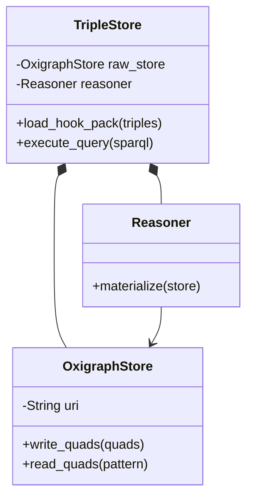
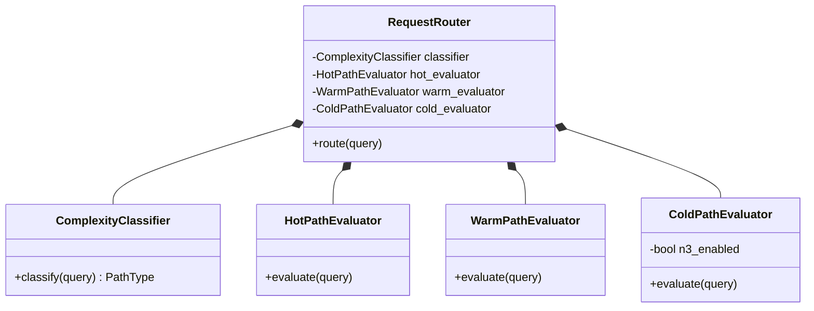
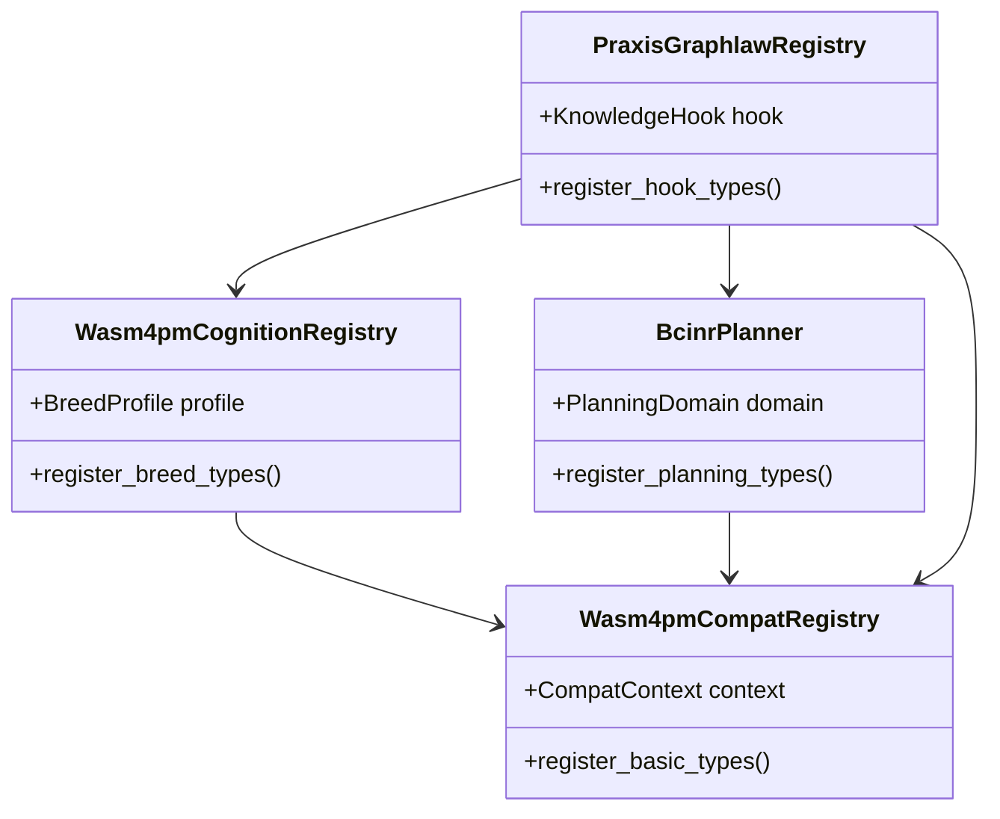
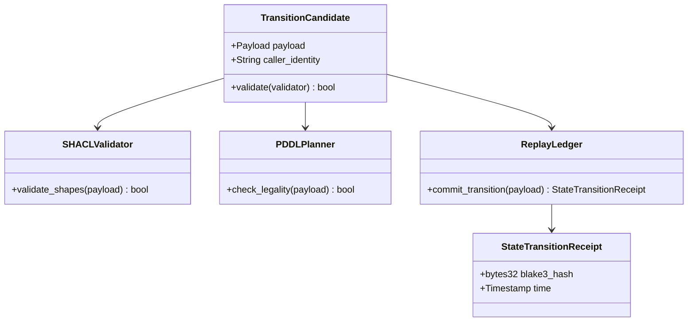
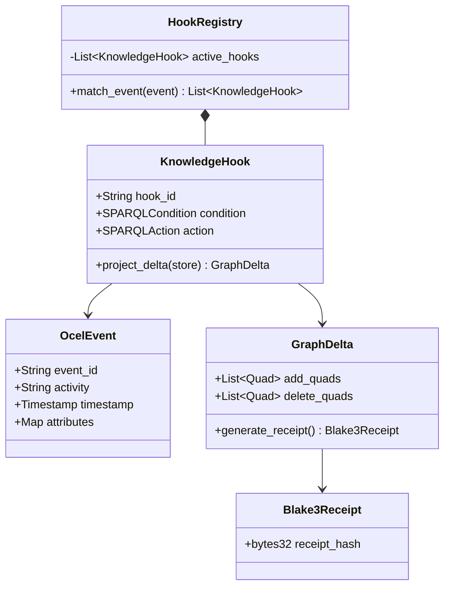
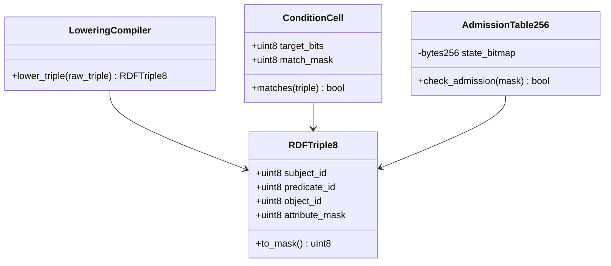
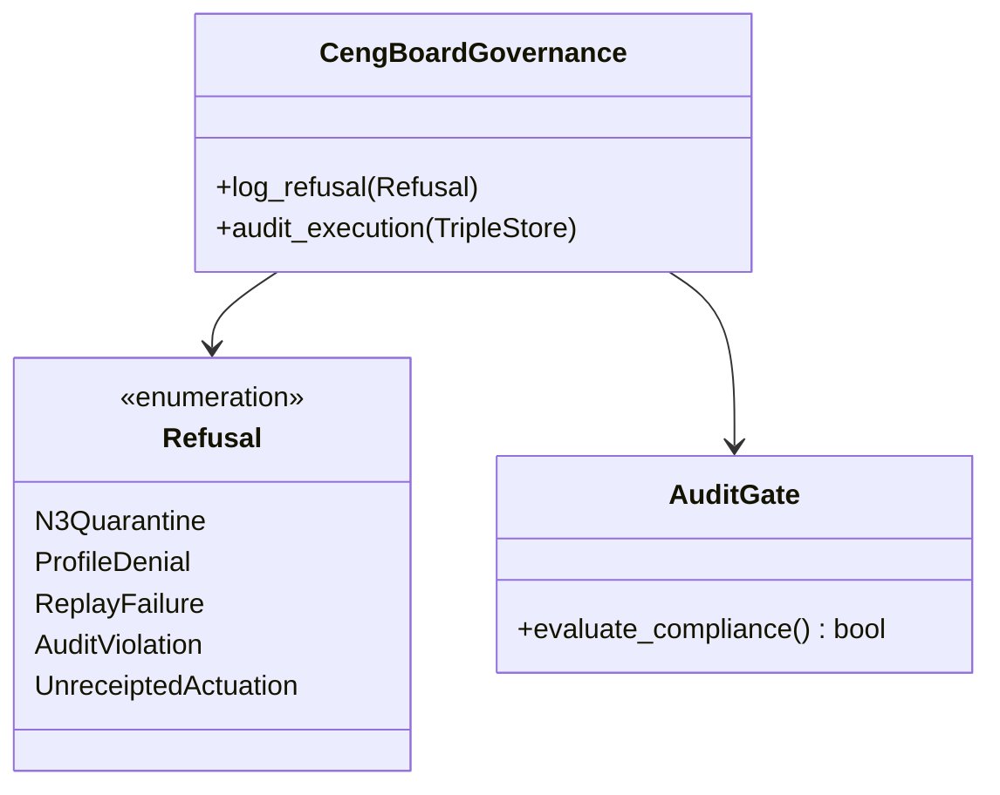
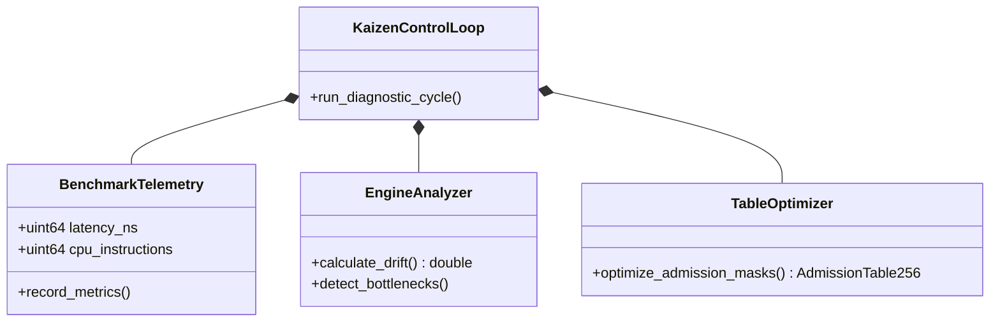

# Class Diagram Family

This document contains exactly 8 class diagrams mapping the Chatman Engine across its 8 projection lenses, preserving key architectural invariants under Design for Combinatorial Maximalism.

## Diagrams

### CLASS-L1: Semantic Authority

Diagram ID: CLASS-L1
Diagram family: Class
Projection lens: Semantic Authority
Architectural invariant preserved: RDF/Oxigraph is the single semantic source of truth; all query and modification models refer directly to the Oxigraph store.
Information-loss risk if omitted: Structuring data caches inside class models, which creates shadow copy variants that drift from Oxigraph.
TPS visual-control purpose: Eliminating model duplication waste by centralizing state ownership under Oxigraph.
DfLSS CTQ protected: Zero semantic shadow copies in memory.
CENG ticket or boundary constrained: Bound by CENG-410-FINAL.
Why this diagram is non-redundant: Visualizes structural relationships and dependencies of semantic storage classes, which sequence/flowcharts cannot show.

---

### CLASS-L2: Routing Constitution

Diagram ID: CLASS-L2
Diagram family: Class
Projection lens: Routing Constitution
Architectural invariant preserved: Least-expressive-power routing structure with N3 quarantined by default.
Information-loss risk if omitted: Compiling the router in a way that allows N3 queries to execute directly without routing gating.
TPS visual-control purpose: Exposing structural routing waste.
DfLSS CTQ protected: 100% compliance with least-expressive routing constraints.
CENG ticket or boundary constrained: CENG-410-M1.
Why this diagram is non-redundant: Defines class-level components of the routing subsystem.

---

### CLASS-L3: Type Kernel Ownership

Diagram ID: CLASS-L3
Diagram family: Class
Projection lens: Type Kernel Ownership
Architectural invariant preserved: Strict crate-level type kernel mapping to enforce modular domain boundaries.
Information-loss risk if omitted: Type redefinitions across crates, breaking system-level type invariants.
TPS visual-control purpose: Exposing structural duplication waste across crates.
DfLSS CTQ protected: Single crate ownership of types.
CENG ticket or boundary constrained: CENG-411 (design-only).
Why this diagram is non-redundant: Details compilation-level type ownership and crate dependencies.

---

### CLASS-L4: Transition Lifecycle

Diagram ID: CLASS-L4
Diagram family: Class
Projection lens: Transition Lifecycle
Architectural invariant preserved: Validation gate interfaces for state transition candidates.
Information-loss risk if omitted: Missing structural validation hooks in transition candidate definitions.
TPS visual-control purpose: Ensuring quality gates (Poka-Yoke) in data structures.
DfLSS CTQ protected: Complete verification of candidate transitions.
CENG ticket or boundary constrained: CENG-410-FINAL.
Why this diagram is non-redundant: Shows structural composition of transition state models and their validators.

---

### CLASS-L5: Event / Hook / Actuation

Diagram ID: CLASS-L5
Diagram family: Class
Projection lens: Event / Hook / Actuation
Architectural invariant preserved: Decoupled event matching and pure SPARQL delta projection modeling.
Information-loss risk if omitted: Side-effect properties defined in hook structures, enabling state mutations without delta receipts.
TPS visual-control purpose: Preventing side-effect pollution (waste reduction).
DfLSS CTQ protected: 100% pure delta projections.
CENG ticket or boundary constrained: CENG-412 (design-only).
Why this diagram is non-redundant: Shows how hooks compile event triggers into declarative CONSTRUCT actions.

---

### CLASS-L6: Performance / 8-Constraint Hot Path

Diagram ID: CLASS-L6
Diagram family: Class
Projection lens: Performance / 8-Constraint Hot Path
Architectural invariant preserved: RDFTriple8 binary layout and byte mask mapping.
Information-loss risk if omitted: Inefficient heap allocation for triples, leading to CPU cache thrashing.
TPS visual-control purpose: Minimizing memory footprint and processing latency.
DfLSS CTQ protected: Hot path execution time boundaries.
CENG ticket or boundary constrained: CENG-410-M1.
Why this diagram is non-redundant: Visualizes structures optimized for direct CPU register operations.

---

### CLASS-L7: Refusal / Risk / Governance

Diagram ID: CLASS-L7
Diagram family: Class
Projection lens: Refusal / Risk / Governance
Architectural invariant preserved: Typed refusal taxonomy to ensure compile-time verification of error structures.
Information-loss risk if omitted: Catch-all panic behaviors that bypass the refusal taxonomy.
TPS visual-control purpose: Error-proofing (Poka-Yoke) through type contracts.
DfLSS CTQ protected: 100% of errors map to a serializable Refusal variant.
CENG ticket or boundary constrained: CENG-410-FINAL.
Why this diagram is non-redundant: Details the failure type hierarchy.

---

### CLASS-L8: TPS / DfLSS / Continuous Improvement

Diagram ID: CLASS-L8
Diagram family: Class
Projection lens: TPS / DfLSS / Continuous Improvement
Architectural invariant preserved: Feedback loops for runtime optimization of table mappings.
Information-loss risk if omitted: Missing structural hook points for benchmark monitors, leaving the system blind to regressions.
TPS visual-control purpose: Kaizen loops mapped in data structures.
DfLSS CTQ protected: Maximum variance limits for execution latency.
CENG ticket or boundary constrained: CENG-416A-F (design-only).
Why this diagram is non-redundant: Maps structural dependencies of diagnostic classes.

