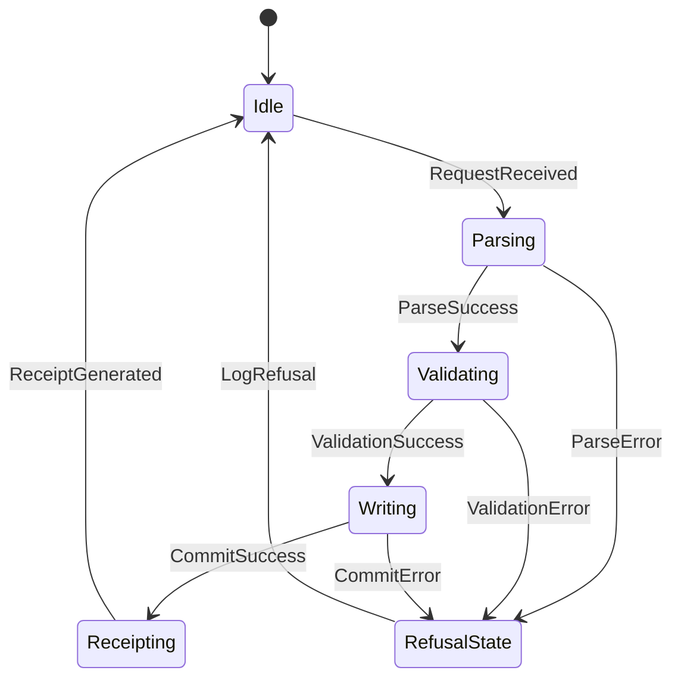
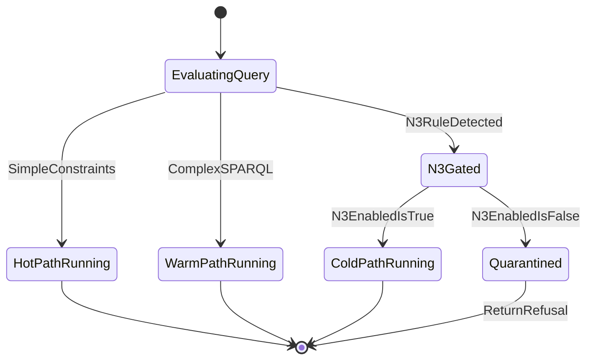
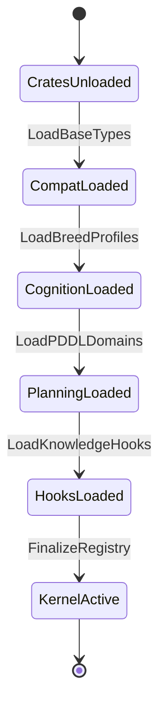
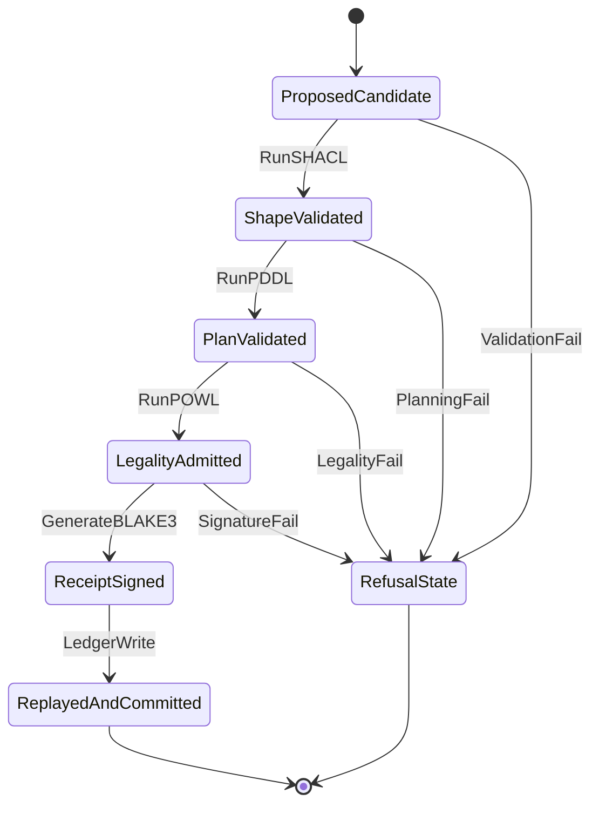
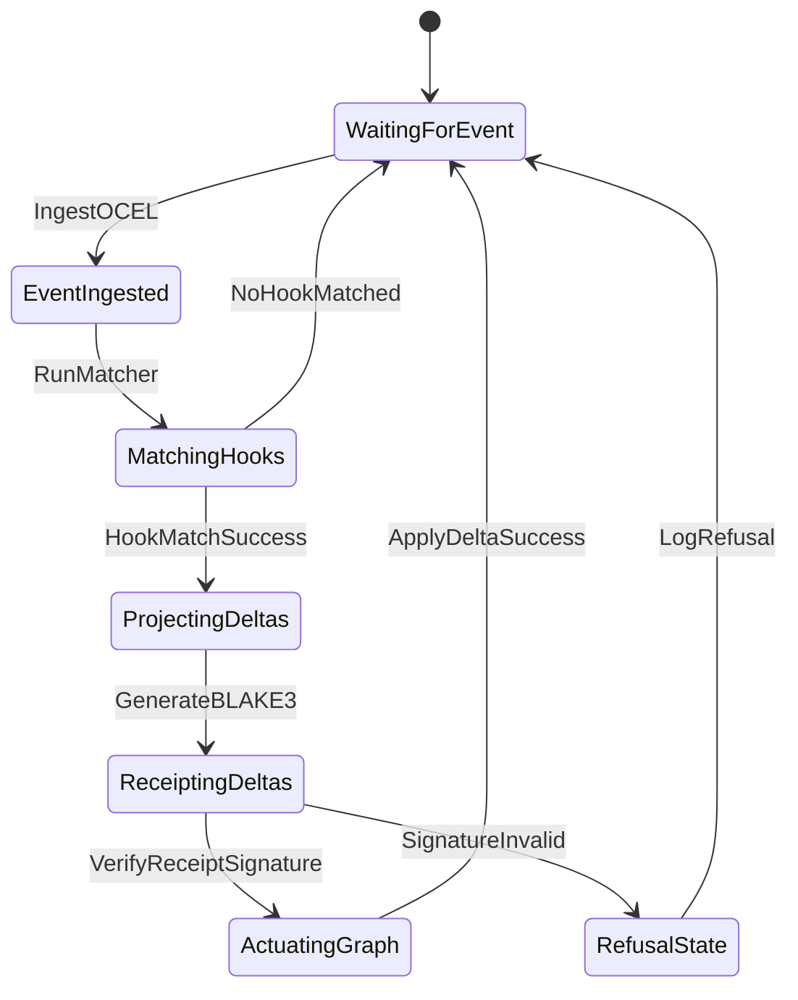
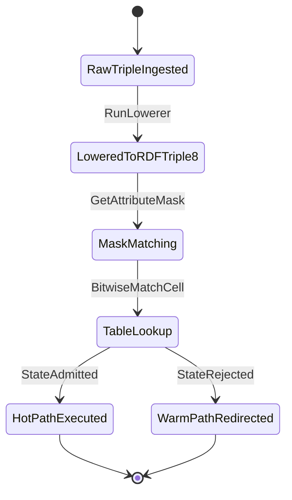
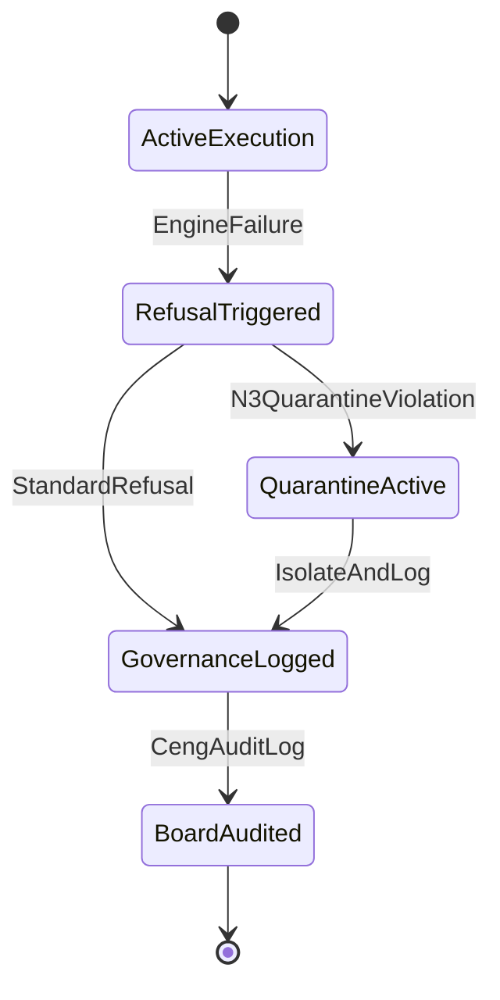
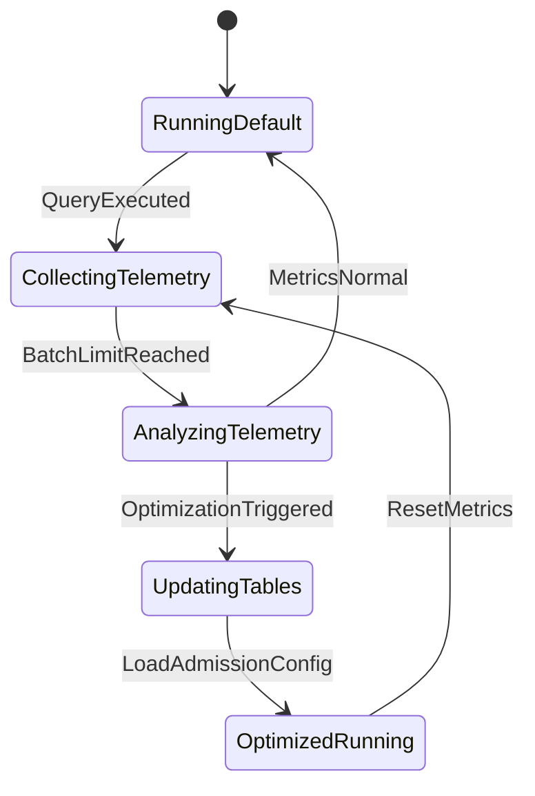

# State Diagram Family

This document contains exactly 8 state diagrams mapping the Chatman Engine across its 8 projection lenses, preserving key architectural invariants under Design for Combinatorial Maximalism.

## Diagrams

### STATE-L1: Semantic Authority

Diagram ID: STATE-L1
Diagram family: State
Projection lens: Semantic Authority
Architectural invariant preserved: Transactional integrity of the Oxigraph semantic store; all write processes must complete database mutation before receipting.
Information-loss risk if omitted: State transition from "Writing" to "Receipted" occurring without verifying the physical Oxigraph database commit state.
TPS visual-control purpose: Preventing defective state handoffs in the transaction pipeline.
DfLSS CTQ protected: 100% of receipted transactions correspond to real data in Oxigraph.
CENG ticket or boundary constrained: Bound by CENG-410-FINAL.
Why this diagram is non-redundant: Details the internal transactional states of semantic storage, which class and sequence diagrams cannot represent.

---

### STATE-L2: Routing Constitution

Diagram ID: STATE-L2
Diagram family: State
Projection lens: Routing Constitution
Architectural invariant preserved: Safe routing constitution state machine; N3 rules remain quarantined until explicitly activated.
Information-loss risk if omitted: Allowing an N3 evaluation state to bypass permission checking.
TPS visual-control purpose: Tracking rule admission compliance at the routing gate.
DfLSS CTQ protected: Least-expressive path execution state isolation.
CENG ticket or boundary constrained: CENG-410-M1.
Why this diagram is non-redundant: Visualizes the conditional states of the routing evaluator.

---

### STATE-L3: Type Kernel Ownership

Diagram ID: STATE-L3
Diagram family: State
Projection lens: Type Kernel Ownership
Architectural invariant preserved: Initialization state sequencing of type registries.
Information-loss risk if omitted: Attempting to load planning or hook domains while base types are uninitialized, causing kernel panics.
TPS visual-control purpose: Visualizing system boot completeness.
DfLSS CTQ protected: Safe boot transition path.
CENG ticket or boundary constrained: CENG-411 (design-only).
Why this diagram is non-redundant: Details the structural loading phases of the engine's modular crates.

---

### STATE-L4: Transition Lifecycle

Diagram ID: STATE-L4
Diagram family: State
Projection lens: Transition Lifecycle
Architectural invariant preserved: Sequential gate transitions for candidate execution (Proposed -> Shape -> Plan -> Legality -> Signed).
Information-loss risk if omitted: Executing state changes that bypass PDDL or POWL gate checks.
TPS visual-control purpose: Ensuring zero-defect transitions through linear sequence gates.
DfLSS CTQ protected: 100% verification coverage of transaction candidates.
CENG ticket or boundary constrained: CENG-410-FINAL.
Why this diagram is non-redundant: Maps the lifecycle states of a single transaction payload.

---

### STATE-L5: Event / Hook / Actuation

Diagram ID: STATE-L5
Diagram family: State
Projection lens: Event / Hook / Actuation
Architectural invariant preserved: Hook execution states are strictly receipt-bound; delta projection occurs inside isolation.
Information-loss risk if omitted: Actuating state changes before delta projection verification, causing side effect leaks.
TPS visual-control purpose: Stopping downstream processing if receipt fails.
DfLSS CTQ protected: Zero unreceipted actuations.
CENG ticket or boundary constrained: CENG-412 (design-only).
Why this diagram is non-redundant: Focuses on the matching and execution states of Knowledge Hooks.

---

### STATE-L6: Performance / 8-Constraint Hot Path

Diagram ID: STATE-L6
Diagram family: State
Projection lens: Performance / 8-Constraint Hot Path
Architectural invariant preserved: Direct bitmask mapping states for fast triple evaluation.
Information-loss risk if omitted: Routing hot-path candidates to the warm-path execution thread by default.
TPS visual-control purpose: Monitoring performance pathway transitions.
DfLSS CTQ protected: Low latency state transitions.
CENG ticket or boundary constrained: CENG-410-M1.
Why this diagram is non-redundant: Focuses on the state transitions of binary representation lowering.

---

### STATE-L7: Refusal / Risk / Governance

Diagram ID: STATE-L7
Diagram family: State
Projection lens: Refusal / Risk / Governance
Architectural invariant preserved: Quarantine and audit logging of state failures.
Information-loss risk if omitted: Silent failures or recovery actions that bypass governance audit records.
TPS visual-control purpose: Visualizing safety containment states (Poka-Yoke).
DfLSS CTQ protected: 100% auditability of execution errors.
CENG ticket or boundary constrained: CENG-410-FINAL.
Why this diagram is non-redundant: Focuses strictly on risk management and quarantine states.

---

### STATE-L8: TPS / DfLSS / Continuous Improvement

Diagram ID: STATE-L8
Diagram family: State
Projection lens: TPS / DfLSS / Continuous Improvement
Architectural invariant preserved: Tuning tables based on telemetry analysis.
Information-loss risk if omitted: Running the system with suboptimal static configuration, causing performance drift.
TPS visual-control purpose: Kaizen feedback loop states.
DfLSS CTQ protected: Telemetry-driven optimization transitions.
CENG ticket or boundary constrained: CENG-416A-F (design-only).
Why this diagram is non-redundant: Represents states of system self-optimization.

