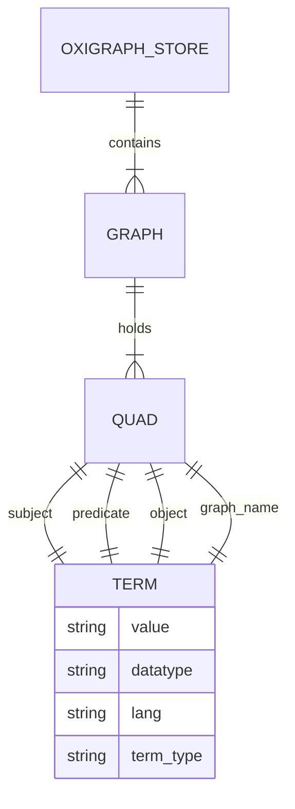
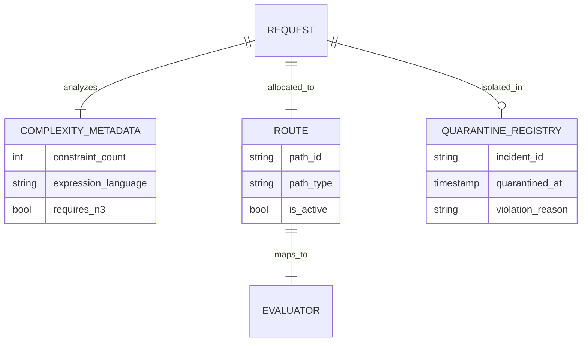
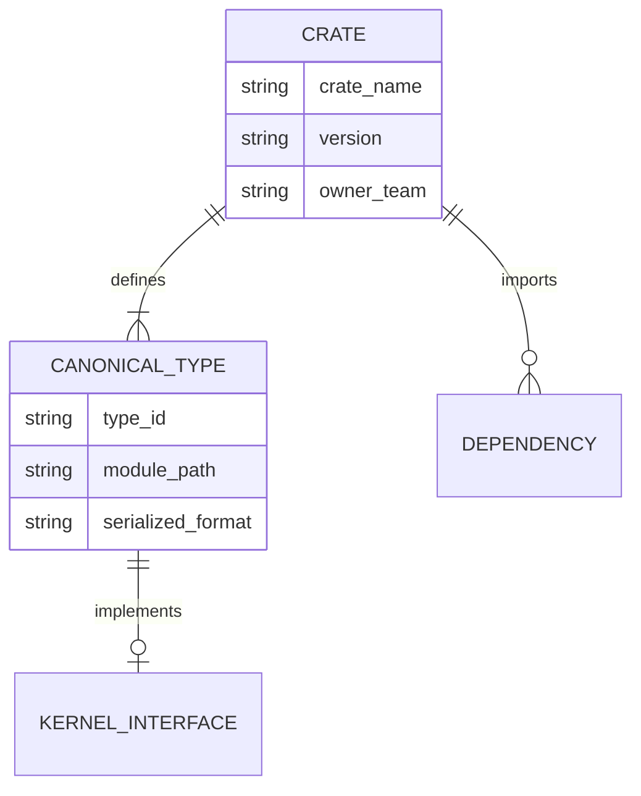
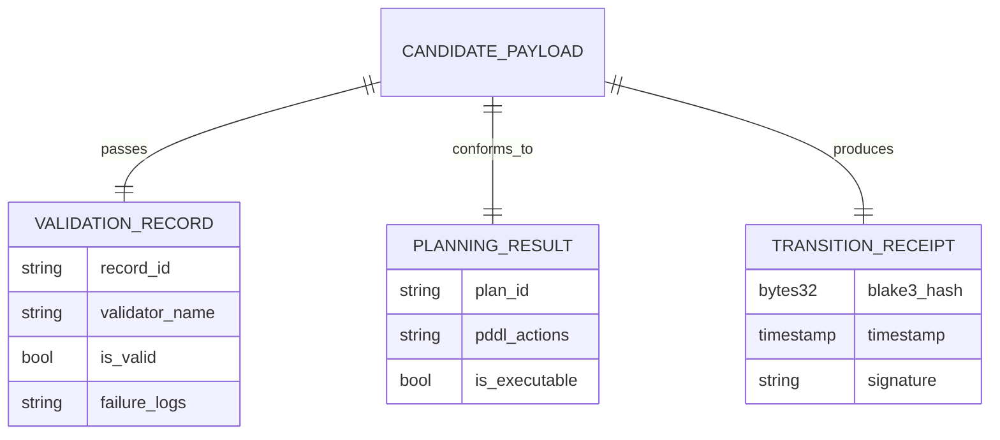
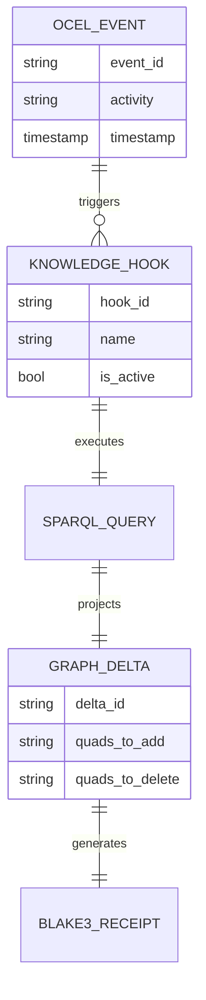
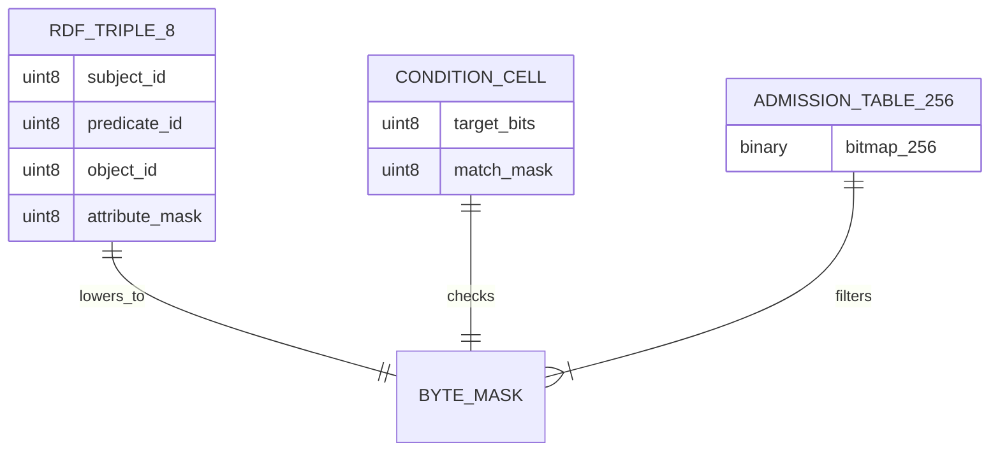
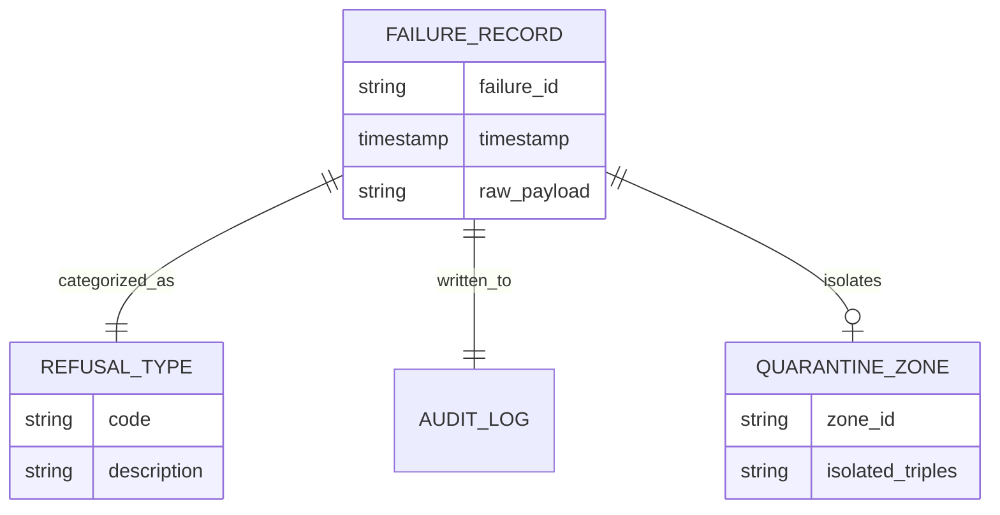
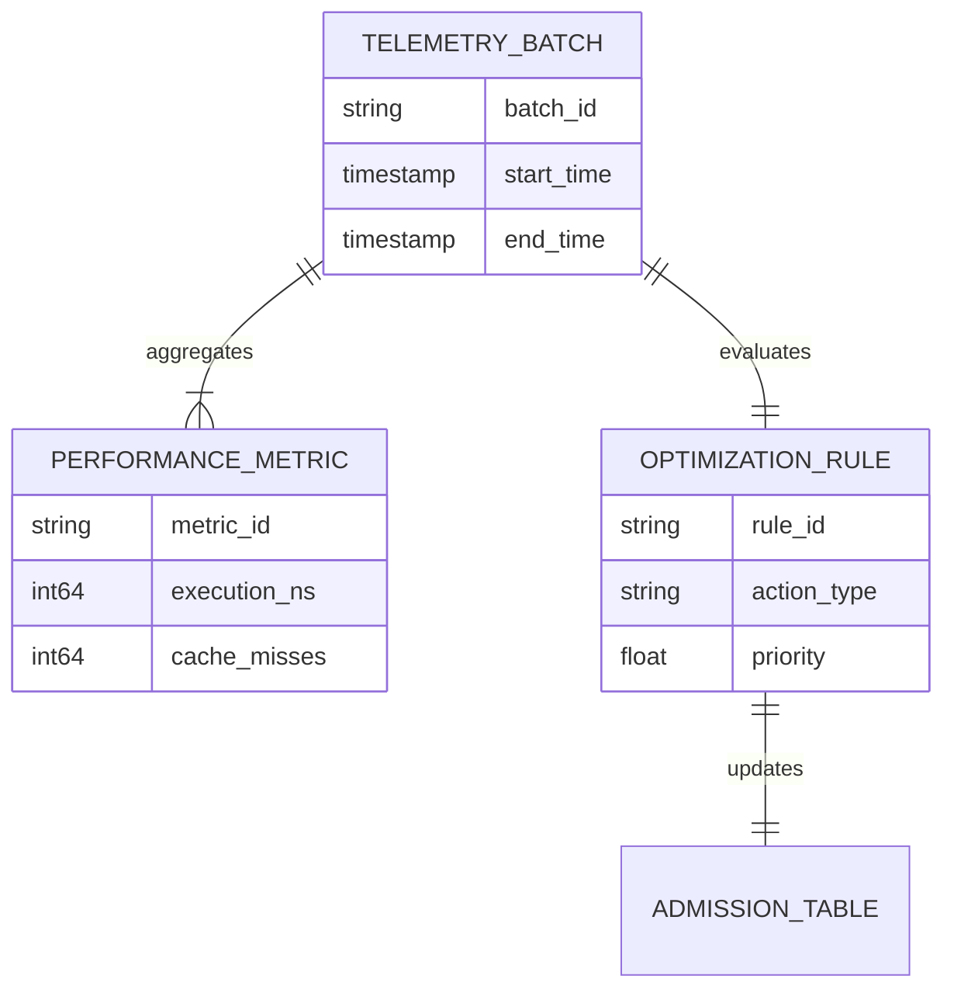

# Entity Relationship Diagram Family

This document contains exactly 8 Entity Relationship (ER) diagrams mapping the Chatman Engine across its 8 projection lenses, preserving key architectural invariants under Design for Combinatorial Maximalism.

## Diagrams

### ENTITY_RELATIONSHIP-L1: Semantic Authority

Diagram ID: ENTITY_RELATIONSHIP-L1
Diagram family: Entity Relationship
Projection lens: Semantic Authority
Architectural invariant preserved: RDF Quad structure semantics; every fact is represented as a canonical RDF Quad consisting of Subject, Predicate, Object, and Graph.
Information-loss risk if omitted: modeling triples with custom properties or skipping graph name contexts, losing Oxigraph semantics.
TPS visual-control purpose: Visualizing fact structures to eliminate semantic representation waste.
DfLSS CTQ protected: Zero non-standard triple shapes in storage.
CENG ticket or boundary constrained: Bound by CENG-410-FINAL.
Why this diagram is non-redundant: Details the structural layout of Oxigraph storage tables and attributes.

---

### ENTITY_RELATIONSHIP-L2: Routing Constitution

Diagram ID: ENTITY_RELATIONSHIP-L2
Diagram family: Entity Relationship
Projection lens: Routing Constitution
Architectural invariant preserved: Query-to-path routing mapping relationships.
Information-loss risk if omitted: Unmapped query routing schemas causing errors during complexity resolution.
TPS visual-control purpose: Restricting execution paths based on complexity metadata.
DfLSS CTQ protected: Least-expressive routing model assignment.
CENG ticket or boundary constrained: CENG-410-M1.
Why this diagram is non-redundant: Models relational data used by the router for path gating and quarantine checks.

---

### ENTITY_RELATIONSHIP-L3: Type Kernel Ownership

Diagram ID: ENTITY_RELATIONSHIP-L3
Diagram family: Entity Relationship
Projection lens: Type Kernel Ownership
Architectural invariant preserved: Dependency constraints and registry ownership relations of kernel types.
Information-loss risk if omitted: Creating circular references or duplicates of kernel types across separate tables.
TPS visual-control purpose: Exposing type duplication waste across compile-time schemas.
DfLSS CTQ protected: Crate-level type boundary isolation.
CENG ticket or boundary constrained: CENG-411 (design-only).
Why this diagram is non-redundant: Focuses on domain type relationships and modular dependency chains.

---

### ENTITY_RELATIONSHIP-L4: Transition Lifecycle

Diagram ID: ENTITY_RELATIONSHIP-L4
Diagram family: Entity Relationship
Projection lens: Transition Lifecycle
Architectural invariant preserved: Verification record chaining for admitted transitions.
Information-loss risk if omitted: Orphan transition receipts that do not reference validation or planning logs.
TPS visual-control purpose: Visualizing validation data chains to ensure auditability.
DfLSS CTQ protected: 100% of receipts contain a valid planning and validation reference.
CENG ticket or boundary constrained: CENG-410-FINAL.
Why this diagram is non-redundant: Details validation audit entity relationships.

---

### ENTITY_RELATIONSHIP-L5: Event / Hook / Actuation

Diagram ID: ENTITY_RELATIONSHIP-L5
Diagram family: Entity Relationship
Projection lens: Event / Hook / Actuation
Architectural invariant preserved: OCEL event ingestion to pure hook action mapping.
Information-loss risk if omitted: Untraceable delta executions because events and hook triggers are decoupled in the schema.
TPS visual-control purpose: Exposing side-effect paths to maintain pure functional graph transitions.
DfLSS CTQ protected: Complete traceability of delta actuation to source OCEL events.
CENG ticket or boundary constrained: CENG-412 (design-only).
Why this diagram is non-redundant: Details schema relationships for hooks, events, and projected quads.

---

### ENTITY_RELATIONSHIP-L6: Performance / 8-Constraint Hot Path

Diagram ID: ENTITY_RELATIONSHIP-L6
Diagram family: Entity Relationship
Projection lens: Performance / 8-Constraint Hot Path
Architectural invariant preserved: RDFTriple8 performance mappings; ConditionCell binary matching structures.
Information-loss risk if omitted: Heap mapping models that represent low-level byte masks, hiding performance-critical memory alignments.
TPS visual-control purpose: Direct memory mapping representation to reduce evaluation latency.
DfLSS CTQ protected: Hot path execution data constraints.
CENG ticket or boundary constrained: CENG-410-M1.
Why this diagram is non-redundant: Visualizes register-aligned entity relationships on the hot path.

---

### ENTITY_RELATIONSHIP-L7: Refusal / Risk / Governance

Diagram ID: ENTITY_RELATIONSHIP-L7
Diagram family: Entity Relationship
Projection lens: Refusal / Risk / Governance
Architectural invariant preserved: Schema constraints on refusal records, quarantines, and governance logs.
Information-loss risk if omitted: Loss of audit trace data for quarantined triple failures.
TPS visual-control purpose: Error containment logging (Poka-Yoke).
DfLSS CTQ protected: Zero undocumented refusals.
CENG ticket or boundary constrained: CENG-410-FINAL.
Why this diagram is non-redundant: Models security/risk metadata relationships.

---

### ENTITY_RELATIONSHIP-L8: TPS / DfLSS / Continuous Improvement

Diagram ID: ENTITY_RELATIONSHIP-L8
Diagram family: Entity Relationship
Projection lens: TPS / DfLSS / Continuous Improvement
Architectural invariant preserved: Metric relational schemas for Kaizen performance tuning.
Information-loss risk if omitted: Telemetry data schema omissions that hide path latency regression parameters.
TPS visual-control purpose: Exposing metrics schema dependencies for optimization feedback loops.
DfLSS CTQ protected: Accurate telemetry tracking schema bounds.
CENG ticket or boundary constrained: CENG-416A-F (design-only).
Why this diagram is non-redundant: Models relational diagnostic tables.

