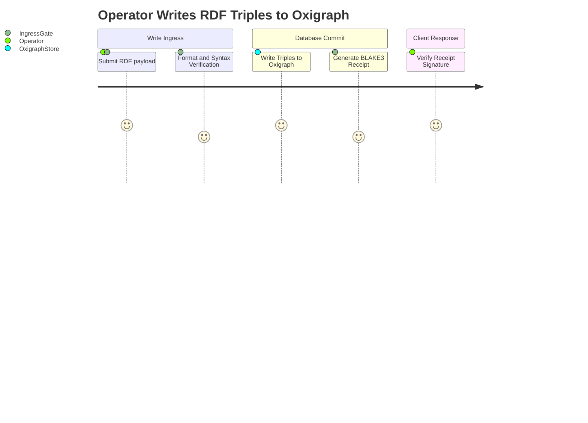
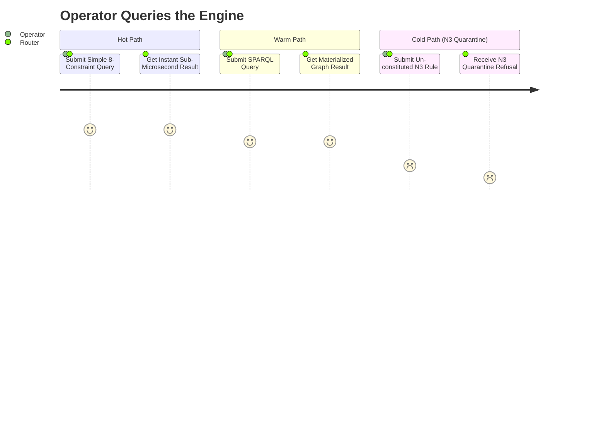
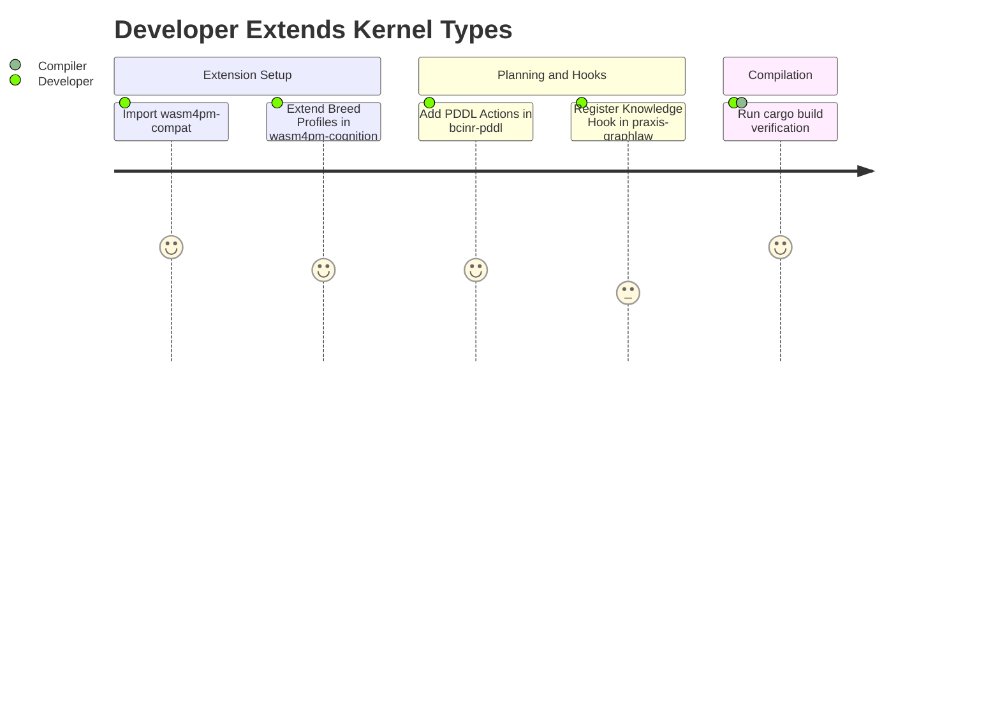
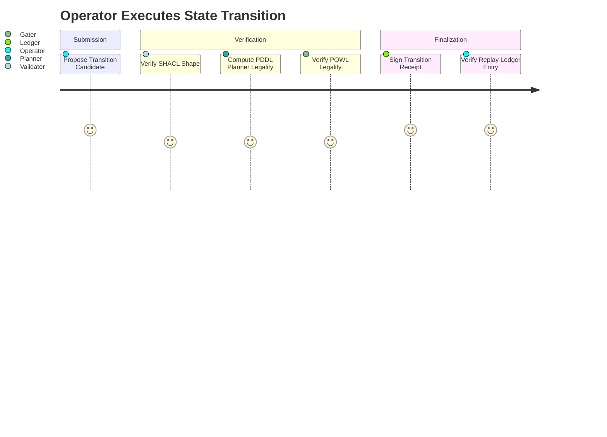
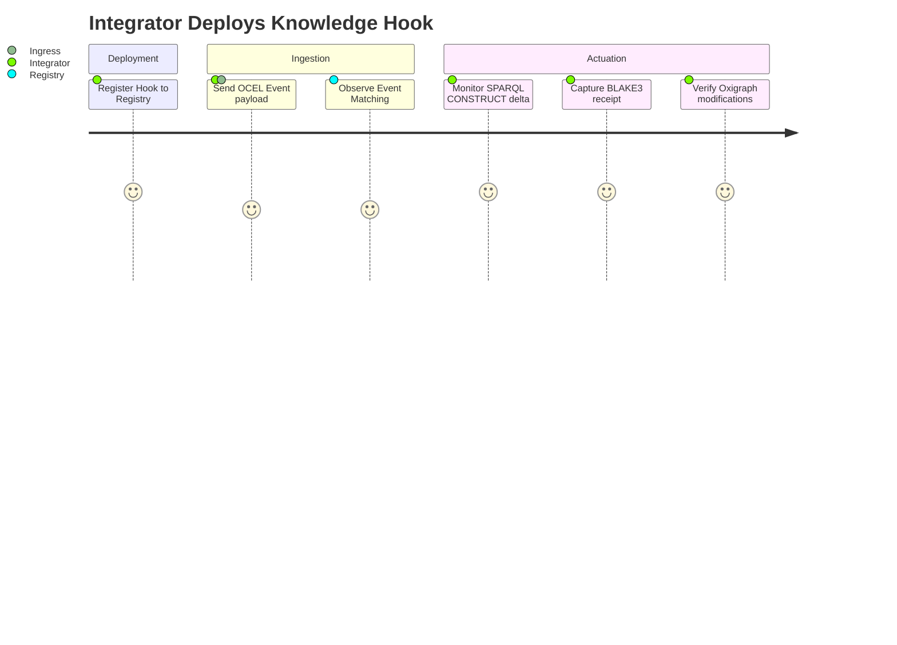
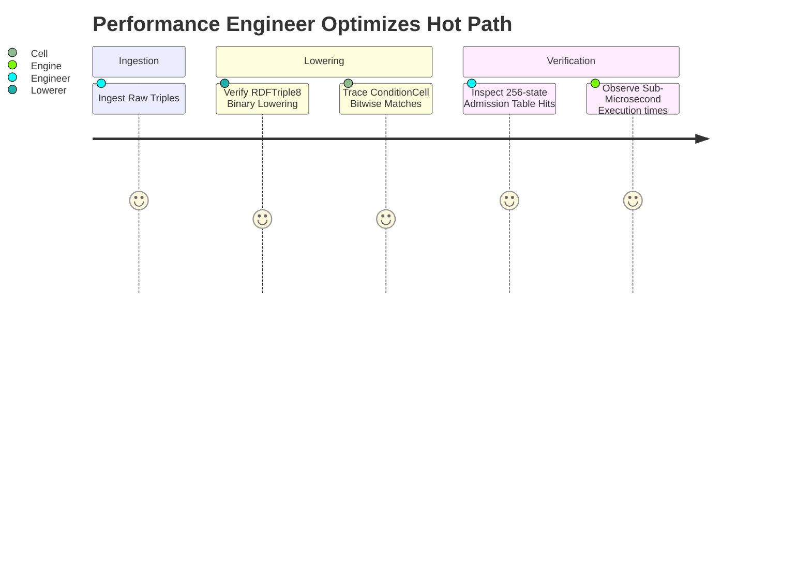
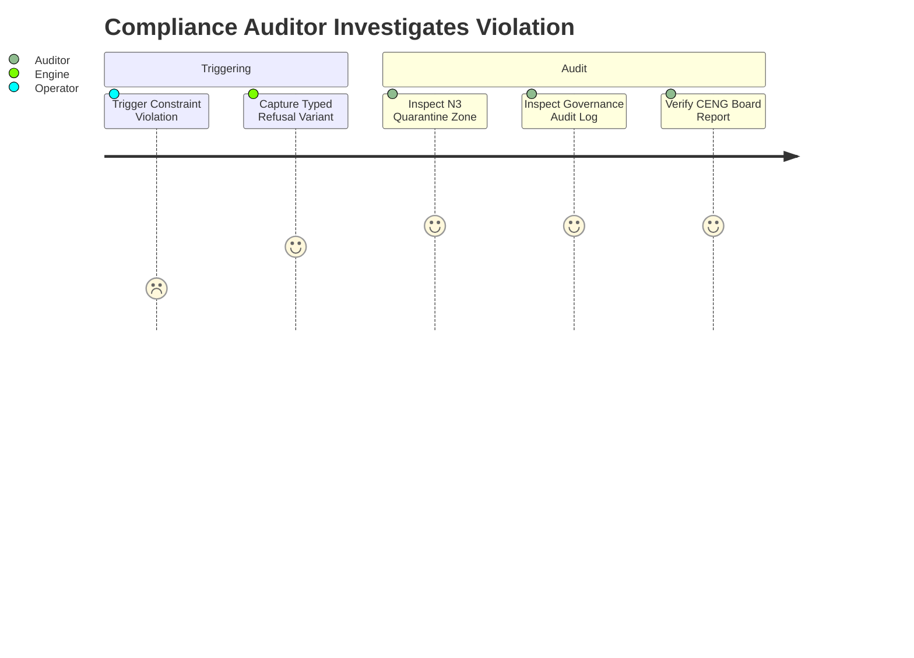
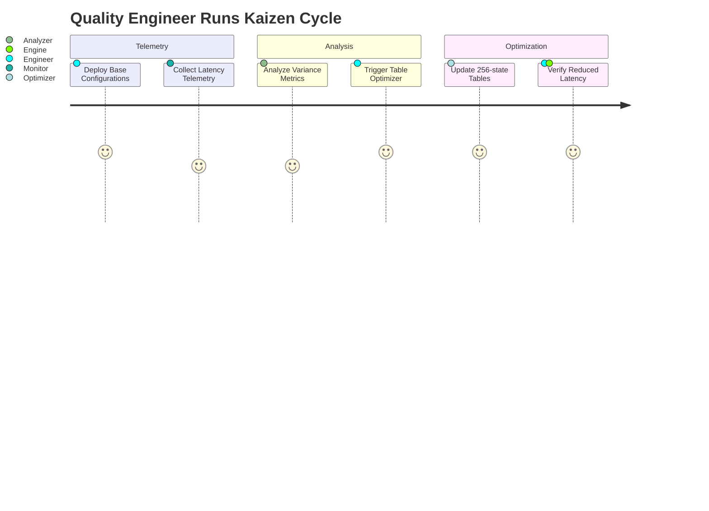

# User Journey Diagram Family

This document contains exactly 8 User Journey diagrams mapping the Chatman Engine across its 8 projection lenses, preserving key architectural invariants under Design for Combinatorial Maximalism.

## Diagrams

### USER_JOURNEY-L1: Semantic Authority

Diagram ID: USER_JOURNEY-L1
Diagram family: User Journey
Projection lens: Semantic Authority
Architectural invariant preserved: Transactional integrity of the Oxigraph store from the perspective of an operator.
Information-loss risk if omitted: Designing interactions that assume a write is complete before it has been persisted to the Oxigraph store.
TPS visual-control purpose: Highlighting user-visible delay waste during transaction validation and write-gating.
DfLSS CTQ protected: Operator trust in triple persistence (zero semantic shadow copies).
CENG ticket or boundary constrained: Bound by CENG-410-FINAL.
Why this diagram is non-redundant: Focuses on the user experience and task perception during database write operations.

---

### USER_JOURNEY-L2: Routing Constitution

Diagram ID: USER_JOURNEY-L2
Diagram family: User Journey
Projection lens: Routing Constitution
Architectural invariant preserved: Execution path gating based on query complexity; N3 quarantine by default.
Information-loss risk if omitted: Operators assuming cold path execution is always available, leading to unexpected runtime refusals.
TPS visual-control purpose: Visualizing user friction and path rejection for non-compliant queries.
DfLSS CTQ protected: Path selection policy enforcement.
CENG ticket or boundary constrained: CENG-410-M1.
Why this diagram is non-redundant: Details operator perception of query execution speed and path refusals.

---

### USER_JOURNEY-L3: Type Kernel Ownership

Diagram ID: USER_JOURNEY-L3
Diagram family: User Journey
Projection lens: Type Kernel Ownership
Architectural invariant preserved: Strict crate-level type kernel mapping to enforce modular domain boundaries for developers.
Information-loss risk if omitted: Developer confusion regarding type compilation errors when extending the codebase.
TPS visual-control purpose: Eliminating development rework waste caused by circular crate dependencies.
DfLSS CTQ protected: Crate-level type boundary isolation.
CENG ticket or boundary constrained: CENG-411 (design-only).
Why this diagram is non-redundant: Maps developer tasks and satisfaction when modifying the modular type registries.

---

### USER_JOURNEY-L4: Transition Lifecycle

Diagram ID: USER_JOURNEY-L4
Diagram family: User Journey
Projection lens: Transition Lifecycle
Architectural invariant preserved: Linear state progression of transition candidates through all validation gates.
Information-loss risk if omitted: Users executing state transitions without validation, leading to state inconsistencies.
TPS visual-control purpose: Ensuring zero-defect transitions through linear sequence gates.
DfLSS CTQ protected: Complete verification of candidate transitions.
CENG ticket or boundary constrained: CENG-410-FINAL.
Why this diagram is non-redundant: Maps operator task sequences when processing a transition candidate.

---

### USER_JOURNEY-L5: Event / Hook / Actuation

Diagram ID: USER_JOURNEY-L5
Diagram family: User Journey
Projection lens: Event / Hook / Actuation
Architectural invariant preserved: OCEL event ingestion to pure hook action mapping for integration developers.
Information-loss risk if omitted: Integrators executing side-effects during hook matching, violating rollback constraints.
TPS visual-control purpose: Preventing side-effect pollution (waste reduction).
DfLSS CTQ protected: 100% pure delta projections.
CENG ticket or boundary constrained: CENG-412 (design-only).
Why this diagram is non-redundant: Details integrator perception of hook matching and actuation.

---

### USER_JOURNEY-L6: Performance / 8-Constraint Hot Path

Diagram ID: USER_JOURNEY-L6
Diagram family: User Journey
Projection lens: Performance / 8-Constraint Hot Path
Architectural invariant preserved: Sub-microsecond hot-path query execution via binary lowering.
Information-loss risk if omitted: High latency warm-path fallback occurrences.
TPS visual-control purpose: Direct memory mapping representation to reduce evaluation latency.
DfLSS CTQ protected: Hot path execution time boundaries.
CENG ticket or boundary constrained: CENG-410-M1.
Why this diagram is non-redundant: Maps performance engineer tasks during hot-path optimizations.

---

### USER_JOURNEY-L7: Refusal / Risk / Governance

Diagram ID: USER_JOURNEY-L7
Diagram family: User Journey
Projection lens: Refusal / Risk / Governance
Architectural invariant preserved: Typed refusal response delivery and audit logging.
Information-loss risk if omitted: Unlogged failures or untyped panics causing system failure without audit logs.
TPS visual-control purpose: Error containment logging (Poka-Yoke).
DfLSS CTQ protected: Zero undocumented refusals.
CENG ticket or boundary constrained: CENG-410-FINAL.
Why this diagram is non-redundant: Visualizes the compliance auditor's task flow during incident investigation.

---

### USER_JOURNEY-L8: TPS / DfLSS / Continuous Improvement

Diagram ID: USER_JOURNEY-L8
Diagram family: User Journey
Projection lens: TPS / DfLSS / Continuous Improvement
Architectural invariant preserved: Continuous performance improvement loop via metric analysis.
Information-loss risk if omitted: Performance drift over time due to rule accumulation.
TPS visual-control purpose: Exposing metrics schema dependencies for optimization feedback loops.
DfLSS CTQ protected: Accurate telemetry tracking schema bounds.
CENG ticket or boundary constrained: CENG-416A-F (design-only).
Why this diagram is non-redundant: Maps quality engineer journey during Kaizen cycles.

