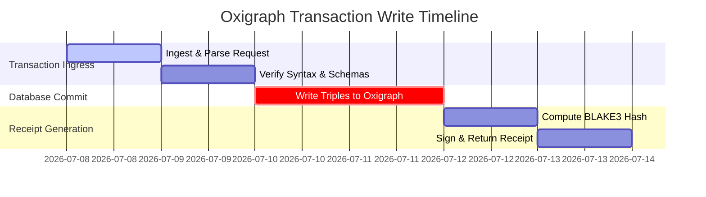
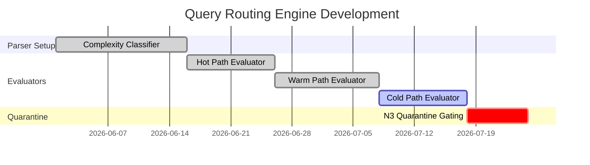
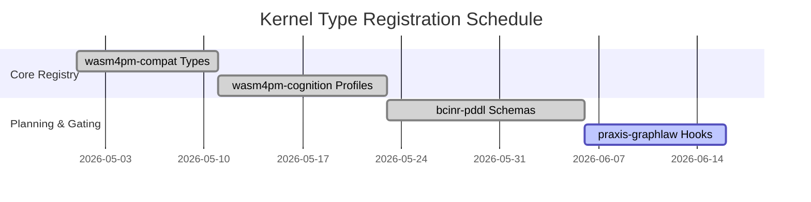
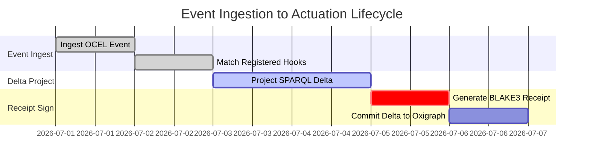
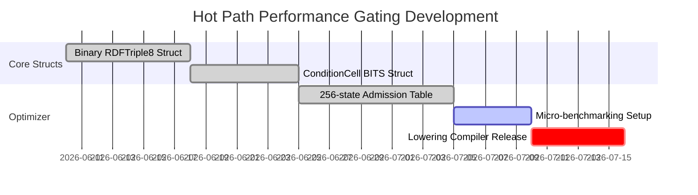
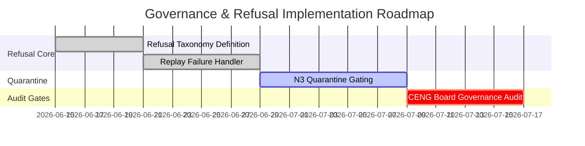
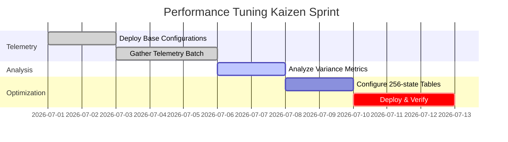

# Gantt Diagram Family

This document contains exactly 8 Gantt diagrams mapping the Chatman Engine across its 8 projection lenses, preserving key architectural invariants under Design for Combinatorial Maximalism.

## Diagrams

### GANTT-L1: Semantic Authority

Diagram ID: GANTT-L1
Diagram family: Gantt
Projection lens: Semantic Authority
Architectural invariant preserved: Transactional integrity of the Oxigraph store.
Information-loss risk if omitted: Scheduling receipt generation and database updates in parallel rather than sequentially, leading to out-of-order execution states.
TPS visual-control purpose: Tracking and optimizing time spent in database commit phases to reduce transaction cycle time.
DfLSS CTQ protected: 100% of receipts generated post-commit.
CENG ticket or boundary constrained: Bound by CENG-410-FINAL.
Why this diagram is non-redundant: Visualizes the temporal scheduling and execution phases of database writing, which other views cannot show.

---

### GANTT-L2: Routing Constitution

Diagram ID: GANTT-L2
Diagram family: Gantt
Projection lens: Routing Constitution
Architectural invariant preserved: Least-expressive-power path routing; Cold path N3 is quarantined unless explicitly enabled.
Information-loss risk if omitted: Overlapping development schedules of warm and cold path evaluators, allowing N3 to bypass gater checks.
TPS visual-control purpose: Visualizing scheduling dependencies of routing subsystems to prevent structural defects.
DfLSS CTQ protected: Least-expressive routing model assignment.
CENG ticket or boundary constrained: CENG-410-M1.
Why this diagram is non-redundant: Tracks development and release phases of the query routing engine.

---

### GANTT-L3: Type Kernel Ownership

Diagram ID: GANTT-L3
Diagram family: Gantt
Projection lens: Type Kernel Ownership
Architectural invariant preserved: Strict crate-level type kernel mapping to enforce modular domain boundaries.
Information-loss risk if omitted: Parallel development of types in separate crates, causing circular compilation dependencies.
TPS visual-control purpose: Eliminating development rework waste caused by circular crate dependencies.
DfLSS CTQ protected: Crate-level type boundary isolation.
CENG ticket or boundary constrained: CENG-411 (design-only).
Why this diagram is non-redundant: Tracks the implementation sequence of crate-level type registries.

---

### GANTT-L4: Transition Lifecycle

Diagram ID: GANTT-L4
Diagram family: Gantt
Projection lens: Transition Lifecycle
Architectural invariant preserved: Linear state progression of transition candidates through all validation gates.
Information-loss risk if omitted: Running validations in parallel without proper cascading dependencies, causing unvalidated admissions.
TPS visual-control purpose: Visualizing gate sequence scheduling for quality control.
DfLSS CTQ protected: Complete verification of candidate transitions.
CENG ticket or boundary constrained: CENG-410-FINAL.
Why this diagram is non-redundant: Details the temporal execution timeline of a single transition candidate.

```mermaid
gantt
    title Single State Transition Process Timeline
    dateFormat  HH:mm:ss
    axisFormat %H:%M:%S
    section Validation Gating
    Propose Candidate           :active, a1, 00:00:00, 5s
    SHACL Shape Verification    :a2, after a1, 10s
    PDDL Plan Legality Check    :a3, after a2, 15s
    POWL Legality Check         :a4, after a3, 5s
    section Finalization
    Compute BLAKE3 Receipt      :crit, a5, after a4, 2s
    Ledger Write Commit         :a6, after a5, 8s
```

---

### GANTT-L5: Event / Hook / Actuation

Diagram ID: GANTT-L5
Diagram family: Gantt
Projection lens: Event / Hook / Actuation
Architectural invariant preserved: OCEL event ingestion to pure hook action mapping.
Information-loss risk if omitted: Scheduling delta projection and receipt generation after actuation, risking side effect leaks.
TPS visual-control purpose: Preventing side-effect pollution (waste reduction).
DfLSS CTQ protected: 100% pure delta projections.
CENG ticket or boundary constrained: CENG-412 (design-only).
Why this diagram is non-redundant: Focuses on the event matching and delta projection sequence timeline.

---

### GANTT-L6: Performance / 8-Constraint Hot Path

Diagram ID: GANTT-L6
Diagram family: Gantt
Projection lens: Performance / 8-Constraint Hot Path
Architectural invariant preserved: Sub-microsecond hot-path query execution via binary lowering.
Information-loss risk if omitted: Allocating development time to dynamic hash maps rather than binary lowering, causing project delays.
TPS visual-control purpose: Eliminating processing waste (latency overhead of warm-path fallbacks).
DfLSS CTQ protected: Hot path execution time boundaries.
CENG ticket or boundary constrained: CENG-410-M1.
Why this diagram is non-redundant: Details the development phases of the hot-path optimizer.

---

### GANTT-L7: Refusal / Risk / Governance

Diagram ID: GANTT-L7
Diagram family: Gantt
Projection lens: Refusal / Risk / Governance
Architectural invariant preserved: Typed refusal response delivery and audit logging.
Information-loss risk if omitted: Developing error handling systems in isolation without a centralized refusal roadmap, leading to untyped panics.
TPS visual-control purpose: Error containment logging (Poka-Yoke).
DfLSS CTQ protected: Zero undocumented refusals.
CENG ticket or boundary constrained: CENG-410-FINAL.
Why this diagram is non-redundant: Visualizes the timeline for setting up risk management and quarantine subsystems.

---

### GANTT-L8: TPS / DfLSS / Continuous Improvement

Diagram ID: GANTT-L8
Diagram family: Gantt
Projection lens: TPS / DfLSS / Continuous Improvement
Architectural invariant preserved: Continuous performance improvement loop via metric analysis.
Information-loss risk if omitted: Running benchmark optimization cycles without strict deadlines, causing performance drift.
TPS visual-control purpose: Exposing metrics schema dependencies for optimization feedback loops.
DfLSS CTQ protected: Accurate telemetry tracking schema bounds.
CENG ticket or boundary constrained: CENG-416A-F (design-only).
Why this diagram is non-redundant: Details the schedule of a continuous performance improvement Kaizen sprint.

