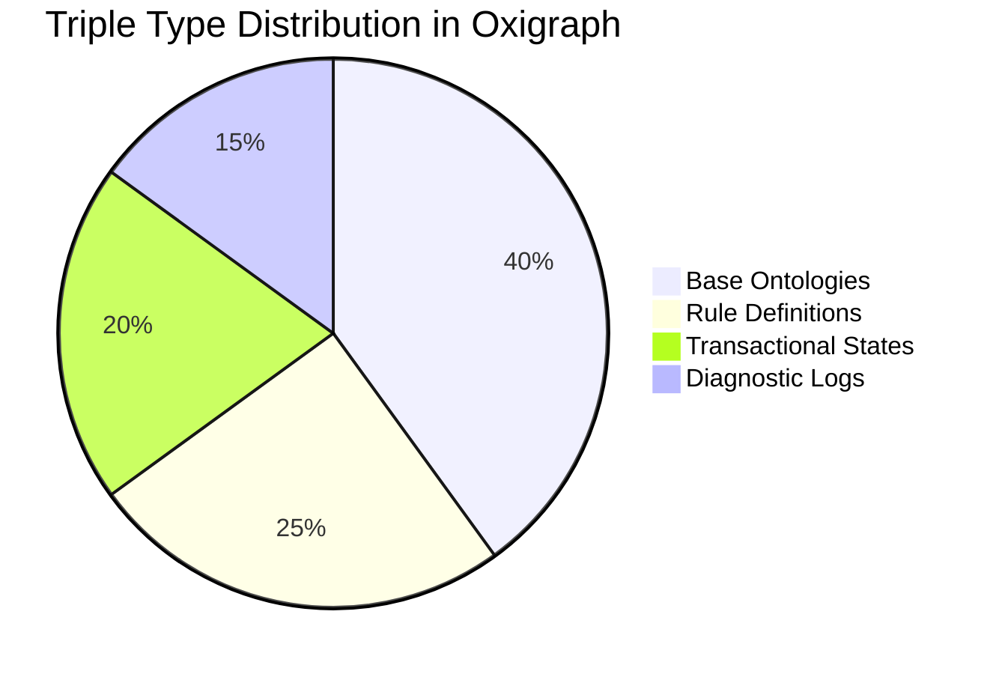
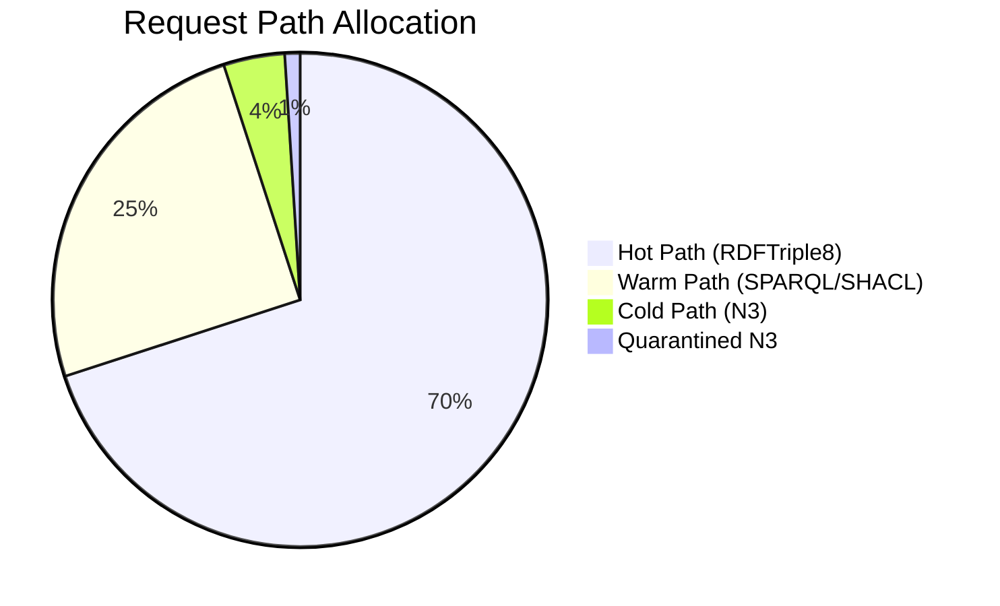
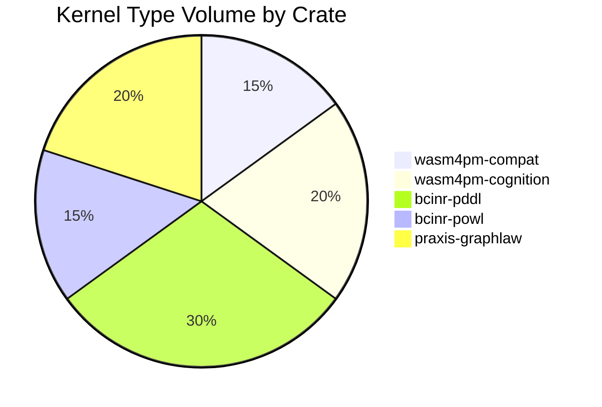
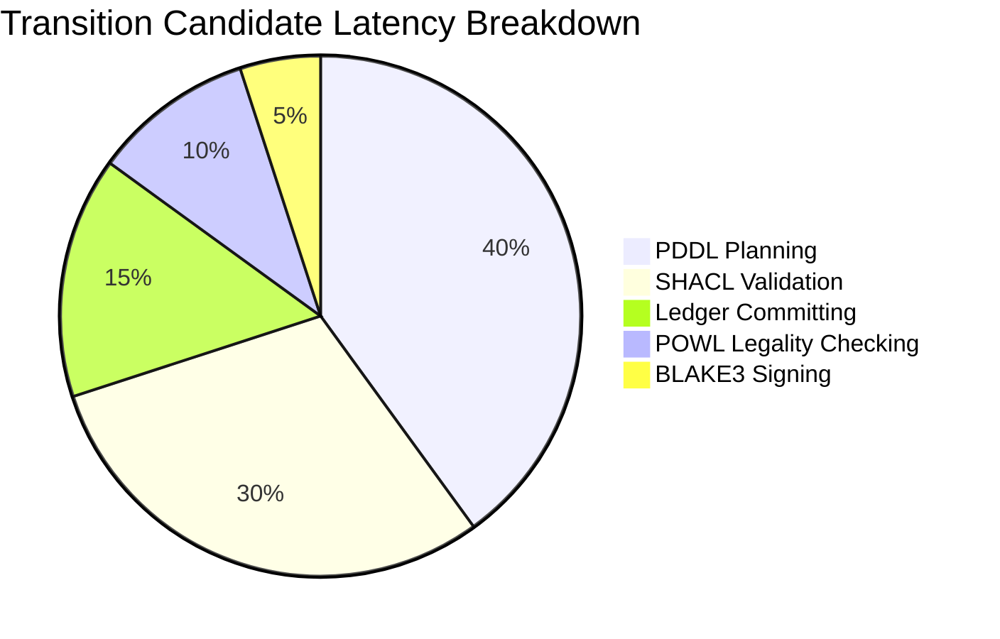
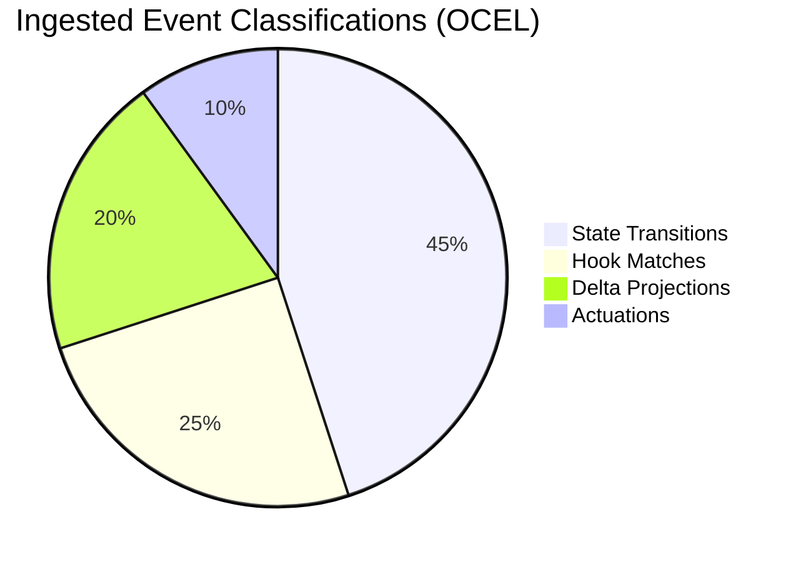
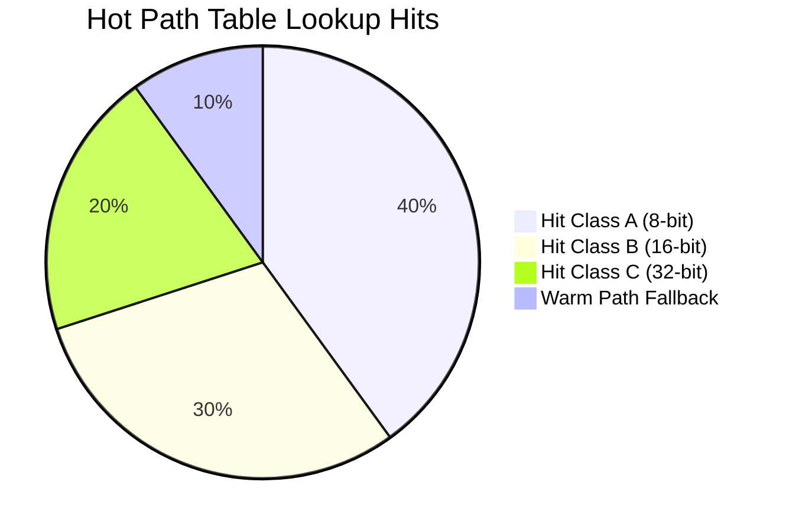
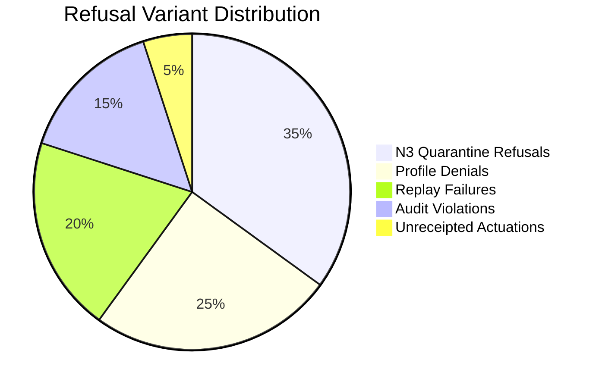
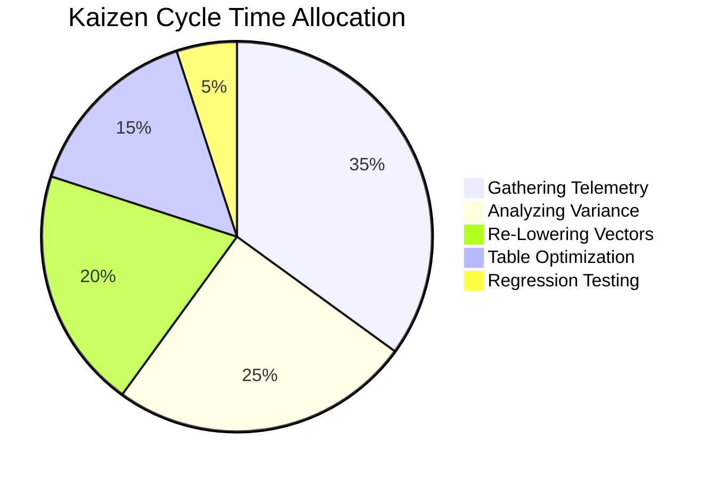

# Pie Chart Diagram Family

This document contains exactly 8 Pie chart diagrams mapping the Chatman Engine across its 8 projection lenses, preserving key architectural invariants under Design for Combinatorial Maximalism.

## Diagrams

### PIE-L1: Semantic Authority

Diagram ID: PIE-L1
Diagram family: Pie
Projection lens: Semantic Authority
Architectural invariant preserved: RDF/Oxigraph is the single semantic source of truth; all facts are stored in Oxigraph.
Information-loss risk if omitted: Overestimating the proportion of data kept in temporary variables rather than committed to Oxigraph.
TPS visual-control purpose: Monitoring storage resource waste across different functional data domains.
DfLSS CTQ protected: Zero semantic shadow copies.
CENG ticket or boundary constrained: Bound by CENG-410-FINAL.
Why this diagram is non-redundant: Visualizes the static distribution of data stored within the Oxigraph database.

---

### PIE-L2: Routing Constitution

Diagram ID: PIE-L2
Diagram family: Pie
Projection lens: Routing Constitution
Architectural invariant preserved: Least-expressive-power path routing.
Information-loss risk if omitted: Failing to detect routing drift where simple queries execute on expensive warm/cold paths.
TPS visual-control purpose: Exposing routing waste (queries executing on unnecessarily complex paths).
DfLSS CTQ protected: Path selection optimization matching rule complexity.
CENG ticket or boundary constrained: CENG-410-M1.
Why this diagram is non-redundant: Details the relative volume of requests handled by each path.

---

### PIE-L3: Type Kernel Ownership

Diagram ID: PIE-L3
Diagram family: Pie
Projection lens: Type Kernel Ownership
Architectural invariant preserved: Strict crate-level type kernel mapping to enforce modular domain boundaries.
Information-loss risk if omitted: Undetected type bloat in specific crates, compromising system modularity.
TPS visual-control purpose: Monitoring type kernel distribution to prevent structural bloat.
DfLSS CTQ protected: Crate-level type boundary isolation.
CENG ticket or boundary constrained: CENG-411 (design-only).
Why this diagram is non-redundant: Represents the structural composition of the codebase across module domains.

---

### PIE-L4: Transition Lifecycle

Diagram ID: PIE-L4
Diagram family: Pie
Projection lens: Transition Lifecycle
Architectural invariant preserved: Linear state progression of transition candidates.
Information-loss risk if omitted: Optimizing the wrong validation gate, wasting engineering effort.
TPS visual-control purpose: Identifying processing bottlenecks in the transition validation pipeline.
DfLSS CTQ protected: Verification process capability.
CENG ticket or boundary constrained: CENG-410-FINAL.
Why this diagram is non-redundant: Visualizes the latency composition of the state transition pipeline.

---

### PIE-L5: Event / Hook / Actuation

Diagram ID: PIE-L5
Diagram family: Pie
Projection lens: Event / Hook / Actuation
Architectural invariant preserved: OCEL event ingestion to pure hook action mapping.
Information-loss risk if omitted: Mismatch between event volume and hook registrations, causing high event drop rates.
TPS visual-control purpose: Tracking event-hook matching and execution efficiency.
DfLSS CTQ protected: 100% pure delta projections.
CENG ticket or boundary constrained: CENG-412 (design-only).
Why this diagram is non-redundant: Shows the volume of events processed by category.

---

### PIE-L6: Performance / 8-Constraint Hot Path

Diagram ID: PIE-L6
Diagram family: Pie
Projection lens: Performance / 8-Constraint Hot Path
Architectural invariant preserved: Sub-microsecond hot-path query execution via binary lowering.
Information-loss risk if omitted: High fallback rates on the hot path going unnoticed.
TPS visual-control purpose: Monitoring hot-path admission effectiveness.
DfLSS CTQ protected: Hot path execution time boundaries.
CENG ticket or boundary constrained: CENG-410-M1.
Why this diagram is non-redundant: Visualizes the hit-rate distribution of the 256-state admission table.

---

### PIE-L7: Refusal / Risk / Governance

Diagram ID: PIE-L7
Diagram family: Pie
Projection lens: Refusal / Risk / Governance
Architectural invariant preserved: Containment of failures via typed refusal translation.
Information-loss risk if omitted: Blindness to the primary failure modes occurring in production.
TPS visual-control purpose: Visualizing defect categories to target corrective action (Poka-Yoke).
DfLSS CTQ protected: Zero undocumented refusals.
CENG ticket or boundary constrained: CENG-410-FINAL.
Why this diagram is non-redundant: Focuses on the relative distribution of refusal types.

---

### PIE-L8: TPS / DfLSS / Continuous Improvement

Diagram ID: PIE-L8
Diagram family: Pie
Projection lens: TPS / DfLSS / Continuous Improvement
Architectural invariant preserved: Continuous performance improvement loop via metric analysis.
Information-loss risk if omitted: Suboptimal allocation of optimization effort during Kaizen sprints.
TPS visual-control purpose: Identifying time-wasting tasks in engineering processes.
DfLSS CTQ protected: Telemetry-driven optimization.
CENG ticket or boundary constrained: CENG-416A-F (design-only).
Why this diagram is non-redundant: Details resource allocation during performance improvement sprints.

