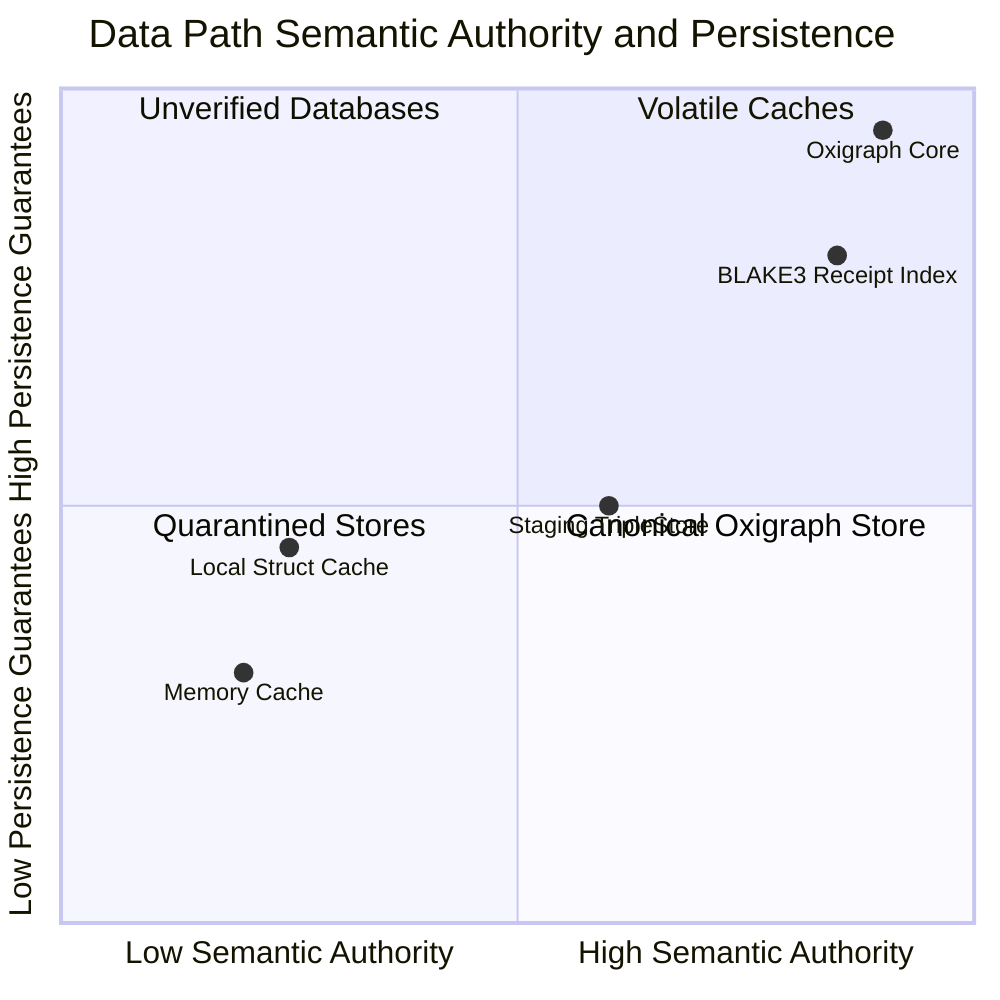
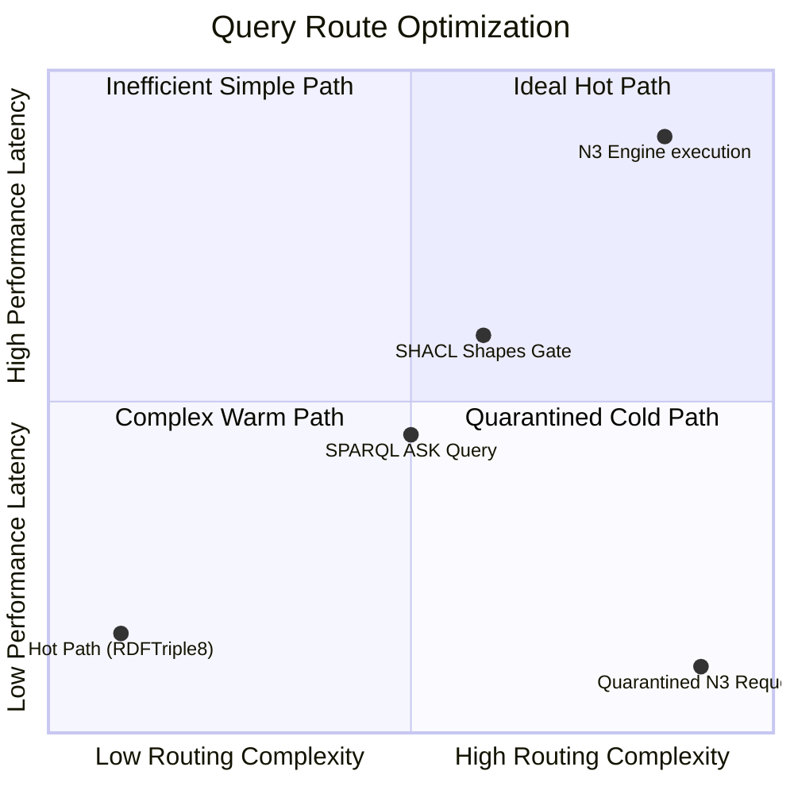
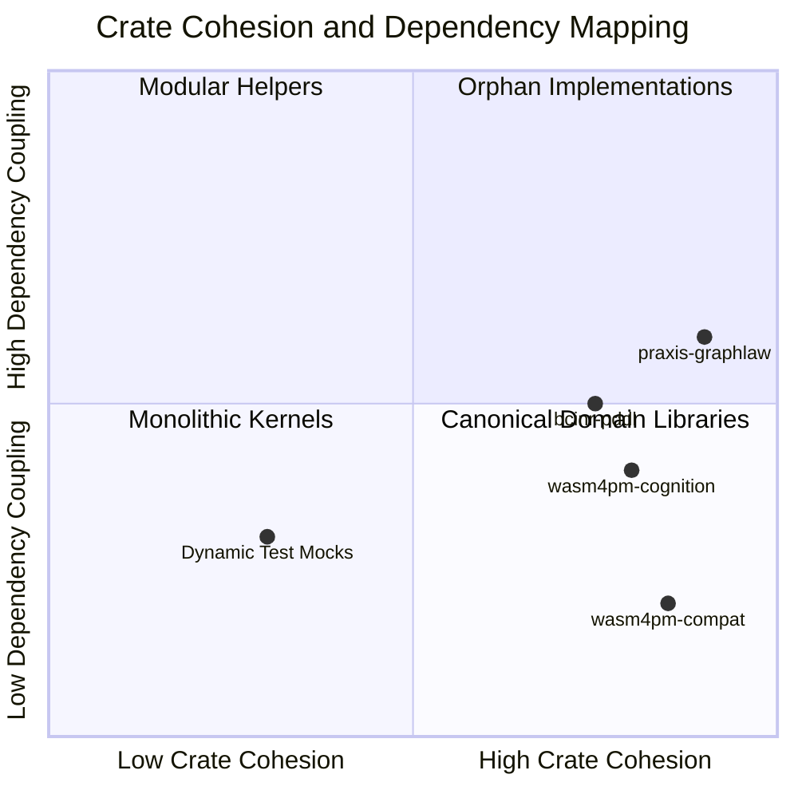
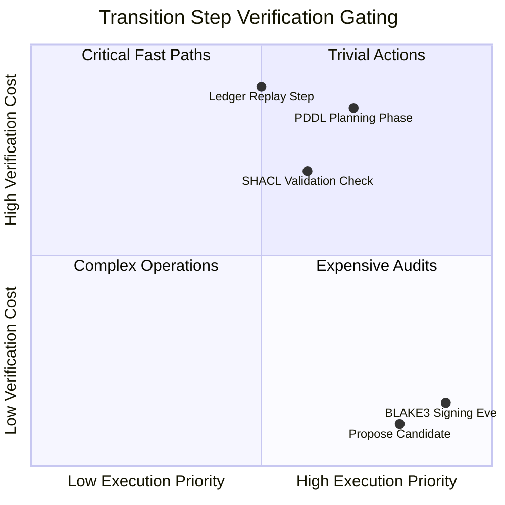
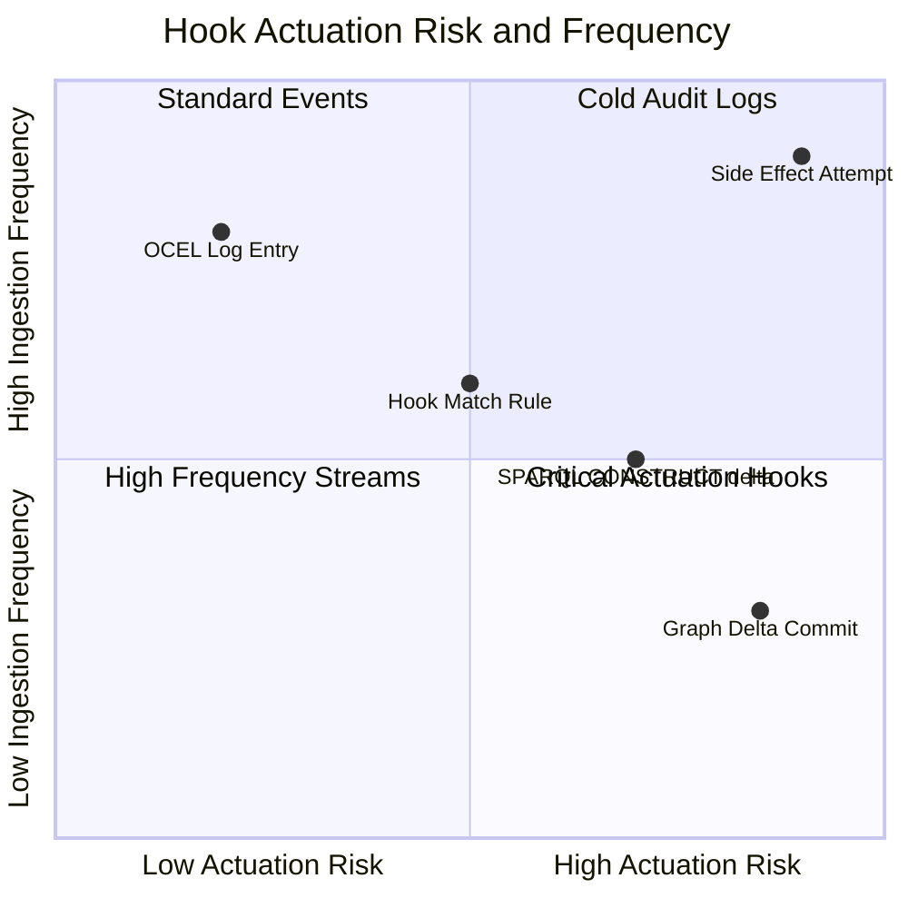
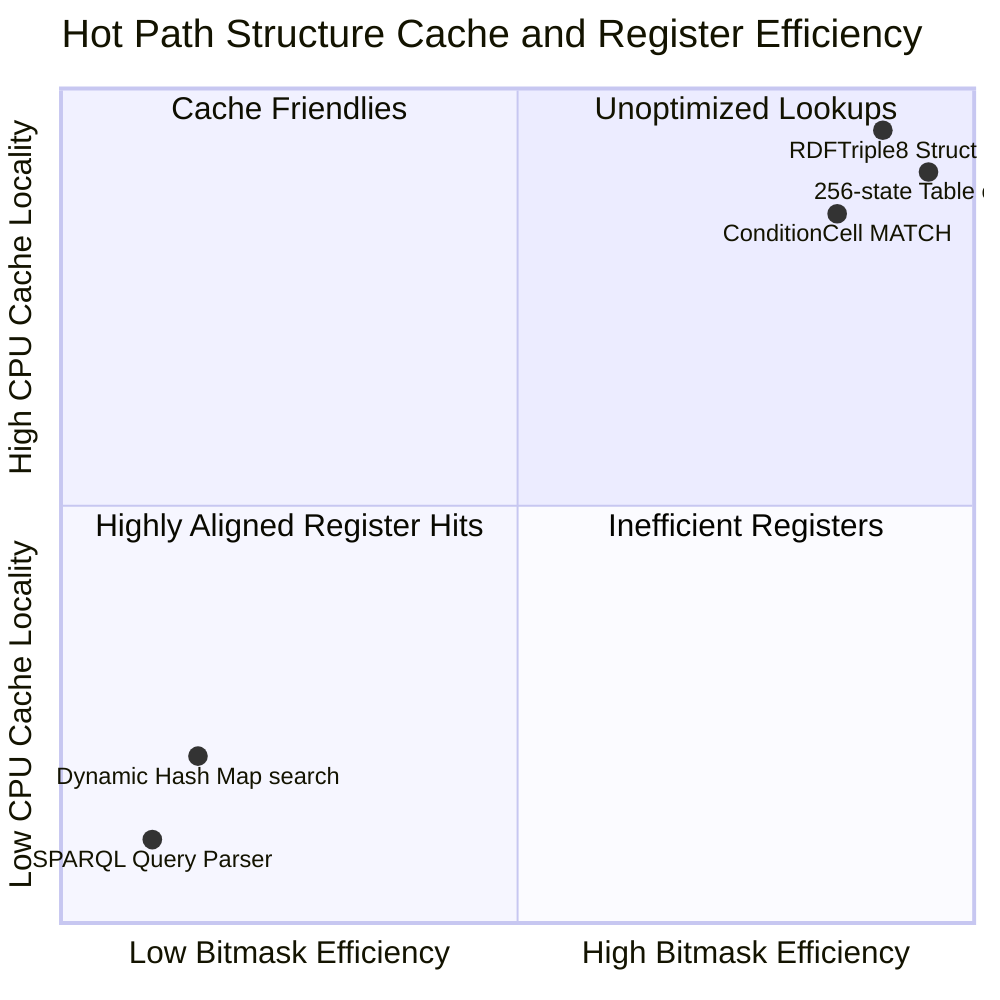
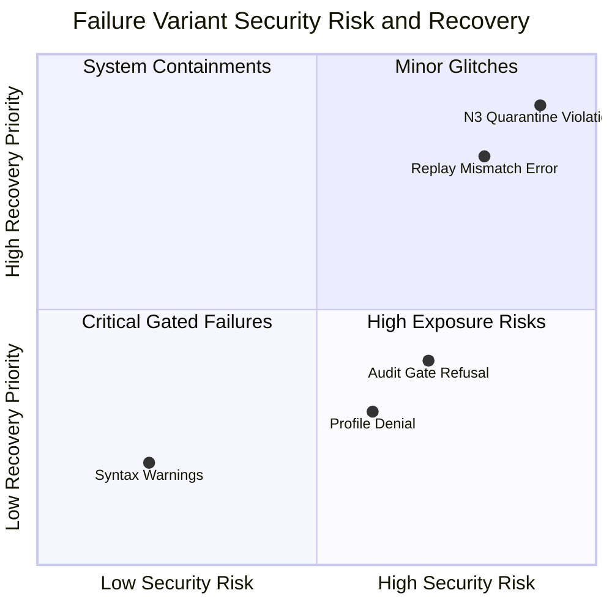
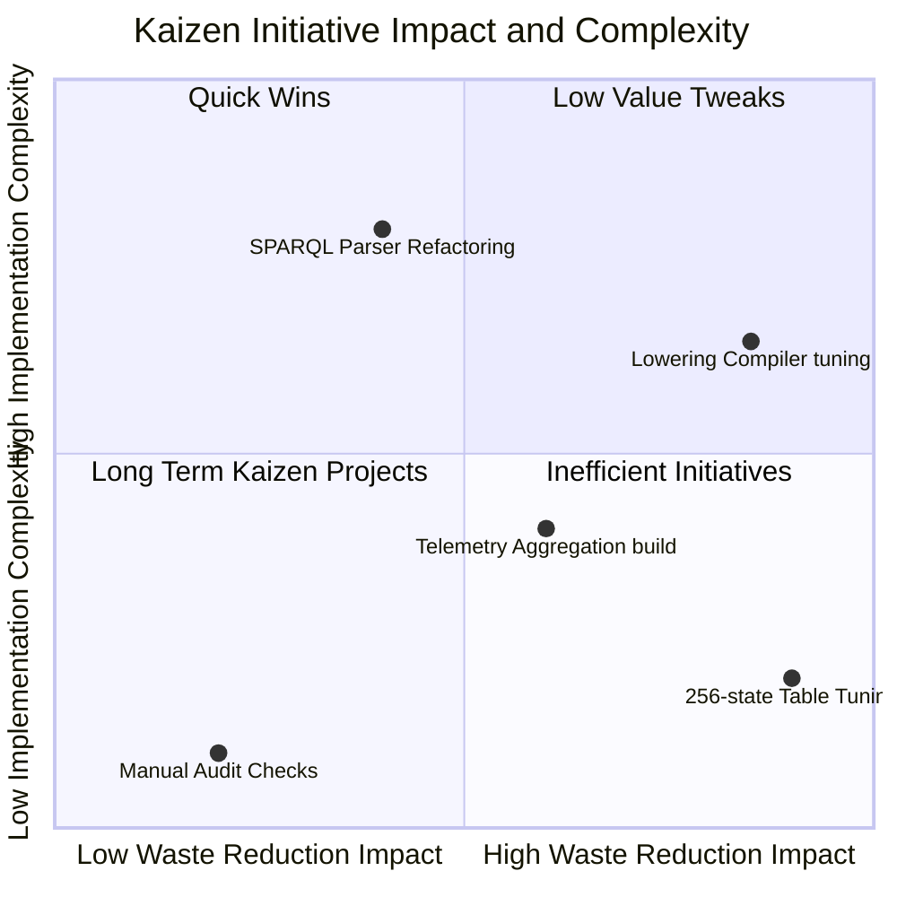

# Quadrant Chart Diagram Family

This document contains exactly 8 Quadrant chart diagrams mapping the Chatman Engine across its 8 projection lenses, preserving key architectural invariants under Design for Combinatorial Maximalism.

## Diagrams

### QUADRANT-L1: Semantic Authority

Diagram ID: QUADRANT-L1
Diagram family: Quadrant
Projection lens: Semantic Authority
Architectural invariant preserved: RDF/Oxigraph is the single semantic source of truth; all facts are classified by semantic authority and persistence guarantees.
Information-loss risk if omitted: Treating local transient variables with the same authority as the Oxigraph store.
TPS visual-control purpose: Identifying and eliminating volatile and unverified data storage paths.
DfLSS CTQ protected: Zero semantic shadow copies.
CENG ticket or boundary constrained: Bound by CENG-410-FINAL.
Why this diagram is non-redundant: Visualizes the classification of database components by persistence and authority, which flow or sequence charts cannot do.

---

### QUADRANT-L2: Routing Constitution

Diagram ID: QUADRANT-L2
Diagram family: Quadrant
Projection lens: Routing Constitution
Architectural invariant preserved: Least-expressive-power path routing.
Information-loss risk if omitted: Over-allocating complex paths to low-complexity queries, causing runtime inefficiency.
TPS visual-control purpose: Exposing routing waste (mapping query complexity against performance latency).
DfLSS CTQ protected: Least-expressive routing model assignment.
CENG ticket or boundary constrained: CENG-410-M1.
Why this diagram is non-redundant: Classifies execution engines and paths based on complexity and latency characteristics.

---

### QUADRANT-L3: Type Kernel Ownership

Diagram ID: QUADRANT-L3
Diagram family: Quadrant
Projection lens: Type Kernel Ownership
Architectural invariant preserved: Strict crate-level type kernel mapping to enforce modular domain boundaries.
Information-loss risk if omitted: Monolithic type structures and loose dependency management causing architectural regression.
TPS visual-control purpose: Eliminating development rework waste caused by circular crate dependencies.
DfLSS CTQ protected: Crate-level type boundary isolation.
CENG ticket or boundary constrained: CENG-411 (design-only).
Why this diagram is non-redundant: Maps crate dependencies and cohesion levels.

---

### QUADRANT-L4: Transition Lifecycle

Diagram ID: QUADRANT-L4
Diagram family: Quadrant
Projection lens: Transition Lifecycle
Architectural invariant preserved: Linear state progression of transition candidates.
Information-loss risk if omitted: Spending excessive resources optimizing low-priority validations.
TPS visual-control purpose: Optimizing verification gating sequences based on execution cost and priority.
DfLSS CTQ protected: Complete verification of candidate transitions.
CENG ticket or boundary constrained: CENG-410-FINAL.
Why this diagram is non-redundant: Classifies transition steps by execution priority and validation cost.

---

### QUADRANT-L5: Event / Hook / Actuation

Diagram ID: QUADRANT-L5
Diagram family: Quadrant
Projection lens: Event / Hook / Actuation
Architectural invariant preserved: OCEL event ingestion to pure hook action mapping.
Information-loss risk if omitted: Failing to isolate high-risk side effect operations.
TPS visual-control purpose: Exposing side-effect paths to maintain pure functional graph transitions.
DfLSS CTQ protected: 100% pure delta projections.
CENG ticket or boundary constrained: CENG-412 (design-only).
Why this diagram is non-redundant: Classifies event/hook actions by ingestion frequency and actuation risk.

---

### QUADRANT-L6: Performance / 8-Constraint Hot Path

Diagram ID: QUADRANT-L6
Diagram family: Quadrant
Projection lens: Performance / 8-Constraint Hot Path
Architectural invariant preserved: Sub-microsecond hot-path query execution via binary lowering.
Information-loss risk if omitted: Maintaining un-aligned structures in CPU registers, degrading hot path speed.
TPS visual-control purpose: Monitoring performance pathways.
DfLSS CTQ protected: Hot path execution time boundaries.
CENG ticket or boundary constrained: CENG-410-M1.
Why this diagram is non-redundant: Classifies data structs by bitmask efficiency and CPU cache locality.

---

### QUADRANT-L7: Refusal / Risk / Governance

Diagram ID: QUADRANT-L7
Diagram family: Quadrant
Projection lens: Refusal / Risk / Governance
Architectural invariant preserved: Containment of failures via typed refusal translation.
Information-loss risk if omitted: Bypassing recovery steps for critical security violations.
TPS visual-control purpose: Error containment logging (Poka-Yoke).
DfLSS CTQ protected: Zero undocumented refusals.
CENG ticket or boundary constrained: CENG-410-FINAL.
Why this diagram is non-redundant: Classifies failure modes by security risk and recovery priority.

---

### QUADRANT-L8: TPS / DfLSS / Continuous Improvement

Diagram ID: QUADRANT-L8
Diagram family: Quadrant
Projection lens: TPS / DfLSS / Continuous Improvement
Architectural invariant preserved: Continuous performance improvement loop via metric analysis.
Information-loss risk if omitted: Wasting resources on low-impact optimizations.
TPS visual-control purpose: Prioritizing engineering efforts based on waste reduction impact.
DfLSS CTQ protected: Accurate telemetry tracking.
CENG ticket or boundary constrained: CENG-416A-F (design-only).
Why this diagram is non-redundant: Classifies Kaizen initiatives by complexity and waste reduction impact.

