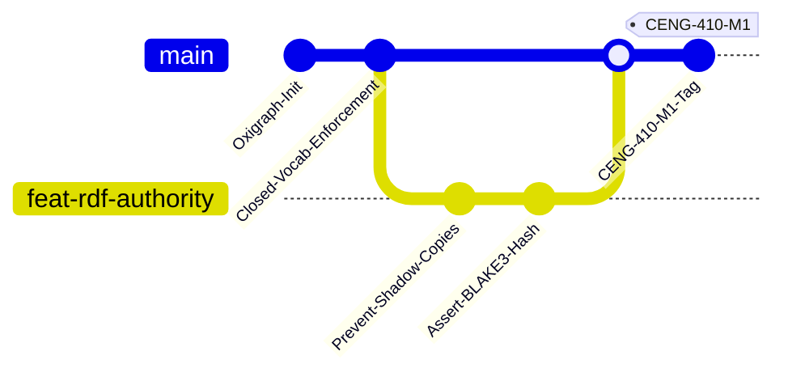
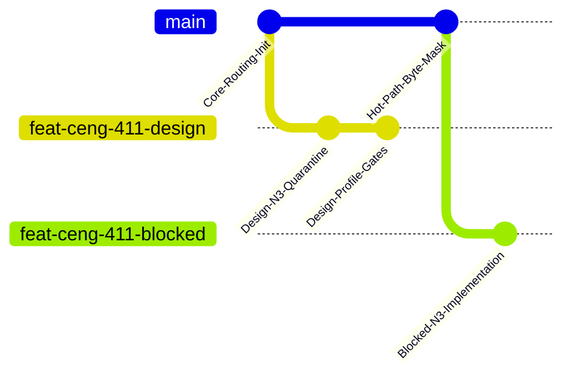
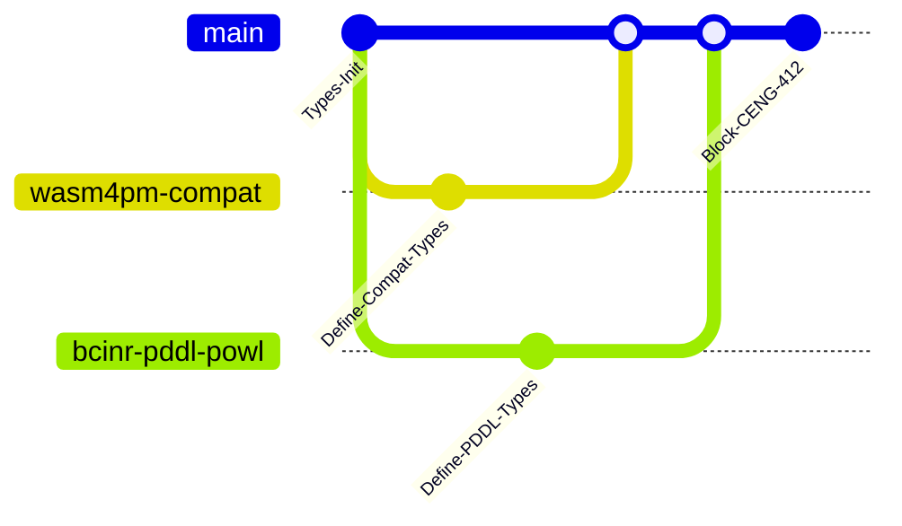
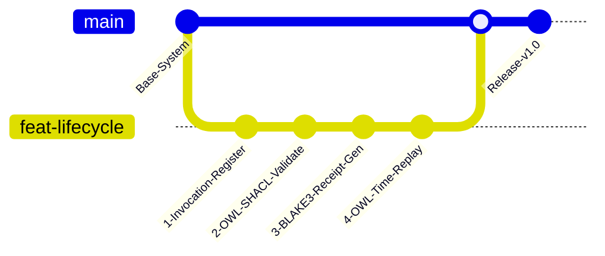
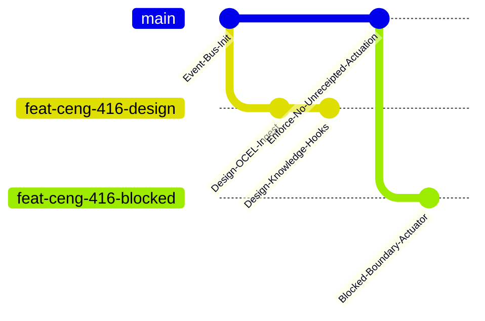
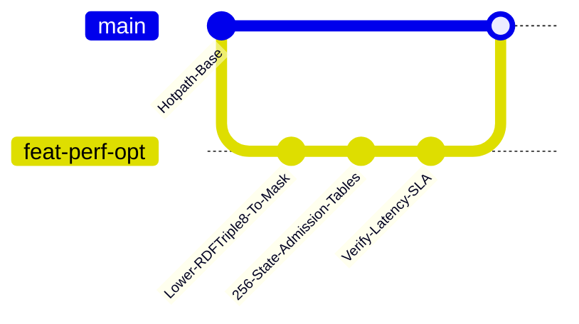
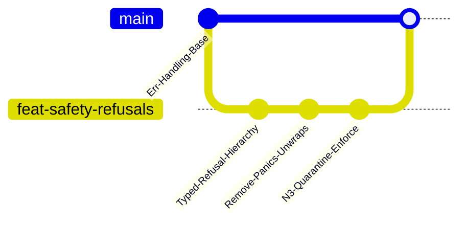
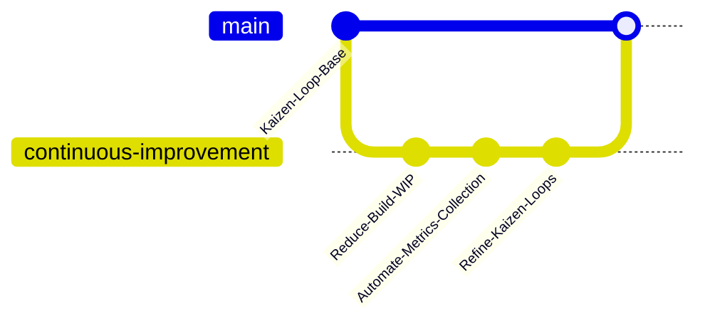

# 12. GitGraph Diagram Family

This file contains the GitGraph diagram family for the Chatman Engine, structured across the 8 projection lenses.

---

## Lens 1: Semantic Authority

Diagram ID: GITGRAPH-L1
Diagram family: GitGraph
Projection lens: Semantic Authority
Architectural invariant preserved: RDF/Oxigraph is the single semantic source of truth. Shadow copies of RDF data are strictly prohibited.
Information-loss risk if omitted: Merging commits that introduce duplicate semantic types or memory shadow caches.
TPS visual-control purpose: Andon check on merge requests to prevent semantic waste.
DfLSS CTQ protected: Zero semantic shadow copies.
CENG ticket or boundary constrained: CENG-410-FINAL (in progress).
Why this diagram is non-redundant: Visualizes the sequence of changes to ensure semantic integrity in the repository.

---

## Lens 2: Routing Constitution

Diagram ID: GITGRAPH-L2
Diagram family: GitGraph
Projection lens: Routing Constitution
Architectural invariant preserved: Least-expressive-power routing; hot/warm/cold path isolation. N3 is disabled by default.
Information-loss risk if omitted: High-expressivity rules (N3) bypassing gates and merging directly into hot-path runtime.
TPS visual-control purpose: Visual control over path isolation branches before merging.
DfLSS CTQ protected: Safe isolation of cold-path N3 execution.
CENG ticket or boundary constrained: CENG-411 (design-only, implementation blocked).
Why this diagram is non-redundant: Traces the path-isolation design branches in git history.

---

## Lens 3: Type Kernel Ownership

Diagram ID: GITGRAPH-L3
Diagram family: GitGraph
Projection lens: Type Kernel Ownership
Architectural invariant preserved: Canonical type ownership across wasm4pm-compat, wasm4pm-cognition, bcinr-pddl, bcinr-powl, and praxis-graphlaw.
Information-loss risk if omitted: Concurrent branching creating duplicate type classes in different packages.
TPS visual-control purpose: Prevents rework and duplicate types across parallel team branches.
DfLSS CTQ protected: Zero duplicate type classes.
CENG ticket or boundary constrained: CENG-412 (design-only, implementation blocked).
Why this diagram is non-redundant: Shows ownership branch separations for key type kernels.

---

## Lens 4: Transition Lifecycle

Diagram ID: GITGRAPH-L4
Diagram family: GitGraph
Projection lens: Transition Lifecycle
Architectural invariant preserved: Every transition must pass through candidate invocation, validation, planning, execution, receipting, and replay.
Information-loss risk if omitted: Untracked and unvalidated lifecycle transitions.
TPS visual-control purpose: visualizes workflow completion gates before releases.
DfLSS CTQ protected: Guaranteed transaction replay validation under fixed seed.
CENG ticket or boundary constrained: CENG-410-FINAL (in progress).
Why this diagram is non-redundant: Maps lifecycle milestone commits in the version control history.

---

## Lens 5: Event / Hook / Actuation

Diagram ID: GITGRAPH-L5
Diagram family: GitGraph
Projection lens: Event / Hook / Actuation
Architectural invariant preserved: Hooks cannot actuate without receipts; no unreceipted actuation.
Information-loss risk if omitted: Code allowing unreceipted events or direct hook invocation.
TPS visual-control purpose: Andon check verifying receipt tests prior to hook integration.
DfLSS CTQ protected: Zero unreceipted execution events.
CENG ticket or boundary constrained: CENG-416A-F (design-only, implementation blocked).
Why this diagram is non-redundant: Outlines git status of event-handling and hook features.

---

## Lens 6: Performance / 8-Constraint Hot Path

Diagram ID: GITGRAPH-L6
Diagram family: GitGraph
Projection lens: Performance / 8-Constraint Hot Path
Architectural invariant preserved: Maximum of 8 constraints checked in parallel via RDFTriple8 and ConditionCell<BITS>.
Information-loss risk if omitted: Uncontrolled growth of the constraint set size in mainline.
TPS visual-control purpose: Continuous integration performance gate monitoring.
DfLSS CTQ protected: Latency bound of hot path operations.
CENG ticket or boundary constrained: CENG-410-FINAL (in progress).
Why this diagram is non-redundant: Visualizes optimization and hot-path integration commits.

---

## Lens 7: Refusal / Risk / Governance

Diagram ID: GITGRAPH-L7
Diagram family: GitGraph
Projection lens: Refusal / Risk / Governance
Architectural invariant preserved: Every failure is a typed Refusal; N3 quarantine rules are strictly enforced.
Information-loss risk if omitted: Committing code with generic panics or unmapped exceptions.
TPS visual-control purpose: Ensures audit gates prevent unhandled exceptions.
DfLSS CTQ protected: No panic or silent fallbacks.
CENG ticket or boundary constrained: CENG-410-FINAL (in progress).
Why this diagram is non-redundant: Tracks safety-related code changes and refusal logic.

---

## Lens 8: TPS / DfLSS / Continuous Improvement

Diagram ID: GITGRAPH-L8
Diagram family: GitGraph
Projection lens: TPS / DfLSS / Continuous Improvement
Architectural invariant preserved: WIP reduction, continuous process improvement loops, and visual waste elimination.
Information-loss risk if omitted: Loss of tracking on optimization feedback loops.
TPS visual-control purpose: visualizes the main Kaizen improvement loop commits.
DfLSS CTQ protected: Flow efficiency and defect rate minimization.
CENG ticket or boundary constrained: CENG-410-FINAL (in progress).
Why this diagram is non-redundant: Outlines Kaizen-driven git workflow.

