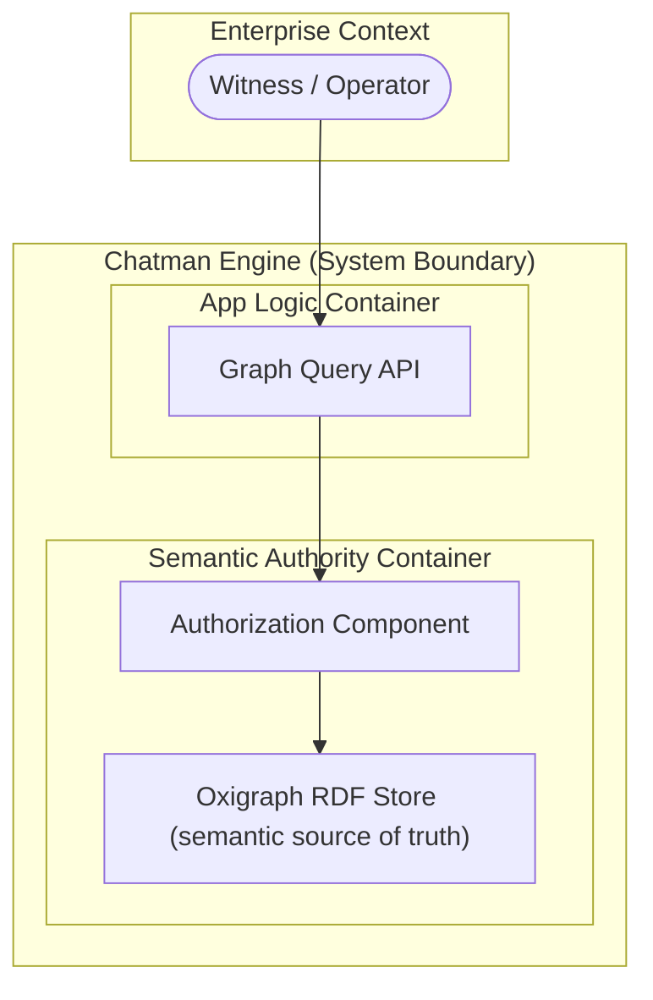
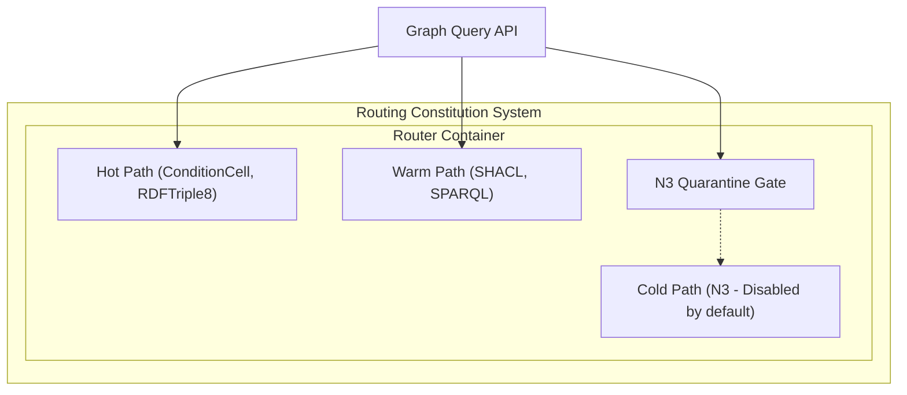
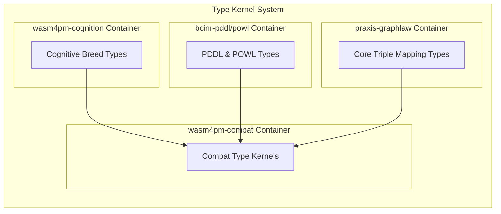
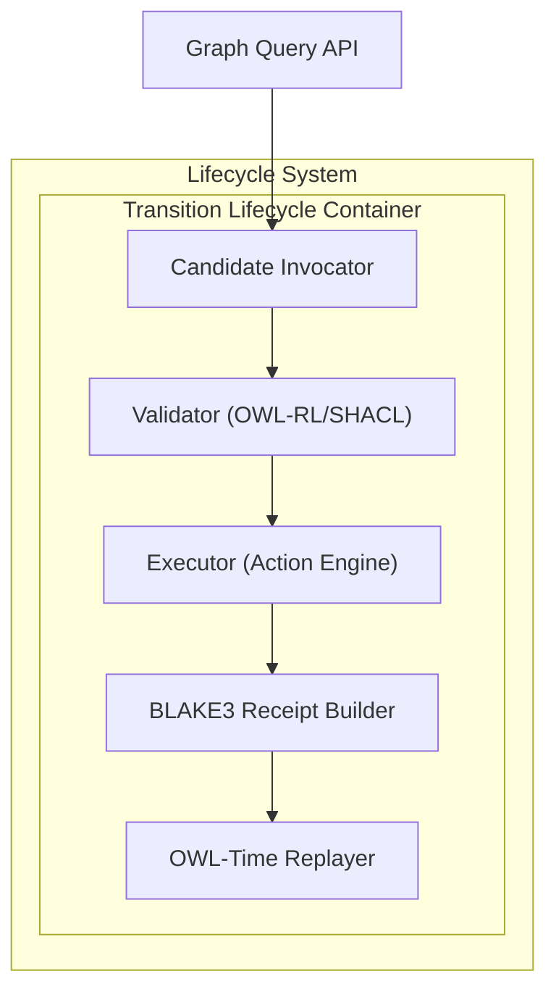
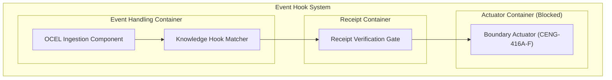
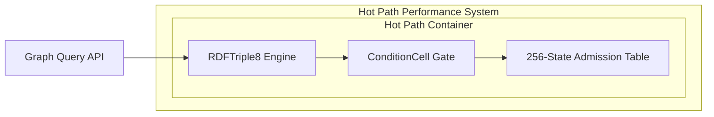
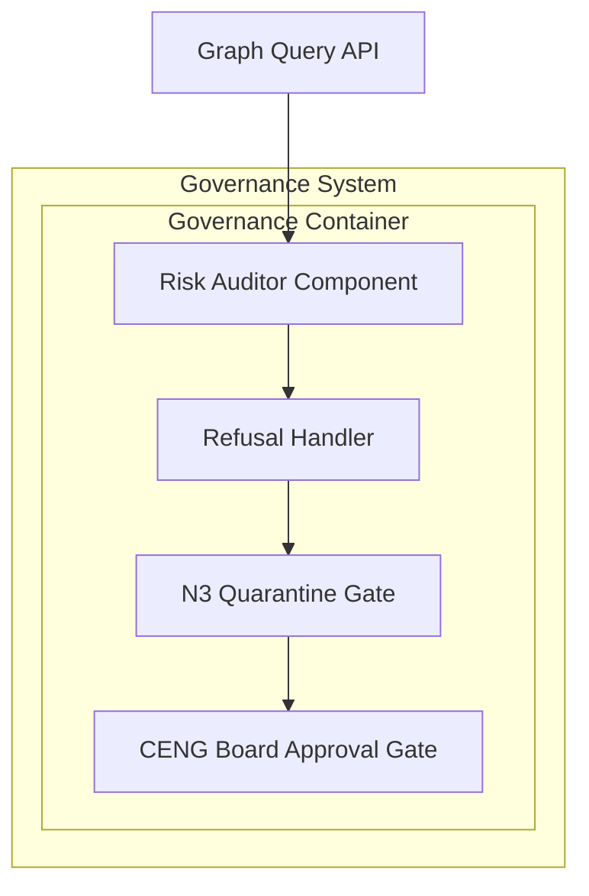
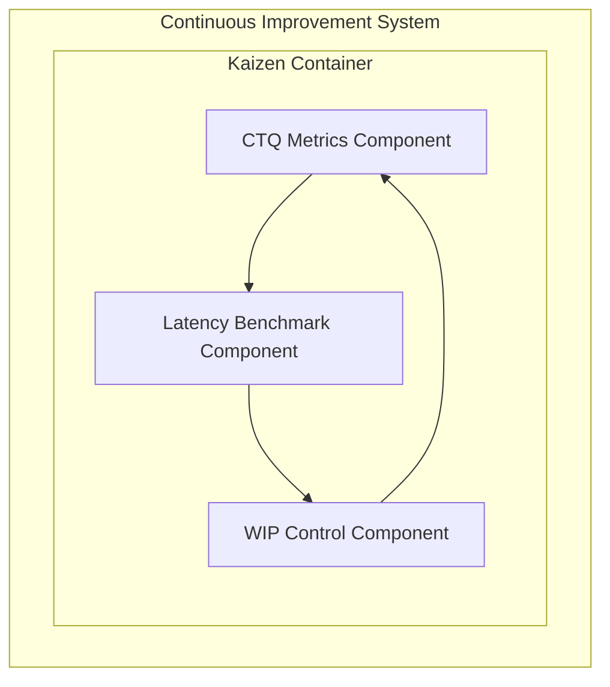

# 13. C4 Diagram Family

This file contains the C4 diagram family for the Chatman Engine, structured across the 8 projection lenses.

Fallback rendering for Mermaid compatibility.

---

## Lens 1: Semantic Authority

Diagram ID: C4-L1
Diagram family: C4
Projection lens: Semantic Authority
Architectural invariant preserved: RDF/Oxigraph is the single semantic source of truth. Shadow copies of RDF data are strictly prohibited.
Information-loss risk if omitted: Loss of container-level architectural context for semantic authority, leading to duplicate database adapters.
TPS visual-control purpose: Prevents container duplication and routing waste.
DfLSS CTQ protected: Zero semantic shadow copies.
CENG ticket or boundary constrained: CENG-410-FINAL (in progress).
Why this diagram is non-redundant: Outlines system boundaries and semantic authority at the container/component level.

---

## Lens 2: Routing Constitution

Diagram ID: C4-L2
Diagram family: C4
Projection lens: Routing Constitution
Architectural invariant preserved: Least-expressive-power routing; hot/warm/cold path isolation. N3 is disabled by default.
Information-loss risk if omitted: Risk of crossing path boundaries (e.g. executing N3 inside hot-path containers).
TPS visual-control purpose: Visually isolates path containers to eliminate processing waste.
DfLSS CTQ protected: Safe isolation of cold-path N3 execution.
CENG ticket or boundary constrained: CENG-411 (design-only, implementation blocked).
Why this diagram is non-redundant: Displays the container routing boundaries and path isolation components.

---

## Lens 3: Type Kernel Ownership

Diagram ID: C4-L3
Diagram family: C4
Projection lens: Type Kernel Ownership
Architectural invariant preserved: Canonical type ownership across wasm4pm-compat, wasm4pm-cognition, bcinr-pddl, bcinr-powl, and praxis-graphlaw.
Information-loss risk if omitted: Developers adding shadow types in other containers, breaking data interchange contracts.
TPS visual-control purpose: Exposes package dependencies to prevent duplicate type work.
DfLSS CTQ protected: Zero duplicate type classes.
CENG ticket or boundary constrained: CENG-412 (design-only, implementation blocked).
Why this diagram is non-redundant: Defines type container boundaries to enforce library ownership constraints.

---

## Lens 4: Transition Lifecycle

Diagram ID: C4-L4
Diagram family: C4
Projection lens: Transition Lifecycle
Architectural invariant preserved: Every transition must pass through candidate invocation, validation, planning, execution, receipting, and replay.
Information-loss risk if omitted: Incomplete transition processing pipelines bypassing container constraints.
TPS visual-control purpose: Visualizes lifecycle container flow to identify queues and waste.
DfLSS CTQ protected: Guaranteed transaction replay validation under fixed seed.
CENG ticket or boundary constrained: CENG-410-FINAL (in progress).
Why this diagram is non-redundant: Details lifecycle processing stages within C4 component blocks.

---

## Lens 5: Event / Hook / Actuation

Diagram ID: C4-L5
Diagram family: C4
Projection lens: Event / Hook / Actuation
Architectural invariant preserved: Hooks cannot actuate without receipts; no unreceipted actuation.
Information-loss risk if omitted: Direct container actuation without audit logging and receipt enforcement.
TPS visual-control purpose: Poka-Yoke (error-proofing) the actuation path by gating with receipt components.
DfLSS CTQ protected: Zero unreceipted execution events.
CENG ticket or boundary constrained: CENG-416A-F (design-only, implementation blocked).
Why this diagram is non-redundant: Models C4 components for event streams, hook matching, and gated actuation.

---

## Lens 6: Performance / 8-Constraint Hot Path

Diagram ID: C4-L6
Diagram family: C4
Projection lens: Performance / 8-Constraint Hot Path
Architectural invariant preserved: Maximum of 8 constraints checked in parallel via RDFTriple8 and ConditionCell<BITS>.
Information-loss risk if omitted: Loss of visibility into the optimized hot-path container structure, causing CPU budget overruns.
TPS visual-control purpose: Andon gauge monitoring the constraint capacity of hot-path components.
DfLSS CTQ protected: Latency bound of hot path operations.
CENG ticket or boundary constrained: CENG-410-FINAL (in progress).
Why this diagram is non-redundant: Resolves hot-path component layout for maximum throughput.

---

## Lens 7: Refusal / Risk / Governance

Diagram ID: C4-L7
Diagram family: C4
Projection lens: Refusal / Risk / Governance
Architectural invariant preserved: Every failure is a typed Refusal; N3 quarantine rules are strictly enforced.
Information-loss risk if omitted: Untyped panics propagating out of container boundaries.
TPS visual-control purpose: visualizes error handling structures to reduce scrap (defective executions).
DfLSS CTQ protected: No panic or silent fallbacks.
CENG ticket or boundary constrained: CENG-410-FINAL (in progress).
Why this diagram is non-redundant: Outlines governance and risk container elements.

---

## Lens 8: TPS / DfLSS / Continuous Improvement

Diagram ID: C4-L8
Diagram family: C4
Projection lens: TPS / DfLSS / Continuous Improvement
Architectural invariant preserved: WIP reduction, continuous process improvement loops, and visual waste elimination.
Information-loss risk if omitted: Operational drift and degradation of continuous validation metrics within containers.
TPS visual-control purpose: Continuous Kaizen feedback loop on container metrics.
DfLSS CTQ protected: Flow efficiency and defect rate minimization.
CENG ticket or boundary constrained: CENG-410-FINAL (in progress).
Why this diagram is non-redundant: Establishes container layout for continuous monitoring.

