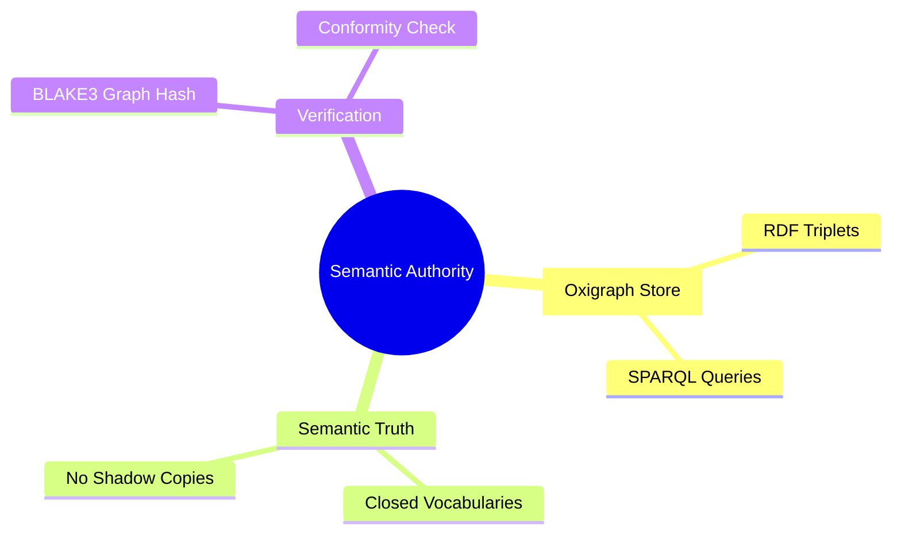
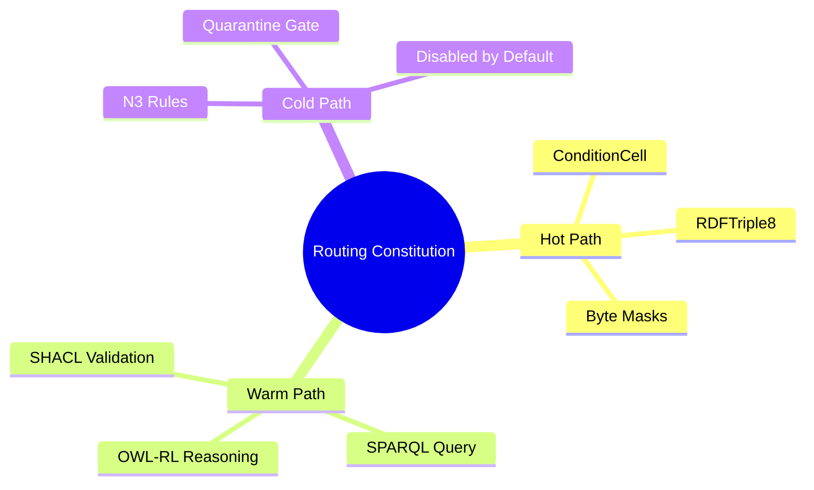
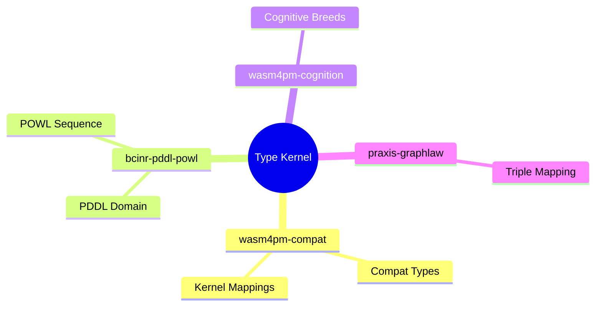
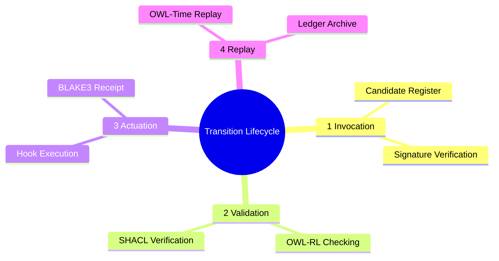
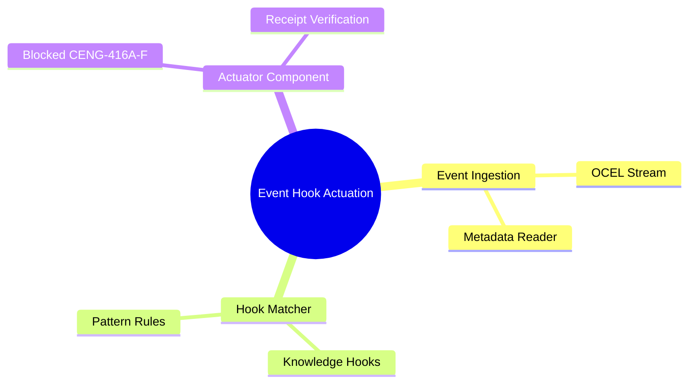
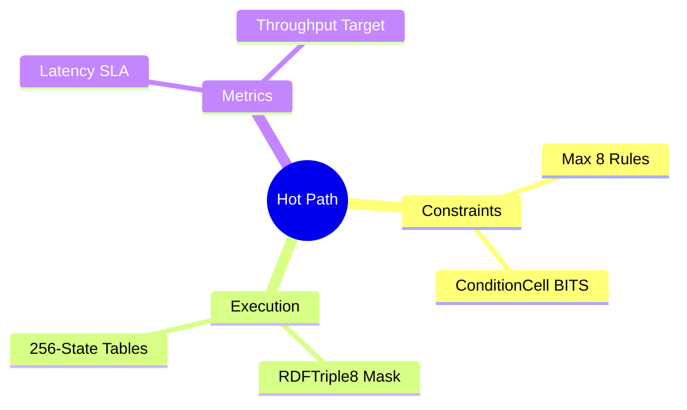
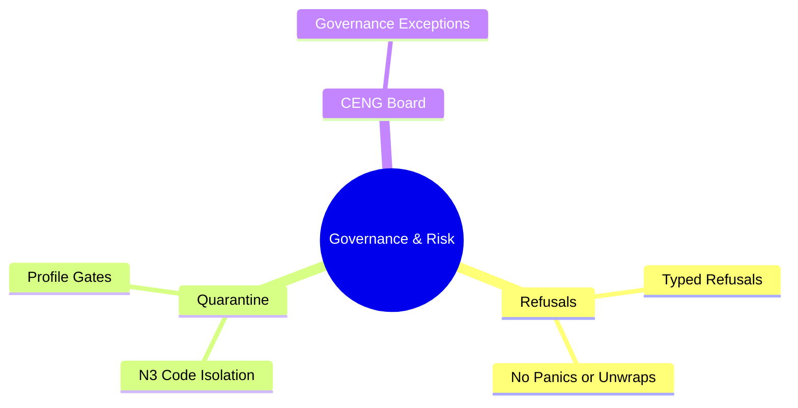
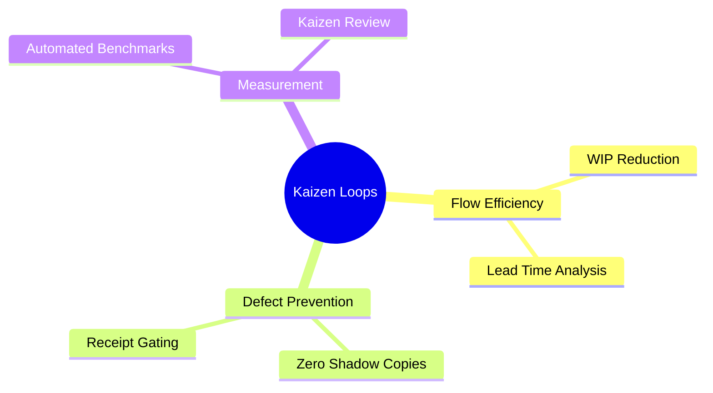

# 14. Mindmaps Diagram Family

This file contains the Mindmaps diagram family for the Chatman Engine, structured across the 8 projection lenses.

---

## Lens 1: Semantic Authority

Diagram ID: MINDMAP-L1
Diagram family: Mindmap
Projection lens: Semantic Authority
Architectural invariant preserved: RDF/Oxigraph is the single semantic source of truth. Shadow copies of RDF data are strictly prohibited.
Information-loss risk if omitted: Lack of structured understanding of the dependencies and attributes associated with semantic authority.
TPS visual-control purpose: Exposes unnecessary database endpoints and semantic waste.
DfLSS CTQ protected: Zero semantic shadow copies.
CENG ticket or boundary constrained: CENG-410-FINAL (in progress).
Why this diagram is non-redundant: Details semantic authority dependencies in a hierarchical mindmap structure.

---

## Lens 2: Routing Constitution

Diagram ID: MINDMAP-L2
Diagram family: Mindmap
Projection lens: Routing Constitution
Architectural invariant preserved: Least-expressive-power routing; hot/warm/cold path isolation. N3 is disabled by default.
Information-loss risk if omitted: Cognitive overload on routing paths, leading to wrong path allocation in code.
TPS visual-control purpose: Groups path routing classes to prevent logic waste.
DfLSS CTQ protected: Safe isolation of cold-path N3 execution.
CENG ticket or boundary constrained: CENG-411 (design-only, implementation blocked).
Why this diagram is non-redundant: Hierarchically classifies routing constraints and paths.

---

## Lens 3: Type Kernel Ownership

Diagram ID: MINDMAP-L3
Diagram family: Mindmap
Projection lens: Type Kernel Ownership
Architectural invariant preserved: Canonical type ownership across wasm4pm-compat, wasm4pm-cognition, bcinr-pddl, bcinr-powl, and praxis-graphlaw.
Information-loss risk if omitted: Duplication of type mapping concepts across system modules.
TPS visual-control purpose: Maps type kernel scopes to prevent duplicate type work.
DfLSS CTQ protected: Zero duplicate type classes.
CENG ticket or boundary constrained: CENG-412 (design-only, implementation blocked).
Why this diagram is non-redundant: Visually assigns kernel types to their respective owning modules.

---

## Lens 4: Transition Lifecycle

Diagram ID: MINDMAP-L4
Diagram family: Mindmap
Projection lens: Transition Lifecycle
Architectural invariant preserved: Every transition must pass through candidate invocation, validation, planning, execution, receipting, and replay.
Information-loss risk if omitted: Incomplete conceptual modeling of transition milestones.
TPS visual-control purpose: Identifies key transition phases to eliminate process waste.
DfLSS CTQ protected: Guaranteed transaction replay validation under fixed seed.
CENG ticket or boundary constrained: CENG-410-FINAL (in progress).
Why this diagram is non-redundant: Hierarchically details transition lifecycle milestones.

---

## Lens 5: Event / Hook / Actuation

Diagram ID: MINDMAP-L5
Diagram family: Mindmap
Projection lens: Event / Hook / Actuation
Architectural invariant preserved: Hooks cannot actuate without receipts; no unreceipted actuation.
Information-loss risk if omitted: Failure to structure hook matching and actuation constraints.
TPS visual-control purpose: Error-proofing (Poka-Yoke) actuation by mapping receipt constraints.
DfLSS CTQ protected: Zero unreceipted execution events.
CENG ticket or boundary constrained: CENG-416A-F (design-only, implementation blocked).
Why this diagram is non-redundant: Outlines event routing, hook rules, and actuation boundaries.

---

## Lens 6: Performance / 8-Constraint Hot Path

Diagram ID: MINDMAP-L6
Diagram family: Mindmap
Projection lens: Performance / 8-Constraint Hot Path
Architectural invariant preserved: Maximum of 8 constraints checked in parallel via RDFTriple8 and ConditionCell<BITS>.
Information-loss risk if omitted: Expanding constraint checking paths beyond performance limits.
TPS visual-control purpose: Visualizes constraint limit rules to maintain latency bounds.
DfLSS CTQ protected: Latency bound of hot path operations.
CENG ticket or boundary constrained: CENG-410-FINAL (in progress).
Why this diagram is non-redundant: Map hot-path constraints and structural optimizations.

---

## Lens 7: Refusal / Risk / Governance

Diagram ID: MINDMAP-L7
Diagram family: Mindmap
Projection lens: Refusal / Risk / Governance
Architectural invariant preserved: Every failure is a typed Refusal; N3 quarantine rules are strictly enforced.
Information-loss risk if omitted: Improper categorization of exceptions leading to system crashes.
TPS visual-control purpose: Exposes refusal categories to prevent structural defects.
DfLSS CTQ protected: No panic or silent fallbacks.
CENG ticket or boundary constrained: CENG-410-FINAL (in progress).
Why this diagram is non-redundant: Groups refusals and risk mitigation processes.

---

## Lens 8: TPS / DfLSS / Continuous Improvement

Diagram ID: MINDMAP-L8
Diagram family: Mindmap
Projection lens: TPS / DfLSS / Continuous Improvement
Architectural invariant preserved: WIP reduction, continuous process improvement loops, and visual waste elimination.
Information-loss risk if omitted: Loss of structured overview for continuous improvement initiatives.
TPS visual-control purpose: Maps Kaizen improvement categories.
DfLSS CTQ protected: Flow efficiency and defect rate minimization.
CENG ticket or boundary constrained: CENG-410-FINAL (in progress).
Why this diagram is non-redundant: Organizes continuous improvement activities and metrics.

