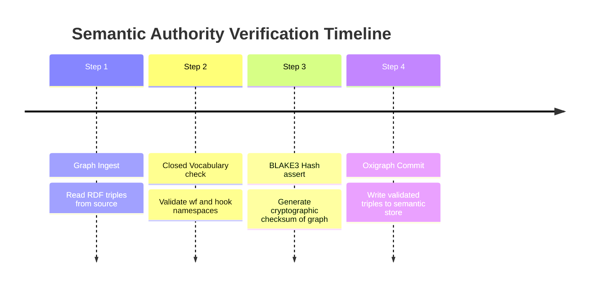
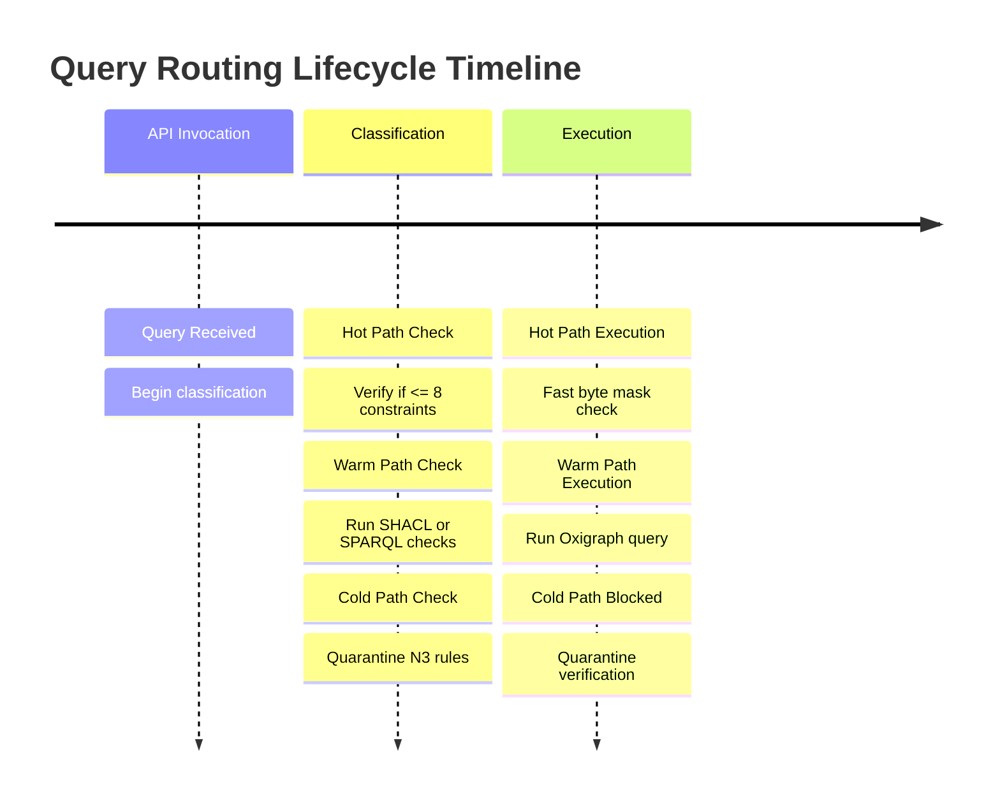
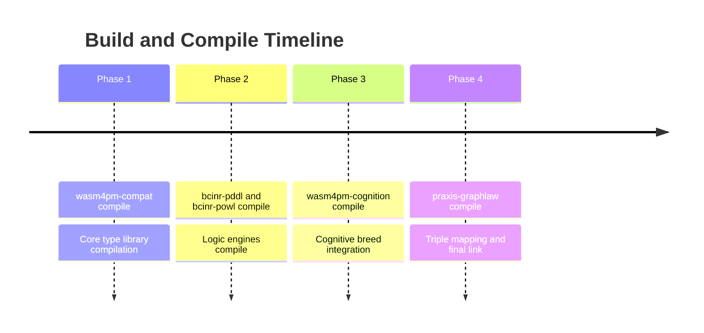
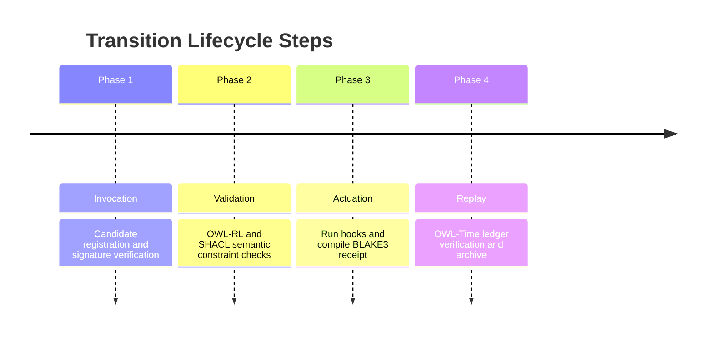
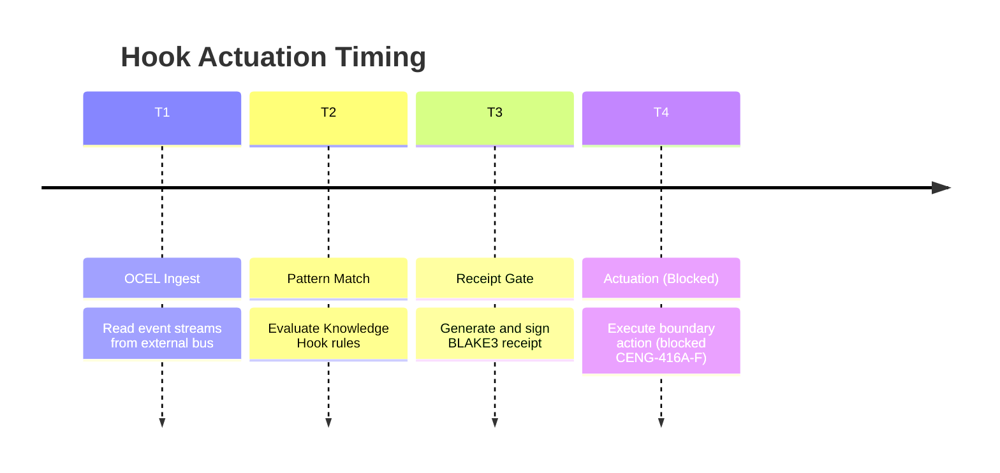
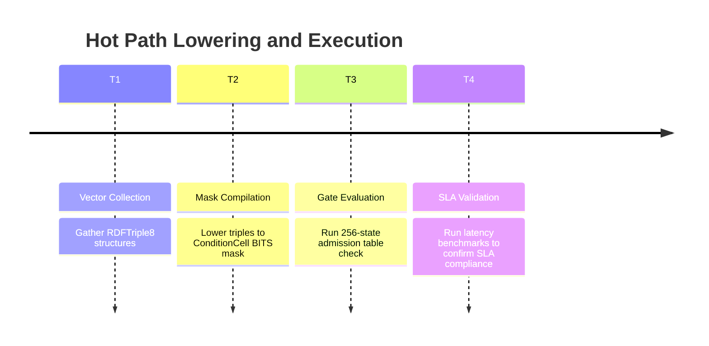
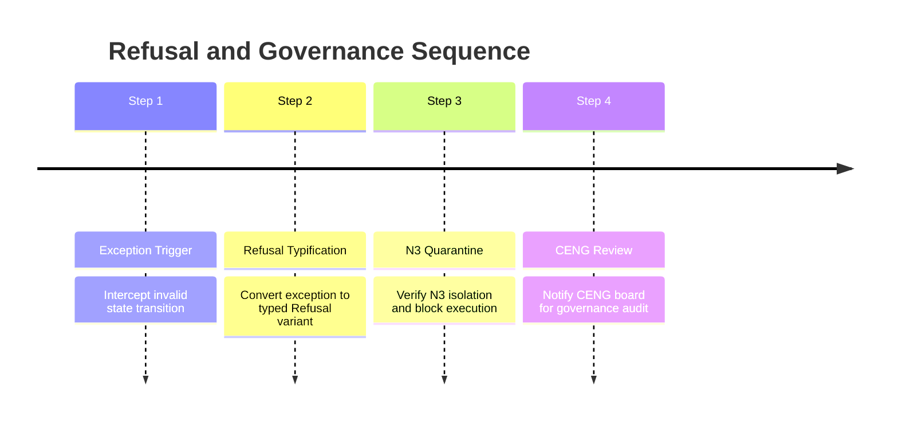
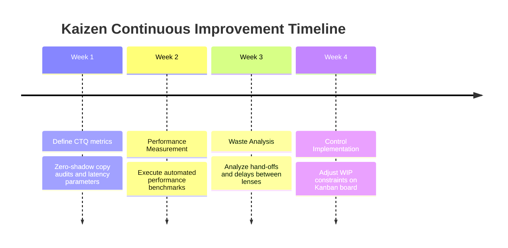

# 15. Timeline Diagram Family

This file contains the Timeline diagram family for the Chatman Engine, structured across the 8 projection lenses.

---

## Lens 1: Semantic Authority

Diagram ID: TIMELINE-L1
Diagram family: Timeline
Projection lens: Semantic Authority
Architectural invariant preserved: RDF/Oxigraph is the single semantic source of truth. Shadow copies of RDF data are strictly prohibited.
Information-loss risk if omitted: Bypassing semantic checks over time.
TPS visual-control purpose: Prevents timing waste in validation phases.
DfLSS CTQ protected: Zero semantic shadow copies.
CENG ticket or boundary constrained: CENG-410-FINAL (in progress).
Why this diagram is non-redundant: Details the temporal verification checks for semantic authority.

---

## Lens 2: Routing Constitution

Diagram ID: TIMELINE-L2
Diagram family: Timeline
Projection lens: Routing Constitution
Architectural invariant preserved: Least-expressive-power routing; hot/warm/cold path isolation. N3 is disabled by default.
Information-loss risk if omitted: Untimeliness in routing classification causing rules to fall back to incorrect paths.
TPS visual-control purpose: Regulates query flow timing to prevent processing waste.
DfLSS CTQ protected: Safe isolation of cold-path N3 execution.
CENG ticket or boundary constrained: CENG-411 (design-only, implementation blocked).
Why this diagram is non-redundant: Outlines the chronological routing decisions made per query.

---

## Lens 3: Type Kernel Ownership

Diagram ID: TIMELINE-L3
Diagram family: Timeline
Projection lens: Type Kernel Ownership
Architectural invariant preserved: Canonical type ownership across wasm4pm-compat, wasm4pm-cognition, bcinr-pddl, bcinr-powl, and praxis-graphlaw.
Information-loss risk if omitted: Compilation race conditions or type duplication due to incorrect module build order.
TPS visual-control purpose: Prevents build rework and dependency timing defects.
DfLSS CTQ protected: Zero duplicate type classes.
CENG ticket or boundary constrained: CENG-412 (design-only, implementation blocked).
Why this diagram is non-redundant: Tracks compile-time dependencies and order for type kernels.

---

## Lens 4: Transition Lifecycle

Diagram ID: TIMELINE-L4
Diagram family: Timeline
Projection lens: Transition Lifecycle
Architectural invariant preserved: Every transition must pass through candidate invocation, validation, planning, execution, receipting, and replay.
Information-loss risk if omitted: Executing transaction phases out of order.
TPS visual-control purpose: Maintains correct transition order to eliminate pipeline defects.
DfLSS CTQ protected: Guaranteed transaction replay validation under fixed seed.
CENG ticket or boundary constrained: CENG-410-FINAL (in progress).
Why this diagram is non-redundant: Details the temporal sequencing of transition phases.

---

## Lens 5: Event / Hook / Actuation

Diagram ID: TIMELINE-L5
Diagram family: Timeline
Projection lens: Event / Hook / Actuation
Architectural invariant preserved: Hooks cannot actuate without receipts; no unreceipted actuation.
Information-loss risk if omitted: Timing delays or execution of actuation before receipt signatures are secured.
TPS visual-control purpose: Poka-Yoke gating of actuation timing.
DfLSS CTQ protected: Zero unreceipted execution events.
CENG ticket or boundary constrained: CENG-416A-F (design-only, implementation blocked).
Why this diagram is non-redundant: Maps temporal stages of event ingestion and hook actuation.

---

## Lens 6: Performance / 8-Constraint Hot Path

Diagram ID: TIMELINE-L6
Diagram family: Timeline
Projection lens: Performance / 8-Constraint Hot Path
Architectural invariant preserved: Maximum of 8 constraints checked in parallel via RDFTriple8 and ConditionCell<BITS>.
Information-loss risk if omitted: Latency spikes due to slow hot-path lowering cycles.
TPS visual-control purpose: Tracks execution timing against latency SLAs.
DfLSS CTQ protected: Latency bound of hot path operations.
CENG ticket or boundary constrained: CENG-410-FINAL (in progress).
Why this diagram is non-redundant: Outlines hot-path optimization phases over time.

---

## Lens 7: Refusal / Risk / Governance

Diagram ID: TIMELINE-L7
Diagram family: Timeline
Projection lens: Refusal / Risk / Governance
Architectural invariant preserved: Every failure is a typed Refusal; N3 quarantine rules are strictly enforced.
Information-loss risk if omitted: Untracked exceptions and delayed refusal notification.
TPS visual-control purpose: visualizes error response latency to reduce scrap.
DfLSS CTQ protected: No panic or silent fallbacks.
CENG ticket or boundary constrained: CENG-410-FINAL (in progress).
Why this diagram is non-redundant: Details the temporal progression of error handling and refusal.

---

## Lens 8: TPS / DfLSS / Continuous Improvement

Diagram ID: TIMELINE-L8
Diagram family: Timeline
Projection lens: TPS / DfLSS / Continuous Improvement
Architectural invariant preserved: WIP reduction, continuous process improvement loops, and visual waste elimination.
Information-loss risk if omitted: Decay of measurement frequencies in the Kaizen feedback cycle.
TPS visual-control purpose: Outlines timing of continuous improvement milestones.
DfLSS CTQ protected: Flow efficiency and defect rate minimization.
CENG ticket or boundary constrained: CENG-410-FINAL (in progress).
Why this diagram is non-redundant: Displays the scheduled Kaizen improvement iterations.

