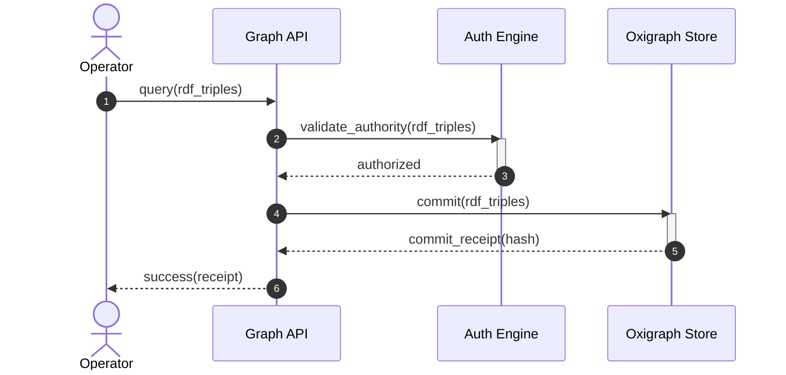
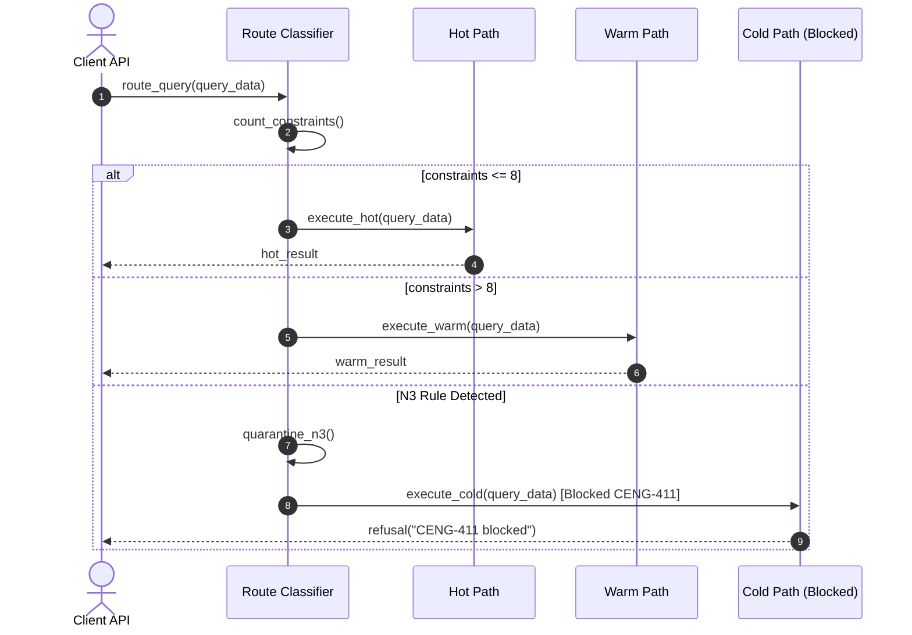
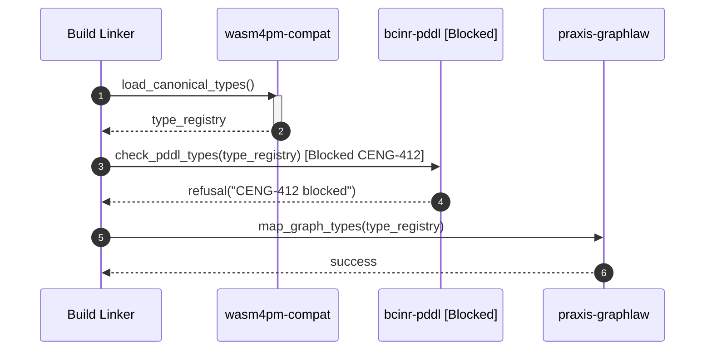
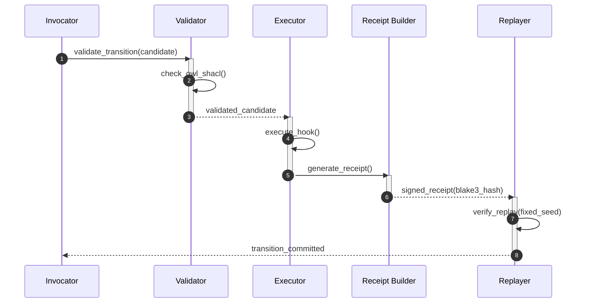
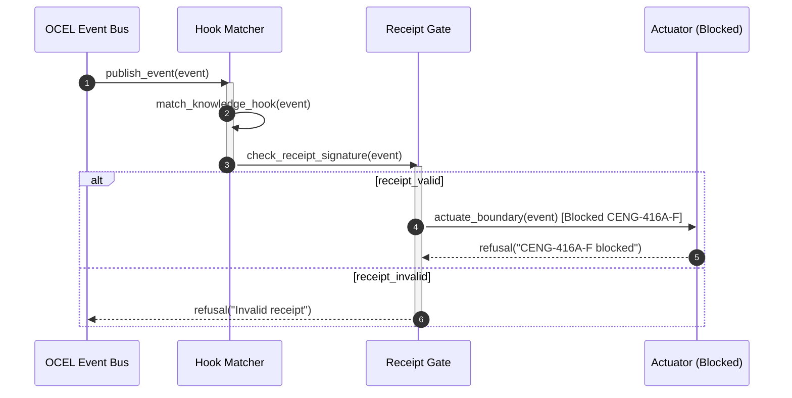
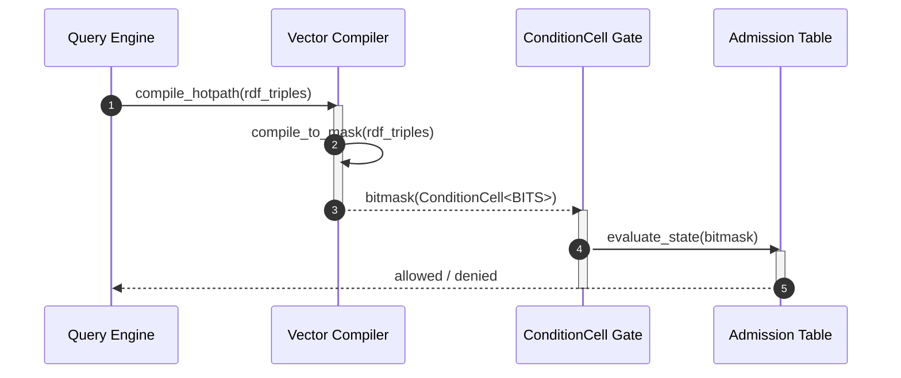
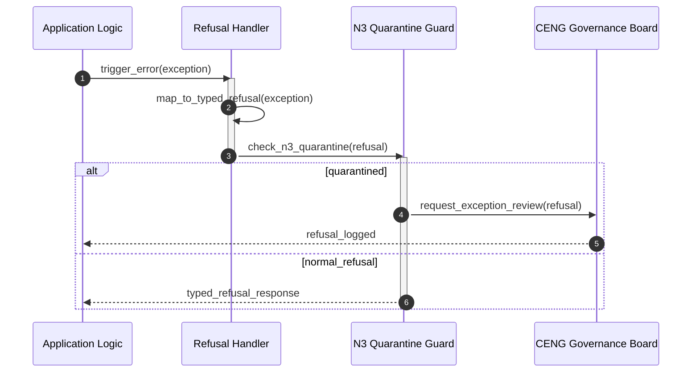
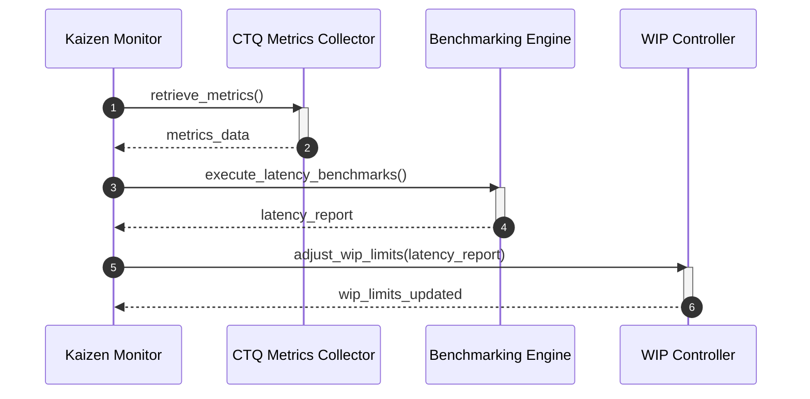

# 16. ZenUML Diagram Family

This file contains the ZenUML diagram family for the Chatman Engine, structured across the 8 projection lenses.

Fallback rendering for Mermaid compatibility.

---

## Lens 1: Semantic Authority

Diagram ID: ZENUML-L1
Diagram family: ZenUML
Projection lens: Semantic Authority
Architectural invariant preserved: RDF/Oxigraph is the single semantic source of truth. Shadow copies of RDF data are strictly prohibited.
Information-loss risk if omitted: Loss of transaction sequence visibility in semantic updates.
TPS visual-control purpose: Prevents messaging waste and redundant query calls.
DfLSS CTQ protected: Zero semantic shadow copies.
CENG ticket or boundary constrained: CENG-410-FINAL (in progress).
Why this diagram is non-redundant: Details sequence flow for updating and validating RDF data.

---

## Lens 2: Routing Constitution

Diagram ID: ZENUML-L2
Diagram family: ZenUML
Projection lens: Routing Constitution
Architectural invariant preserved: Least-expressive-power routing; hot/warm/cold path isolation. N3 is disabled by default.
Information-loss risk if omitted: Executing high-expressivity queries on hot paths due to lack of routing protocol sequence visibility.
TPS visual-control purpose: Prevents routing logic overhead waste.
DfLSS CTQ protected: Safe isolation of cold-path N3 execution.
CENG ticket or boundary constrained: CENG-411 (design-only, implementation blocked).
Why this diagram is non-redundant: Outlines the message-passing sequences for query route classification.

---

## Lens 3: Type Kernel Ownership

Diagram ID: ZENUML-L3
Diagram family: ZenUML
Projection lens: Type Kernel Ownership
Architectural invariant preserved: Canonical type ownership across wasm4pm-compat, wasm4pm-cognition, bcinr-pddl, bcinr-powl, and praxis-graphlaw.
Information-loss risk if omitted: Duplicate types created at runtime during inter-module calls.
TPS visual-control purpose: Prevents redundant type mapping work.
DfLSS CTQ protected: Zero duplicate type classes.
CENG ticket or boundary constrained: CENG-412 (design-only, implementation blocked).
Why this diagram is non-redundant: Maps sequence flow of type kernel validation.

---

## Lens 4: Transition Lifecycle

Diagram ID: ZENUML-L4
Diagram family: ZenUML
Projection lens: Transition Lifecycle
Architectural invariant preserved: Every transition must pass through candidate invocation, validation, planning, execution, receipting, and replay.
Information-loss risk if omitted: Bypassing validation or receipting sequences during state transitions.
TPS visual-control purpose: Restricts lifecycle WIP to eliminate timing bottlenecks.
DfLSS CTQ protected: Guaranteed transaction replay validation under fixed seed.
CENG ticket or boundary constrained: CENG-410-FINAL (in progress).
Why this diagram is non-redundant: Models transition lifecycle step sequencing.

---

## Lens 5: Event / Hook / Actuation

Diagram ID: ZENUML-L5
Diagram family: ZenUML
Projection lens: Event / Hook / Actuation
Architectural invariant preserved: Hooks cannot actuate without receipts; no unreceipted actuation.
Information-loss risk if omitted: Actuators triggering side effects before receiving signed event receipts.
TPS visual-control purpose: Poka-Yoke gating of actuation commands.
DfLSS CTQ protected: Zero unreceipted execution events.
CENG ticket or boundary constrained: CENG-416A-F (design-only, implementation blocked).
Why this diagram is non-redundant: Traces messaging between event router, hook manager, and actuator.

---

## Lens 6: Performance / 8-Constraint Hot Path

Diagram ID: ZENUML-L6
Diagram family: ZenUML
Projection lens: Performance / 8-Constraint Hot Path
Architectural invariant preserved: Maximum of 8 constraints checked in parallel via RDFTriple8 and ConditionCell<BITS>.
Information-loss risk if omitted: CPU execution budget exceeded if lowering paths are suboptimal.
TPS visual-control purpose: Andon check monitoring constraint compiler pipeline.
DfLSS CTQ protected: Latency bound of hot path operations.
CENG ticket or boundary constrained: CENG-410-FINAL (in progress).
Why this diagram is non-redundant: Resolves hot-path vector compilation and execution sequencing.

---

## Lens 7: Refusal / Risk / Governance

Diagram ID: ZENUML-L7
Diagram family: ZenUML
Projection lens: Refusal / Risk / Governance
Architectural invariant preserved: Every failure is a typed Refusal; N3 quarantine rules are strictly enforced.
Information-loss risk if omitted: Silent failures or untyped exceptions escaping container boundaries.
TPS visual-control purpose: Standardizes error signaling to reduce processing defects.
DfLSS CTQ protected: No panic or silent fallbacks.
CENG ticket or boundary constrained: CENG-410-FINAL (in progress).
Why this diagram is non-redundant: Displays exception-handling and refusal typing message flows.

---

## Lens 8: TPS / DfLSS / Continuous Improvement

Diagram ID: ZENUML-L8
Diagram family: ZenUML
Projection lens: TPS / DfLSS / Continuous Improvement
Architectural invariant preserved: WIP reduction, continuous process improvement loops, and visual waste elimination.
Information-loss risk if omitted: Operational drift and degradation of continuous validation metrics over time.
TPS visual-control purpose: Kaizen feedback loop sequencing.
DfLSS CTQ protected: Flow efficiency and defect rate minimization.
CENG ticket or boundary constrained: CENG-410-FINAL (in progress).
Why this diagram is non-redundant: Outlines sequence of measurements in continuous improvement loops.

