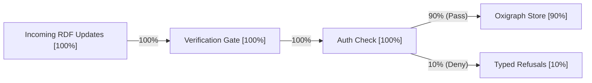
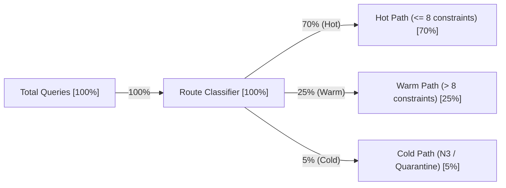
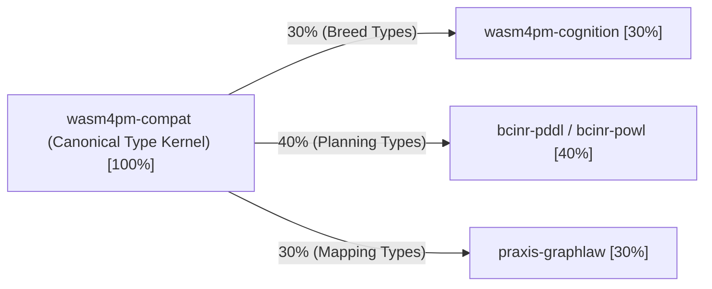
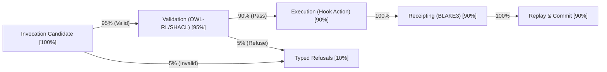
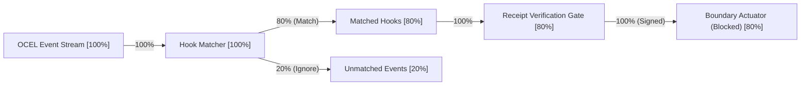
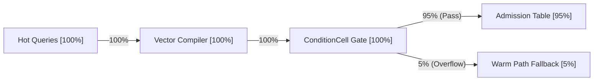
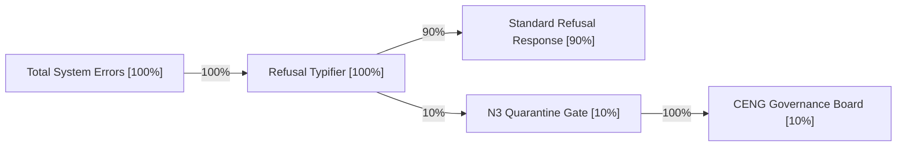
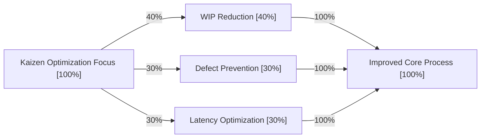

# 17. Sankey Diagram Family

This file contains the Sankey diagram family for the Chatman Engine, structured across the 8 projection lenses.

Fallback rendering for Mermaid compatibility.

---

## Lens 1: Semantic Authority

Diagram ID: SANKEY-L1
Diagram family: Sankey
Projection lens: Semantic Authority
Architectural invariant preserved: RDF/Oxigraph is the single semantic source of truth. Shadow copies of RDF data are strictly prohibited.
Information-loss risk if omitted: Lack of visibility into the flow and volume of RDF semantic updates, leading to untracked shadow data structures.
TPS visual-control purpose: Maps flow volumes of RDF data to expose processing waste.
DfLSS CTQ protected: Zero semantic shadow copies.
CENG ticket or boundary constrained: CENG-410-FINAL (in progress).
Why this diagram is non-redundant: Outlines RDF graph write flow rates and authorization volumes.

---

## Lens 2: Routing Constitution

Diagram ID: SANKEY-L2
Diagram family: Sankey
Projection lens: Routing Constitution
Architectural invariant preserved: Least-expressive-power routing; hot/warm/cold path isolation. N3 is disabled by default.
Information-loss risk if omitted: Incorrect allocation of query workloads across execution paths.
TPS visual-control purpose: Identifies load imbalances across hot, warm, and cold paths.
DfLSS CTQ protected: Safe isolation of cold-path N3 execution.
CENG ticket or boundary constrained: CENG-411 (design-only, implementation blocked).
Why this diagram is non-redundant: Tracks flow distribution across the routing paths.

---

## Lens 3: Type Kernel Ownership

Diagram ID: SANKEY-L3
Diagram family: Sankey
Projection lens: Type Kernel Ownership
Architectural invariant preserved: Canonical type ownership across wasm4pm-compat, wasm4pm-cognition, bcinr-pddl, bcinr-powl, and praxis-graphlaw.
Information-loss risk if omitted: Untracked type definitions leaking into external packages.
TPS visual-control purpose: Maps compilation dependencies to detect redundant type libraries.
DfLSS CTQ protected: Zero duplicate type classes.
CENG ticket or boundary constrained: CENG-412 (design-only, implementation blocked).
Why this diagram is non-redundant: Outlines type distribution from the canonical kernel to system dependencies.

---

## Lens 4: Transition Lifecycle

Diagram ID: SANKEY-L4
Diagram family: Sankey
Projection lens: Transition Lifecycle
Architectural invariant preserved: Every transition must pass through candidate invocation, validation, planning, execution, receipting, and replay.
Information-loss risk if omitted: Drop-offs and loss of transactions between lifecycle phases.
TPS visual-control purpose: Identifies pipeline blockages and scrap rates across transition steps.
DfLSS CTQ protected: Guaranteed transaction replay validation under fixed seed.
CENG ticket or boundary constrained: CENG-410-FINAL (in progress).
Why this diagram is non-redundant: Models transition throughput and drop-off flow rates.

---

## Lens 5: Event / Hook / Actuation

Diagram ID: SANKEY-L5
Diagram family: Sankey
Projection lens: Event / Hook / Actuation
Architectural invariant preserved: Hooks cannot actuate without receipts; no unreceipted actuation.
Information-loss risk if omitted: Event processing leak where hooks execute without audit trails.
TPS visual-control purpose: Tracks event processing yield and gating efficiency.
DfLSS CTQ protected: Zero unreceipted execution events.
CENG ticket or boundary constrained: CENG-416A-F (design-only, implementation blocked).
Why this diagram is non-redundant: Traces event-to-actuation processing flow.

---

## Lens 6: Performance / 8-Constraint Hot Path

Diagram ID: SANKEY-L6
Diagram family: Sankey
Projection lens: Performance / 8-Constraint Hot Path
Architectural invariant preserved: Maximum of 8 constraints checked in parallel via RDFTriple8 and ConditionCell<BITS>.
Information-loss risk if omitted: Overhead and CPU cycles wasted on slow warm-path routing.
TPS visual-control purpose: Andon check of hot-path query execution efficiency.
DfLSS CTQ protected: Latency bound of hot path operations.
CENG ticket or boundary constrained: CENG-410-FINAL (in progress).
Why this diagram is non-redundant: visualizes query flow throughput through the hot-path optimizer.

---

## Lens 7: Refusal / Risk / Governance

Diagram ID: SANKEY-L7
Diagram family: Sankey
Projection lens: Refusal / Risk / Governance
Architectural invariant preserved: Every failure is a typed Refusal; N3 quarantine rules are strictly enforced.
Information-loss risk if omitted: Untyped errors or quarantined code escaping security containment.
TPS visual-control purpose: Tracks scrap flow and routing of risk events.
DfLSS CTQ protected: No panic or silent fallbacks.
CENG ticket or boundary constrained: CENG-410-FINAL (in progress).
Why this diagram is non-redundant: Outlines error routing and quarantine volumes.

---

## Lens 8: TPS / DfLSS / Continuous Improvement

Diagram ID: SANKEY-L8
Diagram family: Sankey
Projection lens: TPS / DfLSS / Continuous Improvement
Architectural invariant preserved: WIP reduction, continuous process improvement loops, and visual waste elimination.
Information-loss risk if omitted: Hidden build inventory (WIP) and delay accumulation in the deployment pipeline.
TPS visual-control purpose: visualizes Kaizen improvement resource allocation.
DfLSS CTQ protected: Flow efficiency and defect rate minimization.
CENG ticket or boundary constrained: CENG-410-FINAL (in progress).
Why this diagram is non-redundant: Details resource and task flows through the Kaizen continuous improvement loop.

