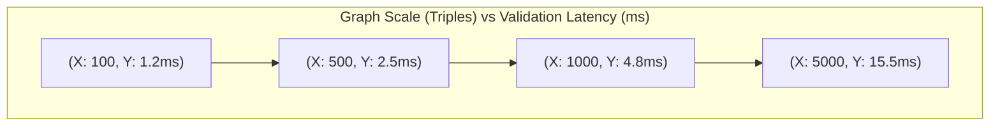
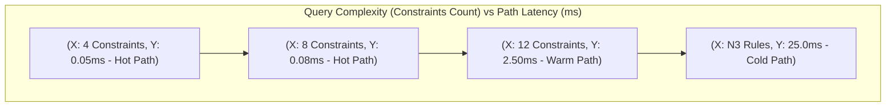
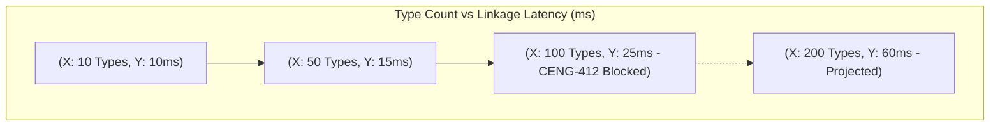
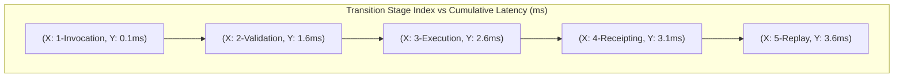
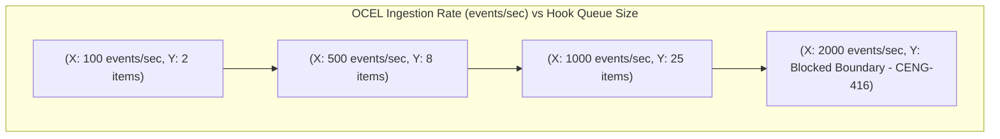
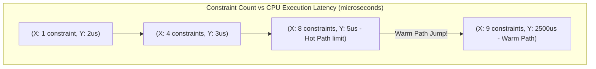
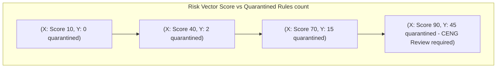
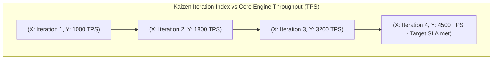

# 18. XY Chart Diagram Family

This file contains the XY Chart diagram family for the Chatman Engine, structured across the 8 projection lenses.

Fallback rendering for Mermaid compatibility.

---

## Lens 1: Semantic Authority

Diagram ID: XY_CHART-L1
Diagram family: XY Chart
Projection lens: Semantic Authority
Architectural invariant preserved: RDF/Oxigraph is the single semantic source of truth. Shadow copies of RDF data are strictly prohibited.
Information-loss risk if omitted: Wasted CPU overhead on shadow copy checks not being tracked against graph scale.
TPS visual-control purpose: Andon alert for non-linear verification time scaling.
DfLSS CTQ protected: Zero semantic shadow copies.
CENG ticket or boundary constrained: CENG-410-FINAL (in progress).
Why this diagram is non-redundant: Plots the verification latency against RDF graph size.

---

## Lens 2: Routing Constitution

Diagram ID: XY_CHART-L2
Diagram family: XY Chart
Projection lens: Routing Constitution
Architectural invariant preserved: Least-expressive-power routing; hot/warm/cold path isolation. N3 is disabled by default.
Information-loss risk if omitted: Inability to visualize routing overhead scaling with constraints.
TPS visual-control purpose: Prevents processing waste by identifying path selection thresholds.
DfLSS CTQ protected: Safe isolation of cold-path N3 execution.
CENG ticket or boundary constrained: CENG-411 (design-only, implementation blocked).
Why this diagram is non-redundant: Plots query complexity against routing overhead.

---

## Lens 3: Type Kernel Ownership

Diagram ID: XY_CHART-L3
Diagram family: XY Chart
Projection lens: Type Kernel Ownership
Architectural invariant preserved: Canonical type ownership across wasm4pm-compat, wasm4pm-cognition, bcinr-pddl, bcinr-powl, and praxis-graphlaw.
Information-loss risk if omitted: Undetected increases in type registry compile-time overhead.
TPS visual-control purpose: Prevents build time waste by tracking compilation bloat.
DfLSS CTQ protected: Zero duplicate type classes.
CENG ticket or boundary constrained: CENG-412 (design-only, implementation blocked).
Why this diagram is non-redundant: Maps number of type definitions to linkage and compilation time.

---

## Lens 4: Transition Lifecycle

Diagram ID: XY_CHART-L4
Diagram family: XY Chart
Projection lens: Transition Lifecycle
Architectural invariant preserved: Every transition must pass through candidate invocation, validation, planning, execution, receipting, and replay.
Information-loss risk if omitted: Undetected lag spikes at specific lifecycle processing steps.
TPS visual-control purpose: WIP tracking across lifecycle phases to identify timing queues.
DfLSS CTQ protected: Guaranteed transaction replay validation under fixed seed.
CENG ticket or boundary constrained: CENG-410-FINAL (in progress).
Why this diagram is non-redundant: Details incremental latency contributions across lifecycle stages.

---

## Lens 5: Event / Hook / Actuation

Diagram ID: XY_CHART-L5
Diagram family: XY Chart
Projection lens: Event / Hook / Actuation
Architectural invariant preserved: Hooks cannot actuate without receipts; no unreceipted actuation.
Information-loss risk if omitted: Loss of control over hook matcher queue sizes under peak event loads.
TPS visual-control purpose: Poka-Yoke check on hook processing capacity.
DfLSS CTQ protected: Zero unreceipted execution events.
CENG ticket or boundary constrained: CENG-416A-F (design-only, implementation blocked).
Why this diagram is non-redundant: Plots incoming OCEL event rates against hook matching queue sizes.

---

## Lens 6: Performance / 8-Constraint Hot Path

Diagram ID: XY_CHART-L6
Diagram family: XY Chart
Projection lens: Performance / 8-Constraint Hot Path
Architectural invariant preserved: Maximum of 8 constraints checked in parallel via RDFTriple8 and ConditionCell<BITS>.
Information-loss risk if omitted: CPU utilization surges undetected when constraint size boundary is crossed.
TPS visual-control purpose: Andon indicator showing constraint limit threshold compliance.
DfLSS CTQ protected: Latency bound of hot path operations.
CENG ticket or boundary constrained: CENG-410-FINAL (in progress).
Why this diagram is non-redundant: Formally plots constraints size against execution latency, highlighting the 8-constraint hot-path boundary.

---

## Lens 7: Refusal / Risk / Governance

Diagram ID: XY_CHART-L7
Diagram family: XY Chart
Projection lens: Refusal / Risk / Governance
Architectural invariant preserved: Every failure is a typed Refusal; N3 quarantine rules are strictly enforced.
Information-loss risk if omitted: System vulnerability exposure if refusal rates scale with risk without triggering quarantine.
TPS visual-control purpose: Exposes waste (scrap rates) in refusal generation.
DfLSS CTQ protected: No panic or silent fallbacks.
CENG ticket or boundary constrained: CENG-410-FINAL (in progress).
Why this diagram is non-redundant: Plots threat/risk levels against refusal and quarantine actions.

---

## Lens 8: TPS / DfLSS / Continuous Improvement

Diagram ID: XY_CHART-L8
Diagram family: XY Chart
Projection lens: TPS / DfLSS / Continuous Improvement
Architectural invariant preserved: WIP reduction, continuous process improvement loops, and visual waste elimination.
Information-loss risk if omitted: Inability to track Kaizen improvements against overall engine throughput (TPS).
TPS visual-control purpose: Kaizen chart showing process improvement trends.
DfLSS CTQ protected: Flow efficiency and defect rate minimization.
CENG ticket or boundary constrained: CENG-410-FINAL (in progress).
Why this diagram is non-redundant: Plots system Kaizen iterations against overall throughput.

