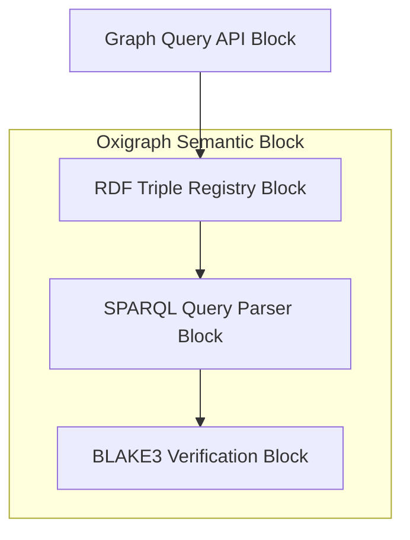
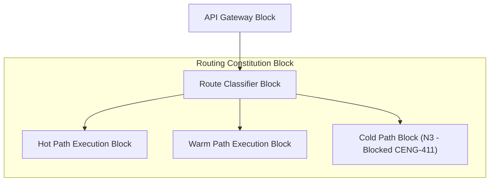
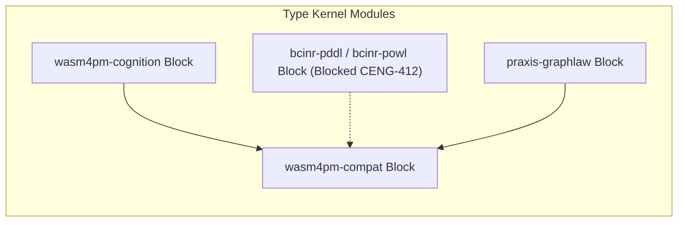
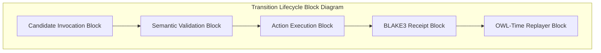
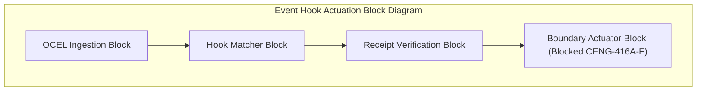
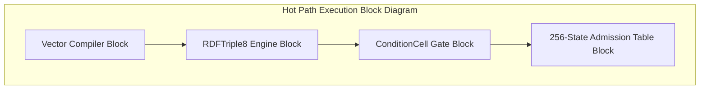
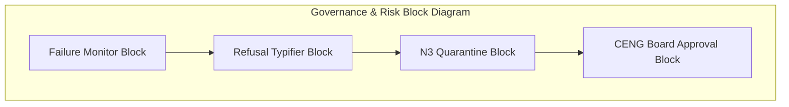
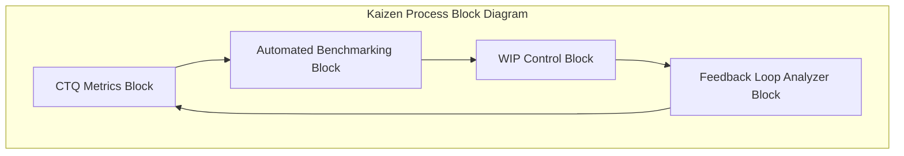

# 19. Block Diagram Family

This file contains the Block diagram family for the Chatman Engine, structured across the 8 projection lenses.

Fallback rendering for Mermaid compatibility.

---

## Lens 1: Semantic Authority

Diagram ID: BLOCK-L1
Diagram family: Block
Projection lens: Semantic Authority
Architectural invariant preserved: RDF/Oxigraph is the single semantic source of truth. Shadow copies of RDF data are strictly prohibited.
Information-loss risk if omitted: Loss of component block isolation, leading to tight coupling between semantic adapters.
TPS visual-control purpose: Prevents inventory waste by isolating database components.
DfLSS CTQ protected: Zero semantic shadow copies.
CENG ticket or boundary constrained: CENG-410-FINAL (in progress).
Why this diagram is non-redundant: Outlines system blocks for semantic authority.

---

## Lens 2: Routing Constitution

Diagram ID: BLOCK-L2
Diagram family: Block
Projection lens: Routing Constitution
Architectural invariant preserved: Least-expressive-power routing; hot/warm/cold path isolation. N3 is disabled by default.
Information-loss risk if omitted: Merging routing execution contexts, violating least-expressive-power constraints.
TPS visual-control purpose: Groups path execution blocks to eliminate processing waste.
DfLSS CTQ protected: Safe isolation of cold-path N3 execution.
CENG ticket or boundary constrained: CENG-411 (design-only, implementation blocked).
Why this diagram is non-redundant: Details routing blocks and execution path isolation.

---

## Lens 3: Type Kernel Ownership

Diagram ID: BLOCK-L3
Diagram family: Block
Projection lens: Type Kernel Ownership
Architectural invariant preserved: Canonical type ownership across wasm4pm-compat, wasm4pm-cognition, bcinr-pddl, bcinr-powl, and praxis-graphlaw.
Information-loss risk if omitted: Compilation failures due to overlapping library block definitions.
TPS visual-control purpose: Defines library boundaries to prevent duplicate type work.
DfLSS CTQ protected: Zero duplicate type classes.
CENG ticket or boundary constrained: CENG-412 (design-only, implementation blocked).
Why this diagram is non-redundant: Formally blocks out the type kernel library components.

---

## Lens 4: Transition Lifecycle

Diagram ID: BLOCK-L4
Diagram family: Block
Projection lens: Transition Lifecycle
Architectural invariant preserved: Every transition must pass through candidate invocation, validation, planning, execution, receipting, and replay.
Information-loss risk if omitted: Out-of-order execution of transition component blocks.
TPS visual-control purpose: visualizes lifecycle blocks to eliminate workflow delay.
DfLSS CTQ protected: Guaranteed transaction replay validation under fixed seed.
CENG ticket or boundary constrained: CENG-410-FINAL (in progress).
Why this diagram is non-redundant: Outlines sequential transition lifecycle blocks.

---

## Lens 5: Event / Hook / Actuation

Diagram ID: BLOCK-L5
Diagram family: Block
Projection lens: Event / Hook / Actuation
Architectural invariant preserved: Hooks cannot actuate without receipts; no unreceipted actuation.
Information-loss risk if omitted: Actuation blocks executing without input receipt block validation.
TPS visual-control purpose: Poka-Yoke gating of boundary execution blocks.
DfLSS CTQ protected: Zero unreceipted execution events.
CENG ticket or boundary constrained: CENG-416A-F (design-only, implementation blocked).
Why this diagram is non-redundant: Maps blocks for events, hook matches, and gated actuators.

---

## Lens 6: Performance / 8-Constraint Hot Path

Diagram ID: BLOCK-L6
Diagram family: Block
Projection lens: Performance / 8-Constraint Hot Path
Architectural invariant preserved: Maximum of 8 constraints checked in parallel via RDFTriple8 and ConditionCell<BITS>.
Information-loss risk if omitted: Inability to trace low-level compiler optimization blocks.
TPS visual-control purpose: Andon check of hot-path constraint block capacity.
DfLSS CTQ protected: Latency bound of hot path operations.
CENG ticket or boundary constrained: CENG-410-FINAL (in progress).
Why this diagram is non-redundant: Details hot-path blocks and state admission execution.

---

## Lens 7: Refusal / Risk / Governance

Diagram ID: BLOCK-L7
Diagram family: Block
Projection lens: Refusal / Risk / Governance
Architectural invariant preserved: Every failure is a typed Refusal; N3 quarantine rules are strictly enforced.
Information-loss risk if omitted: Risks of failure blocks escaping standard containment.
TPS visual-control purpose: Standardizes error blocks to prevent scrap propagation.
DfLSS CTQ protected: No panic or silent fallbacks.
CENG ticket or boundary constrained: CENG-410-FINAL (in progress).
Why this diagram is non-redundant: Displays governance, exception handling, and quarantine blocks.

---

## Lens 8: TPS / DfLSS / Continuous Improvement

Diagram ID: BLOCK-L8
Diagram family: Block
Projection lens: TPS / DfLSS / Continuous Improvement
Architectural invariant preserved: WIP reduction, continuous process improvement loops, and visual waste elimination.
Information-loss risk if omitted: Loss of feedback loop visibility in continuous improvement blocks.
TPS visual-control purpose: Maps Kaizen improvement blocks.
DfLSS CTQ protected: Flow efficiency and defect rate minimization.
CENG ticket or boundary constrained: CENG-410-FINAL (in progress).
Why this diagram is non-redundant: Outlines blocks composing the continuous improvement lifecycle.

