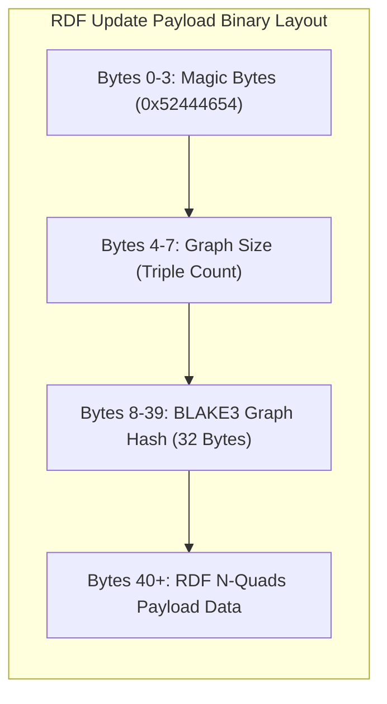
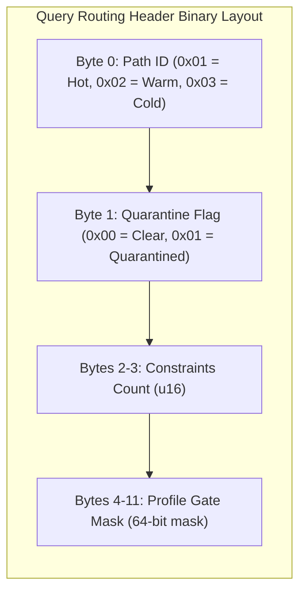
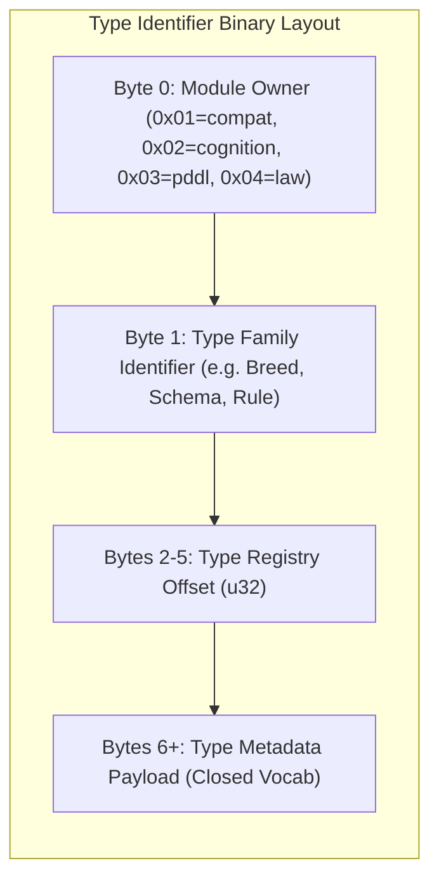
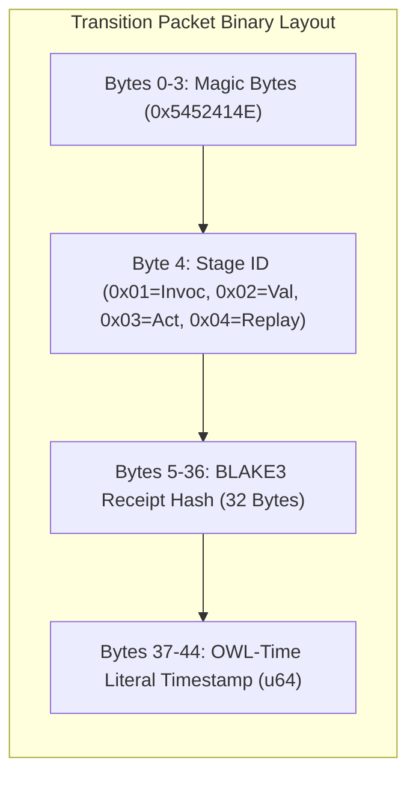
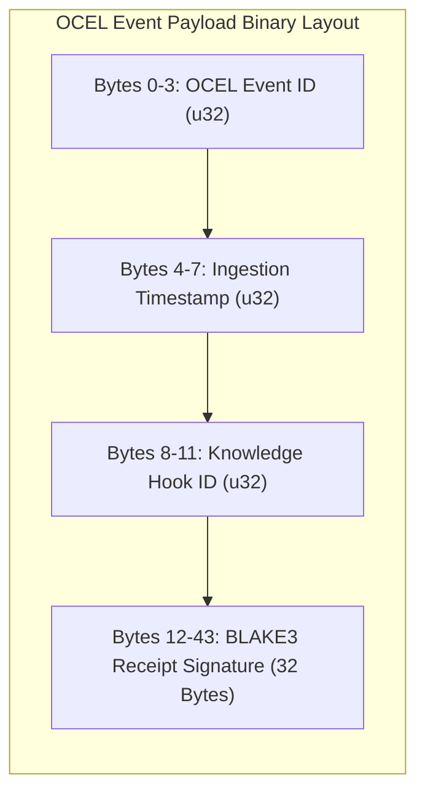
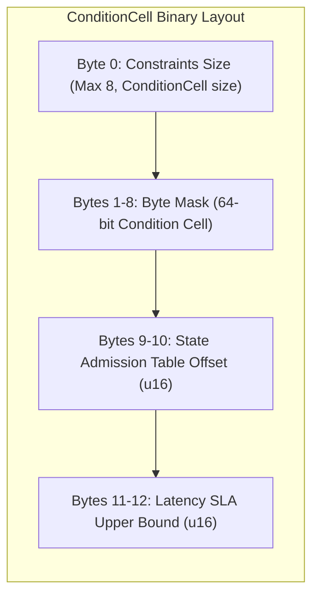
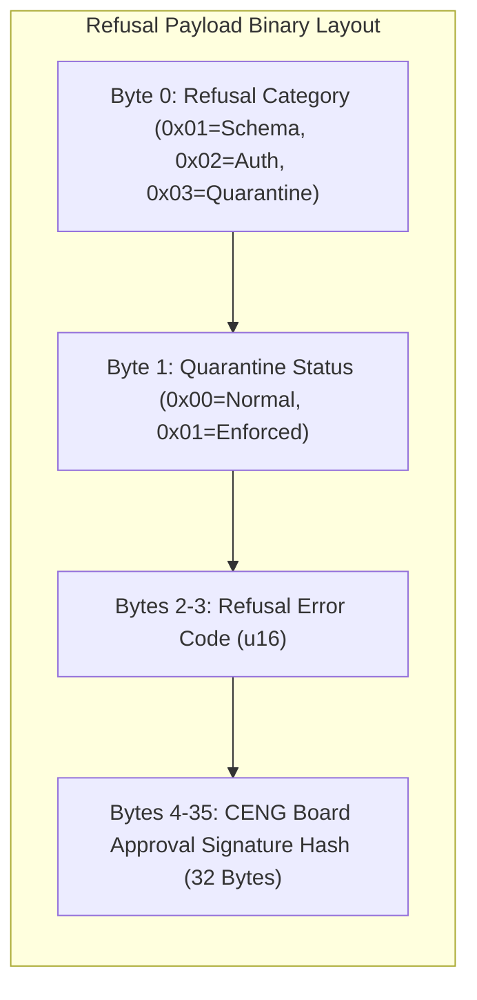
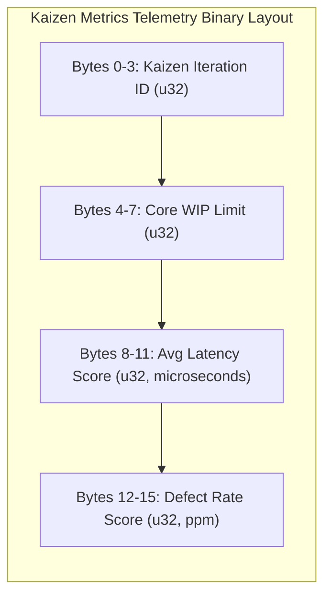

# 20. Packet Diagram Family

This file contains the Packet diagram family for the Chatman Engine, structured across the 8 projection lenses.

Fallback rendering for Mermaid compatibility.

---

## Lens 1: Semantic Authority

Diagram ID: PACKET-L1
Diagram family: Packet
Projection lens: Semantic Authority
Architectural invariant preserved: RDF/Oxigraph is the single semantic source of truth. Shadow copies of RDF data are strictly prohibited.
Information-loss risk if omitted: Ambiguity in the binary layout of RDF update payload packets, leading to deserialization bugs.
TPS visual-control purpose: Prevents transport defects by explicitly mapping byte positions.
DfLSS CTQ protected: Zero semantic shadow copies.
CENG ticket or boundary constrained: CENG-410-FINAL (in progress).
Why this diagram is non-redundant: Details the byte layout of the RDF Update payload packet.

---

## Lens 2: Routing Constitution

Diagram ID: PACKET-L2
Diagram family: Packet
Projection lens: Routing Constitution
Architectural invariant preserved: Least-expressive-power routing; hot/warm/cold path isolation. N3 is disabled by default.
Information-loss risk if omitted: Overlapping headers in routing packets leading to misrouted execution paths.
TPS visual-control purpose: Prevents routing classification errors (scrap).
DfLSS CTQ protected: Safe isolation of cold-path N3 execution.
CENG ticket or boundary constrained: CENG-411 (design-only, implementation blocked).
Why this diagram is non-redundant: Outlines routing packet headers.

---

## Lens 3: Type Kernel Ownership

Diagram ID: PACKET-L3
Diagram family: Packet
Projection lens: Type Kernel Ownership
Architectural invariant preserved: Canonical type ownership across wasm4pm-compat, wasm4pm-cognition, bcinr-pddl, bcinr-powl, and praxis-graphlaw.
Information-loss risk if omitted: Untracked module source identifiers in binary type structures.
TPS visual-control purpose: Prevents cross-module type mapping duplication.
DfLSS CTQ protected: Zero duplicate type classes.
CENG ticket or boundary constrained: CENG-412 (design-only, implementation blocked).
Why this diagram is non-redundant: Outlines the binary structure of type identifiers.

---

## Lens 4: Transition Lifecycle

Diagram ID: PACKET-L4
Diagram family: Packet
Projection lens: Transition Lifecycle
Architectural invariant preserved: Every transition must pass through candidate invocation, validation, planning, execution, receipting, and replay.
Information-loss risk if omitted: Sending transitions with missing lifecycle stage tags or invalid receipt offsets.
TPS visual-control purpose: Eliminates transaction lifecycle ordering defects.
DfLSS CTQ protected: Guaranteed transaction replay validation under fixed seed.
CENG ticket or boundary constrained: CENG-410-FINAL (in progress).
Why this diagram is non-redundant: Outlines the binary layout of state transition packets.

---

## Lens 5: Event / Hook / Actuation

Diagram ID: PACKET-L5
Diagram family: Packet
Projection lens: Event / Hook / Actuation
Architectural invariant preserved: Hooks cannot actuate without receipts; no unreceipted actuation.
Information-loss risk if omitted: Loss of receipt signature tracking in external event packets.
TPS visual-control purpose: Poka-Yoke check validating receipt fields prior to ingestion.
DfLSS CTQ protected: Zero unreceipted execution events.
CENG ticket or boundary constrained: CENG-416A-F (design-only, implementation blocked).
Why this diagram is non-redundant: Details the layout of incoming event payloads and signatures.

---

## Lens 6: Performance / 8-Constraint Hot Path

Diagram ID: PACKET-L6
Diagram family: Packet
Projection lens: Performance / 8-Constraint Hot Path
Architectural invariant preserved: Maximum of 8 constraints checked in parallel via RDFTriple8 and ConditionCell<BITS>.
Information-loss risk if omitted: Exceeding the 64-bit alignment size of the hot-path ConditionCell.
TPS visual-control purpose: Andon check verifying hot-path bit alignments.
DfLSS CTQ protected: Latency bound of hot path operations.
CENG ticket or boundary constrained: CENG-410-FINAL (in progress).
Why this diagram is non-redundant: Outlines the hot-path ConditionCell binary layout.

---

## Lens 7: Refusal / Risk / Governance

Diagram ID: PACKET-L7
Diagram family: Packet
Projection lens: Refusal / Risk / Governance
Architectural invariant preserved: Every failure is a typed Refusal; N3 quarantine rules are strictly enforced.
Information-loss risk if omitted: Untyped exception code or unsigned governance overrides.
TPS visual-control purpose: Exposes safety and refusal fields to prevent security escapes.
DfLSS CTQ protected: No panic or silent fallbacks.
CENG ticket or boundary constrained: CENG-410-FINAL (in progress).
Why this diagram is non-redundant: Outlines the binary structure of Refusal packets.

---

## Lens 8: TPS / DfLSS / Continuous Improvement

Diagram ID: PACKET-L8
Diagram family: Packet
Projection lens: TPS / DfLSS / Continuous Improvement
Architectural invariant preserved: WIP reduction, continuous process improvement loops, and visual waste elimination.
Information-loss risk if omitted: Missing measurement data fields in Kaizen tracking payloads.
TPS visual-control purpose: Structures Kaizen metrics for performance telemetry.
DfLSS CTQ protected: Flow efficiency and defect rate minimization.
CENG ticket or boundary constrained: CENG-410-FINAL (in progress).
Why this diagram is non-redundant: Details the telemetry packet structure for Kaizen metrics.

