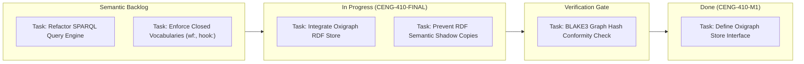
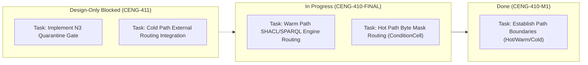
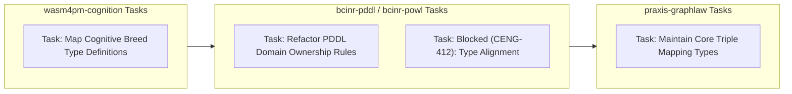
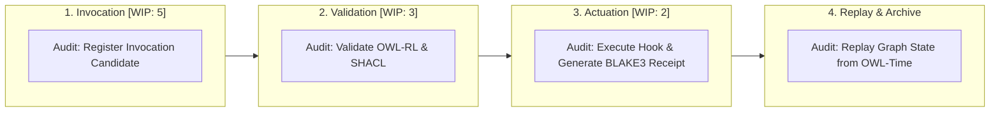
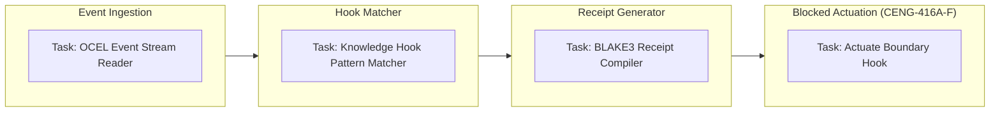
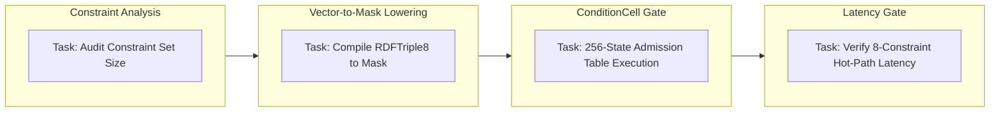
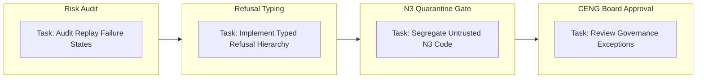
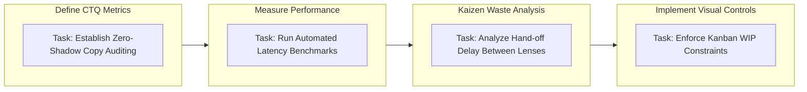

# 21. Kanban Diagram Family

This file contains the Kanban diagram family for the Chatman Engine, structured across the 8 projection lenses.

Fallback rendering for Mermaid compatibility.

---

## Lens 1: Semantic Authority

Diagram ID: KANBAN-L1
Diagram family: Kanban
Projection lens: Semantic Authority
Architectural invariant preserved: RDF/Oxigraph is the single semantic source of truth. Shadow copies of RDF data are strictly prohibited.
Information-loss risk if omitted: Loss of visibility into RDF authority tasks, allowing development of unauthorized semantic shadow copies.
TPS visual-control purpose: Exposes waste and duplicate semantic tasks in the pipeline.
DfLSS CTQ protected: Zero semantic shadow copies.
CENG ticket or boundary constrained: CENG-410-FINAL (in progress).
Why this diagram is non-redundant: Tracks semantic authority task transitions specifically on the Kanban board.

---

## Lens 2: Routing Constitution

Diagram ID: KANBAN-L2
Diagram family: Kanban
Projection lens: Routing Constitution
Architectural invariant preserved: Least-expressive-power routing; hot/warm/cold path isolation. N3 is disabled by default.
Information-loss risk if omitted: Uncontrolled propagation of N3 rules leading to performance degradation or escape from profile-local gates.
TPS visual-control purpose: Prevents routing logic waste by visually separating path implementation tickets.
DfLSS CTQ protected: Safe isolation of cold-path N3 execution.
CENG ticket or boundary constrained: CENG-411 (design-only, implementation blocked).
Why this diagram is non-redundant: Visualizes routing-related tasks and constraints across path states.

---

## Lens 3: Type Kernel Ownership

Diagram ID: KANBAN-L3
Diagram family: Kanban
Projection lens: Type Kernel Ownership
Architectural invariant preserved: Canonical type ownership across wasm4pm-compat, wasm4pm-cognition, bcinr-pddl, bcinr-powl, and praxis-graphlaw.
Information-loss risk if omitted: Overlapping type definitions leading to duplicate semantic serialization formats.
TPS visual-control purpose: Swimlane column boundaries prevent duplicate type development.
DfLSS CTQ protected: Zero duplicate type classes.
CENG ticket or boundary constrained: CENG-412 (design-only, implementation blocked).
Why this diagram is non-redundant: Specifically tracks type ownership assignments across system boundaries.

---

## Lens 4: Transition Lifecycle

Diagram ID: KANBAN-L4
Diagram family: Kanban
Projection lens: Transition Lifecycle
Architectural invariant preserved: Every transition must pass through candidate invocation, validation, planning, execution, receipting, and replay.
Information-loss risk if omitted: Bypassing of validation or receipting phases in lifecycle execution.
TPS visual-control purpose: WIP limits on lifecycle stages prevent transaction pile-up and memory leaks.
DfLSS CTQ protected: Guaranteed transaction replay validation under fixed seed.
CENG ticket or boundary constrained: CENG-410-FINAL (in progress).
Why this diagram is non-redundant: Models lifecycle transitions as distinct Kanban columns to control WIP.

---

## Lens 5: Event / Hook / Actuation

Diagram ID: KANBAN-L5
Diagram family: Kanban
Projection lens: Event / Hook / Actuation
Architectural invariant preserved: Hooks cannot actuate without receipts; no unreceipted actuation.
Information-loss risk if omitted: Actuation without proof-of-execution receipt, breaking auditing logs.
TPS visual-control purpose: Error-proofing (Poka-Yoke) actuation by locking the task column until receipt signature is attached.
DfLSS CTQ protected: Zero unreceipted execution events.
CENG ticket or boundary constrained: CENG-416A-F (design-only, implementation blocked).
Why this diagram is non-redundant: Visualizes task dependencies in hook execution pipeline on Kanban.

---

## Lens 6: Performance / 8-Constraint Hot Path

Diagram ID: KANBAN-L6
Diagram family: Kanban
Projection lens: Performance / 8-Constraint Hot Path
Architectural invariant preserved: Maximum of 8 constraints checked in parallel via RDFTriple8 and ConditionCell<BITS>.
Information-loss risk if omitted: Performance bottlenecks or CPU overhead if hot path expands beyond 8 constraints.
TPS visual-control purpose: Kanban column limits act as visual alerts for hot-path constraint violations.
DfLSS CTQ protected: Latency bound of hot path operations.
CENG ticket or boundary constrained: CENG-410-FINAL (in progress).
Why this diagram is non-redundant: Tracks constraints optimization and parallel check tasks.

---

## Lens 7: Refusal / Risk / Governance

Diagram ID: KANBAN-L7
Diagram family: Kanban
Projection lens: Refusal / Risk / Governance
Architectural invariant preserved: Every failure is a typed Refusal; N3 quarantine rules are strictly enforced.
Information-loss risk if omitted: Silent failures or untyped panic execution paths.
TPS visual-control purpose: Standardized visual separation of Refusal classification tasks.
DfLSS CTQ protected: No panic or silent fallbacks.
CENG ticket or boundary constrained: CENG-410-FINAL (in progress).
Why this diagram is non-redundant: Tracks risk remediation and refusal system tasks.

---

## Lens 8: TPS / DfLSS / Continuous Improvement

Diagram ID: KANBAN-L8
Diagram family: Kanban
Projection lens: TPS / DfLSS / Continuous Improvement
Architectural invariant preserved: WIP reduction, continuous process improvement loops, and visual waste elimination.
Information-loss risk if omitted: Accumulation of hidden process waste and visual blind spots in the engineering cycle.
TPS visual-control purpose: Kaizen-driven visual controls to maintain throughput and minimize lead times.
DfLSS CTQ protected: Flow efficiency and defect rate minimization.
CENG ticket or boundary constrained: CENG-410-FINAL (in progress).
Why this diagram is non-redundant: Represents the meta-governance of the Kanban board itself under TPS/DfLSS rules.

