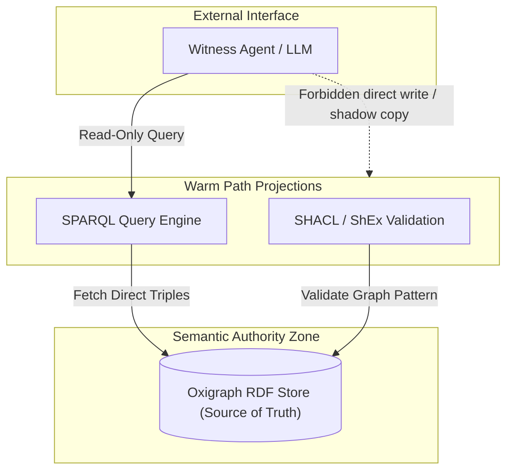
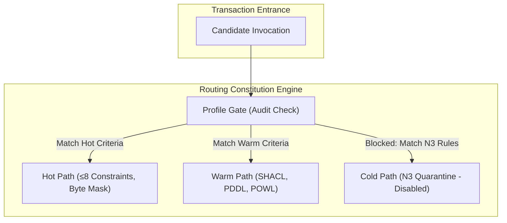
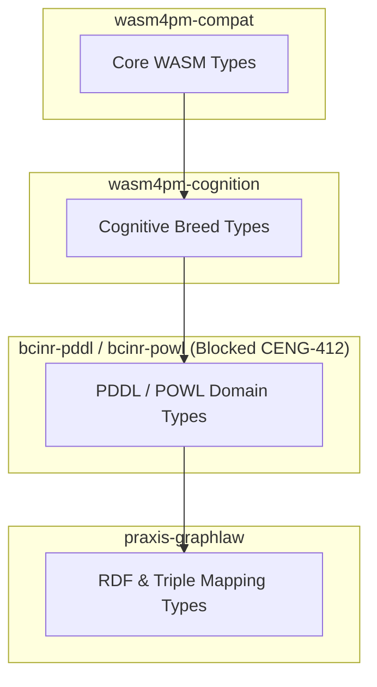
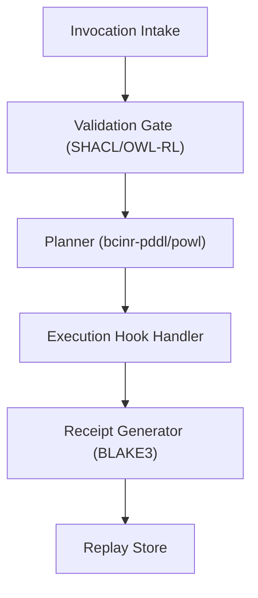
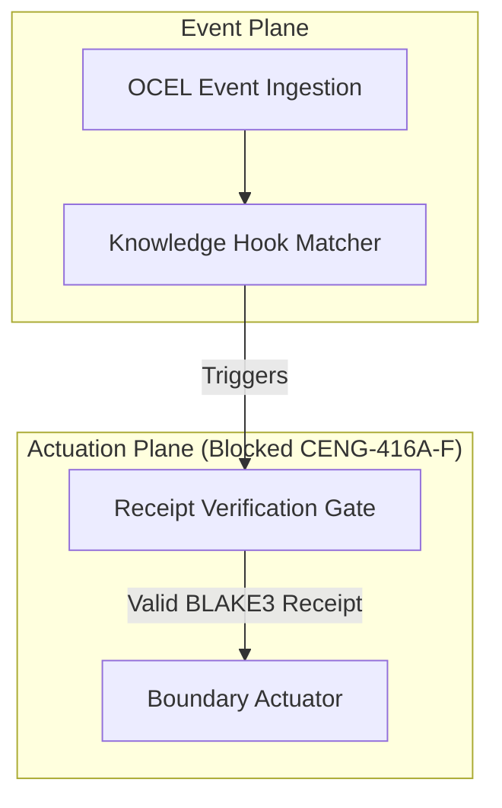
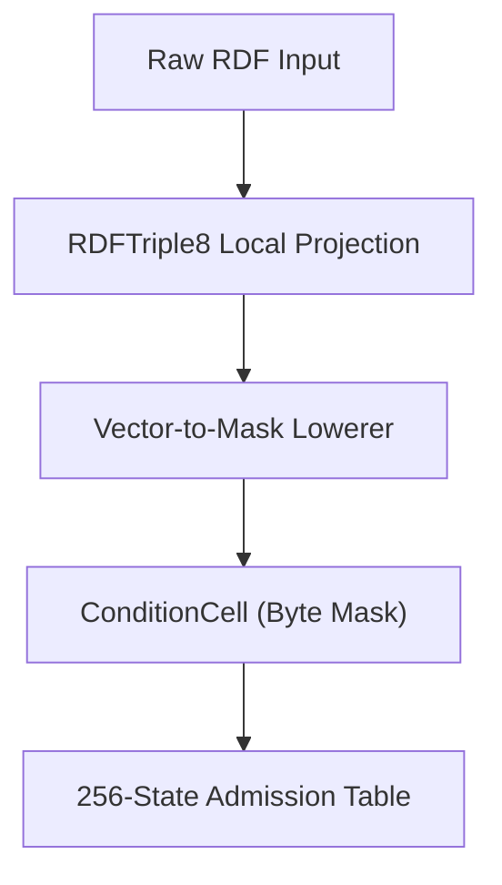
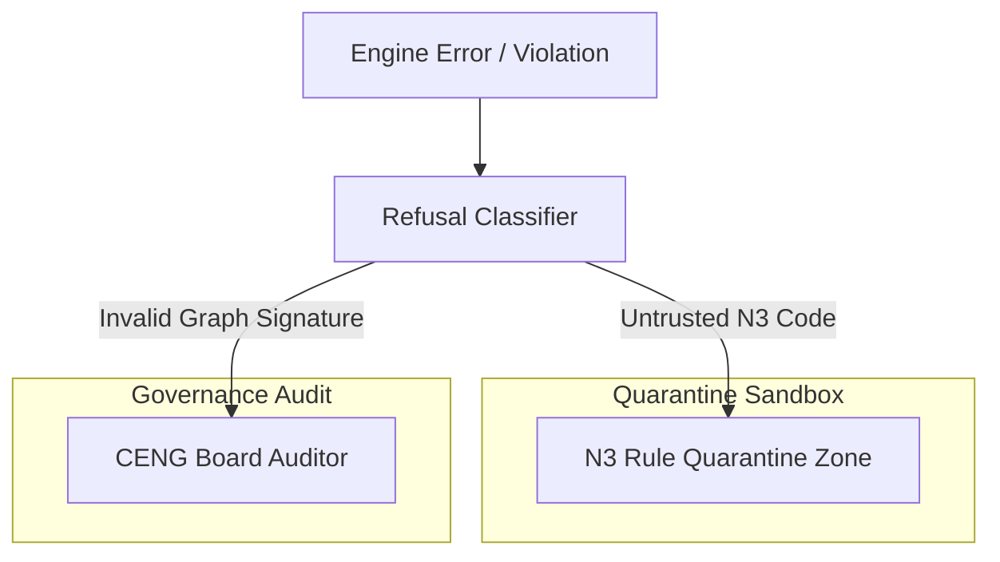
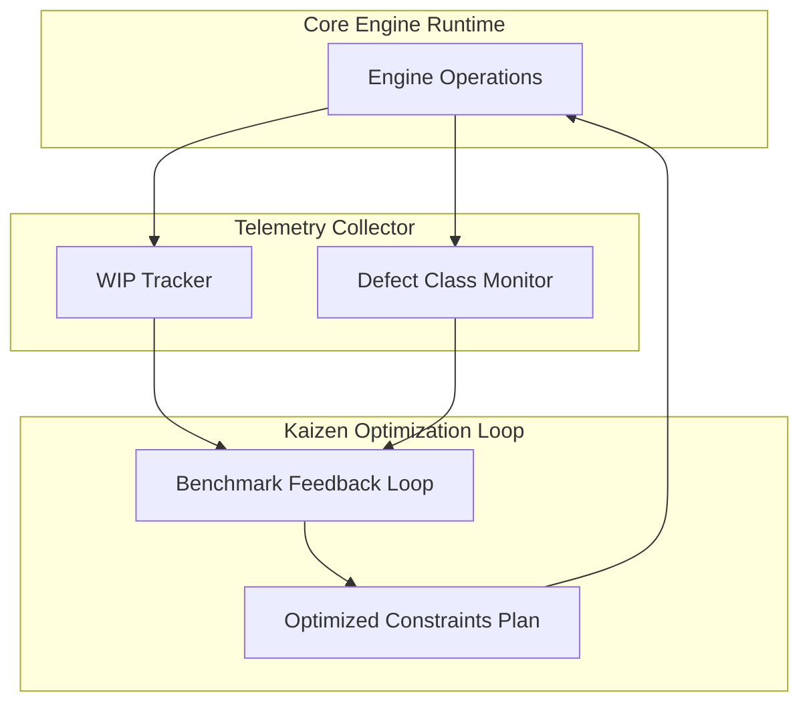

# 22. Architecture Diagram Family

This file contains the Architecture diagram family for the Chatman Engine, structured across the 8 projection lenses.

Fallback rendering for Mermaid compatibility.

---

## Lens 1: Semantic Authority

Diagram ID: ARCHITECTURE-L1
Diagram family: Architecture
Projection lens: Semantic Authority
Architectural invariant preserved: RDF/Oxigraph is the single semantic source of truth. Shadow copies of RDF data are strictly prohibited.
Information-loss risk if omitted: Bypassing the core Oxigraph database, leading to unsynchronized state or out-of-order execution.
TPS visual-control purpose: Shows path lines that bypass the source of truth, exposing illegal shadow bypasses.
DfLSS CTQ protected: Zero semantic shadow copies.
CENG ticket or boundary constrained: CENG-410-FINAL (in progress).
Why this diagram is non-redundant: Visualizes database query routing paths to ensure authority.

---

## Lens 2: Routing Constitution

Diagram ID: ARCHITECTURE-L2
Diagram family: Architecture
Projection lens: Routing Constitution
Architectural invariant preserved: Least-expressive-power routing; hot/warm/cold path isolation. N3 is disabled by default.
Information-loss risk if omitted: Direct invocation of cold-path N3 engines without passing through profile gates.
TPS visual-control purpose: Isolates routing channels to avoid routing waste and logic bypass.
DfLSS CTQ protected: Strict segregation of hot/warm/cold paths.
CENG ticket or boundary constrained: CENG-411 (design-only, implementation blocked).
Why this diagram is non-redundant: Details component connections inside the routing router.

---

## Lens 3: Type Kernel Ownership

Diagram ID: ARCHITECTURE-L3
Diagram family: Architecture
Projection lens: Type Kernel Ownership
Architectural invariant preserved: Canonical type ownership across wasm4pm-compat, wasm4pm-cognition, bcinr-pddl, bcinr-powl, and praxis-graphlaw.
Information-loss risk if omitted: Cross-crate type shadowing and duplicate serializations.
TPS visual-control purpose: Limits type definition domains to ensure clean integration boundaries.
DfLSS CTQ protected: Zero duplicate type classes.
CENG ticket or boundary constrained: CENG-412 (design-only, implementation blocked).
Why this diagram is non-redundant: Details crate boundaries and dependency flow for types.

---

## Lens 4: Transition Lifecycle

Diagram ID: ARCHITECTURE-L4
Diagram family: Architecture
Projection lens: Transition Lifecycle
Architectural invariant preserved: Transitions must pass sequentially through candidate invocation, validation, planning, execution, receipting, and replay.
Information-loss risk if omitted: Execution of state changes prior to planning verification or validation.
TPS visual-control purpose: Shows state checkpoints to control queue build-up.
DfLSS CTQ protected: Fully replayable state transitions under fixed seed.
CENG ticket or boundary constrained: CENG-410-FINAL (in progress).
Why this diagram is non-redundant: Details component lifecycle pipelines.

---

## Lens 5: Event / Hook / Actuation

Diagram ID: ARCHITECTURE-L5
Diagram family: Architecture
Projection lens: Event / Hook / Actuation
Architectural invariant preserved: Hooks cannot actuate without receipts; no unreceipted actuation.
Information-loss risk if omitted: Execution of side-effects on external boundaries without a valid cryptographic receipt.
TPS visual-control purpose: Prevents unreceipted actuation using an interlocked gate circuit.
DfLSS CTQ protected: Cryptographic receipt verification prior to actuation.
CENG ticket or boundary constrained: CENG-416A-F (design-only, implementation blocked).
Why this diagram is non-redundant: Architecture of event-to-actuator components.

---

## Lens 6: Performance / 8-Constraint Hot Path

Diagram ID: ARCHITECTURE-L6
Diagram family: Architecture
Projection lens: Performance / 8-Constraint Hot Path
Architectural invariant preserved: RDFTriple8, ConditionCell<BITS> byte masks, and 256-state tables.
Information-loss risk if omitted: Falling back to warm-path SHACL engine for hot-path constraint checking.
TPS visual-control purpose: Exposes performance-critical pathways via byte-mask mapping.
DfLSS CTQ protected: Latency bound of hot path operations.
CENG ticket or boundary constrained: CENG-410-FINAL (in progress).
Why this diagram is non-redundant: Visualizes the byte-mask optimization hardware/software layer.

---

## Lens 7: Refusal / Risk / Governance

Diagram ID: ARCHITECTURE-L7
Diagram family: Architecture
Projection lens: Refusal / Risk / Governance
Architectural invariant preserved: Typed Refusal hierarchy; N3 quarantine segregation.
Information-loss risk if omitted: Uncontrolled application failure due to unhandled panic states.
TPS visual-control purpose: Standardized visual segregation of quarantine zones.
DfLSS CTQ protected: Zero untyped exceptions or panic statements.
CENG ticket or boundary constrained: CENG-410-FINAL (in progress).
Why this diagram is non-redundant: Architectural layout of the exception handling boundary.

---

## Lens 8: TPS / DfLSS / Continuous Improvement

Diagram ID: ARCHITECTURE-L8
Diagram family: Architecture
Projection lens: TPS / DfLSS / Continuous Improvement
Architectural invariant preserved: Visual defect controls, WIP optimization, continuous quality loops.
Information-loss risk if omitted: Process drift and lack of trace feedback on component efficiency.
TPS visual-control purpose: Telemetry indicators that show process waste at compile/runtime.
DfLSS CTQ protected: Throughput and defect-free execution rate.
CENG ticket or boundary constrained: CENG-410-FINAL (in progress).
Why this diagram is non-redundant: Focuses on metrics telemetry feedback loop architecture.

