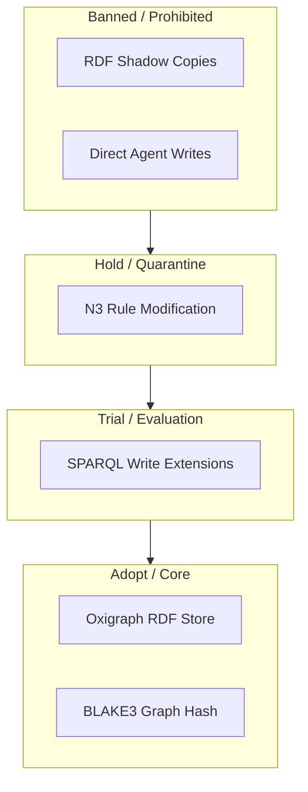
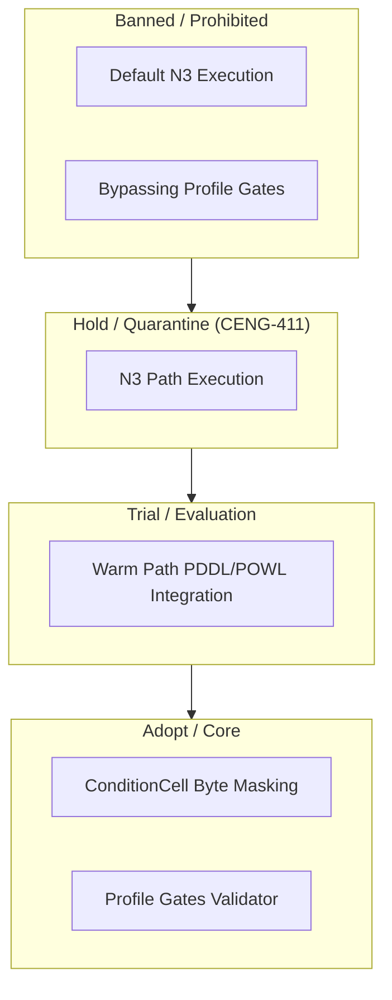
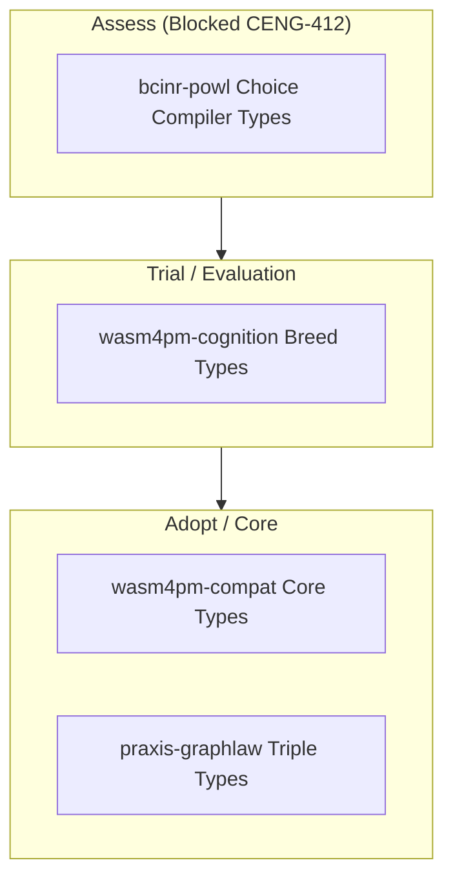
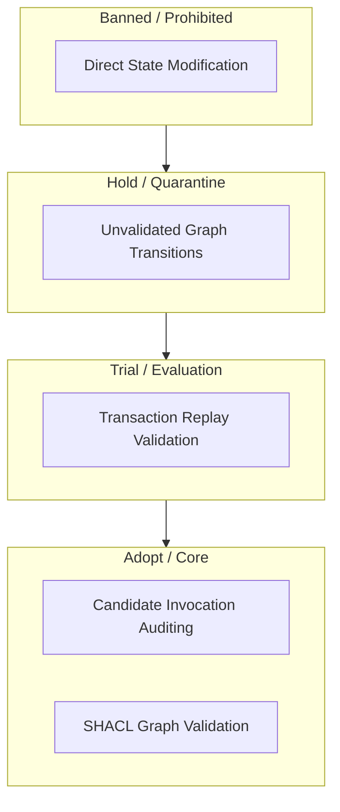
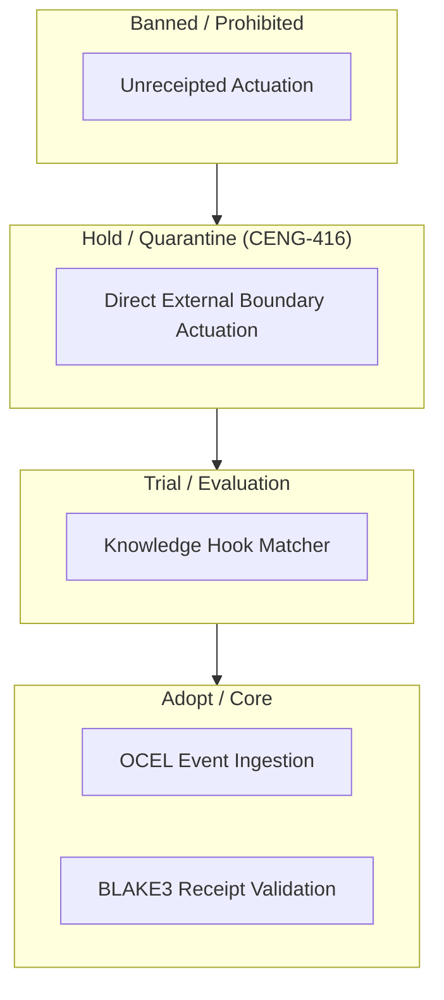
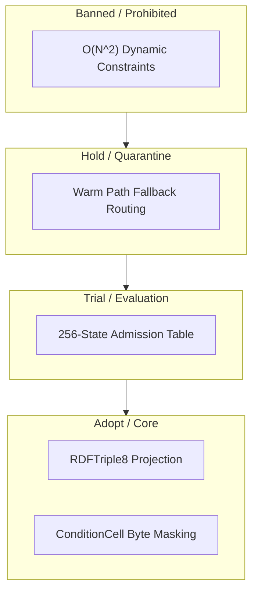
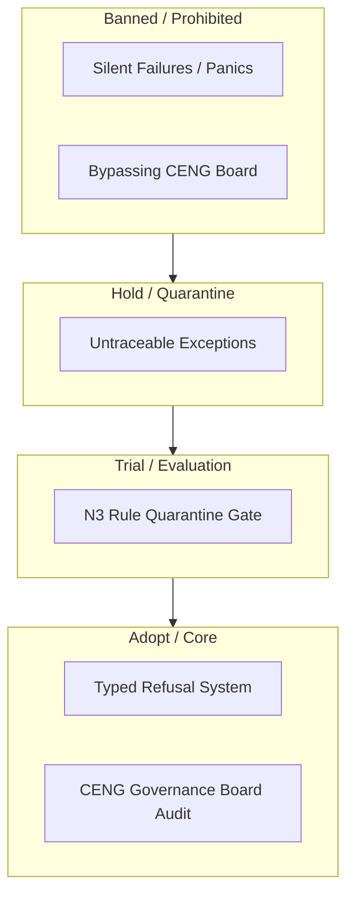
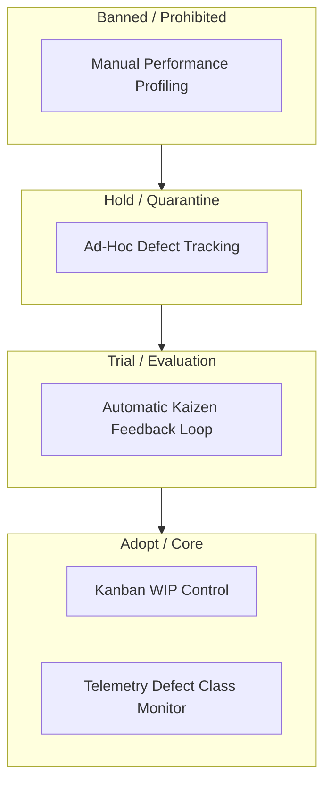

# 23. Radar Diagram Family

This file contains the Radar diagram family for the Chatman Engine, structured across the 8 projection lenses.

Fallback rendering for Mermaid compatibility.

---

## Lens 1: Semantic Authority

Diagram ID: RADAR-L1
Diagram family: Radar
Projection lens: Semantic Authority
Architectural invariant preserved: RDF/Oxigraph is the single semantic source of truth. Shadow copies of RDF data are strictly prohibited.
Information-loss risk if omitted: Accidental adoption of duplicate semantic models in warm/cold execution paths.
TPS visual-control purpose: Groups data access layers by authority maturity.
DfLSS CTQ protected: Zero semantic shadow copies.
CENG ticket or boundary constrained: CENG-410-FINAL (in progress).
Why this diagram is non-redundant: Visualizes semantic technology maturity rings.

---

## Lens 2: Routing Constitution

Diagram ID: RADAR-L2
Diagram family: Radar
Projection lens: Routing Constitution
Architectural invariant preserved: Least-expressive-power routing; hot/warm/cold path isolation. N3 is disabled by default.
Information-loss risk if omitted: Misrouting warm-path rules to the hot-path optimizer.
TPS visual-control purpose: Identifies routing strategies that create waste and latency.
DfLSS CTQ protected: Safe isolation of cold-path N3 execution.
CENG ticket or boundary constrained: CENG-411 (design-only, implementation blocked).
Why this diagram is non-redundant: Maps routing technology adoption rings.

---

## Lens 3: Type Kernel Ownership

Diagram ID: RADAR-L3
Diagram family: Radar
Projection lens: Type Kernel Ownership
Architectural invariant preserved: Canonical type ownership across wasm4pm-compat, wasm4pm-cognition, bcinr-pddl, bcinr-powl, and praxis-graphlaw.
Information-loss risk if omitted: Crate-level dependency loops and duplicate types.
TPS visual-control purpose: Controls type sprawl and redundant definition waste.
DfLSS CTQ protected: Zero duplicate type classes.
CENG ticket or boundary constrained: CENG-412 (design-only, implementation blocked).
Why this diagram is non-redundant: Groups type registry crates by architectural maturity.

---

## Lens 4: Transition Lifecycle

Diagram ID: RADAR-L4
Diagram family: Radar
Projection lens: Transition Lifecycle
Architectural invariant preserved: Transitions must pass sequentially through candidate invocation, validation, planning, execution, receipting, and replay.
Information-loss risk if omitted: Executing state updates without planning verification.
TPS visual-control purpose: Visual control of pipeline checkpoint maturity.
DfLSS CTQ protected: Replayable state transitions under fixed seed.
CENG ticket or boundary constrained: CENG-410-FINAL (in progress).
Why this diagram is non-redundant: Maps lifecycle steps to maturity zones.

---

## Lens 5: Event / Hook / Actuation

Diagram ID: RADAR-L5
Diagram family: Radar
Projection lens: Event / Hook / Actuation
Architectural invariant preserved: Hooks cannot actuate without receipts; no unreceipted actuation.
Information-loss risk if omitted: Side-effect actions escaping cryptographic tracking.
TPS visual-control purpose: Prevents unreceipted execution leaks by isolating actuation boundaries.
DfLSS CTQ protected: Zero unreceipted actuation events.
CENG ticket or boundary constrained: CENG-416A-F (design-only, implementation blocked).
Why this diagram is non-redundant: Maps hook technologies by maturity rings.

---

## Lens 6: Performance / 8-Constraint Hot Path

Diagram ID: RADAR-L6
Diagram family: Radar
Projection lens: Performance / 8-Constraint Hot Path
Architectural invariant preserved: Maximum of 8 constraints checked in parallel via RDFTriple8 and ConditionCell<BITS>.
Information-loss risk if omitted: Warm-path fallback during high-frequency transactional checks.
TPS visual-control purpose: Controls constraints complexity to preserve CPU cycles.
DfLSS CTQ protected: Latency bound of hot path operations.
CENG ticket or boundary constrained: CENG-410-FINAL (in progress).
Why this diagram is non-redundant: Maps optimization strategies by adoption rings.

---

## Lens 7: Refusal / Risk / Governance

Diagram ID: RADAR-L7
Diagram family: Radar
Projection lens: Refusal / Risk / Governance
Architectural invariant preserved: Typed Refusal taxonomy; N3 quarantine rules.
Information-loss risk if omitted: Silent failures or generic error panic loops.
TPS visual-control purpose: Visual control of risk mitigations.
DfLSS CTQ protected: Zero untyped exceptions.
CENG ticket or boundary constrained: CENG-410-FINAL (in progress).
Why this diagram is non-redundant: Maps refusal techniques by adoption zones.

---

## Lens 8: TPS / DfLSS / Continuous Improvement

Diagram ID: RADAR-L8
Diagram family: Radar
Projection lens: TPS / DfLSS / Continuous Improvement
Architectural invariant preserved: Visual control gauges, waste elimination, CTQ auditing.
Information-loss risk if omitted: Stagnation in performance improvements or lack of visual feedback.
TPS visual-control purpose: Tracks the adoption of Kaizen optimization mechanisms.
DfLSS CTQ protected: Throughput and defect-free execution rate.
CENG ticket or boundary constrained: CENG-410-FINAL (in progress).
Why this diagram is non-redundant: Maps continuous improvement methods by adoption rings.

