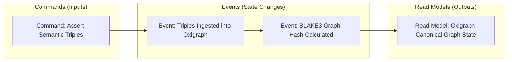
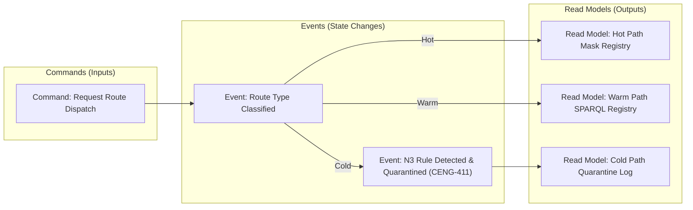
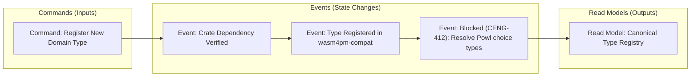
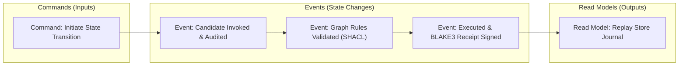
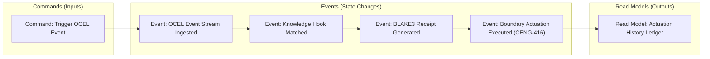
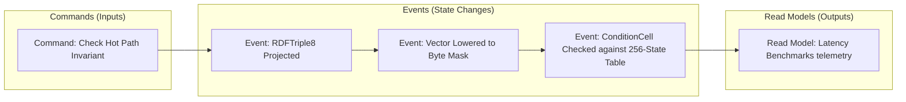
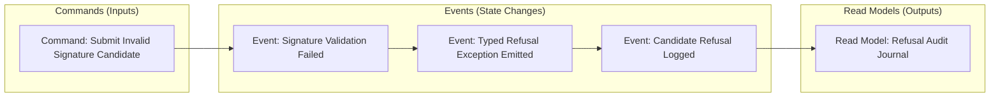
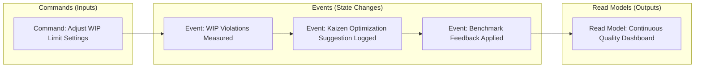

# 24. Event Modeling Diagram Family

This file contains the Event Modeling diagram family for the Chatman Engine, structured across the 8 projection lenses.

Fallback rendering for Mermaid compatibility.

---

## Lens 1: Semantic Authority

Diagram ID: EVENT_MODELING-L1
Diagram family: Event Modeling
Projection lens: Semantic Authority
Architectural invariant preserved: RDF/Oxigraph is the single semantic source of truth. Shadow copies of RDF data are strictly prohibited.
Information-loss risk if omitted: Mismatch between Command assertion, ingested Event, and the resulting query state.
TPS visual-control purpose: Ensures the event-to-read model flow has zero shadow copy buffers.
DfLSS CTQ protected: Zero semantic shadow copies.
CENG ticket or boundary constrained: CENG-410-FINAL (in progress).
Why this diagram is non-redundant: Visualizes command-event-read model mapping for semantic writes.

---

## Lens 2: Routing Constitution

Diagram ID: EVENT_MODELING-L2
Diagram family: Event Modeling
Projection lens: Routing Constitution
Architectural invariant preserved: Least-expressive-power routing; hot/warm/cold path isolation. N3 is disabled by default.
Information-loss risk if omitted: Warm-path execution events spilling over into hot-path execution environments.
TPS visual-control purpose: Isolates event streams by path type to prevent routing bottlenecks.
DfLSS CTQ protected: Safe isolation of cold-path N3 execution.
CENG ticket or boundary constrained: CENG-411 (design-only, implementation blocked).
Why this diagram is non-redundant: Details routing events and read models.

---

## Lens 3: Type Kernel Ownership

Diagram ID: EVENT_MODELING-L3
Diagram family: Event Modeling
Projection lens: Type Kernel Ownership
Architectural invariant preserved: Canonical type ownership across wasm4pm-compat, wasm4pm-cognition, bcinr-pddl, bcinr-powl, and praxis-graphlaw.
Information-loss risk if omitted: Redundant type register events causing state corruption during replay.
TPS visual-control purpose: Restricts type registration commands to canonical system boundaries.
DfLSS CTQ protected: Zero duplicate type classes.
CENG ticket or boundary constrained: CENG-412 (design-only, implementation blocked).
Why this diagram is non-redundant: Models the registration and verification timeline of type models.

---

## Lens 4: Transition Lifecycle

Diagram ID: EVENT_MODELING-L4
Diagram family: Event Modeling
Projection lens: Transition Lifecycle
Architectural invariant preserved: Every transition must pass through candidate invocation, validation, planning, execution, receipting, and replay.
Information-loss risk if omitted: Lifecycle event sequence bypasses validation before receipting.
TPS visual-control purpose: Restricts WIP in transition phases by mapping events sequentially.
DfLSS CTQ protected: Replayable state transitions under fixed seed.
CENG ticket or boundary constrained: CENG-410-FINAL (in progress).
Why this diagram is non-redundant: Details lifecycle command-to-event sequence.

---

## Lens 5: Event / Hook / Actuation

Diagram ID: EVENT_MODELING-L5
Diagram family: Event Modeling
Projection lens: Event / Hook / Actuation
Architectural invariant preserved: Hooks cannot actuate without receipts; no unreceipted actuation.
Information-loss risk if omitted: Ingested events triggering side-effects without receipt logs.
TPS visual-control purpose: Error-proofs hook actuation via interlocked receipt verification.
DfLSS CTQ protected: Zero unreceipted actuation events.
CENG ticket or boundary constrained: CENG-416A-F (design-only, implementation blocked).
Why this diagram is non-redundant: Visualizes Hook-actuation events and read models.

---

## Lens 6: Performance / 8-Constraint Hot Path

Diagram ID: EVENT_MODELING-L6
Diagram family: Event Modeling
Projection lens: Performance / 8-Constraint Hot Path
Architectural invariant preserved: RDFTriple8, ConditionCell<BITS> byte masks, and 256-state tables.
Information-loss risk if omitted: High hot-path constraint counts leading to latency spikes.
TPS visual-control purpose: Tracks the lowering events of hot-path constraints to maintain speed.
DfLSS CTQ protected: Latency bound of hot path operations.
CENG ticket or boundary constrained: CENG-410-FINAL (in progress).
Why this diagram is non-redundant: Models constraint byte mask lowering timeline events.

---

## Lens 7: Refusal / Risk / Governance

Diagram ID: EVENT_MODELING-L7
Diagram family: Event Modeling
Projection lens: Refusal / Risk / Governance
Architectural invariant preserved: Typed Refusal hierarchy; N3 quarantine rules.
Information-loss risk if omitted: Silent failures during transaction execution.
TPS visual-control purpose: Separates normal events from exception refusal events.
DfLSS CTQ protected: Zero untyped exceptions or panics.
CENG ticket or boundary constrained: CENG-410-FINAL (in progress).
Why this diagram is non-redundant: Visualizes refusal events and audit log models.

---

## Lens 8: TPS / DfLSS / Continuous Improvement

Diagram ID: EVENT_MODELING-L8
Diagram family: Event Modeling
Projection lens: TPS / DfLSS / Continuous Improvement
Architectural invariant preserved: Continuous Kaizen optimization loops, visual gauges, waste reduction.
Information-loss risk if omitted: Untracked process bottleneck events and drift.
TPS visual-control purpose: Shows telemetry events mapped to continuous improvement read models.
DfLSS CTQ protected: Throughput and defect-free execution rate.
CENG ticket or boundary constrained: CENG-410-FINAL (in progress).
Why this diagram is non-redundant: Maps continuous improvement loops in event modeling format.

