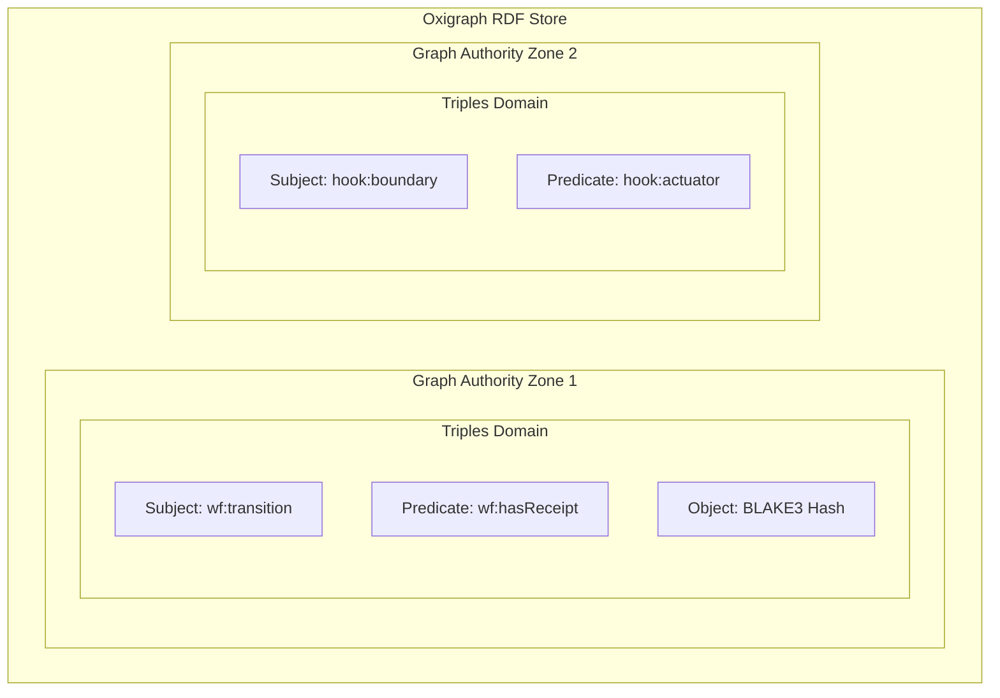
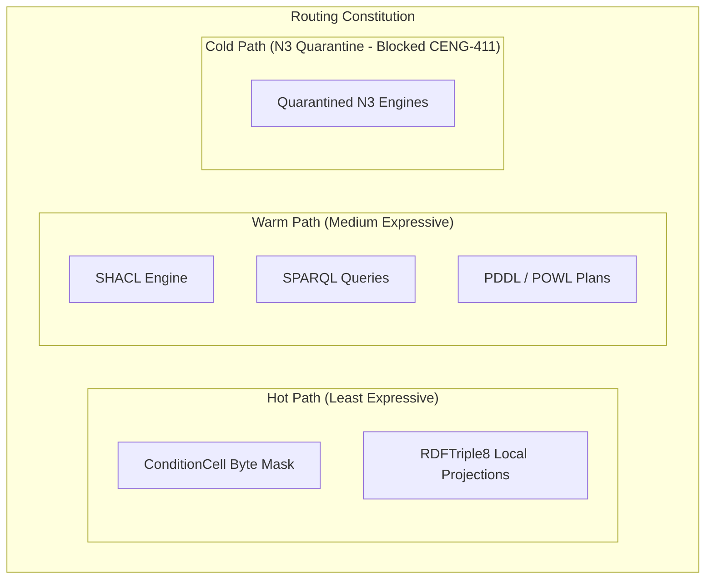
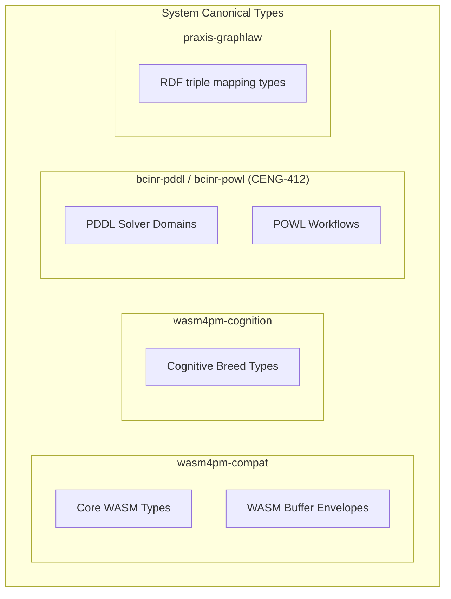
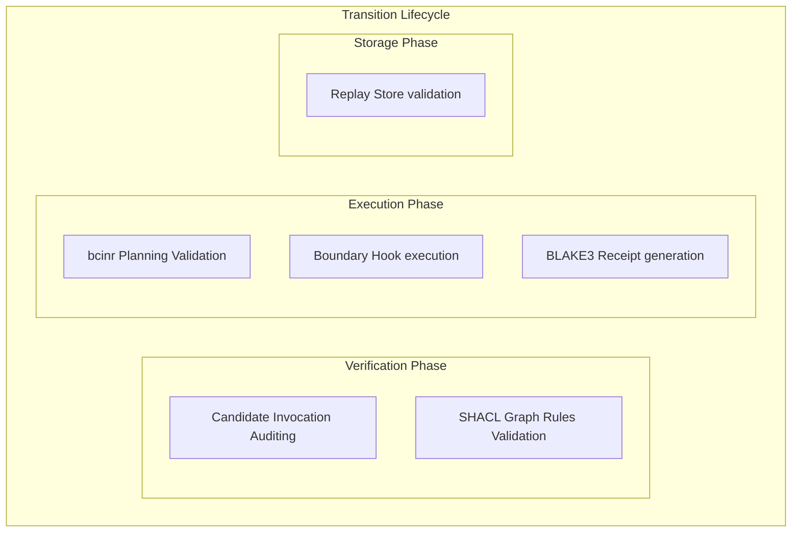
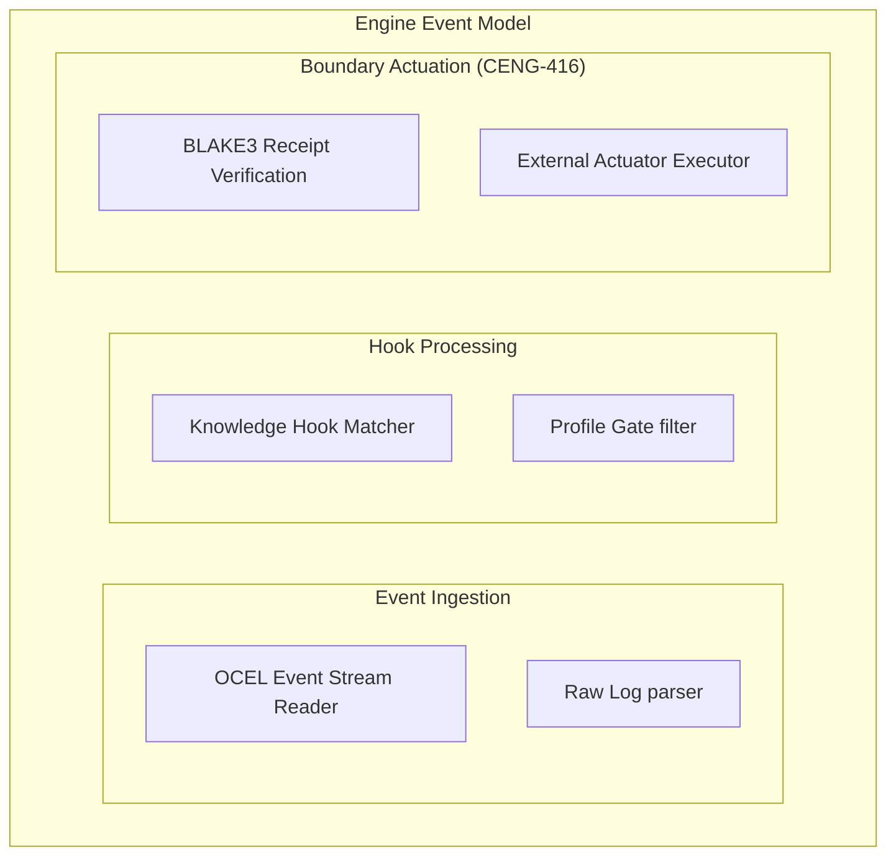
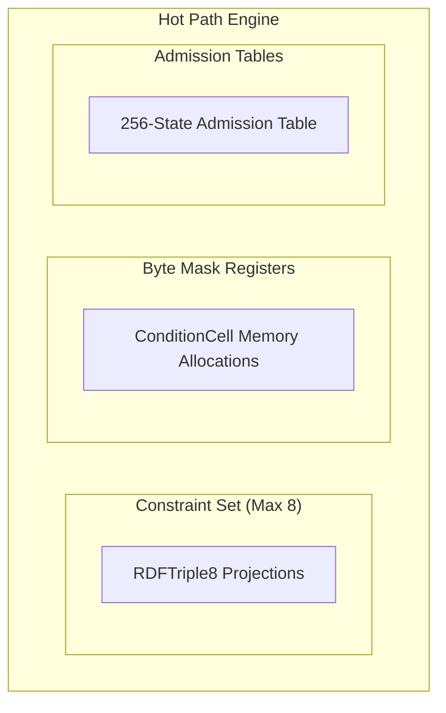
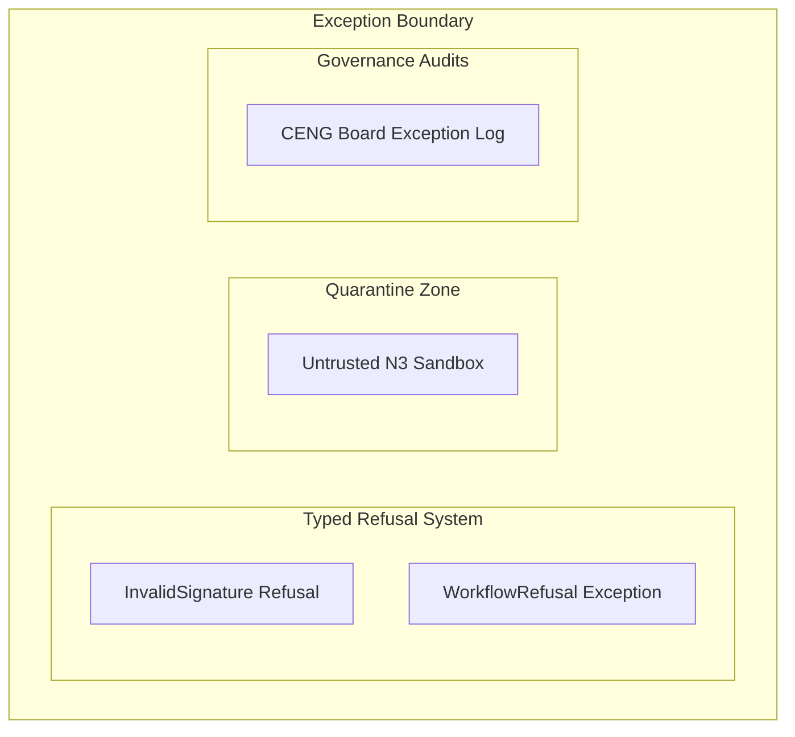
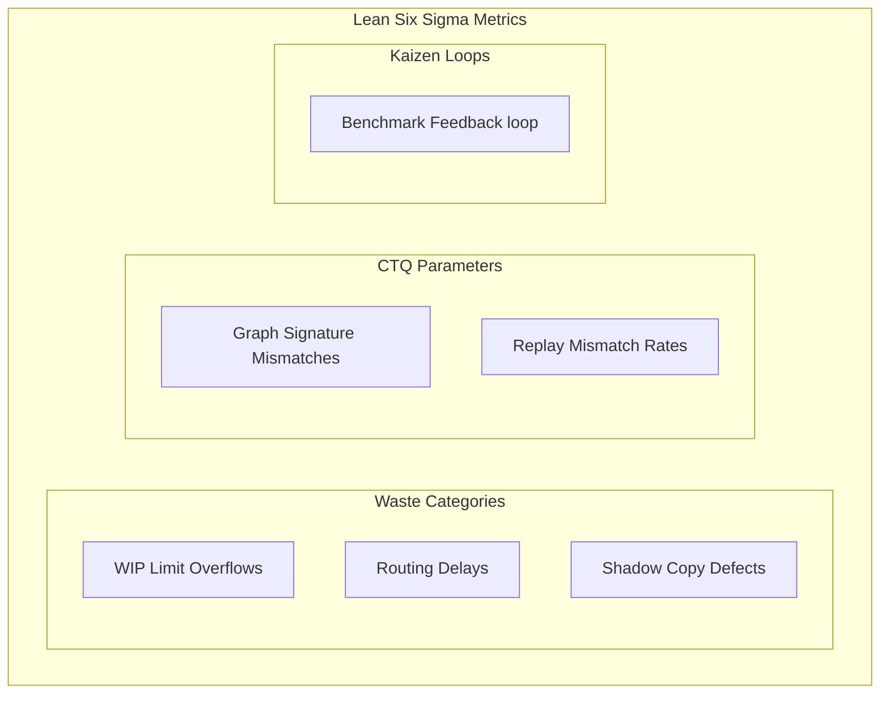

# 25. Treemap Diagram Family

This file contains the Treemap diagram family for the Chatman Engine, structured across the 8 projection lenses.

Fallback rendering for Mermaid compatibility.

---

## Lens 1: Semantic Authority

Diagram ID: TREEMAP-L1
Diagram family: Treemap
Projection lens: Semantic Authority
Architectural invariant preserved: RDF/Oxigraph is the single semantic source of truth. Shadow copies of RDF data are strictly prohibited.
Information-loss risk if omitted: Ambiguity about the hierarchy of semantic data structures inside Oxigraph.
TPS visual-control purpose: Eliminates waste by structuring semantic scopes.
DfLSS CTQ protected: Zero semantic shadow copies.
CENG ticket or boundary constrained: CENG-410-FINAL (in progress).
Why this diagram is non-redundant: Details RDF data hierarchies inside the database authority domain.

---

## Lens 2: Routing Constitution

Diagram ID: TREEMAP-L2
Diagram family: Treemap
Projection lens: Routing Constitution
Architectural invariant preserved: Least-expressive-power routing; hot/warm/cold path isolation. N3 is disabled by default.
Information-loss risk if omitted: Incorrect nesting of path constraints within routing boundaries.
TPS visual-control purpose: Isolates the warm, hot, and cold paths visually to detect complexity drift.
DfLSS CTQ protected: Safe isolation of cold-path N3 execution.
CENG ticket or boundary constrained: CENG-411 (design-only, implementation blocked).
Why this diagram is non-redundant: Visualizes nested routing paths and quarantine regions.

---

## Lens 3: Type Kernel Ownership

Diagram ID: TREEMAP-L3
Diagram family: Treemap
Projection lens: Type Kernel Ownership
Architectural invariant preserved: Canonical type ownership across wasm4pm-compat, wasm4pm-cognition, bcinr-pddl, bcinr-powl, and praxis-graphlaw.
Information-loss risk if omitted: Duplicate types created inside wrong crates.
TPS visual-control purpose: Groups types by crate boundaries to prevent redundant declarations.
DfLSS CTQ protected: Zero duplicate type classes.
CENG ticket or boundary constrained: CENG-412 (design-only, implementation blocked).
Why this diagram is non-redundant: Details type module namespaces and boundaries.

---

## Lens 4: Transition Lifecycle

Diagram ID: TREEMAP-L4
Diagram family: Treemap
Projection lens: Transition Lifecycle
Architectural invariant preserved: Every transition must pass through candidate invocation, validation, planning, execution, receipting, and replay.
Information-loss risk if omitted: Skipping lifecycle phases or mixing execution states.
TPS visual-control purpose: Visually tracks checkpoint allocation to maintain flow efficiency.
DfLSS CTQ protected: Replayable state transitions under fixed seed.
CENG ticket or boundary constrained: CENG-410-FINAL (in progress).
Why this diagram is non-redundant: Details nesting of lifecycle checkpoints.

---

## Lens 5: Event / Hook / Actuation

Diagram ID: TREEMAP-L5
Diagram family: Treemap
Projection lens: Event / Hook / Actuation
Architectural invariant preserved: Hooks cannot actuate without receipts; no unreceipted actuation.
Information-loss risk if omitted: Shadow actuation processes escaping event loops.
TPS visual-control purpose: Eliminates unreceipted actuation waste using strict boundary nested scopes.
DfLSS CTQ protected: Zero unreceipted actuation events.
CENG ticket or boundary constrained: CENG-416A-F (design-only, implementation blocked).
Why this diagram is non-redundant: Details Hook execution hierarchies.

---

## Lens 6: Performance / 8-Constraint Hot Path

Diagram ID: TREEMAP-L6
Diagram family: Treemap
Projection lens: Performance / 8-Constraint Hot Path
Architectural invariant preserved: RDFTriple8, ConditionCell<BITS> byte masks, and 256-state tables.
Information-loss risk if omitted: Overflow of hot-path constraint bounds.
TPS visual-control purpose: Visual control of constraint limits.
DfLSS CTQ protected: Latency bound of hot path operations.
CENG ticket or boundary constrained: CENG-410-FINAL (in progress).
Why this diagram is non-redundant: Maps performance constraint domains and mask boundaries.

---

## Lens 7: Refusal / Risk / Governance

Diagram ID: TREEMAP-L7
Diagram family: Treemap
Projection lens: Refusal / Risk / Governance
Architectural invariant preserved: Typed Refusal hierarchy; N3 quarantine rules.
Information-loss risk if omitted: Lack of containment classification for exceptions.
TPS visual-control purpose: Isolates exceptions by category to prevent panic propagation.
DfLSS CTQ protected: Zero untyped exceptions or panics.
CENG ticket or boundary constrained: CENG-410-FINAL (in progress).
Why this diagram is non-redundant: Details risk and refusal containment hierarchies.

---

## Lens 8: TPS / DfLSS / Continuous Improvement

Diagram ID: TREEMAP-L8
Diagram family: Treemap
Projection lens: TPS / DfLSS / Continuous Improvement
Architectural invariant preserved: Continuous Kaizen optimization loops, visual gauges, waste reduction.
Information-loss risk if omitted: Blind spots in Lean quality matrices and metrics.
TPS visual-control purpose: Groups Six Sigma categories to manage process improvement.
DfLSS CTQ protected: Throughput and defect-free execution rate.
CENG ticket or boundary constrained: CENG-410-FINAL (in progress).
Why this diagram is non-redundant: Details continuous improvement containment classes.

