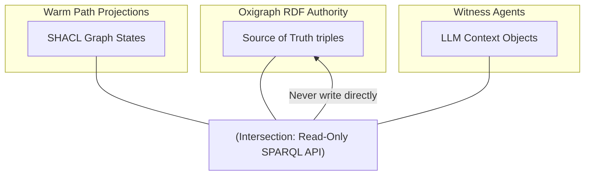
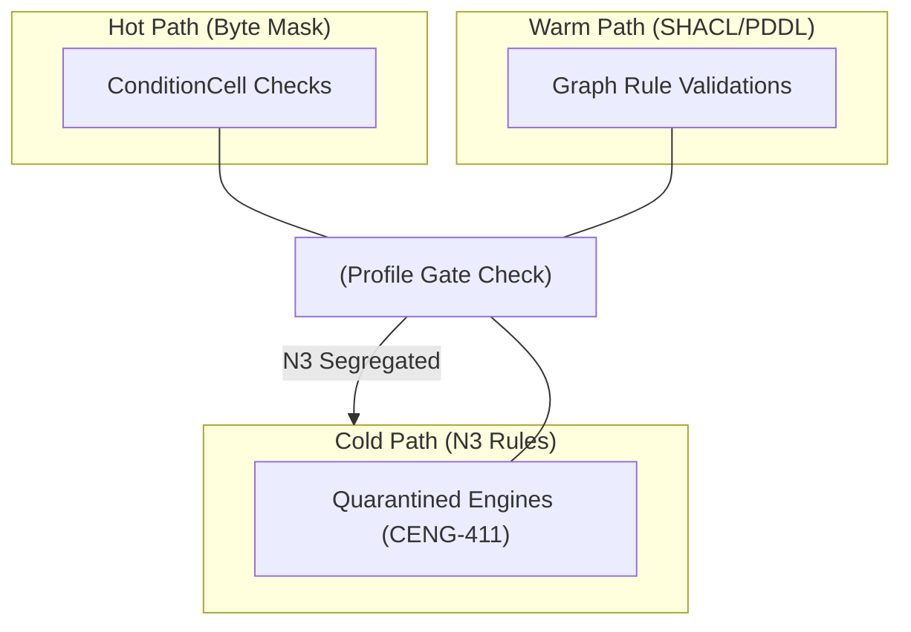
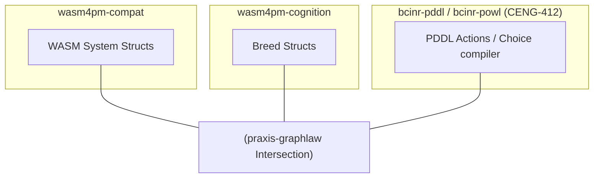
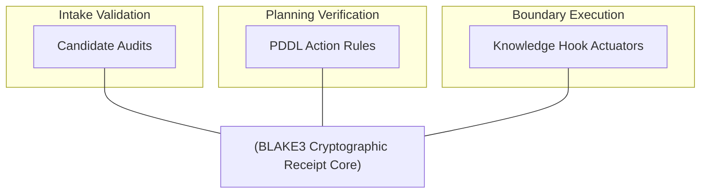
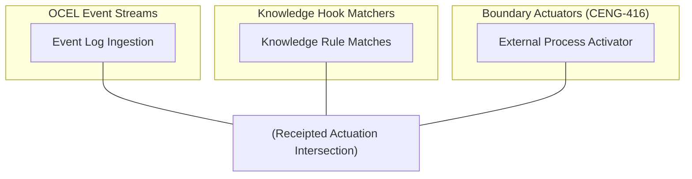
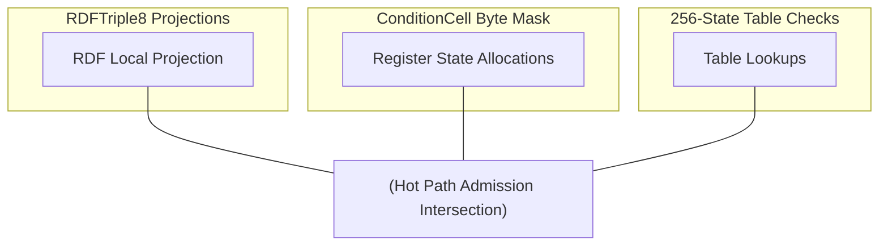
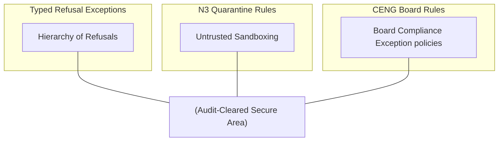
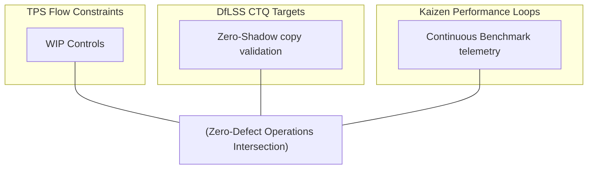

# 26. Venn Diagram Family

This file contains the Venn diagram family for the Chatman Engine, structured across the 8 projection lenses.

Fallback rendering for Mermaid compatibility.

---

## Lens 1: Semantic Authority

Diagram ID: VENN-L1
Diagram family: Venn
Projection lens: Semantic Authority
Architectural invariant preserved: RDF/Oxigraph is the single semantic source of truth. Shadow copies of RDF data are strictly prohibited.
Information-loss risk if omitted: Overlapping data models from different system layers resulting in duplicate conflicting databases.
TPS visual-control purpose: Eliminates information duplicate waste at system intersections.
DfLSS CTQ protected: Zero semantic shadow copies.
CENG ticket or boundary constrained: CENG-410-FINAL (in progress).
Why this diagram is non-redundant: Visualizes semantic overlaps and boundaries across database modules.

---

## Lens 2: Routing Constitution

Diagram ID: VENN-L2
Diagram family: Venn
Projection lens: Routing Constitution
Architectural invariant preserved: Least-expressive-power routing; hot/warm/cold path isolation. N3 is disabled by default.
Information-loss risk if omitted: Route overlap letting slow-path rules pollute fast-path byte masks.
TPS visual-control purpose: Ensures routing rules do not overlap in invalid path zones.
DfLSS CTQ protected: Safe isolation of cold-path N3 execution.
CENG ticket or boundary constrained: CENG-411 (design-only, implementation blocked).
Why this diagram is non-redundant: Details path execution boundaries.

---

## Lens 3: Type Kernel Ownership

Diagram ID: VENN-L3
Diagram family: Venn
Projection lens: Type Kernel Ownership
Architectural invariant preserved: Canonical type ownership across wasm4pm-compat, wasm4pm-cognition, bcinr-pddl, bcinr-powl, and praxis-graphlaw.
Information-loss risk if omitted: Overlapping type namespaces causing binary serialization conflicts.
TPS visual-control purpose: Identifies shared type boundaries to eliminate duplicate coding.
DfLSS CTQ protected: Zero duplicate type classes.
CENG ticket or boundary constrained: CENG-412 (design-only, implementation blocked).
Why this diagram is non-redundant: Visualizes overlapping type domain responsibilities.

---

## Lens 4: Transition Lifecycle

Diagram ID: VENN-L4
Diagram family: Venn
Projection lens: Transition Lifecycle
Architectural invariant preserved: Every transition must pass through candidate invocation, validation, planning, execution, receipting, and replay.
Information-loss risk if omitted: Executing state changes without complete validation overlays.
TPS visual-control purpose: Ensures audit overlap covering all lifecycle phases.
DfLSS CTQ protected: Replayable state transitions under fixed seed.
CENG ticket or boundary constrained: CENG-410-FINAL (in progress).
Why this diagram is non-redundant: Focuses on lifecycle phase intersections.

---

## Lens 5: Event / Hook / Actuation

Diagram ID: VENN-L5
Diagram family: Venn
Projection lens: Event / Hook / Actuation
Architectural invariant preserved: Hooks cannot actuate without receipts; no unreceipted actuation.
Information-loss risk if omitted: Mismatch in Hook execution overlaps leading to unverified actuation actions.
TPS visual-control purpose: Eliminates unreceipted action leaks.
DfLSS CTQ protected: Zero unreceipted actuation events.
CENG ticket or boundary constrained: CENG-416A-F (design-only, implementation blocked).
Why this diagram is non-redundant: Highlights the receipt intersection in hook-based systems.

---

## Lens 6: Performance / 8-Constraint Hot Path

Diagram ID: VENN-L6
Diagram family: Venn
Projection lens: Performance / 8-Constraint Hot Path
Architectural invariant preserved: RDFTriple8, ConditionCell<BITS> byte masks, and 256-state tables.
Information-loss risk if omitted: Inability to execute parallel checks on constraint boundaries.
TPS visual-control purpose: Ensures hot-path criteria matches execution bounds.
DfLSS CTQ protected: Latency bound of hot path operations.
CENG ticket or boundary constrained: CENG-410-FINAL (in progress).
Why this diagram is non-redundant: Focuses on constraint optimization loops.

---

## Lens 7: Refusal / Risk / Governance

Diagram ID: VENN-L7
Diagram family: Venn
Projection lens: Refusal / Risk / Governance
Architectural invariant preserved: Typed Refusal hierarchy; N3 quarantine rules.
Information-loss risk if omitted: Silent failures bypassing governance and board verification overlays.
TPS visual-control purpose: Clearly flags quarantine intersections to protect core safety.
DfLSS CTQ protected: Zero untyped exceptions or panics.
CENG ticket or boundary constrained: CENG-410-FINAL (in progress).
Why this diagram is non-redundant: Visualizes governance and exception handling boundary overlaps.

---

## Lens 8: TPS / DfLSS / Continuous Improvement

Diagram ID: VENN-L8
Diagram family: Venn
Projection lens: TPS / DfLSS / Continuous Improvement
Architectural invariant preserved: Continuous Kaizen optimization loops, visual gauges, waste reduction.
Information-loss risk if omitted: Isolation of Lean quality targets from runtime feedback loops.
TPS visual-control purpose: Visual control of continuous quality intersection boundaries.
DfLSS CTQ protected: Throughput and defect-free execution rate.
CENG ticket or boundary constrained: CENG-410-FINAL (in progress).
Why this diagram is non-redundant: Shows intersections of Six Sigma domains.

