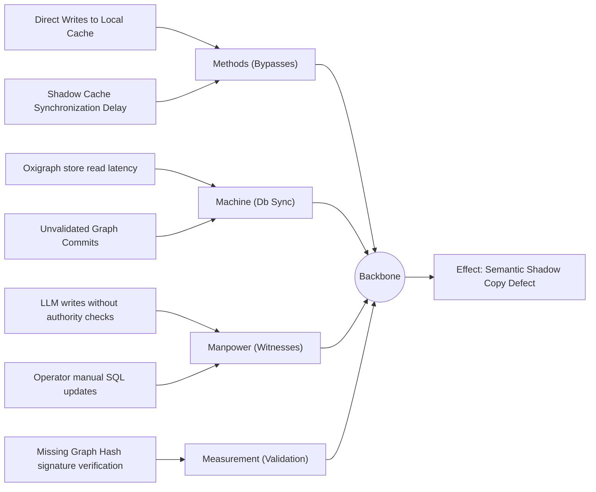
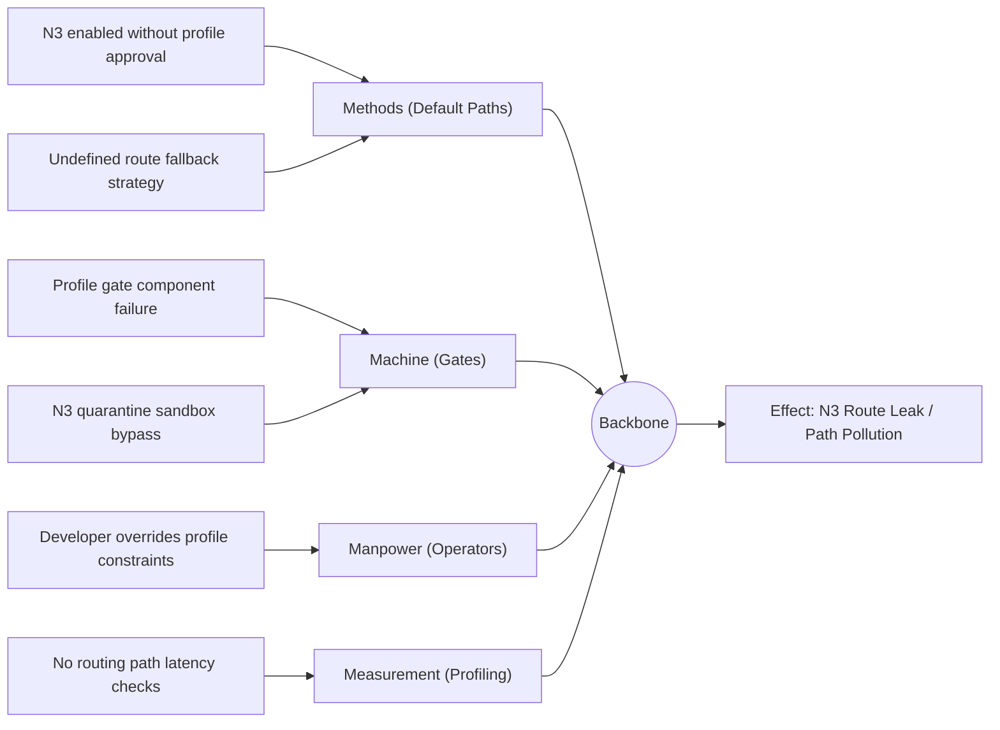
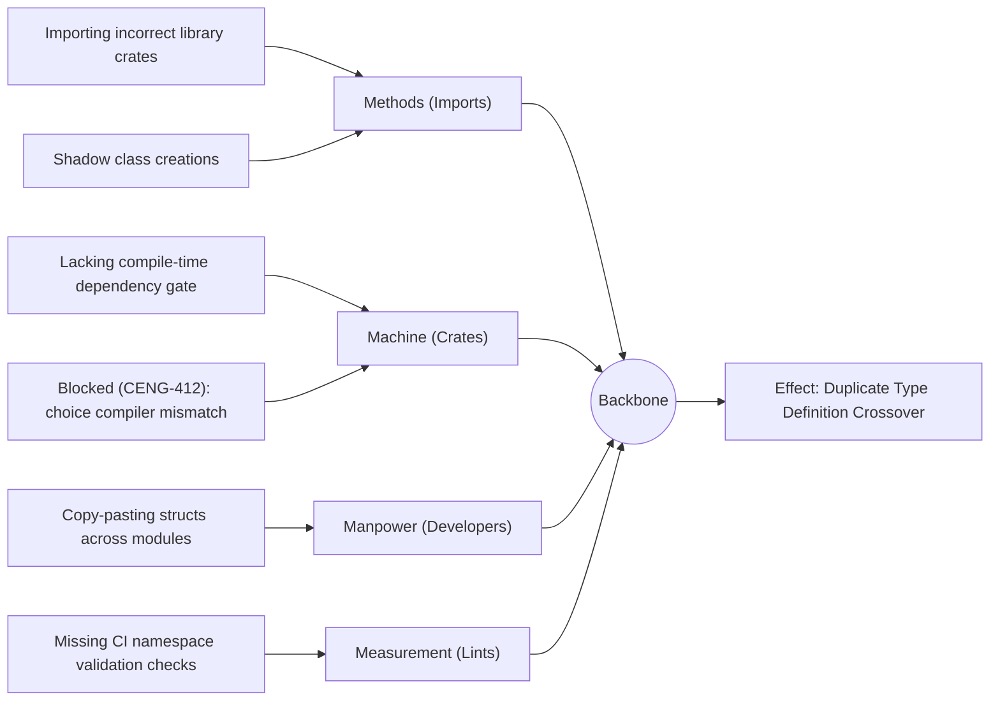
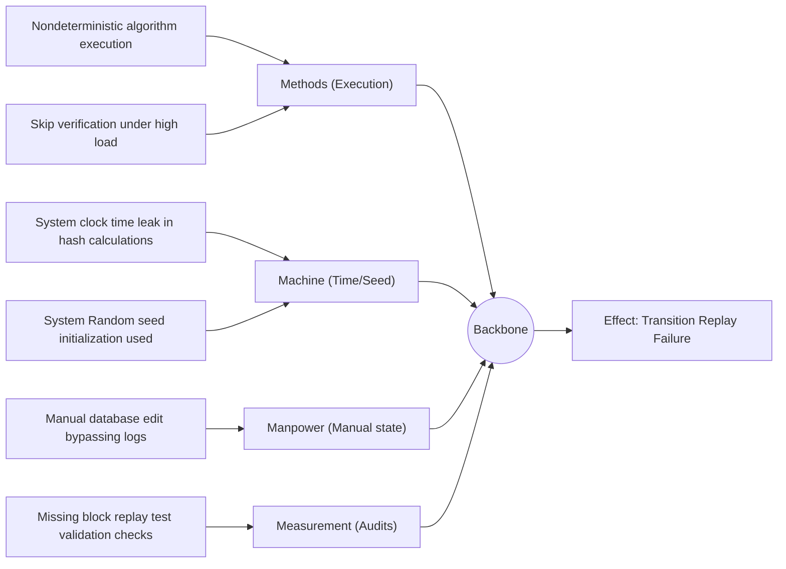
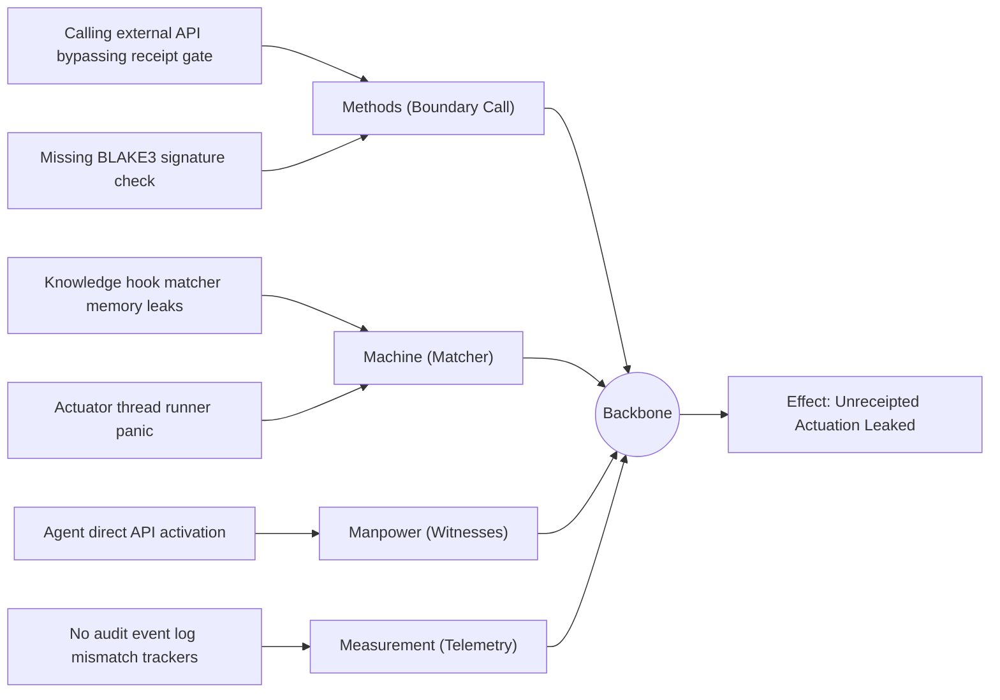
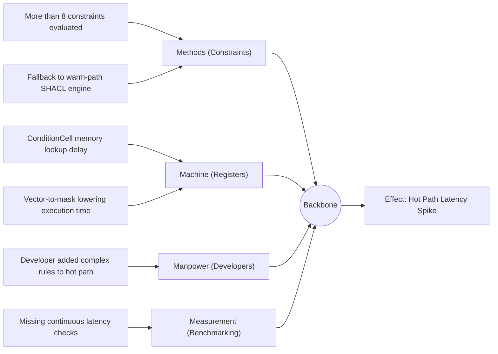
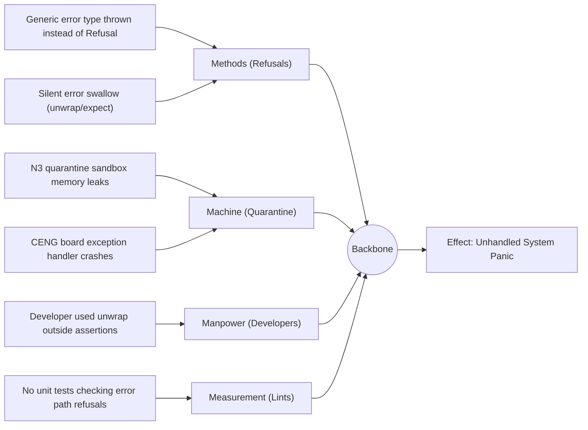
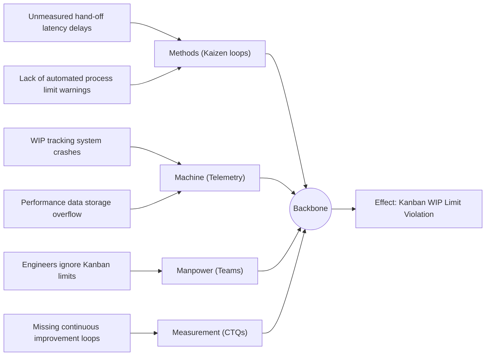

# 27. Ishikawa Diagram Family

This file contains the Ishikawa diagram family for the Chatman Engine, structured across the 8 projection lenses.

Fallback rendering for Mermaid compatibility.

---

## Lens 1: Semantic Authority

Diagram ID: ISHIKAWA-L1
Diagram family: Ishikawa
Projection lens: Semantic Authority
Architectural invariant preserved: RDF/Oxigraph is the single semantic source of truth. Shadow copies of RDF data are strictly prohibited.
Information-loss risk if omitted: Inability to determine the root cause of semantic database drift or shadow copies.
TPS visual-control purpose: Identifies root causes of information waste in the semantic layers.
DfLSS CTQ protected: Zero semantic shadow copies.
CENG ticket or boundary constrained: CENG-410-FINAL (in progress).
Why this diagram is non-redundant: Visualizes root causes of semantic shadow copies.

---

## Lens 2: Routing Constitution

Diagram ID: ISHIKAWA-L2
Diagram family: Ishikawa
Projection lens: Routing Constitution
Architectural invariant preserved: Least-expressive-power routing; hot/warm/cold path isolation. N3 is disabled by default.
Information-loss risk if omitted: Failure to pinpoint root causes of route leakage between hot/warm/cold paths.
TPS visual-control purpose: Isolates causes of routing waste and gate bypass.
DfLSS CTQ protected: Safe isolation of cold-path N3 execution.
CENG ticket or boundary constrained: CENG-411 (design-only, implementation blocked).
Why this diagram is non-redundant: Maps root causes of routing errors.

---

## Lens 3: Type Kernel Ownership

Diagram ID: ISHIKAWA-L3
Diagram family: Ishikawa
Projection lens: Type Kernel Ownership
Architectural invariant preserved: Canonical type ownership across wasm4pm-compat, wasm4pm-cognition, bcinr-pddl, bcinr-powl, and praxis-graphlaw.
Information-loss risk if omitted: Inability to trace root causes of duplicate type definition crossovers.
TPS visual-control purpose: Root cause tracking for type sprawl and serialization errors.
DfLSS CTQ protected: Zero duplicate type classes.
CENG ticket or boundary constrained: CENG-412 (design-only, implementation blocked).
Why this diagram is non-redundant: Details root causes of type definition conflicts.

---

## Lens 4: Transition Lifecycle

Diagram ID: ISHIKAWA-L4
Diagram family: Ishikawa
Projection lens: Transition Lifecycle
Architectural invariant preserved: Every transition must pass through candidate invocation, validation, planning, execution, receipting, and replay.
Information-loss risk if omitted: Failure to identify why replay state drift happens.
TPS visual-control purpose: Isolates causes of queue delays and validation bypass.
DfLSS CTQ protected: Replayable state transitions under fixed seed.
CENG ticket or boundary constrained: CENG-410-FINAL (in progress).
Why this diagram is non-redundant: Root cause analysis of state transition replay failure.

---

## Lens 5: Event / Hook / Actuation

Diagram ID: ISHIKAWA-L5
Diagram family: Ishikawa
Projection lens: Event / Hook / Actuation
Architectural invariant preserved: Hooks cannot actuate without receipts; no unreceipted actuation.
Information-loss risk if omitted: Uncontrolled actuation without trace tracking root causes.
TPS visual-control purpose: Locates reasons for side-effect failures.
DfLSS CTQ protected: Zero unreceipted actuation events.
CENG ticket or boundary constrained: CENG-416A-F (design-only, implementation blocked).
Why this diagram is non-redundant: Diagnoses unreceipted boundary execution root causes.

---

## Lens 6: Performance / 8-Constraint Hot Path

Diagram ID: ISHIKAWA-L6
Diagram family: Ishikawa
Projection lens: Performance / 8-Constraint Hot Path
Architectural invariant preserved: RDFTriple8, ConditionCell<BITS> byte masks, and 256-state tables.
Information-loss risk if omitted: Slowness in transaction checks due to unoptimized constraint bottlenecks.
TPS visual-control purpose: Resolves causes of latency waste in hot-path checking.
DfLSS CTQ protected: Latency bound of hot path operations.
CENG ticket or boundary constrained: CENG-410-FINAL (in progress).
Why this diagram is non-redundant: Diagnoses latency overflows on the hot-path checker.

---

## Lens 7: Refusal / Risk / Governance

Diagram ID: ISHIKAWA-L7
Diagram family: Ishikawa
Projection lens: Refusal / Risk / Governance
Architectural invariant preserved: Typed Refusal hierarchy; N3 quarantine rules.
Information-loss risk if omitted: Silent failures or crashes from unhandled panic root causes.
TPS visual-control purpose: Diagnoses causes of exceptions escaping visual alarms.
DfLSS CTQ protected: Zero untyped exceptions or panics.
CENG ticket or boundary constrained: CENG-410-FINAL (in progress).
Why this diagram is non-redundant: Visualizes root causes of untyped panic statements.

---

## Lens 8: TPS / DfLSS / Continuous Improvement

Diagram ID: ISHIKAWA-L8
Diagram family: Ishikawa
Projection lens: TPS / DfLSS / Continuous Improvement
Architectural invariant preserved: Continuous Kaizen optimization loops, visual gauges, waste reduction.
Information-loss risk if omitted: Chronic process bottlenecks causing continuous quality targets to fail.
TPS visual-control purpose: Resolves root causes of process inefficiencies.
DfLSS CTQ protected: Throughput and defect-free execution rate.
CENG ticket or boundary constrained: CENG-410-FINAL (in progress).
Why this diagram is non-redundant: Diagnoses root causes of Kanban WIP limit violations.

