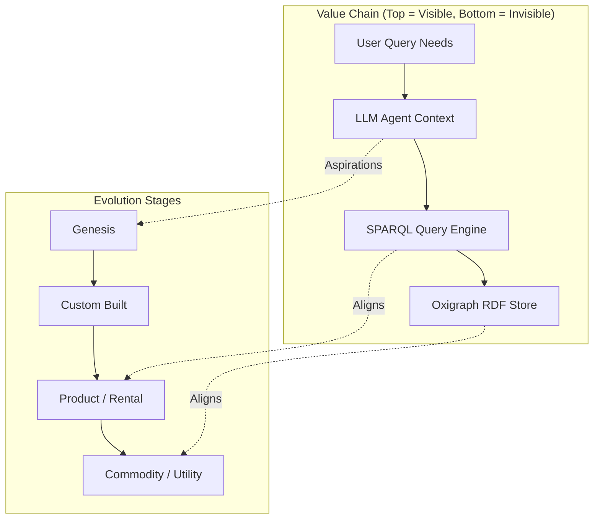
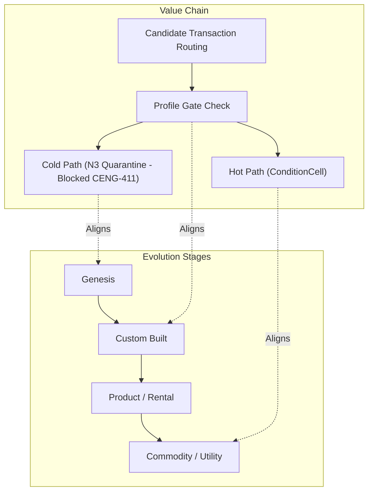
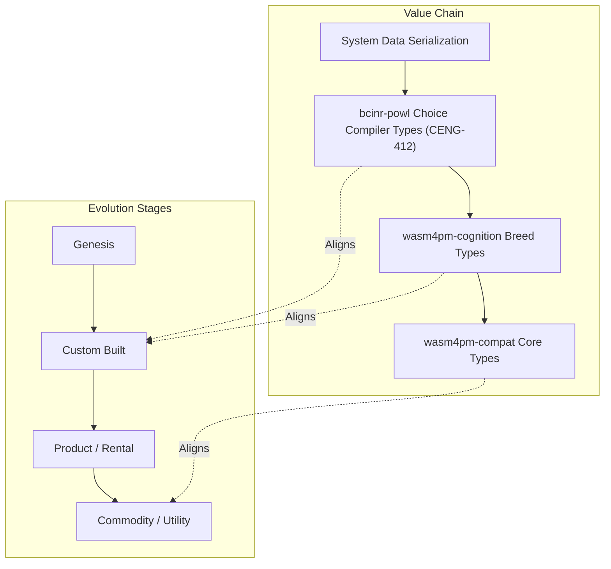
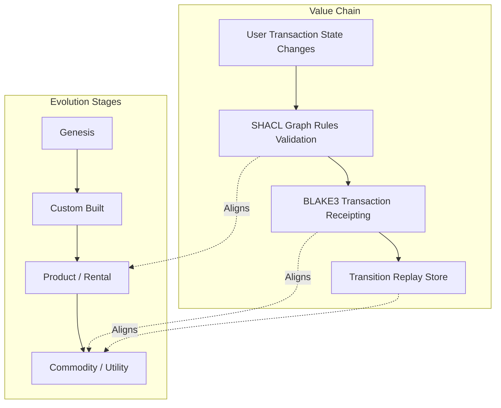
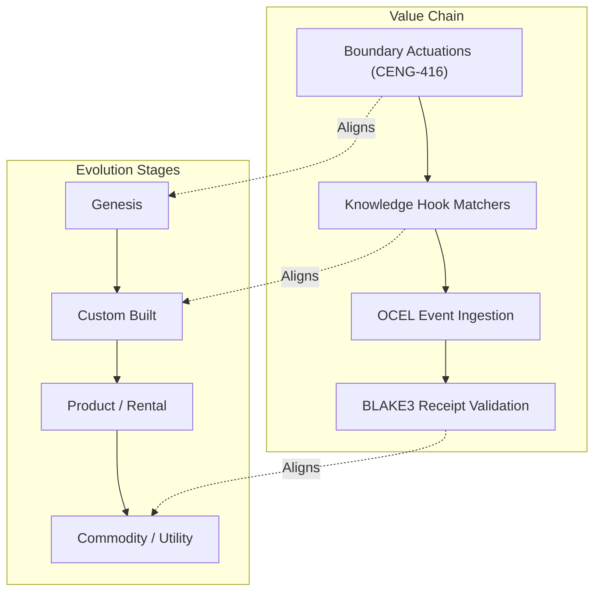
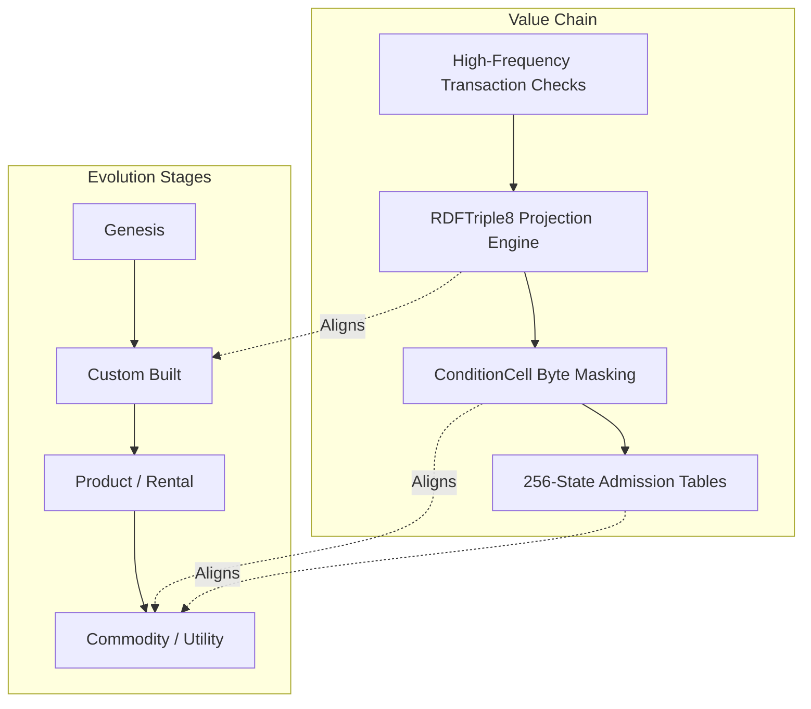
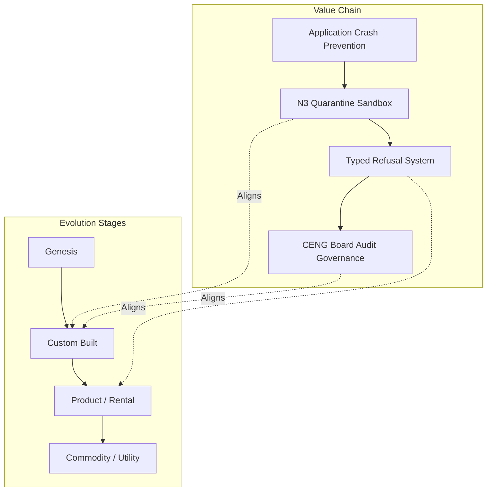
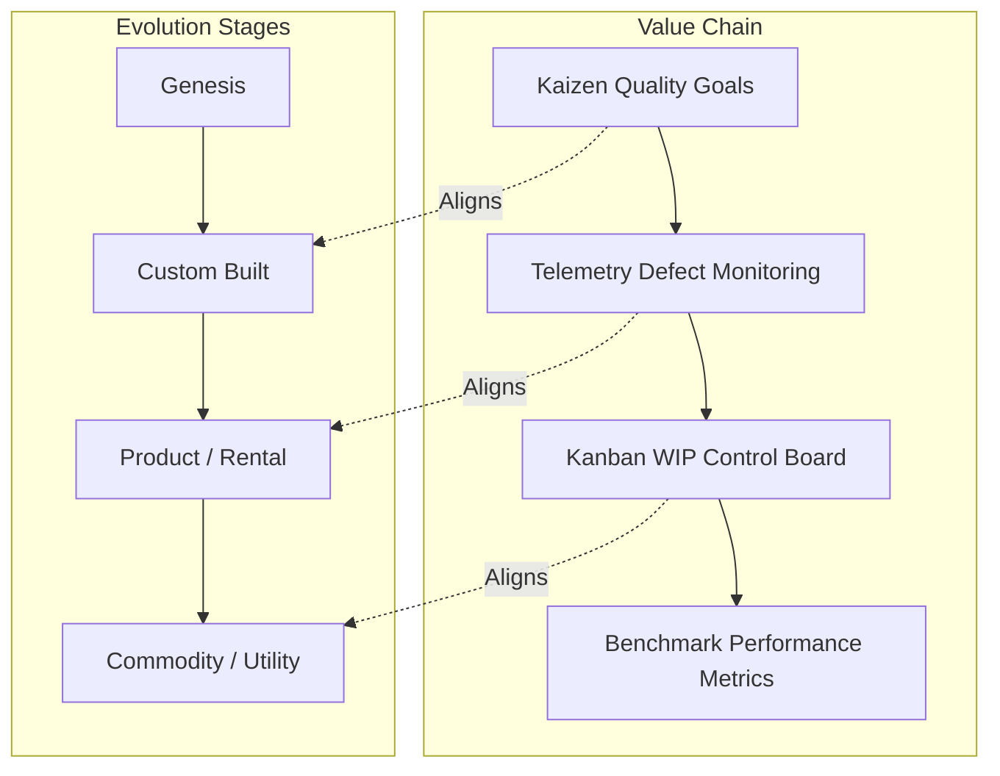

# 28. Wardley Map Diagram Family

This file contains the Wardley Map diagram family for the Chatman Engine, structured across the 8 projection lenses.

Fallback rendering for Mermaid compatibility.

---

## Lens 1: Semantic Authority

Diagram ID: WARDLEY-L1
Diagram family: Wardley Map
Projection lens: Semantic Authority
Architectural invariant preserved: RDF/Oxigraph is the single semantic source of truth. Shadow copies of RDF data are strictly prohibited.
Information-loss risk if omitted: Developing custom shadow databases when commodity semantic engines are available.
TPS visual-control purpose: Maps value chain positions to avoid development of custom redundant databases.
DfLSS CTQ protected: Zero semantic shadow copies.
CENG ticket or boundary constrained: CENG-410-FINAL (in progress).
Why this diagram is non-redundant: Visualizes semantic components against evolution stages.

---

## Lens 2: Routing Constitution

Diagram ID: WARDLEY-L2
Diagram family: Wardley Map
Projection lens: Routing Constitution
Architectural invariant preserved: Least-expressive-power routing; hot/warm/cold path isolation. N3 is disabled by default.
Information-loss risk if omitted: Over-engineering routing logic into custom products rather than utilizing commodity byte-mask tables.
TPS visual-control purpose: Restricts route implementation waste.
DfLSS CTQ protected: Safe isolation of cold-path N3 execution.
CENG ticket or boundary constrained: CENG-411 (design-only, implementation blocked).
Why this diagram is non-redundant: Details routing components across evolution zones.

---

## Lens 3: Type Kernel Ownership

Diagram ID: WARDLEY-L3
Diagram family: Wardley Map
Projection lens: Type Kernel Ownership
Architectural invariant preserved: Canonical type ownership across wasm4pm-compat, wasm4pm-cognition, bcinr-pddl, bcinr-powl, and praxis-graphlaw.
Information-loss risk if omitted: Custom-building duplicate types that are already provided as commoditized library structures.
TPS visual-control purpose: Prevents redundant type custom-coding.
DfLSS CTQ protected: Zero duplicate type classes.
CENG ticket or boundary constrained: CENG-412 (design-only, implementation blocked).
Why this diagram is non-redundant: Maps type components relative to evolution phases.

---

## Lens 4: Transition Lifecycle

Diagram ID: WARDLEY-L4
Diagram family: Wardley Map
Projection lens: Transition Lifecycle
Architectural invariant preserved: Every transition must pass through candidate invocation, validation, planning, execution, receipting, and replay.
Information-loss risk if omitted: Bypassing commoditized receipt validation for custom validation code.
TPS visual-control purpose: Ensures lifecycle components move toward higher efficiency states.
DfLSS CTQ protected: Replayable state transitions under fixed seed.
CENG ticket or boundary constrained: CENG-410-FINAL (in progress).
Why this diagram is non-redundant: Maps transition lifecycle components to evolutionary stages.

---

## Lens 5: Event / Hook / Actuation

Diagram ID: WARDLEY-L5
Diagram family: Wardley Map
Projection lens: Event / Hook / Actuation
Architectural invariant preserved: Hooks cannot actuate without receipts; no unreceipted actuation.
Information-loss risk if omitted: Custom hook actuators operating without a standardized receipt tracking protocol.
TPS visual-control purpose: Forces the evolution of custom actuators to standard receipt-locked interfaces.
DfLSS CTQ protected: Zero unreceipted actuation events.
CENG ticket or boundary constrained: CENG-416A-F (design-only, implementation blocked).
Why this diagram is non-redundant: Details Hook technology evolution paths.

---

## Lens 6: Performance / 8-Constraint Hot Path

Diagram ID: WARDLEY-L6
Diagram family: Wardley Map
Projection lens: Performance / 8-Constraint Hot Path
Architectural invariant preserved: RDFTriple8, ConditionCell<BITS> byte masks, and 256-state tables.
Information-loss risk if omitted: Designing custom execution loops rather than leveraging commodity bitmasks.
TPS visual-control purpose: Standardizes hot-path routines as commodity operations to save CPU cycles.
DfLSS CTQ protected: Latency bound of hot path operations.
CENG ticket or boundary constrained: CENG-410-FINAL (in progress).
Why this diagram is non-redundant: Details hot-path constraint optimization evolution.

---

## Lens 7: Refusal / Risk / Governance

Diagram ID: WARDLEY-L7
Diagram family: Wardley Map
Projection lens: Refusal / Risk / Governance
Architectural invariant preserved: Typed Refusal hierarchy; N3 quarantine rules.
Information-loss risk if omitted: Designing custom handlers for every risk type rather than adopting standard refusal schemas.
TPS visual-control purpose: Tracks maturity of exception management.
DfLSS CTQ protected: Zero untyped exceptions or panics.
CENG ticket or boundary constrained: CENG-410-FINAL (in progress).
Why this diagram is non-redundant: Visualizes governance and risk containment components.

---

## Lens 8: TPS / DfLSS / Continuous Improvement

Diagram ID: WARDLEY-L8
Diagram family: Wardley Map
Projection lens: TPS / DfLSS / Continuous Improvement
Architectural invariant preserved: Continuous Kaizen optimization loops, visual gauges, waste reduction.
Information-loss risk if omitted: Missing opportunities to modularize optimization and telemetry loops.
TPS visual-control purpose: Drives the evolution of telemetry gauges to standardized commodities.
DfLSS CTQ protected: Throughput and defect-free execution rate.
CENG ticket or boundary constrained: CENG-410-FINAL (in progress).
Why this diagram is non-redundant: Maps quality management systems to evolution categories.

