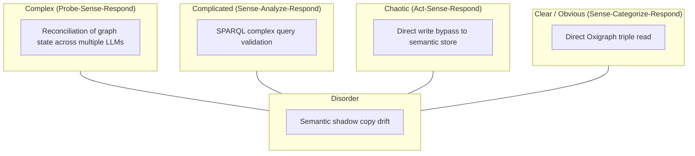
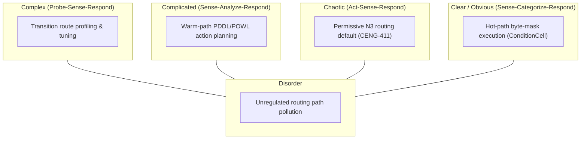
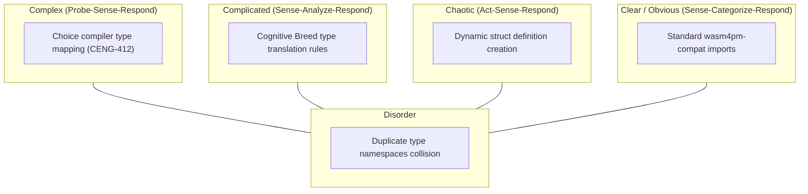
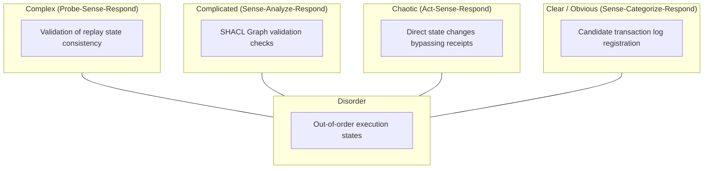
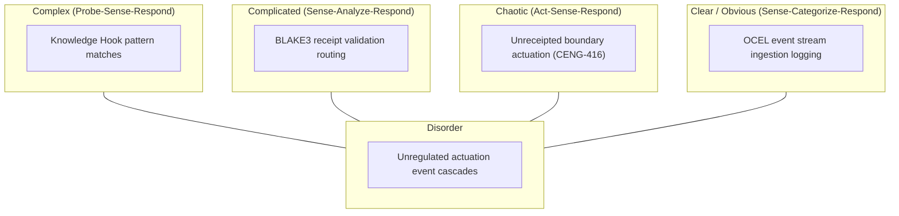
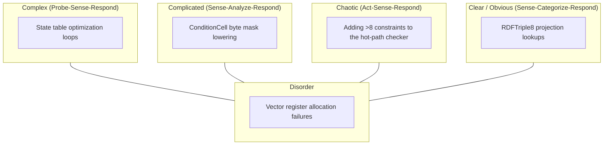
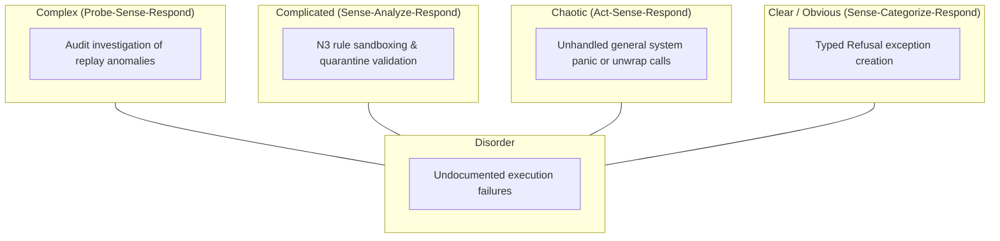
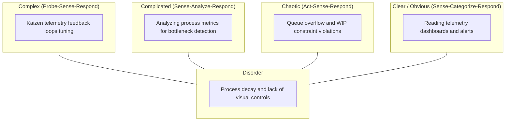

# 29. Cynefin Framework Diagram Family

This file contains the Cynefin framework diagram family for the Chatman Engine, structured across the 8 projection lenses.

Fallback rendering for Mermaid compatibility.

---

## Lens 1: Semantic Authority

Diagram ID: CYNEFIN-L1
Diagram family: Cynefin
Projection lens: Semantic Authority
Architectural invariant preserved: RDF/Oxigraph is the single semantic source of truth. Shadow copies of RDF data are strictly prohibited.
Information-loss risk if omitted: Treating complex semantic conflicts as simple database writes, leading to graph state corruptions.
TPS visual-control purpose: Groups semantic situations to apply correct resolution methods.
DfLSS CTQ protected: Zero semantic shadow copies.
CENG ticket or boundary constrained: CENG-410-FINAL (in progress).
Why this diagram is non-redundant: Classifies semantic data situations by complexity.

---

## Lens 2: Routing Constitution

Diagram ID: CYNEFIN-L2
Diagram family: Cynefin
Projection lens: Routing Constitution
Architectural invariant preserved: Least-expressive-power routing; hot/warm/cold path isolation. N3 is disabled by default.
Information-loss risk if omitted: Incorrectly applying chaotic N3 rules to clear hot-path execution environments.
TPS visual-control purpose: Isolates routing tasks into appropriate complexity categories to prevent routing waste.
DfLSS CTQ protected: Safe isolation of cold-path N3 execution.
CENG ticket or boundary constrained: CENG-411 (design-only, implementation blocked).
Why this diagram is non-redundant: Visualizes routing situations across Cynefin domains.

---

## Lens 3: Type Kernel Ownership

Diagram ID: CYNEFIN-L3
Diagram family: Cynefin
Projection lens: Type Kernel Ownership
Architectural invariant preserved: Canonical type ownership across wasm4pm-compat, wasm4pm-cognition, bcinr-pddl, bcinr-powl, and praxis-graphlaw.
Information-loss risk if omitted: Structural type duplication caused by treating complex type alignments as clear cut copies.
TPS visual-control purpose: Groups typing tasks to prevent redundant namespace collision.
DfLSS CTQ protected: Zero duplicate type classes.
CENG ticket or boundary constrained: CENG-412 (design-only, implementation blocked).
Why this diagram is non-redundant: Classifies type kernel issues under Cynefin domains.

---

## Lens 4: Transition Lifecycle

Diagram ID: CYNEFIN-L4
Diagram family: Cynefin
Projection lens: Transition Lifecycle
Architectural invariant preserved: Every transition must pass through candidate invocation, validation, planning, execution, receipting, and replay.
Information-loss risk if omitted: Failure to identify when lifecycle execution falls into chaos due to lack of validation loops.
TPS visual-control purpose: Eliminates process waste by keeping transition execution in clear/complicated states.
DfLSS CTQ protected: Replayable state transitions under fixed seed.
CENG ticket or boundary constrained: CENG-410-FINAL (in progress).
Why this diagram is non-redundant: Details lifecycle situations in Cynefin formats.

---

## Lens 5: Event / Hook / Actuation

Diagram ID: CYNEFIN-L5
Diagram family: Cynefin
Projection lens: Event / Hook / Actuation
Architectural invariant preserved: Hooks cannot actuate without receipts; no unreceipted actuation.
Information-loss risk if omitted: Side-effect actions getting stuck in chaotic states due to receipt validation failures.
TPS visual-control purpose: Restricts boundary hook triggers to clear/obvious rules.
DfLSS CTQ protected: Zero unreceipted actuation events.
CENG ticket or boundary constrained: CENG-416A-F (design-only, implementation blocked).
Why this diagram is non-redundant: Maps hook situations to complexity categories.

---

## Lens 6: Performance / 8-Constraint Hot Path

Diagram ID: CYNEFIN-L6
Diagram family: Cynefin
Projection lens: Performance / 8-Constraint Hot Path
Architectural invariant preserved: RDFTriple8, ConditionCell<BITS> byte masks, and 256-state tables.
Information-loss risk if omitted: Trying to handle chaotic constraint counts in the hot path without bitmask optimization.
TPS visual-control purpose: Prevents hot path degradation by mapping complexity.
DfLSS CTQ protected: Latency bound of hot path operations.
CENG ticket or boundary constrained: CENG-410-FINAL (in progress).
Why this diagram is non-redundant: Visualizes constraint complexity constraints.

---

## Lens 7: Refusal / Risk / Governance

Diagram ID: CYNEFIN-L7
Diagram family: Cynefin
Projection lens: Refusal / Risk / Governance
Architectural invariant preserved: Typed Refusal hierarchy; N3 quarantine rules.
Information-loss risk if omitted: Silent failures or crashes caused by untyped errors in chaotic domains.
TPS visual-control purpose: Standardizes error categorization to avoid untraceable panics.
DfLSS CTQ protected: Zero untyped exceptions or panics.
CENG ticket or boundary constrained: CENG-410-FINAL (in progress).
Why this diagram is non-redundant: Focuses on risk management.

---

## Lens 8: TPS / DfLSS / Continuous Improvement

Diagram ID: CYNEFIN-L8
Diagram family: Cynefin
Projection lens: TPS / DfLSS / Continuous Improvement
Architectural invariant preserved: Continuous Kaizen optimization loops, visual gauges, waste reduction.
Information-loss risk if omitted: Failure to detect systemic process waste by ignoring continuous improvement indicators.
TPS visual-control purpose: Classifies process improvement scenarios to target waste elimination.
DfLSS CTQ protected: Throughput and defect-free execution rate.
CENG ticket or boundary constrained: CENG-410-FINAL (in progress).
Why this diagram is non-redundant: Visualizes continuous improvement complexity domains.

