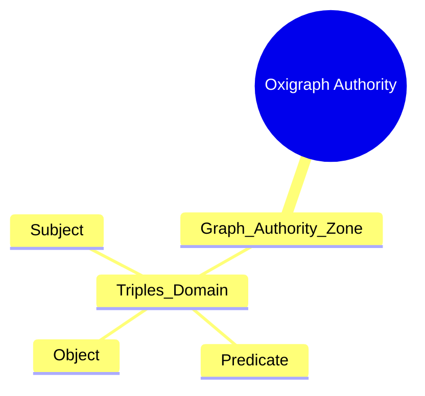
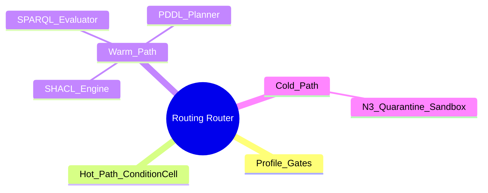
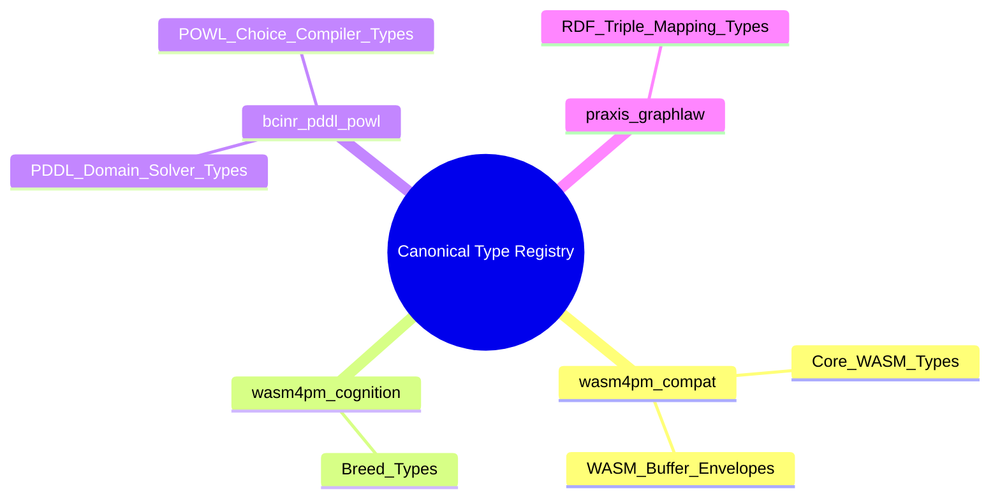
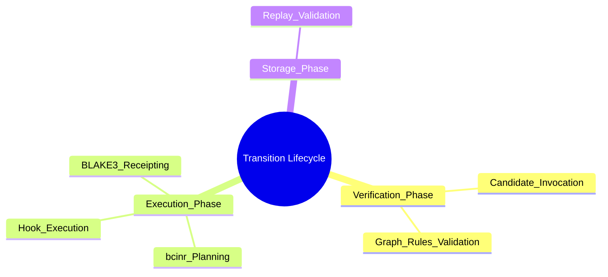
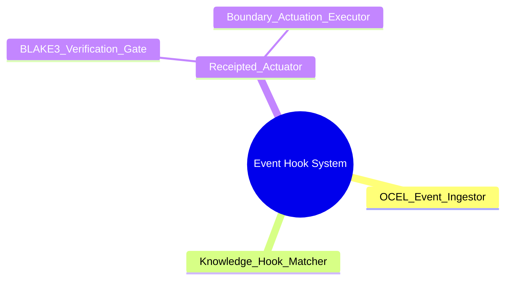
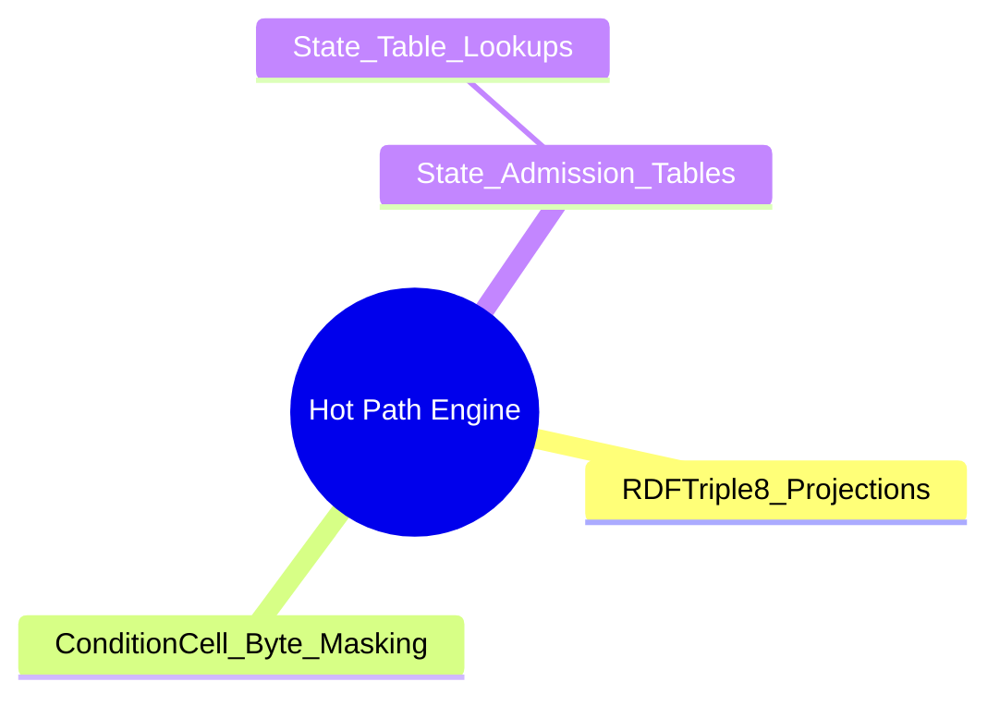
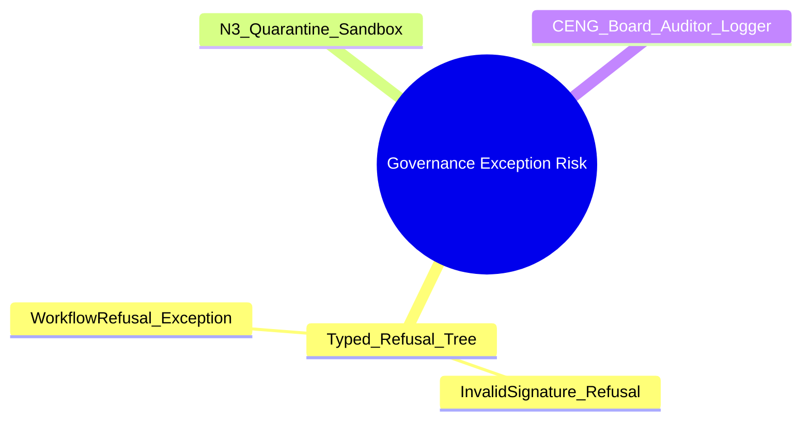
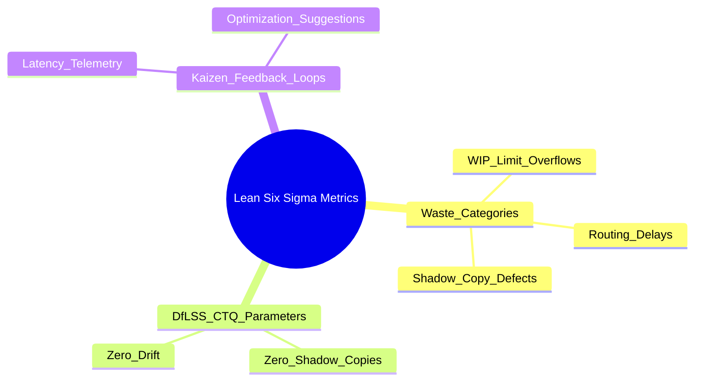

# 30. Treeview Diagram Family

This file contains the Treeview diagram family for the Chatman Engine, structured across the 8 projection lenses.

Fallback rendering for Mermaid compatibility.

---

## Lens 1: Semantic Authority

Diagram ID: TREEVIEW-L1
Diagram family: Treeview
Projection lens: Semantic Authority
Architectural invariant preserved: RDF/Oxigraph is the single semantic source of truth. Shadow copies of RDF data are strictly prohibited.
Information-loss risk if omitted: Ambiguity about the nested storage layout of semantic entities.
TPS visual-control purpose: Structure mapping to avoid shadow copy directories.
DfLSS CTQ protected: Zero semantic shadow copies.
CENG ticket or boundary constrained: CENG-410-FINAL (in progress).
Why this diagram is non-redundant: Visualizes semantic database storage hierarchy.

---

## Lens 2: Routing Constitution

Diagram ID: TREEVIEW-L2
Diagram family: Treeview
Projection lens: Routing Constitution
Architectural invariant preserved: Least-expressive-power routing; hot/warm/cold path isolation. N3 is disabled by default.
Information-loss risk if omitted: Incorrect directory structures for hot vs cold execution code.
TPS visual-control purpose: Isolates routing components visually to avoid path pollution waste.
DfLSS CTQ protected: Safe isolation of cold-path N3 execution.
CENG ticket or boundary constrained: CENG-411 (design-only, implementation blocked).
Why this diagram is non-redundant: Visualizes routing configuration tree hierarchy.

---

## Lens 3: Type Kernel Ownership

Diagram ID: TREEVIEW-L3
Diagram family: Treeview
Projection lens: Type Kernel Ownership
Architectural invariant preserved: Canonical type ownership across wasm4pm-compat, wasm4pm-cognition, bcinr-pddl, bcinr-powl, and praxis-graphlaw.
Information-loss risk if omitted: Duplicate types across subfolders and namespaces.
TPS visual-control purpose: Groups types by crate paths to ensure clean dependency trees.
DfLSS CTQ protected: Zero duplicate type classes.
CENG ticket or boundary constrained: CENG-412 (design-only, implementation blocked).
Why this diagram is non-redundant: Visualizes crate dependency namespaces and boundaries.

---

## Lens 4: Transition Lifecycle

Diagram ID: TREEVIEW-L4
Diagram family: Treeview
Projection lens: Transition Lifecycle
Architectural invariant preserved: Every transition must pass through candidate invocation, validation, planning, execution, receipting, and replay.
Information-loss risk if omitted: Execution of lifecycle steps out of order.
TPS visual-control purpose: Visual check on phase execution order.
DfLSS CTQ protected: Replayable state transitions under fixed seed.
CENG ticket or boundary constrained: CENG-410-FINAL (in progress).
Why this diagram is non-redundant: Details transition stage pipelines.

---

## Lens 5: Event / Hook / Actuation

Diagram ID: TREEVIEW-L5
Diagram family: Treeview
Projection lens: Event / Hook / Actuation
Architectural invariant preserved: Hooks cannot actuate without receipts; no unreceipted actuation.
Information-loss risk if omitted: Accidental creation of actuation modules that bypass receipt checks.
TPS visual-control purpose: Isolates actuation components to avoid unreceipted side-effects.
DfLSS CTQ protected: Zero unreceipted actuation events.
CENG ticket or boundary constrained: CENG-416A-F (design-only, implementation blocked).
Why this diagram is non-redundant: Visualizes hook configuration hierarchies.

---

## Lens 6: Performance / 8-Constraint Hot Path

Diagram ID: TREEVIEW-L6
Diagram family: Treeview
Projection lens: Performance / 8-Constraint Hot Path
Architectural invariant preserved: RDFTriple8, ConditionCell<BITS> byte masks, and 256-state tables.
Information-loss risk if omitted: Slowness in hot-path checking if checks are nested recursively.
TPS visual-control purpose: Controls nested complexity to protect CPU cache lines.
DfLSS CTQ protected: Latency bound of hot path operations.
CENG ticket or boundary constrained: CENG-410-FINAL (in progress).
Why this diagram is non-redundant: Maps performance hot-path components hierarchy.

---

## Lens 7: Refusal / Risk / Governance

Diagram ID: TREEVIEW-L7
Diagram family: Treeview
Projection lens: Refusal / Risk / Governance
Architectural invariant preserved: Typed Refusal hierarchy; N3 quarantine rules.
Information-loss risk if omitted: Silent failures or crashes from untracked exception hierarchies.
TPS visual-control purpose: Groups refusal classes to manage error visual alarms.
DfLSS CTQ protected: Zero untyped exceptions or panics.
CENG ticket or boundary constrained: CENG-410-FINAL (in progress).
Why this diagram is non-redundant: Details refusal exception type inheritance hierarchies.

---

## Lens 8: TPS / DfLSS / Continuous Improvement

Diagram ID: TREEVIEW-L8
Diagram family: Treeview
Projection lens: TPS / DfLSS / Continuous Improvement
Architectural invariant preserved: Continuous Kaizen optimization loops, visual gauges, waste reduction.
Information-loss risk if omitted: Inability to categorize Lean parameters for continuous quality metrics.
TPS visual-control purpose: Organizes Six Sigma feedback channels to manage improvement telemetry.
DfLSS CTQ protected: Throughput and defect-free execution rate.
CENG ticket or boundary constrained: CENG-410-FINAL (in progress).
Why this diagram is non-redundant: Maps continuous improvement telemetry structures.

