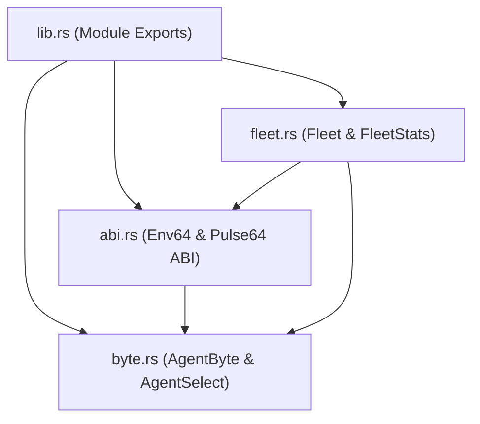
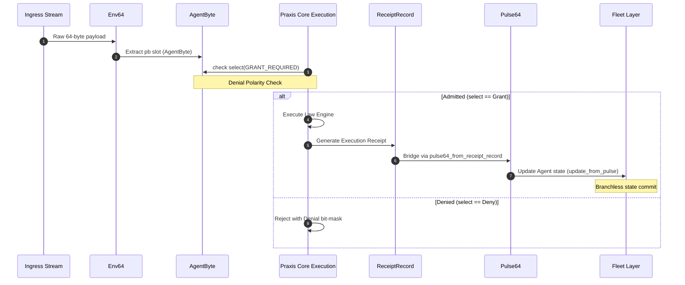

# Crate: `agent8`

Defines the low-level 8-bit status byte representations, 64-byte wire ABI layout structures, and high-performance branchless SWAR (SIMD-Within-A-Register) vector operations for massive multi-agent fleet governance and monitoring.

- **Path**: [`crates/agent8`](file:///Users/sac/praxis/crates/agent8)

---

## 1. Theory and Logic Design

The `agent8` crate serves as a high-performance execution bridge and wire-level link between the `praxis-core` execution layers and high-throughput communication protocols. It projects agent admission and governance posture into a single byte (`AgentByte`), maps this posture onto a 64-byte aligned hardware-friendly envelope structure (`Env64`), bridges runtime execution receipts into observer pulses (`Pulse64`), and evaluates agent fleets in bulk using a branchless SWAR kernel.

### 1.1 AgentByte and Named Bits Vocabulary

The `AgentByte` is a `#[repr(transparent)]` `u8` newtype that acts as the wire-level projection of an agent's governance, admission, and operational status. The 8-bit space is split into a specific vocabulary:

*   **Bit 0: `ADMITTED` (`0x01` / Glyph `A`)** — Prerequisite admission completed.
*   **Bit 1: `EVIDENCE_OK` (`0x02` / Glyph `E`)** — Supporting evidence verified.
*   **Bit 2: `WITHIN_BUDGET` (`0x04` / Glyph `B`)** — Operating within rate/credit budgets.
*   **Bit 3: `AUTHORITY_BOUND` (`0x08` / Glyph `U`)** — Bound to a granted authority.
*   **Bit 4: `HEALTHY` (`0x10` / Glyph `H`)** — Operational health signal (advisory).
*   **Bit 5: `CONFORMANT` (`0x20` / Glyph `C`)** — Conforms to declared law/schema.
*   **Bit 6: `RECEIPTED` (`0x40` / Glyph `R`)** — Immutably receipted.
*   **Bit 7: `REPLAYABLE` (`0x80` / Glyph `P`)** — Deterministically replayable transition (advisory).

#### The Default Admission Policy (`GRANT_REQUIRED`)
To be granted execution clearance, an agent must satisfy the six *load-bearing governance* bits. Advisory signals like `HEALTHY` (momentary operational health, which can fluctuate) and `REPLAYABLE` (a post-hoc property, not a precondition) are excluded. The default admission mask is:

$$\text{GRANT\_REQUIRED} = \text{ADMITTED} \mid \text{EVIDENCE\_OK} \mid \text{WITHIN\_BUDGET} \mid \text{AUTHORITY\_BOUND} \mid \text{CONFORMANT} \mid \text{RECEIPTED} = \text{0x6F}$$

This sub-mask comparison mirrors the prior art of `Status8Field` in the `semantic_bit` crate (`/Users/sac/semantic_bit/src/status8.rs`), selecting a specific subset of bits for eligibility checks.

### 1.2 Denial Polarity Doctrine

To maximize efficiency and maintain compatibility with `unibit-kernel` (`/Users/sac/unibit/crates/unibit-kernel/src/lib.rs`), `agent8` adheres to the **denial polarity doctrine**:

> **Zero means admitted; non-zero means denied.**

The `AgentByte::denial(self, required_mask)` method computes:

$$\text{denial} = \text{required\_mask} \ \& \ \sim\!\text{self.0}$$

*   If the result is `0`, all required bits are present, mapping to `AgentSelect::Grant`.
*   If the result is non-zero, the value directly names the exact missing bits that caused the denial, mapping to `AgentSelect::Deny`.

This is a direct SWAR lift of `unibit-kernel`'s `admit3` prereq check (`prereq & !state`).

### 1.3 64-Byte Cache-Line Alignment (`Env64` & `Pulse64`)

To match the C-based `bytestar` definitions of `env64_t` (from `envelope.h`) and `pulse64_t` (from `pulse.h`), both `Env64` and `Pulse64` are marked `#[repr(C, align(64))]`. Their sizes and alignments are verified at compile-time to be exactly 64 bytes using Rust's static assertion idiom:

```rust
const _: () = {
    assert!(core::mem::size_of::<Env64>() == 64, "Env64 must be exactly 64 bytes");
    assert!(core::mem::align_of::<Env64>() == 64, "Env64 must be 64-byte aligned");
};
```

Rather than using `#[repr(packed)]` (which introduces memory alignment hazards and requires `unsafe` code to access fields), `agent8` specifies a field order where every field is naturally aligned and the struct has zero internal padding. This layout allows `agent8` to enforce `#![forbid(unsafe_code)]` while maintaining 100% binary compatibility with the packed C wire headers.

### 1.4 SWAR (SIMD Within A Register) Fleet Sweep

When checking thousands of agents sequentially, branching and loop overhead become a bottleneck. `agent8` optimizes this by packing 8 agents (8 bytes) into a single 64-bit word (`u64`), effectively treating each byte lane as an independent SIMD lane.

1.  **Mask Broadcasting**:
    To check all lanes simultaneously, the 8-bit required mask is broadcast across all 8 byte lanes of a 64-bit word by multiplying it with the constant `0x0101_0101_0101_0101`:
    
    $$\text{broadcast\_mask} = \text{required\_mask} \times \text{0x0101\_0101\_0101\_0101}$$

2.  **Sweep Admission**:
    The sweep admission check runs a bitwise gate on the word:
    
    $$\text{denial\_word} = \text{broadcast\_mask} \ \& \ \sim\!\text{word}$$
    
    Each byte lane in the resulting `denial_word` is `0` if that agent was admitted (satisfied the mask), and contains the missing bits if it was denied.

3.  **Borrow-Safe Zero Lane Detector**:
    To count how many agents were admitted (i.e. which lanes in `denial_word` are exactly zero), a standard subtraction-based trick (`(v - 0x0101...) & !v & 0x8080...`) fails because borrowing propagates across lane boundaries. To prevent borrow leakage, `agent8` implements a borrow-safe zero lane detector:
    
    ```rust
    const LANE_HIGH: u64 = 0x8080_8080_8080_8080;
    const LANE_LOW7: u64 = 0x7f7f_7f7f_7f7f_7f7f;

    const fn zero_lane_mask(word: u64) -> u64 {
        let nonzero_high = ((word & LANE_LOW7).wrapping_add(LANE_LOW7)) | word;
        !nonzero_high & LANE_HIGH
    }
    ```
    
    #### Mathematical Walkthrough of Zero Lane Isolation
    For a single byte lane `B` represented as `[b7, b6, b5, b4, b3, b2, b1, b0]`:
    
    *   **Isolate lower 7 bits**: `word & LANE_LOW7` extracts the bottom 7 bits of each byte:
        
        $$\text{low7} = [0, b_6, b_5, b_4, b_3, b_2, b_1, b_0]$$
        
    *   **Wrapping Addition**: Adding `LANE_LOW7` (`0x7f` or `[0, 1, 1, 1, 1, 1, 1, 1]`) to `low7`:
        *   If `low7` is exactly zero (`0x00`), the sum is `0x7f` (`[0, 1, 1, 1, 1, 1, 1, 1]`). The MSB of the lane (bit 7) is `0`.
        *   If `low7` is non-zero (at least `0x01`), the sum will be $\ge \text{0x80}$ and $\le \text{0xfe}$ (`0x7f + 0x7f`). The MSB of the lane (bit 7) becomes `1`.
        *   Because the maximum sum is `0xfe`, the addition never carries over into the next byte lane, preserving the lane boundary.
        
    *   **Merge Original MSB**: ORing the sum with the original `word` combines the MSB of the sum with the original MSB of `B`. The resulting bit 7 is `1` if the lower 7 bits were non-zero OR if the original bit 7 was `1`. Thus, the MSB is `1` if and only if the byte was non-zero.
    
    *   **Invert and Mask**: Inverting `nonzero_high` and masking it with `LANE_HIGH` yields `0x80` in lanes that were exactly `0x00`, and `0x00` in lanes that were non-zero.
    
    *   **Count**: Calling `zero_lane_mask(denial).count_ones()` counts the set bits, which is exactly the number of admitted agents in the word, executed in a single processor instruction.

---

## 2. Internal Architecture

### 2.1 Module Structure & Dependency Layout



### 2.2 End-to-End Execution & Verification Pipeline



### 2.3 SWAR Fleet Sweep Pipeline

```mermaid
graph TD
    subgraph Fleet Memory
        F[Fleet::bytes: Vec<u64>]
    end

    subgraph SWAR Sweep Step (per u64 word)
        W[Input Word: 8 Packed Agents]
        M[Required Mask: 8-bit]
        B[Broadcast: required_mask * 0x0101...]
        D[Denial Word: broadcast & ~word]
        Z[zero_lane_mask: !((D & 0x7f...) + 0x7f... | D) & 0x80...]
        P[Popcount: zero_lane_mask.count_ones()]
    end

    F -->|Iterate Words| W
    M --> B
    W --> D
    B --> D
    D --> Z
    Z --> P
    P -->|Accumulate| Stats[FleetStats: admitted, blocked, total]
```

---

## 3. API Signatures & Examples

### 3.1 `byte` Module
File Path: `crates/agent8/src/byte.rs`

Defines `AgentByte` and the governance status evaluation.

```rust
#[repr(u8)]
#[derive(Clone, Copy, Eq, PartialEq, Debug)]
pub enum AgentSelect {
    Grant = 0,
    Deny = 1,
}

#[repr(transparent)]
#[derive(Clone, Copy, Eq, PartialEq, Hash, Debug, Default, Serialize, Deserialize)]
#[serde(transparent)]
pub struct AgentByte(u8);

impl AgentByte {
    pub const ADMITTED: u8 = 0x01;
    pub const EVIDENCE_OK: u8 = 0x02;
    pub const WITHIN_BUDGET: u8 = 0x04;
    pub const AUTHORITY_BOUND: u8 = 0x08;
    pub const HEALTHY: u8 = 0x10;
    pub const CONFORMANT: u8 = 0x20;
    pub const RECEIPTED: u8 = 0x40;
    pub const REPLAYABLE: u8 = 0x80;

    pub const GRANT_REQUIRED: u8 = Self::ADMITTED
        | Self::EVIDENCE_OK
        | Self::WITHIN_BUDGET
        | Self::AUTHORITY_BOUND
        | Self::CONFORMANT
        | Self::RECEIPTED;

    /// The empty projection (no bits set).
    #[must_use]
    pub const fn empty() -> Self;

    /// Construct directly from a raw byte.
    #[must_use]
    pub const fn from_raw(byte: u8) -> Self;

    /// The underlying byte.
    #[must_use]
    pub const fn raw(self) -> u8;

    /// Set the bits in `position` (const builder; OR-in).
    #[must_use]
    pub const fn with(mut self, position: u8) -> Self;

    /// Clear the bits in `position` (const builder; AND-NOT).
    #[must_use]
    pub const fn without(mut self, position: u8) -> Self;

    /// True iff *every* bit in `position` is set. Note this takes a mask, so
    /// `carries(A | B)` means "carries both A and B".
    #[must_use]
    pub const fn carries(self, position: u8) -> bool;

    /// The denial word for this byte against `required_mask`, in the ported
    /// `unibit` denial polarity: zero means all required bits present (admitted);
    /// non-zero identifies exactly the missing required bits.
    #[must_use]
    pub const fn denial(self, required_mask: u8) -> u8;

    /// Grant iff every bit in `required_mask` is set. Pass
    /// `Self::GRANT_REQUIRED` for the documented default policy.
    #[must_use]
    pub const fn select(self, required_mask: u8) -> AgentSelect;
}

impl core::fmt::Display for AgentByte {
    /// 8-char flag string, high bit first, one unique letter per set bit and
    /// `-` for each clear bit, for an at-a-glance read:
    /// `P R C H U B E A`
    fn fmt(&self, f: &mut core::fmt::Formatter<'_>) -> core::fmt::Result;
}
```

### 3.2 `abi` Module
File Path: `crates/agent8/src/abi.rs`

Provides Rust implementations of the 64-byte cache-aligned wire ABI and the `ReceiptRecord` bridge.

```rust
pub const ENV_MAGIC: u16 = 0xBE64;
pub const PULSE_MAGIC: u16 = 0x5064;
pub const ABI_VERSION: u8 = 3;
pub const MAX_PRIORITY: u8 = 7;
pub const MAX_STEP: u8 = 8;

pub const PULSE_FLAG_VALID: u8 = 0x01;
pub const PULSE_FLAG_FINAL: u8 = 0x02;
pub const PULSE_FLAG_ERROR: u8 = 0x04;

#[repr(C, align(64))]
#[derive(Clone, Copy, PartialEq, Eq, Debug)]
pub struct Env64 {
    pub magic: u16,
    pub ver: u8,
    pub pb: u8,
    pub budget: u16,
    pub flags: u8,
    pub priority: u8,
    pub in_cid: [u8; 16],
    pub timestamp: u64,
    pub seq_num: u32,
    pub source: [u8; 4],
    pub aux: [u8; 24],
}

impl Env64 {
    /// A zeroed envelope stamped with the correct magic and version.
    #[must_use]
    pub const fn new() -> Self;

    /// Set the `AgentByte` carried in the pattern-byte (pb) slot.
    #[must_use]
    pub const fn with_agent(mut self, agent: AgentByte) -> Self;

    /// The `AgentByte` projection carried in the pattern-byte (pb) slot.
    #[must_use]
    pub const fn agent(self) -> AgentByte;

    /// Validate: magic, version, and priority <= 7 must all hold.
    #[must_use]
    pub const fn validate(&self) -> bool;
}

impl Default for Env64 {
    fn default() -> Self;
}

#[repr(C, align(64))]
#[derive(Clone, Copy, PartialEq, Eq, Debug)]
pub struct Pulse64 {
    pub magic: u16,
    pub ver: u8,
    pub flags: u8,
    pub in_cid: [u8; 16],
    pub out_cid: [u8; 16],
    pub receipt: [u8; 16],
    pub ticks: u8,
    pub hop: u8,
    pub cube_pos: u8,
    pub observer_id: u8,
    pub timestamp: u64,
}

impl Pulse64 {
    /// A zeroed pulse stamped with the correct magic and version.
    #[must_use]
    pub const fn new() -> Self;

    /// Validate: magic, version, ticks <= 8, hop <= 8.
    #[must_use]
    pub const fn validate(&self) -> bool;

    /// True if the error flag is set.
    #[must_use]
    pub const fn has_error(&self) -> bool;
}

impl Default for Pulse64 {
    fn default() -> Self;
}

/// Bridge a praxis `ReceiptRecord` into a wire `Pulse64`.
#[must_use]
pub fn pulse64_from_receipt_record(record: &praxis_core::ReceiptRecord) -> Pulse64;
```

### 3.3 `fleet` Module
File Path: `crates/agent8/src/fleet.rs`

Contains the vector-packed fleet representation and SWAR kernels.

```rust
pub const LANES_PER_WORD: usize = 8;

/// SWAR primitive: Gate all 8 agents in `word` against a broadcast `required_mask`,
/// returning a denial word where zero lane means admitted.
#[must_use]
pub const fn sweep_admit(word: u64, required_mask: u8) -> u64;

#[derive(Clone, Copy, PartialEq, Eq, Debug, Default)]
pub struct FleetStats {
    pub total: u64,
    pub admitted: u64,
    pub blocked: u64,
    pub receipted: u64,
    pub replayable: u64,
}

#[derive(Clone, Debug, Default)]
pub struct Fleet {
    pub bytes: Vec<u64>,
}

impl Fleet {
    /// An empty fleet.
    #[must_use]
    pub fn new() -> Self;

    /// A fleet of `count` agents (rounded up to a whole word), every agent
    /// initialized to `fill`.
    #[must_use]
    pub fn with_fill(count: usize, fill: AgentByte) -> Self;

    /// Number of agents (word count × 8).
    #[must_use]
    pub fn len(&self) -> usize;

    /// True if the fleet holds no words.
    #[must_use]
    pub fn is_empty(&self) -> bool;

    /// Read one agent's projection.
    #[must_use]
    pub fn get(&self, agent: usize) -> AgentByte;

    /// Overwrite one agent's projection.
    pub fn set(&mut self, agent: usize, value: AgentByte);

    /// Sweep the whole fleet against `required_mask` and return popcount statistics.
    #[must_use]
    pub fn sweep_stats(&self, required_mask: u8) -> FleetStats;

    /// Fold an observed `Pulse64` back into one agent's projection branchlessly.
    pub fn update_from_pulse(&mut self, agent: usize, pulse: &Pulse64);
}
```

---

## 4. Realistic Usage Example

Below is a complete, realistic program utilizing the full pipeline of the `agent8` APIs. It illustrates incoming envelope validation, bridging a receipt to a pulse feedback loop, and executing a SWAR fleet check.

```rust
use agent8::{
    pulse64_from_receipt_record, AgentByte, AgentSelect, Env64, Fleet, Pulse64,
};
use praxis_core::{law::Andon, ReceiptRecord};

fn main() {
    // 1. Setup Ingress Envelope carrying the admission posture of a new agent
    let initial_posture = AgentByte::empty()
        .with(AgentByte::ADMITTED)
        .with(AgentByte::EVIDENCE_OK)
        .with(AgentByte::WITHIN_BUDGET)
        .with(AgentByte::AUTHORITY_BOUND)
        .with(AgentByte::HEALTHY); // Operational health check is set, but RECEIPTED is missing

    let env = Env64::new().with_agent(initial_posture);

    // Validate the envelope structure itself
    assert!(env.validate());

    // Extract the agent's posture from the envelope and test against the default policy
    let agent_posture = env.agent();
    let default_policy = AgentByte::GRANT_REQUIRED;

    println!("Agent status string: {}", agent_posture);
    // Output should show "-H-UBEA" because RECEIPTED ('R') and CONFORMANT ('C') are not set yet

    match agent_posture.select(default_policy) {
        AgentSelect::Grant => println!("Agent transition granted!"),
        AgentSelect::Deny => {
            let missing_bits = AgentByte::from_raw(agent_posture.denial(default_policy));
            println!("Agent transition denied. Missing bits: {}", missing_bits);
            // Will indicate missing bits (CONFORMANT, RECEIPTED)
        }
    }

    // 2. Initialize a Fleet of 16 agents with the initial posture
    let mut fleet = Fleet::with_fill(16, agent_posture);

    // 3. Simulate processing and getting a ReceiptRecord from the Praxis core law layer
    let receipt_record = ReceiptRecord {
        version: 1,
        instruction_id: 42,
        activity_idx: 1,
        activity: Some("Agent Step Action".to_string()),
        node_kind: 2,
        ts_ns: 1719878400000000000,
        duration_ms: Some(12),
        payload_hash_hex: "d301f280e22709cc8d90fa6b46b0c2a5ee11d4e7a840e698888b1cc90a369efb".to_string(),
        prev_chain_hash_hex: "a52cf180e22709cc8d90fa6b46b0c2a5ee11d4e7a840e698888b1cc90a369efa".to_string(),
        chain_hash_hex: "f818d180e22709cc8d90fa6b46b0c2a5ee11d4e7a840e698888b1cc90a369efc".to_string(),
        andon: Andon::Green, // No halt defects
        obligation_count: 3,
        object_ids: vec!["obj:101".to_string()],
    };

    // 4. Bridge the ReceiptRecord to Pulse64
    let pulse = pulse64_from_receipt_record(&receipt_record);
    assert!(pulse.validate());
    assert!(!pulse.has_error());

    // 5. Update agent index 0 in the fleet based on this pulse
    // An error-free valid pulse will set the RECEIPTED and REPLAYABLE bits branchlessly
    fleet.update_from_pulse(0, &pulse);

    // Let's also set the CONFORMANT bit manually for agent 0 to make it satisfy policy
    let updated_agent_0 = fleet.get(0).with(AgentByte::CONFORMANT);
    fleet.set(0, updated_agent_0);

    // 6. Run a SWAR Fleet Sweep across all 16 agents to collect aggregate statistics
    let stats = fleet.sweep_stats(default_policy);

    println!("\nFleet Sweep Statistics (Policy: 0x6F):");
    println!("Total Agents Analyzed: {}", stats.total);
    println!("Admitted Agents (Grant): {}", stats.admitted);
    println!("Blocked Agents (Deny): {}", stats.blocked);
    println!("Receipted Agents: {}", stats.receipted);
    println!("Replayable Agents: {}", stats.replayable);

    // Agent 0 has been updated to satisfy all six bits, so it will be admitted.
    // The other 15 agents are still missing the required bits and remain blocked.
    assert_eq!(stats.admitted, 1);
    assert_eq!(stats.blocked, 15);
}
```

---

## 5. Verification and Benchmarking

The `agent8` library can be built, verified, and benchmarked directly within the Praxis workspace using:

```bash
# Run all unit, integration, and doc tests
cargo test -p agent8

# Run benchmarks for high-throughput fleet sweep execution
cargo bench -p agent8
```
