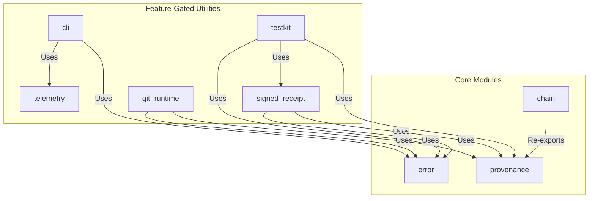
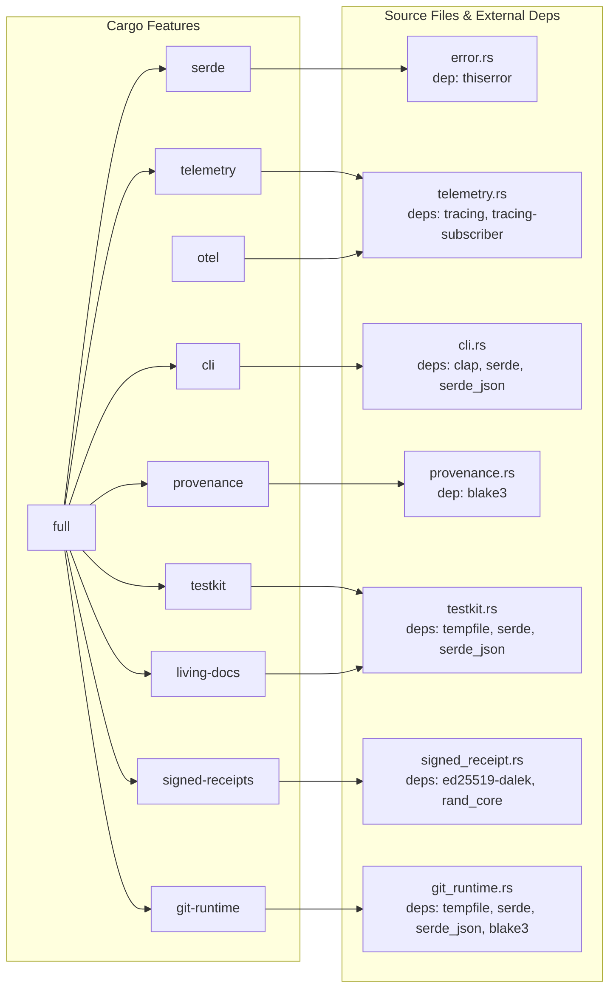
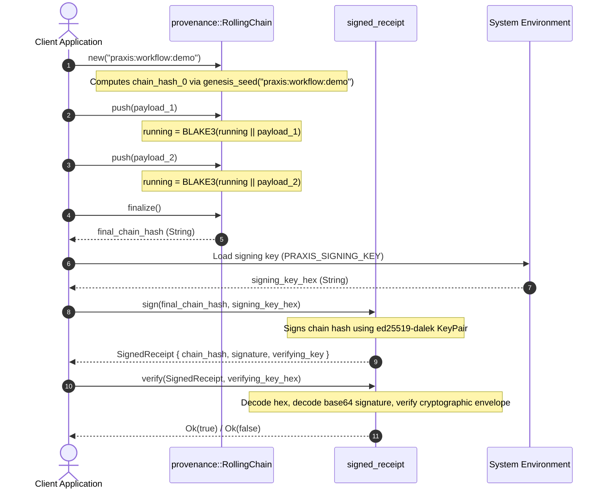
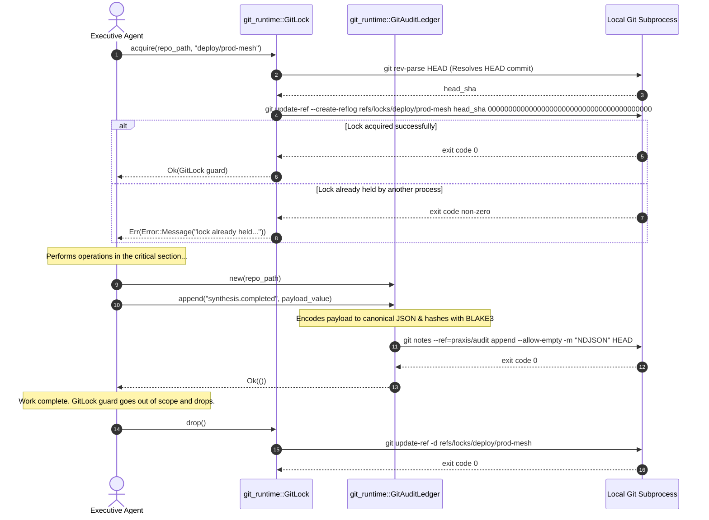

# Crate: `chatman-common`

The `chatman-common` crate serves as the house-standard common utility library for the Praxis workspace and the broader SeanChatman Rust codebase ecosystem. It provides low-dependency, stable primitives for content-based addressing, tamper-evident lineage tracking, cooperative Git-based runtime process locking, telemetry, formatting, and high-assurance testing infrastructure.

---

## 1. Theory and Logic Design

To build a reliable local-first, offline-ready software delivery and synthesis platform, the system relies on cryptographic invariants, deterministic execution chains, and zero-dependency process coordination. `chatman-common` implements these patterns using first-principles logic.

### A. Content-Based Addressing via Canonical JSON and BLAKE3 Hashing

In standard data pipeline architectures, tracking artifact provenance requires a unique, immutable reference to data inputs and outputs. Standard serialization formats (such as JSON) are inherently non-deterministic:
* **Key Ordering**: Field maps are typically unordered (e.g., `serde_json::Map` is backed by a `BTreeMap` or `HashMap` where ordering during iteration depends on memory layout or hash seeds).
* **Whitespace**: Indentation, spacing, newlines, and trailing commas vary across implementations, altering the byte representation without changing semantic value.
* **Float Representation**: Floating-point variants (e.g., `1.0` vs `1`) can resolve to different byte lengths.

To enforce content addressing, the crate couples **Canonical JSON serialization** with **BLAKE3 hashing**.

1. **Canonical JSON Serialization**: Serialized data is stripped of extraneous whitespace, keys are lexicographically sorted, and character sequences are formatted using strict UTF-8 rules.
2. **BLAKE3 Cryptographic Hash**: The serialized canonical byte sequence is hashed using BLAKE3. BLAKE3 is selected over SHA-256 or SHA-3 because of its performance, immunity to length extension attacks, and tree-hashing architecture (which allows parallel chunk hashing and verification).
3. **Format**: Every content-addressed artifact is referred to by its 64-character lowercase hexadecimal hash digest of the BLAKE3 signature.

```
+--------------------+      Sorted Keys      +------------------------+
|  Raw JSON Payload  | ------------------->  | Canonicalized JSON     |
|  (Arbitrary order) |                       | (No spacing, UTF-8)    |
+--------------------+                       +------------------------+
                                                          |
                                                          | BLAKE3 Hash
                                                          v
                                             +------------------------+
                                             | 64-char Hex Digest     |
                                             | (Stable content ID)    |
                                             +------------------------+
```

### B. Tamper-Evident Rolling Chains and Chain Verification

When actions or steps happen sequentially (such as synthetic execution steps or DAG transformations), a mechanism is required to prove that the sequence occurred in a specific order and was not modified, truncated, or re-ordered. 

`chatman-common` implements a **tamper-evident rolling chain hash** scheme:
1. **Domain Isolation**: To prevent replay attacks (where a chain from a development environment is presented as a valid production chain), the sequence starts with a genesis hash tied to a specific domain name.
   $$\text{chain\_hash}_0 = \text{BLAKE3}(\text{genesis\_seed}(\text{domain}))$$
2. **Sequential Hashing**: Each subsequent payload is folded into the chain by concatenating the previous link's hexadecimal hash string with the new payload's raw bytes, then hashing the combined buffer:
   $$\text{chain\_hash}_n = \text{BLAKE3}(\text{chain\_hash}_{n-1} \mathbin{\Vert} \text{payload}_n)$$
3. **Tamper Propagation**: Because each link incorporates the hash of the preceding link, any change to a prior payload, insertion of an unauthorized link, or deletion of a link alters all subsequent hashes. This allows chronological sequences to be verified by recomputing the chain hash.

### C. Git-as-a-Runtime Primitives

In serverless, local-first, or air-gapped environments, relying on external coordinate runtimes (like Redis, Zookeeper, or relational databases) introduces runtime overhead and configuration failure modes. `chatman-common` utilizes the local Git repository filesystem structure as an atomic database.

#### 1. Atomic CAS Locking (`GitLock`)
To implement mutual exclusion across multiple concurrent agent processes, the crate leverages Git's internal reference update engine:
* **The Command**: `git update-ref refs/locks/<lock_name> <head_sha> 0000000000000000000000000000000000000000`
* **Atomic CAS Semantics**: The final parameter is the expected current OID. Passing all-zeros indicates that the ref **must not exist**.
* **Kernel Guarantees**: Git updates references by writing a temporary lockfile and executing an atomic POSIX `rename(2)` system call to finalize the write. Under high concurrency, only one process's rename call succeeds; the other processes receive an error indicating that the ref is already held.
* **RAII Release**: The `GitLock` struct implements `Drop`. When the guard goes out of scope, it deletes the lock ref via `git update-ref -d refs/locks/<lock_name>`, freeing the lock for other processes.

#### 2. Append-Only Auditing (`GitAuditLedger`)
To maintain an immutable, tamper-evident log of execution events without spinning up database servers:
* **Storage Path**: The ledger writes to Git notes under a custom reference namespace (such as `refs/notes/praxis/audit`).
* **Content Immutability**: Git notes are stored as Git blobs inside the object database, which is content-addressed and cryptographically secured by SHA-1/SHA-256. Appending records writes a new note object containing the previous lines plus the new line (using NDJSON format).
* **Self-Verifying Entries**: Each NDJSON line (`AuditEntry`) records the epoch timestamp, dot-separated event type, canonical payload hash, and the JSON payload itself. This ensures that any historical tampering changes the note commit OID, which would fail verification.

---

## 2. Internal Architecture

### A. Architectural Module Topology
The structural relationship and dependency flow among modules inside the `chatman-common` crate:



### B. Module & Feature Gate Layout
The following diagram maps the crate's conditional compilation flags (`Cargo.toml` features) to their respective Rust source modules and third-party dependencies:



### C. Data Flow: Cryptographic Chain Generation & Receipt Attestation
This sequence diagram shows the pipeline for generating a rolling hash chain over a list of payloads, signing the final state, and verifying the receipt:



### D. Cooperative Mutex & Audit Ledger Sequencing
This diagram shows how processes utilize Git command line tools via `git_runtime` to obtain an atomic lock and write records to the repository's database:



---

## 3. API Signatures & Examples

This section contains technical documentation of the crate's public API. Each module is listed with its function/struct signatures and verified Rust usage examples.

### A. Module: `error`

Provides a crate-wide error type built on `thiserror`.

#### API Signatures
```rust
#[derive(Debug, thiserror::Error)]
pub enum Error {
    #[error("{0}")]
    Message(String),

    #[error(transparent)]
    Io(#[from] std::io::Error),

    #[cfg(feature = "serde")]
    #[error(transparent)]
    Json(#[from] serde_json::Error),
}

impl Error {
    /// Helper to construct a plain message error.
    pub fn msg(m: impl Into<String>) -> Self;
}

pub type Result<T, E = Error> = core::result::Result<T, E>;
```

#### Usage Example
```rust
use chatman_common::{Error, Result};

fn process_transaction(val: i32) -> Result<()> {
    if val < 0 {
        return Err(Error::msg("Value cannot be negative"));
    }
    Ok(())
}
```

---

### B. Modules: `provenance` and `chain`

Provides content-addressing and rolling hash chain primitives. `chain` re-exports `provenance` items under a stable interface.

#### API Signatures
```rust
/// Compute the BLAKE3 hash of bytes as a lowercase hex string.
pub fn content_address(bytes: &[u8]) -> String;

/// Check if string is a valid 64-char lowercase hexadecimal digest.
pub fn is_valid_digest(s: &str) -> bool;

/// Derive the genesis hash for a domain chain.
pub fn genesis_seed(domain: &str) -> String;

/// Fold a payload into a running chain hash string.
pub fn fold_event(prev_hex: &str, payload: &[u8]) -> String;

/// Recompute a complete chain hash for an ordered sequence of payloads.
pub fn recompute_chain<'a>(
    domain: &str,
    payloads: impl IntoIterator<Item = &'a [u8]>,
) -> String;

/// Stateful hasher that maintains a running chain hash.
pub struct RollingChain {
    running: String,
    count: usize,
}

impl RollingChain {
    pub fn new(domain: &str) -> Self;
    pub fn push(&mut self, payload: &[u8]);
    pub fn len(&self) -> usize;
    pub fn is_empty(&self) -> bool;
    pub fn current(&self) -> &str;
    pub fn finalize(self) -> String;
}

/// Simple incremental BLAKE3 streaming hasher.
pub struct RollingHash {
    hasher: blake3::Hasher,
}

impl RollingHash {
    pub fn new() -> Self;
    pub fn update(&mut self, bytes: &[u8]);
    pub fn finalize(self) -> String;
}
```

#### Usage Example
```rust
use chatman_common::chain::{content_address, genesis_seed, fold_event, RollingChain};

fn run_pipeline() {
    let domain = "praxis:workflow:demo";
    
    // 1. Manual folding
    let genesis = genesis_seed(domain);
    let step_1 = fold_event(&genesis, b"action-run-solver");
    let step_2 = fold_event(&step_1, b"action-optimize-mesh");
    
    // 2. Stateful RollingChain helper
    let mut chain = RollingChain::new(domain);
    chain.push(b"action-run-solver");
    chain.push(b"action-optimize-mesh");
    let final_hash = chain.finalize();
    
    assert_eq!(step_2, final_hash);
    assert_eq!(content_address(b"action-run-solver").len(), 64);
}
```

---

### C. Module: `signed_receipt`

Provides ed25519 cryptographic signatures for non-repudiable audit receipts (requires feature `signed-receipts`).

#### API Signatures
```rust
#[derive(Debug, Clone, serde::Serialize, serde::Deserialize)]
pub struct SignedReceipt {
    pub chain_hash: String,
    pub signature: String,
    pub verifying_key: String,
}

pub struct KeyPair {
    signing: ed25519_dalek::SigningKey,
}

impl KeyPair {
    pub fn generate() -> Self;
    pub fn from_hex(hex: &str) -> Result<Self>;
    pub fn signing_key_hex(&self) -> String;
    pub fn verifying_key_hex(&self) -> String;
}

pub fn sign(chain_hash: &str, signing_key_hex: &str) -> Result<SignedReceipt>;
pub fn verify(signed_receipt: &SignedReceipt, verifying_key_hex: &str) -> Result<bool>;
pub fn signing_key_from_env() -> Result<String>;
pub fn sign_with_env_key(chain_hash: &str) -> Result<SignedReceipt>;
```

#### Usage Example
```rust
use chatman_common::signed_receipt::{KeyPair, sign, verify};

fn execute_receipt_cycle() -> chatman_common::Result<()> {
    let keys = KeyPair::generate();
    let signing_key = keys.signing_key_hex();
    let verifying_key = keys.verifying_key_hex();
    
    let hash = "d301f2efca5e59b2a758784ef3b2f5b4d758f2efca5e59b2a758784ef3b2f5b4";
    
    // Sign receipt
    let receipt = sign(hash, &signing_key)?;
    
    // Verify receipt
    let is_valid = verify(&receipt, &verifying_key)?;
    assert!(is_valid);
    
    Ok(())
}
```

---

### D. Module: `cli`

Provides terminal output formatting, color mode selection, and standard arguments (requires feature `cli`).

#### API Signatures
```rust
#[derive(Debug, Clone, PartialEq, clap::ValueEnum)]
pub enum OutputFormat { Json, Yaml, Text }

#[derive(Debug, Clone, PartialEq, clap::ValueEnum)]
pub enum ColorMode { Auto, Always, Never }

impl ColorMode {
    pub fn enabled(&self, is_tty: bool) -> bool;
}

pub mod color {
    pub fn bold(text: &str) -> String;
    pub fn green(text: &str) -> String;
    pub fn red(text: &str) -> String;
    pub fn yellow(text: &str) -> String;
    pub fn dim(text: &str) -> String;
}

#[derive(Debug, Clone, clap::Parser)]
pub struct GlobalArgs {
    #[arg(long, value_enum, default_value = "text")]
    pub format: OutputFormat,

    #[arg(long, value_enum, default_value = "auto")]
    pub color: ColorMode,

    #[arg(short = 'v', action = clap::ArgAction::Count)]
    pub verbose: u8,
}

impl GlobalArgs {
    pub fn color_enabled(&self) -> bool;
}

pub fn print_output<T, F>(value: &T, format: &OutputFormat, text_fn: F) -> Result<()>
where
    T: serde::Serialize,
    F: FnOnce(&T) -> String;

pub fn init(args: &GlobalArgs, service_name: &str) -> Result<()>;
```

#### Usage Example
```rust
use chatman_common::cli::{GlobalArgs, OutputFormat, print_output, color};
use serde::Serialize;

#[derive(Serialize)]
struct Status {
    online: bool,
    latency_ms: u32,
}

fn print_status(args: &GlobalArgs) -> chatman_common::Result<()> {
    let stat = Status { online: true, latency_ms: 12 };
    
    print_output(&stat, &args.format, |s| {
        let status_str = if s.online { color::green("ONLINE") } else { color::red("OFFLINE") };
        format!("System: {} ({} ms)", status_str, s.latency_ms)
    })
}
```

---

### E. Module: `telemetry`

Provides structured trace/log initialization using `tracing` (requires feature `telemetry`).

#### API Signatures
```rust
/// Initialize tracing subscribers and env filter defaults.
pub fn init_tracing(service_name: &str) -> Result<()>;

/// Flushes tracing on drop.
pub struct TracingGuard {
    _private: (),
}

impl TracingGuard {
    pub fn new(service_name: &str) -> Result<Self>;
}
```

#### Usage Example
```rust
use chatman_common::telemetry::TracingGuard;

fn main() {
    let _guard = TracingGuard::new("mesh-synth").expect("Telemetry init failed");
    tracing::info!("Tracing system active and processing tasks");
}
```

---

### F. Module: `testkit`

Provides test assertions, snapshot comparisons, Arrange-Act-Assert state transitions, and living document builders (requires feature `testkit`).

#### API Signatures
```rust
/// Assert data bytes match golden file contents. 
/// Re-write with UPDATE_GOLDEN=1.
pub fn assert_golden(actual: &[u8], path: &std::path::Path) -> Result<()>;

/// Assert text matches snap file.
/// Update with UPDATE_SNAPSHOTS=1.
pub fn assert_snapshot(name: &str, actual: &str, snapshots_dir: &std::path::Path);

/// Deterministically generate version 5 UUID from string seed.
pub fn deterministic_uuid(seed: &str) -> String;

/// Request a free ephemeral TCP port from the OS.
pub fn allocate_ephemeral_port() -> u16;

// AAA Phase types
pub struct Arrange;
pub struct Act;
pub struct Assert;

pub struct TestState<Phase> { /* phantom fields */ }

impl TestState<Arrange> {
    pub fn new() -> Self;
    pub fn act(self) -> TestState<Act>;
}
impl TestState<Act> {
    pub fn assert(self) -> TestState<Assert>;
}

// Environmental records
pub struct EnvironmentFingerprint {
    pub os: String,
    pub rust_version: &'static str,
    pub target: &'static str,
    pub timestamp_unix: i64,
}

pub struct TestReceipt {
    pub test_name: String,
    pub passed: bool,
    pub duration_ms: u64,
    pub environment: EnvironmentFingerprint,
    pub chain_hash: Option<String>,
    #[cfg(feature = "signed-receipts")]
    pub signed: Option<chatman_common::signed_receipt::SignedReceipt>,
}

impl TestReceipt {
    pub fn record(test_name: impl Into<String>, passed: bool, duration_ms: u64) -> Self;
    pub fn capture<F: FnOnce()>(test_name: impl Into<String>, f: F) -> Self;
    #[cfg(feature = "signed-receipts")]
    pub fn sign(mut self) -> Self;
    #[cfg(feature = "signed-receipts")]
    pub fn sign_with(mut self, signing_key_hex: &str) -> crate::Result<Self>;
}

// Macros
#[macro_export]
macro_rules! assert_fail {
    ($expr:expr, $pat:pat) => { ... };
    ($expr:expr) => { ... };
}

#[macro_export]
macro_rules! skip_without_docker {
    () => { ... };
}

#[macro_export]
macro_rules! performance_test {
    ($name:ident, $sla_ms:expr, $body:block) => { ... };
}
```

#### Living Documentation API (feature = `living-docs`)
```rust
#[derive(Debug, Clone)]
pub enum DocEvent {
    Section(String),
    Para(String),
    Code { lang: String, body: String },
    Table { header: Vec<String>, rows: Vec<Vec<String>> },
    KeyValue(Vec<(String, String)>),
    Assertion { label: String, passed: bool },
    Mermaid(String),
    ChainHash(String),
}

pub struct DocContext {
    name: String,
    events: Vec<DocEvent>,
    output_dir: std::path::PathBuf,
    finished: bool,
}

impl DocContext {
    pub fn for_test(name: impl Into<String>) -> Self;
    pub fn with_output_dir(mut self, dir: impl Into<std::path::PathBuf>) -> Self;
    pub fn say(&mut self, text: &str);
    pub fn say_section(&mut self, heading: &str);
    pub fn say_code(&mut self, lang: &str, body: &str);
    pub fn say_table(&mut self, header: &[&str], rows: &[&[&str]]);
    pub fn say_mermaid(&mut self, dsl: &str);
    pub fn say_key_value(&mut self, pairs: &[(&str, &str)]);
    pub fn say_and_assert(&mut self, label: &str, cond: bool);
    pub fn render_markdown(&self) -> Vec<u8>;
    pub fn finish(mut self) -> crate::Result<()>;
}

#[macro_export]
macro_rules! doc_assert {
    ($ctx:expr, $label:expr, $cond:expr) => { ... };
}
```

#### Usage Example
```rust
use chatman_common::testkit::{TestState, Arrange, deterministic_uuid, assert_snapshot};
use std::path::Path;

#[test]
fn test_mesh_generation_state() {
    // 1. Compile-time AAA pattern tracking
    let state = TestState::<Arrange>::new();
    let unique_id = deterministic_uuid("test-mesh-node-0");
    
    // Transition to execution (Act)
    let state = state.act();
    let result_text = format!("node-id: {unique_id}\nstatus: active\n");
    
    // Transition to verification (Assert)
    let _state = state.assert();
    
    // Snapshot assertion
    let snap_dir = Path::new("tests/snapshots");
    assert_snapshot("mesh_gen_test", &result_text, snap_dir);
}
```

---

### G. Module: `git_runtime`

Provides Git-based distributed CAS locks and append-only notes logs (requires feature `git-runtime`).

#### API Signatures
```rust
pub struct GitLock {
    ref_name: String,
    repo_path: std::path::PathBuf,
}

impl GitLock {
    /// Atomically acquire a lock via git update-ref.
    pub fn acquire(repo: &std::path::Path, lock_name: &str) -> Result<Self>;
    
    /// Get the ref name representing the lock.
    pub fn ref_name(&self) -> &str;
}

#[derive(Debug, Clone, serde::Serialize, serde::Deserialize)]
pub struct AuditEntry {
    pub timestamp: u64,
    pub event_type: String,
    pub payload_hash: String,
    pub payload: serde_json::Value,
}

pub struct GitAuditLedger {
    repo_path: std::path::PathBuf,
    ref_name: String,
}

impl GitAuditLedger {
    pub fn new(repo: &std::path::Path) -> Self;
    pub fn with_ref(repo: &std::path::Path, ref_name: &str) -> Self;
    pub fn append(&self, event_type: &str, payload: &serde_json::Value) -> Result<()>;
    pub fn read_all(&self) -> Result<Vec<AuditEntry>>;
    pub fn ref_name(&self) -> &str;
}
```

#### Usage Example
```rust
use chatman_common::git_runtime::{GitLock, GitAuditLedger};
use serde_json::json;
use std::path::Path;

fn perform_safe_git_write() -> chatman_common::Result<()> {
    let repo = Path::new(".");
    
    // 1. Acquire filesystem lock via Git reference system
    let _lock = GitLock::acquire(repo, "pipeline/step-3")
        .map_err(|e| chatman_common::Error::msg(format!("Lock already held: {e}")))?;
        
    // 2. Perform writing tasks...
    let audit_data = json!({
        "agent": "worker-42",
        "action": "synthesis",
        "output_size_bytes": 1024
    });
    
    // 3. Append to the repository notes log ledger
    let ledger = GitAuditLedger::new(repo);
    ledger.append("synthesis.succeeded", &audit_data)?;
    
    // 4. Retrieve log history
    let logs = ledger.read_all()?;
    for log in logs {
        println!("Event: {} Hash: {}", log.event_type, log.payload_hash);
    }
    
    Ok(()) // Lock released automatically on drop here
}
```
