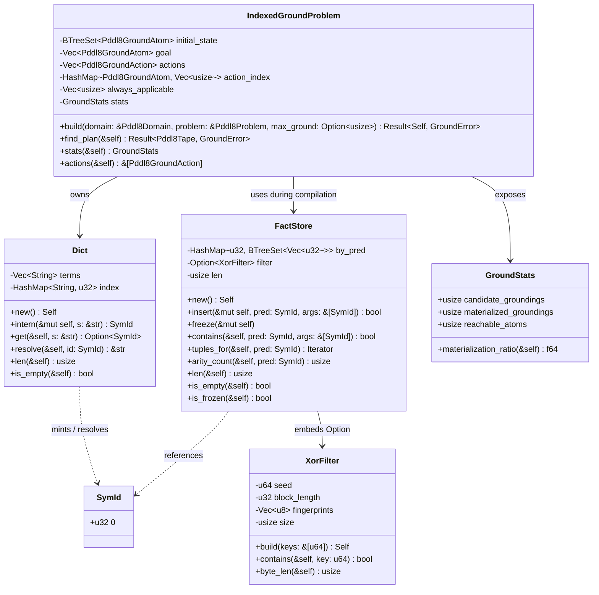
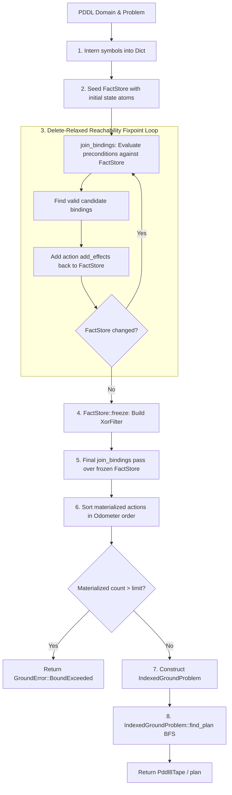
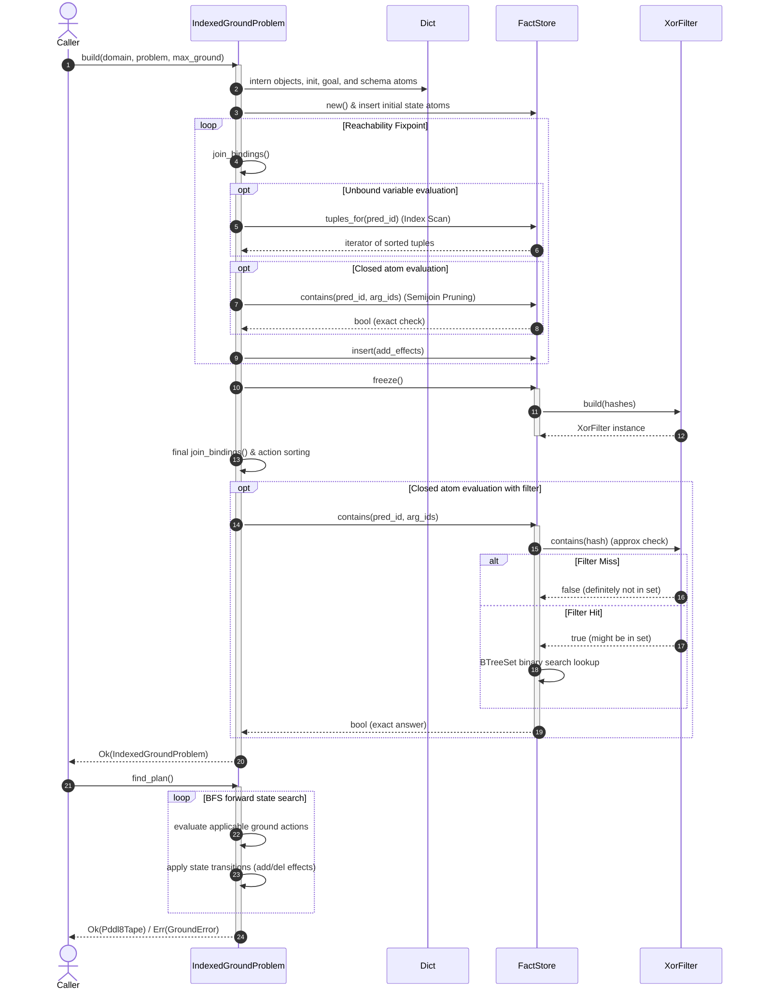

# Crate: `pddl-index`

The `pddl-index` crate provides a high-performance, dictionary-encoded relational database join engine designed to solve the **Naive Grounding Problem** in classical PDDL planning. It serves as a memory-efficient, drop-in replacement for the naive grounding pipeline by materializing only the reachable action set.

- **Path**: [`crates/pddl-index`](file:///Users/sac/praxis/crates/pddl-index)

---

## 1. Theory and Logic Design

### The Naive Grounding Problem & Combinatorial Explosion
In classical planning (STRIPS/PDDL), action schemas contain parameters restricted by type hierarchies. A naive grounder (such as `bcinr_pddl::GroundProblem::build`) materializes the full Cartesian product of type-compatible objects for every parameter of every action schema:
$$\text{Candidates} = \sum_{\text{schemas}} \prod_{i} |\text{objects\_of\_type}(\text{param}_i)|$$
For domains with many parameters or large object sets, this Cartesian product suffers from combinatorial parameter explosion. 

Crucially, in real-world planning domains (e.g., logistics, transit networks, road maps, or supply chains), the static environment structure is highly sparse. For example, a vehicle can only move between physically connected locations. A naive grounder generates every possible combination of vehicles, source locations, and destination locations, even if no road exists between the source and destination. These ground actions are "dead on arrival" because their static preconditions (such as `(link ?from ?to)`) can never be satisfied by the initial state or any reachable state. Materializing and filtering millions of dead actions wastes CPU cycles, allocates gigabytes of unnecessary memory, and slows down the subsequent planning phase.

### The QLever-Style Relational Join Treatment
Rather than materializing the full Cartesian product upfront and discarding invalid states later, `pddl-index` treats action grounding as a **relational database join query over a compact integer ID space**, mirroring triple store and Datalog engine designs (specifically inspired by the QLever RDF engine):

1. **Relational Representation**: Predicates are treated as database relations, and their arguments are columns containing dictionary-encoded integer IDs.
2. **Variables as Join Attributes**: Action schema parameters represent variables. Preconditions sharing the same parameters function as join constraints.
3. **Index Scans**: Unbound variables are resolved by scanning sorted relations.
4. **Semijoins**: Fully-bound parameters are validated using fast membership queries against the relations (semijoins), pruning invalid combinations as early as possible.

### Dictionary Encoding (`SymId` u32)
All symbol strings (predicates, object names, and type names) are interned into a global dictionary. 
* **`SymId(pub u32)`** is a type-safe wrapper around a raw `u32` value. Wrapping the integer prevents mixing up symbol IDs with array indexes, arity values, or other numeric constants.
* **`Dict`** maintains a bidirectional mapping: a sequential `Vec<String>` for ID-to-string lookups and a `HashMap<String, u32>` for string-to-ID interning.
* **Benefits**: 
  - Strings are stored exactly once in memory.
  - Relational indexes and action structures store only `SymId` values (`4 bytes` per symbol), minimizing memory footprint.
  - Value comparisons, equality checks, and sorting operations become simple `u32` integer operations rather than expensive string comparisons.

### Delete-Relaxed Reachability Fixpoint Calculations
To determine which ground atoms can ever possibly hold true, the engine computes a reachability fixpoint in a delete-relaxed manner:
1. The initial state facts are dictionary-encoded and inserted into a `FactStore` representing the set of reachable atoms $R$.
2. In a loop, the engine evaluates the preconditions of all action schemas against the current fact set $R$. This evaluation is performed using relational joins (`join_bindings`).
3. For every valid parameter binding found, the schema's `add_effects` are grounded and inserted back into the `FactStore` $R$. Delete effects are ignored (relaxed reachability).
4. The loop runs until a fixpoint is reached (i.e., an iteration completes with no new facts inserted).
5. Any ground action whose preconditions cannot be satisfied within this final set $R$ is mathematically unreachable and is safely pruned.

During the fixpoint calculation, the `FactStore` remains "unfrozen" because rebuilding membership filters on every iteration would be prohibitively expensive.

### Join-Driven Materialization & Index Scans / Semijoin Pruning
Once the fixpoint is reached, a final materialization pass grounds the reachable actions. The engine executes relational joins over the action schema preconditions:
* **Precondition Order**: Preconditions are processed sequentially.
* **Index Scan**: If a precondition introduces at least one unbound variable, the engine scans the sorted argument-tuple relations for that predicate (`FactStore::tuples_for`). This acts as an ordered index scan.
* **Semijoin Pruning**: If all variables in a precondition are already bound, the query becomes a membership check. The engine queries the relation to check if the specific ground tuple exists. This acts as a semijoin, pruning the partial bindings immediately.
* **Effect-Only Parameters**: Parameters that appear in the effects of an action but not in its preconditions are expanded over their type-compatible candidate lists at the very end.
* **Odometer Sorting**: Materialized actions are sorted in lexicographical candidate order to guarantee the exact sequence alignment with the naive grounder's output, maintaining deterministic plan equivalence.

### XOR-Filter-Pruned Membership Gates
While the sorted `BTreeSet` inside `FactStore` provides $O(\log N)$ search complexity, querying it millions of times during join evaluation becomes a CPU bottleneck. To accelerate closed membership checks:
1. **XOR Filter (Graf & Lemire 2020)**: When the `FactStore` is frozen, it constructs an 8-bit `XorFilter` over a 64-bit FNV-1a rolling hash of each reachable atom.
2. **Zero False Negatives**: The filter is mathematically guaranteed to have zero false negatives. If an atom is reachable, the filter will *always* return `true`.
3. **Low False Positives**: The filter has a false positive rate of approximately $0.4\%$.
4. **Fastrange Reduction**: Rather than using division (`%`) to map key hashes to block positions, the filter uses Daniel Lemire's `fastrange` reduction:
   $$\text{reduce}(x, n) = \frac{x \times n}{2^{32}}$$
   This reduces three byte-index computations to simple multiplications and bit-shifts.
5. **Double-Gate Architecture**:
   - When checking `FactStore::contains`, the hash of the target atom is probed against the `XorFilter`.
   - If the filter returns `false`, the atom is definitely unreachable, and the engine rejects it immediately with zero `BTreeSet` lookups.
   - If the filter returns `true` (a hit or a $0.4\%$ false positive), the engine falls back to the exact binary search in the `BTreeSet` to verify membership.

---

## 2. Internal Architecture

### Module Organization
The `pddl-index` crate consists of four key modules:
* **`dict`**: Manages the bidirectional mapping between strings and dense `u32` IDs (`SymId`).
* **`xorf`**: Implements the approximate membership XOR filter using `splitmix64` mixing and `fastrange` reduction.
* **`facts`**: Manages `FactStore`, which holds partitioned sorted argument tuples in `BTreeSet` structures along with an optional `XorFilter`.
* **`ground`**: Implements the `IndexedGroundProblem`, coordinates the fixpoint calculation, executes the relational joins, materializes the actions, and performs BFS plan search.

### Structural Relationships


### Data Flow


### Execution Sequence


---

## 3. API Signatures & Examples

### Constants
```rust
/// Default auto-select cutoff threshold. If the naive grounder would materialize 
/// more than this number of actions, the indexed grounding path is preferred.
pub const GROUND_INDEX_THRESHOLD: usize = 256;
```

### Free Functions
```rust
/// Computes an O(schemas) upper bound on naive materialization candidates.
/// Sums the product of type-compatible object counts across all schemas.
#[must_use]
pub fn candidate_estimate(domain: &Pddl8Domain, problem: &Pddl8Problem) -> usize;

/// Determines if the indexed grounder should be preferred over the naive grounder
/// based on the computed candidate estimate and GROUND_INDEX_THRESHOLD.
#[must_use]
pub fn should_use_indexed(domain: &Pddl8Domain, problem: &Pddl8Problem) -> bool;

/// Convenience function that grounds the problem and runs BFS, 
/// returning the plan and the grounding statistics.
pub fn solve_indexed(
    domain: &Pddl8Domain,
    problem: &Pddl8Problem,
) -> Result<(Pddl8Tape, GroundStats), GroundError>;
```

### Key Structs & Enums

#### `IndexedGroundProblem`
```rust
pub struct IndexedGroundProblem {
    initial_state: BTreeSet<Pddl8GroundAtom>,
    goal: Vec<Pddl8GroundAtom>,
    actions: Vec<Pddl8GroundAction>,
    action_index: HashMap<Pddl8GroundAtom, Vec<usize>>,
    always_applicable: Vec<usize>,
    stats: GroundStats,
}

impl IndexedGroundProblem {
    /// Builds the indexed ground representation, limiting actions to `max_ground`.
    /// If `max_ground` is None, the system default limit is enforced.
    pub fn build(
        domain: &Pddl8Domain,
        problem: &Pddl8Problem,
        max_ground: Option<usize>,
    ) -> Result<Self, GroundError>;

    /// Executes BFS forward search to find a valid plan.
    pub fn find_plan(&self) -> Result<Pddl8Tape, GroundError>;

    /// Obtains the grounding optimization statistics.
    #[must_use]
    pub fn stats(&self) -> GroundStats;

    /// Returns the slice of materialized ground actions.
    #[must_use]
    pub fn actions(&self) -> &[Pddl8GroundAction];
}
```

#### `GroundStats`
```rust
#[derive(Debug, Clone, Copy, PartialEq, Eq)]
pub struct GroundStats {
    /// Ground actions the naive grounder would materialize.
    pub candidate_groundings: usize,
    /// Ground actions this grounder actually materialized (reachable subset).
    pub materialized_groundings: usize,
    /// Number of ground facts in the reachability fixpoint FactStore.
    pub reachable_atoms: usize,
}

impl GroundStats {
    /// Returns the fraction of materialized vs candidate groundings.
    /// Returns 1.0 if candidate_groundings is 0.
    #[must_use]
    pub fn materialization_ratio(&self) -> f64;
}
```

#### `GroundError`
```rust
#[derive(Debug, Clone, PartialEq, Eq)]
pub enum GroundError {
    /// No schema produced any reachable ground action.
    EmptyGrounding,
    /// Forward search exhausted the search space without finding a valid plan.
    NoAdmittedPlan,
    /// More reachable ground actions were materialized than the allowed limit.
    BoundExceeded { limit: usize, got: usize },
}

impl std::fmt::Display for GroundError {
    fn fmt(&self, f: &mut std::fmt::Formatter<'_>) -> std::fmt::Result;
}

impl std::error::Error for GroundError {}
```

---

## 4. Usage Example

The following code illustrates how to dynamically choose the optimal grounding strategy using `should_use_indexed`, ground the problem, print efficiency metrics, and locate a plan.

```rust
use pddl_index::{should_use_indexed, IndexedGroundProblem, GroundStats, GroundError};
use wasm4pm_compat::pddl::{Pddl8Domain, Pddl8Problem, Pddl8Tape};

/// Solves a PDDL problem choosing the optimal grounding strategy based on size.
pub fn solve_pddl(
    domain: &Pddl8Domain,
    problem: &Pddl8Problem,
) -> Result<Pddl8Tape, Box<dyn std::error::Error>> {
    // 1. Evaluate whether the problem is large enough to justify the indexed path
    if should_use_indexed(domain, problem) {
        println!("Domain is large. Utilizing Indexed Grounder...");

        // 2. Build the indexed ground problem
        let ground_prob = IndexedGroundProblem::build(domain, problem, None)?;
        
        // 3. Print grounding optimization statistics
        let stats: GroundStats = ground_prob.stats();
        println!(
            "Naive candidates: {}, Materialized: {}, Reachable atoms: {}, Savings ratio: {:.2}%",
            stats.candidate_groundings,
            stats.materialized_groundings,
            stats.reachable_atoms,
            stats.materialization_ratio() * 100.0
        );

        // 4. Find the plan using the pruned action set
        let plan: Pddl8Tape = ground_prob.find_plan()?;
        Ok(plan)
    } else {
        println!("Domain is small. Falling back to Naive Grounder...");
        // Naive fallback execution would go here.
        // For demonstration, we use a simple solve fallback:
        let ground_prob = IndexedGroundProblem::build(domain, problem, None)?;
        let plan = ground_prob.find_plan()?;
        Ok(plan)
    }
}
```
