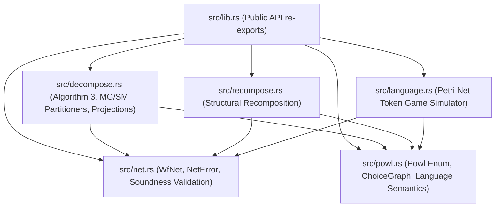
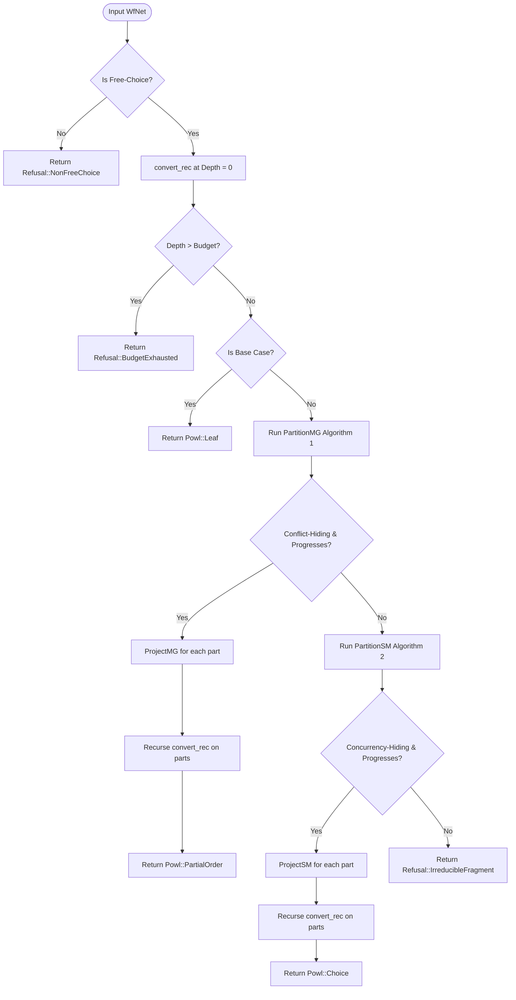
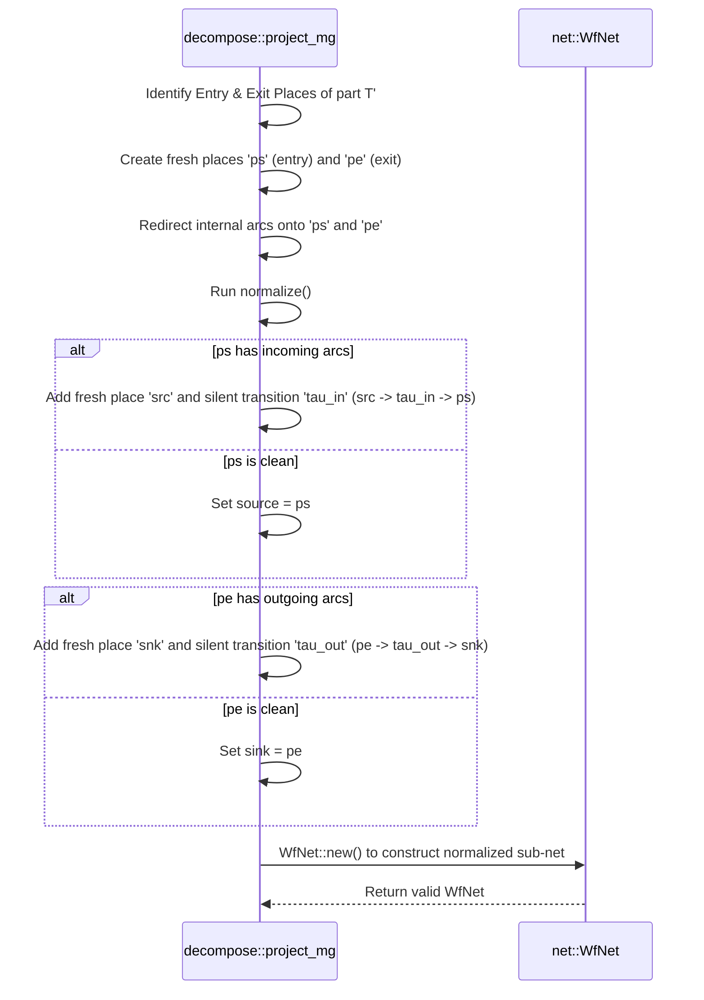

# Crate: `powl2-decompose`

A high-performance Rust library implementing the Kourani, Park, and van der Aalst Stage-1 recursive decomposition algorithm (*"Hierarchical Decomposition of Separable Workflow-Nets"*, arXiv:2602.15739). This crate transforms safe & sound workflow nets (WF-nets) into equivalent process models in the POWL 2.0 language.

---

## 1. Theory & Logic Design

The `powl2-decompose` crate is designed around process mining and Petri net theory. It bridges the gap between low-level bipartite Petri nets and high-level, human-readable process trees (POWL 2.0).

### 1.1 Safe and Sound Workflow Nets (WF-nets)

A Petri net is a bipartite directed graph $N = (P, T, F)$ consisting of:
*   A finite set of places $P$.
*   A finite set of transitions $T$ (where $P \cap T = \emptyset$).
*   A flow relation $F \subseteq (P \times T) \cup (T \times P)$ representing directed arcs.

A **Workflow Net (WF-net)** is a subclass of Petri nets satisfying the following structural constraints:
1.  **Unique Source**: There exists a unique place $source \in P$ with no incoming arcs: $\bullet source = \emptyset$.
2.  **Unique Sink**: There exists a unique place $sink \in P$ with no outgoing arcs: $sink\bullet = \emptyset$.
3.  **Path Connectivity**: Every node $n \in P \cup T$ lies on a directed path from $source$ to $sink$.

A WF-net is **sound** if it satisfies three behavioral properties under token game semantics:
*   **Option to Complete**: From any marking $M$ reachable from the initial marking $[source]$, it is always possible to reach the terminal marking $[sink]$.
*   **Proper Termination**: If the terminal marking $[sink]$ is reached, no other tokens remain in the net (i.e., $M \ge [sink] \implies M = [sink]$).
*   **No Dead Transitions**: For every transition $t \in T$, there is some firing sequence from the initial marking $[source]$ that enables $t$.

A sound WF-net is **safe** if no reachable marking contains more than one token in any place: $\forall M \in [source]\rangle, \forall p \in P, M(p) \le 1$. The `powl2-decompose` crate accepts only safe & sound WF-nets as inputs.

### 1.2 POWL 2.0 Process Models

POWL (Partial Order Workflow Language) 2.0 defines a strict subclass of sound WF-nets represented as hierarchical trees. A POWL model $\psi$ is defined recursively:
1.  **Leaves**: $\text{Leaf}(l)$, representing an atomic transition with a label $l \in \Sigma$ or a silent step $\tau$ (represented as `None`).
2.  **Partial Orders ($\prec$)**: $\prec(\psi_1, \psi_2, \dots, \psi_n)$, where child submodels are executed concurrently subject to a strict partial order relation $\prec \subset \{1..n\} \times \{1..n\}$. An event in $\psi_j$ can fire only after all events in predecessor $\psi_i$ (where $i \prec j$) have finished.
3.  **Choice Graphs ($\gamma$)**: $\gamma(\psi_1, \psi_2, \dots, \psi_n)$, where routing is governed by a directed graph $G = (V, E)$ over the vertex set $V = \{\text{Start}\} \cup \{\text{Child}(0), \dots, \text{Child}(n-1)\} \cup \{\text{End}\}$. The graph represents exclusive choices, joins, and cyclic loop behavior. A token starts at $\text{Start}$ and traverses directed edges to child indices and eventually to $\text{End}$.

The language semantics of POWL 2.0 models are defined by the set of all possible firing sequences (traces), with silent steps ($\tau$) omitted. For cyclic models, the full language is infinite, so the crate computes bounded prefix languages ($\mathcal{L}_k$) containing traces up to length $k$.

### 1.3 Stage-1 Recursive Decomposition Algorithm

The Stage-1 decomposition algorithm recursively partitions the transition set $T$ of a WF-net. It runs two primary partitioners:

#### 1.3.1 `PartitionMG` (Algorithm 1) - Conflict-Hiding
Groups transitions such that exclusive choices (conflicts) are internal to the partition parts. The top-level interface between parts then exposes a conflict-free marked graph (partial order / concurrency) structure.
*   **Methodology**: Initialize each transition in a singleton part. For every place $p \in P$:
    *   If $p$ has multiple outgoing transitions (XOR-split), group all transitions that are reached by *some* but *not all* branches of $p$ using Floyd-Warshall reachability closures.
    *   If $p$ has multiple incoming transitions (XOR-join), group all transitions that reach *some* but *not all* branches of $p$.
*   **Admission**: The resulting partition is conflict-hiding (Def 4.1) iff no place is a top-level choice node and every part has a single (equivalence-class) entry and exit interface.

#### 1.3.2 `PartitionSM` (Algorithm 2) - Concurrency-Hiding
Groups transitions such that parallel splits and joins are internal to the parts. The top-level interface between parts then exposes a state machine (choice graph) structure.
*   **Methodology**: Initialize each transition in a singleton part.
    *   For every transition $t_{split}$ with multiple outgoing places (AND-split), compute the forward restricted reachability $R^{\rightarrow}_{\neg t_{split}}(p)$ from each output place $p$. Group transitions that are reachable from some but not all of these branches, along with $t_{split}$.
    *   For every transition $t_{join}$ with multiple incoming places (AND-join), compute the backward restricted reachability $R^{\leftarrow}_{\neg t_{join}}(p)$ from each input place $p$. Group transitions that reach some but not all of these branches, along with $t_{join}$.
*   **Admission**: The resulting partition is concurrency-hiding (Def 4.4) iff every part has exactly one entry place and one exit place.

#### 1.3.3 Recursion and Projection Loop (Algorithm 3)
At each recursion step:
1.  Check for the base case (a single transition connecting the source place to the sink place). If found, return `Powl::Leaf`.
2.  Compute `PartitionMG`. If it has size $> 1$, is conflict-hiding, and makes progress (meaning the structural signature of the projections differs from the parent net's signature), project the net onto each part using `ProjectMG` and recurse. Return `Powl::PartialOrder` with the Hasse execution order relation.
3.  Compute `PartitionSM`. If it has size $> 1$, is concurrency-hiding, and makes progress, project the net onto each part using `ProjectSM` and recurse. Return `Powl::Choice` with the choice graph routing edges.
4.  If both partitioners fail to make progress, the net is refused.

### 1.4 Separability as the Admission Predicate

The decomposition algorithm is complete precisely on the **separable** class of WF-nets (nets constructed by nesting state machines and marked graphs). When the algorithm encounters a net that falls outside this class (e.g., non-free-choice nets or irreducible fragments like the flower net), it does not approximate or emit invalid models.

Instead, the crate enforces a strict admission predicate by returning a structured `Refusal` containing:
1.  A classified `RefusalReason` (such as `NonFreeChoice` or `IrreducibleFragment`).
2.  A content-addressed BLAKE3 receipt hash of the net.

This ensures mathematical soundness: every returned `Powl` model is guaranteed to be semantically equivalent to the input net, and every rejection is a verifiable certificate of non-separability.

### 1.5 Differential Correctness and Round-Tripping

To guarantee semantic correctness, the crate computes bounded languages (traces up to length $k$) using three independent engines:
1.  **Petri Net Bounded Language ($\mathcal{L}_k(N)$)**: Discovered via depth-first token game simulation over the `WfNet` struct.
2.  **POWL Bounded Language ($\mathcal{L}_k(\psi)$)**: Evaluated directly from the hierarchical structures of the `Powl` model (shuffling partial orders and traversing choice graphs).
3.  **Recomposed Net Bounded Language ($\mathcal{L}_k(\text{recompose}(\psi))$)**: The `Powl` model is mapped back to a WF-net using structural patterns, and the token game language of the recomposed net is simulated.

Differential testing ensures that for all admitted separable nets:
$$\mathcal{L}_k(N) = \mathcal{L}_k(\text{convert}(N)) = \mathcal{L}_k(\text{recompose}(\text{convert}(N)))$$

---

## 2. Internal Architecture

### 2.1 Module Structure and Dependencies

The internal crate layout separates input validation, intermediate representation, partitioning algorithms, and verification pipelines:



### 2.2 Recursive Stage-1 Decomposition Flow

The control flow of the `convert` function implements Algorithm 3 with up-front free-choice checks and recursion depth budget enforcement:



### 2.3 Net Projection and Normalization

When projecting a net onto a partition part $T'$, boundary places (entry and exit interfaces) must be unified. To ensure the resulting sub-net remains a structurally sound WF-net (with a unique source place and a unique sink place), a normalization step is performed:



### 2.4 Structural Recomposition Layout

When recomposing a POWL 2.0 model back into a `WfNet` (`recompose`):
*   **Leaf(label)**: Translates to a source place, transition with `label`, sink place, and two connecting arcs.
*   **PartialOrder**: Generates a concurrent structure wrapped by a single silent `po_init` split and `po_fini` join, utilizing intermediate edge places mapped directly from the Hasse cover relation (transitive reduction of the order relation).
*   **Choice**: Generates a state-machine style net where each transition represents a directed edge splicing child exit/sink places to their target entry/source places, enabling cyclic token traversal.

---

## 3. API Signatures & Examples

This section details the primary public Rust APIs of the `powl2-decompose` crate, along with concrete usage examples.

### 3.1 Crate Entrypoints

The main entrypoint functions run Stage-1 decomposition and recomposition:

```rust
/// Convert a safe & sound WF-net into an equivalent POWL 2.0 model,
/// or refuse it as non-separable. Uses the default recursion depth budget of 64.
pub fn convert(net: &WfNet) -> Result<Powl, Refusal>;

/// Convert a safe & sound WF-net into an equivalent POWL 2.0 model
/// with an explicit depth budget.
pub fn convert_with_budget(net: &WfNet, budget: usize) -> Result<Powl, Refusal>;

/// Recompose a POWL 2.0 model back into an equivalent safe & sound WF-net.
pub fn recompose(model: &Powl) -> WfNet;

/// Bounded language of a Petri net up to max trace length.
pub fn language_upto(net: &WfNet, max_len: usize) -> Language;

/// Default recursion depth budget.
pub const DEFAULT_DEPTH_BUDGET: usize = 64;
```

### 3.2 The `WfNet` Struct

`WfNet` represents a safe & sound workflow net. All internal sets are ordered (`BTreeSet`, `BTreeMap`) to ensure that all partitions, projections, and receipts are deterministic.

```rust
use std::collections::{BTreeMap, BTreeSet};

pub type Label = Option<String>;

#[derive(Debug, Clone, PartialEq, Eq)]
pub struct WfNet {
    places: BTreeSet<String>,
    transitions: BTreeMap<String, Label>,
    pt: BTreeSet<(String, String)>,
    tp: BTreeSet<(String, String)>,
    source: String,
    sink: String,
}

impl WfNet {
    /// Build and validate a WF-net. Asserts structural soundness:
    /// 1. No dangling arcs.
    /// 2. Unique source place with empty pre-set.
    /// 3. Unique sink place with empty post-set.
    /// 4. Every place and transition is on a path from source to sink.
    pub fn new(
        places: impl IntoIterator<Item = String>,
        transitions: impl IntoIterator<Item = (String, Label)>,
        pt: impl IntoIterator<Item = (String, String)>,
        tp: impl IntoIterator<Item = (String, String)>,
        source: impl Into<String>,
        sink: impl Into<String>,
    ) -> Result<Self, NetError>;

    pub fn places(&self) -> &BTreeSet<String>;
    pub fn transitions(&self) -> &BTreeMap<String, Label>;
    pub fn source(&self) -> &str;
    pub fn sink(&self) -> &str;
    pub fn label(&self, t: &str) -> Label;
    pub fn post_place(&self, p: &str) -> BTreeSet<String>;
    pub fn pre_place(&self, p: &str) -> BTreeSet<String>;
    pub fn post_trans(&self, t: &str) -> BTreeSet<String>;
    pub fn pre_trans(&self, t: &str) -> BTreeSet<String>;
    
    /// Asserts free-choiceness (Def 3.4): overlap in pre-sets implies equality.
    pub fn is_free_choice(&self) -> bool;
    
    /// Computes transition reachability closure.
    pub fn reaches(&self, t: &str) -> BTreeSet<String>;
    
    /// Forward restricted reachability.
    pub fn fwd_restricted(&self, p: &str, tstop: &str) -> BTreeSet<String>;
    
    /// Backward restricted reachability.
    pub fn bwd_restricted(&self, p: &str, tstop: &str) -> BTreeSet<String>;
    
    pub fn entry_places(&self, part: &BTreeSet<String>) -> BTreeSet<String>;
    pub fn exit_places(&self, part: &BTreeSet<String>) -> BTreeSet<String>;
    pub fn equiv_wrt(&self, p: &str, q: &str, part: &BTreeSet<String>) -> bool;
    
    /// Canonical structural signature used to guard against infinite recursion.
    pub fn signature(&self) -> (usize, usize, usize, Vec<String>);
    
    /// Content hash computed via BLAKE3, used in Refusal receipts.
    pub fn content_hash(&self) -> String;
}
```

`NetError` defines the validation errors:

```rust
#[derive(Debug, Clone, PartialEq, Eq, thiserror::Error)]
pub enum NetError {
    #[error("not a workflow net: {0}")]
    NotWfNet(String),
    #[error("dangling arc: {0}")]
    DanglingArc(String),
}
```

### 3.3 The `Powl` Enum and Choice Structures

`Powl` represents the hierarchical process tree.

```rust
pub type Trace = Vec<String>;
pub type Language = BTreeSet<Trace>;

#[derive(Debug, Clone, PartialEq, Eq)]
pub enum Powl {
    /// A leaf transition (Some(name) = labeled activity, None = silent step tau).
    Leaf(Option<String>),
    
    /// A concurrent block with a partial order constraint.
    /// order holds child index pairs (i, j) where i must finish before j starts.
    PartialOrder {
        children: Vec<Powl>,
        order: BTreeSet<(usize, usize)>,
    },
    
    /// A routing choice block governed by a choice graph.
    Choice {
        children: Vec<Powl>,
        graph: ChoiceGraph,
    },
}

impl Powl {
    /// Computes the bounded trace language generated by this model.
    pub fn language_upto(&self, max_len: usize) -> Language;
}

#[derive(Debug, Clone, PartialEq, Eq)]
pub struct ChoiceGraph {
    pub n: usize,
    pub edges: BTreeSet<(GNode, GNode)>,
}

#[derive(Debug, Clone, Copy, PartialEq, Eq, PartialOrd, Ord)]
pub enum GNode {
    Start,
    End,
    Child(usize),
}
```

### 3.4 Rejections and Receipts

Rejections are modeled via `Refusal`:

```rust
use serde::{Deserialize, Serialize};

#[derive(Debug, Clone, PartialEq, Eq, Serialize, Deserialize)]
pub struct Refusal {
    pub reason: RefusalReason,
    pub net_hash: String,
    pub separable: bool, // Always false
}

#[derive(Debug, Clone, PartialEq, Eq, Serialize, Deserialize)]
pub enum RefusalReason {
    NonFreeChoice {
        transitions: (String, String),
    },
    IrreducibleFragment {
        depth: usize,
    },
    BudgetExhausted {
        budget: usize,
    },
}

impl std::fmt::Display for RefusalReason {
    fn fmt(&self, f: &mut std::fmt::Formatter<'_>) -> std::fmt::Result;
}

impl std::fmt::Display for Refusal {
    fn fmt(&self, f: &mut std::fmt::Formatter<'_>) -> std::fmt::Result;
}
```

---

## 4. Practical Code Examples

### 4.1 Successful Decomposition, Language Generation, and Recomposition

The following example builds a sequence workflow net (`a` then `b`), converts it to a `Powl` model, verifies the token game language against the POWL semantics, and recomposes it back to a Petri Net:

```rust
use std::collections::BTreeSet;
use powl2_decompose::{convert, recompose, WfNet, Powl, Trace};
use powl2_decompose::language::language_upto;

fn main() -> Result<(), Box<dyn std::error::Error>> {
    // 1. Build a sequence workflow net: source -> a -> p1 -> b -> sink
    let net = WfNet::new(
        vec!["source".to_string(), "p1".to_string(), "sink".to_string()],
        vec![
            ("a".to_string(), Some("a".to_string())),
            ("b".to_string(), Some("b".to_string())),
        ],
        vec![
            ("source".to_string(), "a".to_string()),
            ("p1".to_string(), "b".to_string()),
        ],
        vec![
            ("a".to_string(), "p1".to_string()),
            ("b".to_string(), "sink".to_string()),
        ],
        "source",
        "sink",
    )?;

    // 2. Convert to POWL 2.0
    let powl_model = convert(&net).expect("Sequence net is separable and must decompose");
    
    // The sequence net decomposes into a partial order with two leaf child models:
    assert!(matches!(powl_model, Powl::PartialOrder { .. }));
    println!("Successfully decomposed model: {:?}", powl_model);

    // 3. Compare languages (trace depth 4)
    let net_lang = language_upto(&net, 4);
    let powl_lang = powl_model.language_upto(4);
    assert_eq!(net_lang, powl_lang);
    
    let expected_trace: Trace = vec!["a".to_string(), "b".to_string()];
    assert!(net_lang.contains(&expected_trace));
    println!("Languages match: {:?}", net_lang);

    // 4. Recompose back to a sound WfNet
    let recomposed_net = recompose(&powl_model);
    let recomposed_lang = language_upto(&recomposed_net, 4);
    assert_eq!(recomposed_lang, net_lang);
    println!("Round-trip verification successful!");

    Ok(())
}
```

### 4.2 Non-Separable Net Refusal and Receipt Inspection

The following example builds a non-free-choice net and verifies that it is refused with the correct `RefusalReason` and BLAKE3 content hash receipt:

```rust
use powl2_decompose::{convert, WfNet, RefusalReason};

fn main() -> Result<(), Box<dyn std::error::Error>> {
    // Non-free-choice net: transitions sharing a place but having different pre-sets
    let net = WfNet::new(
        vec![
            "p0".to_string(),
            "p1".to_string(),
            "p2".to_string(),
            "p3".to_string(),
        ],
        vec![
            ("t1".to_string(), Some("t1".to_string())),
            ("t2".to_string(), Some("t2".to_string())),
        ],
        vec![
            ("p0".to_string(), "t1".to_string()),
            ("p1".to_string(), "t1".to_string()), // t1 pre-set: {p0, p1}
            ("p1".to_string(), "t2".to_string()), // t2 pre-set: {p1} -- overlapping but unequal
        ],
        vec![
            ("t1".to_string(), "p2".to_string()),
            ("t2".to_string(), "p3".to_string()),
        ],
        "p0",
        "p2",
    );

    if let Err(refusal) = convert(&net.unwrap()) {
        println!("Net was correctly refused!");
        println!("Verdict (separable): {}", refusal.separable); // false
        println!("BLAKE3 Receipt Hash: {}", refusal.net_hash);
        
        match &refusal.reason {
            RefusalReason::NonFreeChoice { transitions: (t1, t2) } => {
                println!("Refusal Reason: Non-free-choice transitions: {} and {}", t1, t2);
            }
            RefusalReason::IrreducibleFragment { depth } => {
                println!("Refusal Reason: Irreducible fragment at depth {}", depth);
            }
            RefusalReason::BudgetExhausted { budget } => {
                println!("Refusal Reason: Budget of {} exhausted", budget);
            }
        }
        
        // Print user-facing message
        println!("Rendered Refusal: {}", refusal.to_string());
    }

    Ok(())
}
```
