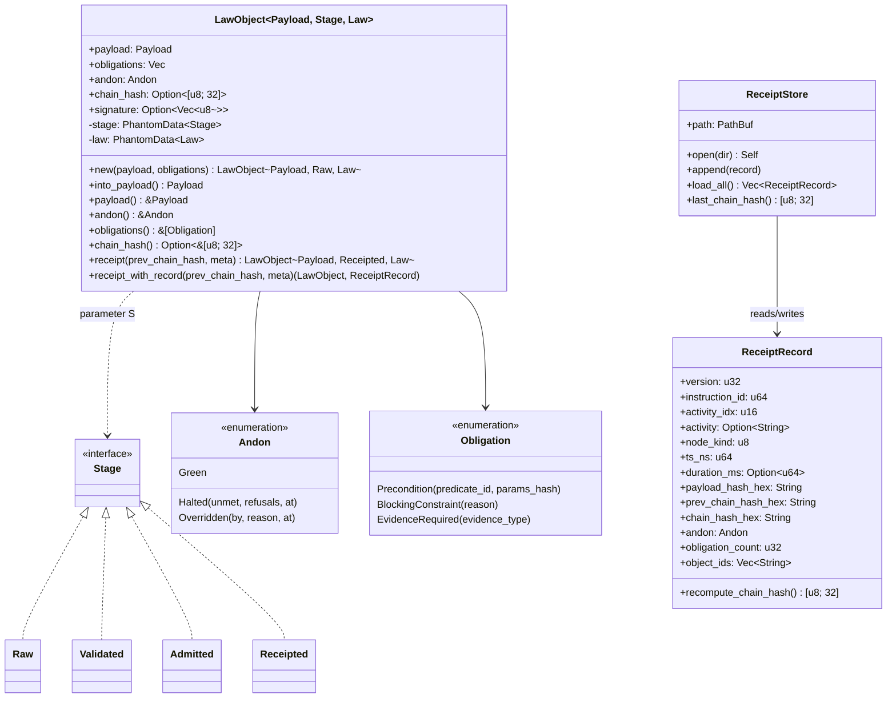
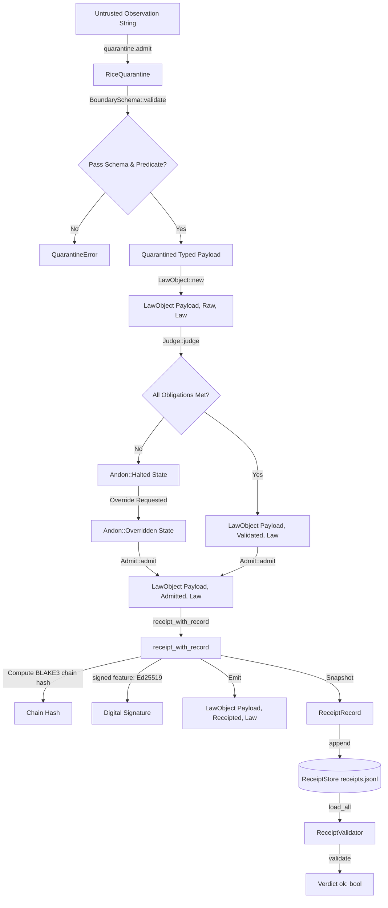
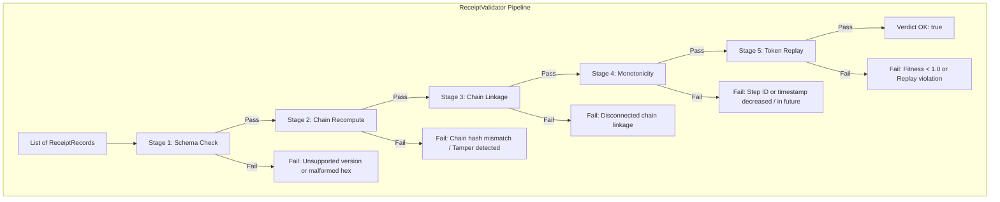

# Crate `praxis-core`

The core typestate validation, policy enforcement, and audit ledger kernel of the Praxis framework.

- **Path**: [`crates/praxis-core`](file:///Users/sac/praxis/crates/praxis-core)
- **Features**: 
  - `typestate` (default): Enforces compile-time lifecycle stage transitions.
  - `signed`: Enables Ed25519 signing for admission receipts (fail-closed implementation).
  - `ocel`: Enables direct conversion of `Receipted` objects into OCEL 2.0 format.

---

## 1. Theory and Logic Design

The `praxis-core` crate serves as the policy and audit gatekeeper of the Praxis workspace. It governs process compliance by mapping untrusted execution observations, evaluating them against strict policy obligations, enforcing step-by-step state transitions, and sealing valid states into a cryptographically chained, append-only audit log.

### A. Typestate Pattern (Compile-Time Lifecycle Stage Transitions)
To prevent runtime process violations—such as receipting an un-admitted object or double-admitting a payload—`praxis-core` leverages the **Typestate Pattern**. 

In `src/lifecycle.rs`, the system defines a set of empty sentinel structures representing the distinct lifecycle stages of a domain object:
*   `Raw`: The initial, unevaluated state. Obligations and Andon defect status are unknown.
*   `Validated`: The post-judgment state. All policy obligations have been evaluated, and the Andon status (defect/health state) has been determined.
*   `Admitted`: The post-admission state. The object has passed the admission verdict (marked Green or Overridden) and is ready to be locked into the cryptographic ledger.
*   `Receipted`: The final, immutable state. The causal chain hash has been computed, and a digital signature (if signing is enabled) has been applied.

These stages are managed under a sealed trait pattern, preventing downstream crates from defining custom lifecycle stages:
```rust
pub mod sealed {
    pub trait Stage {}
}
impl sealed::Stage for Raw {}
impl sealed::Stage for Validated {}
impl sealed::Stage for Admitted {}
impl sealed::Stage for Receipted {}
```

The primary state carrier is the `LawObject<Payload, S: Stage, Law>` struct. The stage transition functions consume the `LawObject` by value (`self`), returning a new `LawObject` parametrized with the next stage:
1.  `Judge::judge(LawObject<P, Raw, L>) -> Result<LawObject<P, Validated, L>, LawObject<P, Raw, L>>`
2.  `Admit::admit(LawObject<P, Validated, L>) -> Result<LawObject<P, Admitted, L>, Andon>`
3.  `LawObject::receipt(...) -> Result<LawObject<P, Receipted, L>, CoreError>`

Because each transition function is typed to expect specific phantom stages and consumes the inputs, it is mathematically impossible at compile time to skip steps or reuse previous states.

### B. Defect Signaling Pattern (Obligations & Andon Status)
Rather than propagating standard Rust `Result::Err` short-circuits during policy execution, `praxis-core` uses a **Defect Signaling Pattern** modeled on the industrial "Andon Cord."

*   **Obligations**: Preconditions, blocking constraints, or evidence requirements that a payload must satisfy. These are defined as a hashable, dispatchable `Obligation` enum (in `src/law.rs`) rather than closures, allowing them to be fully serialized, transferred, and audited.
*   **Andon**: The operational status of the object. It can be:
    *   `Andon::Green`: All obligations satisfied; execution is healthy.
    *   `Andon::Halted`: One or more obligations failed. Contains the list of unmet obligations, their corresponding refusal classifications, and the timestamp (`at`) of the halt.
    *   `Andon::Overridden`: A halt was acknowledged and manually bypassed by an authorized actor. Contains the identity of the authorizer (`by`), the justification (`reason`), and the override timestamp (`at`).

During the judgment phase, if any `Obligation` is unmet, the `Judge` transitions the object's internal state to `Andon::Halted`. However, instead of aborting, it returns the *entire* `LawObject<Payload, Raw, Law>` wrapped in `Err`. This allows callers to inspect the unmet obligations, present overrides, or log detailed telemetry without dropping the payload or the progress state. An overridden object is cleared for admission, allowing it to transition to the `Admitted` state.

### C. Rice Quarantine Pattern
Dynamic, untrusted input strings (e.g., incoming JSON from external networks) are structurally isolated using the **Rice Quarantine Pattern** before they can interact with the core policy lifecycle.

In `src/quarantine.rs`, untrusted observations must first pass through a `RiceQuarantine` gate configured with a specific `BoundarySchema<T>`. The schema:
1.  Parses the raw JSON observation into a target payload type `T`.
2.  Asserts structural invariants and applies optional predicates (domain validation).
3.  Rejects anomalies with a typed `QuarantineError` (`ValidationFailed`, `DeserializationFailed`, `PredicateDenied`, or `Malformed`).

```text
Untrusted Input (String) ──> [ RiceQuarantine ] ──> BoundarySchema::validate() ──> [Typed Payload (T)] ──> LawObject::new()
```

No external string is ever directly wrapped into a `LawObject` without passing through this gate.

### D. Append-Only Cryptographic Ledger (Receipt Chain)
Once an object is `Admitted`, it must be sealed into a tamper-evident, append-only log. The ledger is constructed by chaining `OcelCausalFrame` bodies together, linked via `bcinr_powl_receipt`.

For every receipt, a 32-byte `payload_hash` is computed from the canonical JSON representation of the payload. This hash, along with the previous record's chain hash (`prior_hash`) and step metadata (such as `instruction_id`, `activity_idx`, `node_kind`, `ts_ns`, `andon`, and `object_ids`), is packed into an `OcelCausalFrame`. The 32-byte payload hash is mapped into the frame's `obj_refs` field as eight little-endian `u32` words, converting it into a cryptographic commitment.

The ledger chain hash for step $t$ is computed deterministically as:
$$\text{chain\_hash}_{t} = \text{BLAKE3}(\text{chain\_hash}_{t-1} \mathbin{\Vert} \text{frame\_bytes}_t)$$

The `prev_chain_hash` is mixed twice: once inside the 99-byte frame body (`frame.prior_hash`), and a second time as the receipt's own seeded `chain_hash` before `chain()` prepends it. This double-mixing enforces chain linkage compatibility with legacy transactions.

### E. 5-Stage Validation Pipeline & 3-Node SEQ POWL Token Replay
Audit logs are verified retrospectively using the `ReceiptValidator` (defined in `src/receipt_validator.rs`). The validator processes a batch of `ReceiptRecord`s through a 5-stage non-short-circuiting pipeline, recording an explicit `CheckOutcome` (`Pass`, `Fail(String)`, or `Skip(String)`) for each stage to compile a comprehensive `Verdict`:

1.  **`schema`**: Asserts that records conform to the current schema version and that all hex hashes decode to exactly 32-byte blocks.
2.  **`chain_recompute`**: Recomputes the BLAKE3 chain hash for each frame from scratch using its stored fields. If the computed hash differs from the stored `chain_hash_hex`, a tamper event is flagged.
3.  **`chain_linkage`**: Verifies that the chain sequence is unbroken, asserting that record $0$ starts with the genesis anchor (32 zero bytes) and that each record $i$'s `prev_chain_hash_hex` matches record $i-1$'s `chain_hash_hex`.
4.  **`monotonic`**: Uses an injectable `Clock` to ensure that `ts_ns` timestamps do not occur in the future. It also asserts that `instruction_id`s strictly increase and `ts_ns` timestamps are non-decreasing.
5.  **`token_replay`**: Replays the events through a 3-node SEQ POWL token-passing model to verify process-conformance.

#### 3-Node SEQ POWL Token Game
The lifecycle transitions of `praxis-core` represent a sequential path: **`judge` ──> `admit` ──> `receipt`**.
This process is formally modeled as a 3-node SEQ POWL game:
*   **Token Bits (Flow State)**:
    *   `TOK_START` (`1 << 0`): Start token, required to fire `judge`.
    *   `TOK_JUDGED` (`1 << 1`): Produced by `judge`, required to fire `admit`.
    *   `TOK_ADMITTED` (`1 << 2`): Produced by `admit`, required to fire `receipt`.
    *   `TOK_DONE` (`1 << 3`): Produced by `receipt` (terminal state).
*   **Node Identity Bits**:
    *   `NODE_BIT_JUDGE` (`1 << 8`) / Node ID `1`
    *   `NODE_BIT_ADMIT` (`1 << 9`) / Node ID `2`
    *   `NODE_BIT_RECEIPT` (`1 << 10`) / Node ID `3`

During replay, the validator fires transitions step-by-step. If a step fires without its required tokens being present (e.g., executing `admit` before `judge`), a `ReplayViolation::TokenNotEnabled` error is thrown. A fully compliant sequence yields a conformance fitness of $1.0$ (represented as `0x0001_0000` in Q16.16 fixed-point format).

### F. Refusal Taxonomy
If a transaction is halted or denied admission, it is mapped into an 8-bucket refusal taxonomy (ported from `stpnt` design principles as prior art):
1.  **`Identity`**: Format or identification issues with the subject or payload.
2.  **`Capacity`**: Violations of resource constraints or quota limits.
3.  **`Topology`**: Structural or conformance violations.
4.  **`Temporal`**: Timing or deadline failures.
5.  **`Lifecycle`**: Invalid state machine sequence or out-of-order execution.
6.  **`Authorization`**: Missing credentials or failed signatures.
7.  **`Prerequisites`**: Missing evidence or unmet preconditions.
8.  **`Reserved`**: Reserved for future policy extensions.

Unmet `Obligation`s and `DenialPolarity` failures map to concrete `RefusalScenario`s, which resolve to exactly one `RefusalCategory`:

| Refusal Scenario | Triggers | Refusal Category |
| :--- | :--- | :--- |
| `BlockingConstraint` | An active constraint that blocks all progress | `Lifecycle` |
| `MissingEvidence` | Required evidence was not found in the payload | `Prerequisites` |
| `UnsatisfiedPrecondition` | A precondition predicate is not satisfied | `Prerequisites` |
| `WatchdogDrained` | Watchdog timer expired | `Temporal` |
| `PreconditionFailed` | General precondition validation failure | `Prerequisites` |
| `SlaBreach` | SLA deadline violated | `Temporal` |
| `AuthorizationDenied` | Missing or invalid authorization credentials | `Authorization` |
| `ResourceExhausted` | Quota or resource capacity exceeded | `Capacity` |
| `ObjectLifecycleViolation` | Out-of-order lifecycle stage call | `Lifecycle` |
| `ConformanceGateFailed` | Step failed process-conformance check | `Topology` |
| `KernelDenied` | Prolog8 Kernel query returned denied | `Authorization` |
| `KernelInvalid` | Prolog8 query/facts failed structural checks | `Identity` |
| `AndonInvariantViolated` | Fired a blocking second-gate ring event | `Topology` |

### G. Fail-Closed Cryptographic Signing
When compiled with the `signed` feature, `LawObject::receipt` applies a digital signature to the computed `chain_hash`.
*   **Key Loading**: Keys are resolved from environment variables (`PRAXIS_SIGNING_KEY` or `PRAXIS_SIGNING_KEY_FILE`).
*   **Fail-Closed Design**: If the signature feature is enabled but the signing key is missing or unreadable, the system aborts execution and returns `CoreError::SigningFailed`. It will **never** fall back to writing an unsigned receipt or using a dummy signature key, ensuring that missing configurations fail securely.

---

## 2. Internal Architecture

### A. Structural Relationships
The following class diagram shows how the core components in `praxis-core` are structured and relate to one another:



### B. Lifecycle Stage Transitions
This state diagram details how a `LawObject` transitions through the sequential stages, driven by the `Judge` and `Admit` policies:

```mermaid
stateDiagram-v2
    [*] --> Raw : LawObject::new(payload, obligations)
    
    state "Raw Stage" as RawStage {
        [*] --> RawObject : Andon::Green
    }

    RawStage --> ValidatedStage : Judge::judge() [Success / All obligations met]
    RawStage --> RawStage : Judge::judge() [Failure / Andon::Halted] : Returns Err(LawObject<Payload, Raw, Law>)

    state "Validated Stage" as ValidatedStage {
        [*] --> ValidatedObject : Andon::Green or Andon::Overridden
    }

    state "Admitted Stage" as AdmittedStage {
        [*] --> AdmittedObject : Ready to be receipted
    }

    ValidatedStage --> AdmittedStage : Admit::admit() [Success / Green or Overridden]
    ValidatedStage --> [*] : Admit::admit() [Failure / Andon::Halted] : Returns Err(Andon)

    state "Receipted Stage" as ReceiptedStage {
        [*] --> ReceiptedObject : Chain hash & Signature generated
    }

    AdmittedStage --> ReceiptedStage : LawObject::receipt() / receipt_with_record()
    ReceiptedStage --> [*]
```

### C. Processing Data Flow
The sequence from untrusted raw inputs to schema verification, policy evaluation, admission, receipt generation, and validation:



### D. Verification Pipeline
The 5-stage validation pipeline running checks on a slice of `ReceiptRecord`s:



---

## 3. API Signatures & Examples

This section defines the key Rust API signatures for public-facing components in `praxis-core`.

### A. Lifecycle Stages & Law Object

```rust
pub mod lifecycle {
    pub mod sealed {
        pub trait Stage {}
    }
    pub struct Raw;
    pub struct Validated;
    pub struct Admitted;
    pub struct Receipted;
}

pub struct LawObject<Payload, S: Stage, Law> {
    pub payload: Payload,
    pub obligations: Vec<Obligation>,
    pub andon: Andon,
    pub chain_hash: Option<[u8; 32]>,
    pub signature: Option<Vec<u8>>,
    _stage: PhantomData<S>,
    _law: PhantomData<Law>,
}

impl<Payload, S: Stage, Law> LawObject<Payload, S, Law> {
    pub fn new(payload: Payload, obligations: Vec<Obligation>) -> LawObject<Payload, Raw, Law>;
    pub fn into_payload(self) -> Payload;
    pub fn payload(&self) -> &Payload;
    pub fn andon(&self) -> &Andon;
    pub fn obligations(&self) -> &[Obligation];
    pub fn chain_hash(&self) -> Option<&[u8; 32]>;
}

impl<Payload: Serialize, Law> LawObject<Payload, Admitted, Law> {
    pub fn receipt(
        mut self,
        prev_chain_hash: &[u8; 32],
        meta: ReceiptMeta,
    ) -> Result<LawObject<Payload, Receipted, Law>, CoreError>;

    pub fn receipt_with_record(
        mut self,
        prev_chain_hash: &[u8; 32],
        meta: ReceiptMeta,
    ) -> Result<(LawObject<Payload, Receipted, Law>, ReceiptRecord), CoreError>;
}
```

### B. Execution Traits

```rust
pub trait Judge {
    type Payload;
    type Law;
    type Error;

    fn judge(
        raw: LawObject<Self::Payload, Raw, Self::Law>,
    ) -> Result<
        LawObject<Self::Payload, Validated, Self::Law>,
        LawObject<Self::Payload, Raw, Self::Law>,
    >;
}

pub trait Admit {
    type Payload;
    type Law;
    type Witness;

    fn admit(
        validated: LawObject<Self::Payload, Validated, Self::Law>,
    ) -> Result<LawObject<Self::Payload, Admitted, Self::Law>, Andon>;
}
```

### C. Boundary Quarantine Gate

```rust
pub enum QuarantineError {
    ValidationFailed { reason: String },
    DeserializationFailed { reason: String },
    PredicateDenied { reason: String },
    Malformed { reason: String },
}

pub trait BoundarySchema<T: Serialize + DeserializeOwned> {
    fn validate(&self, observation: &str) -> Result<T, QuarantineError>;
}

pub struct RiceQuarantine<S, P: Serialize + DeserializeOwned> {
    schema: S,
    _payload: PhantomData<P>,
}

impl<S, P> RiceQuarantine<S, P>
where
    S: BoundarySchema<P>,
    P: Serialize + DeserializeOwned,
{
    pub fn new(schema: S) -> Self;
    pub fn admit(&self, observation: &str) -> Result<P, QuarantineError>;
    pub fn schema(&self) -> &S;
}

pub struct JsonBoundarySchema<T, F = fn(&T) -> bool>
where
    T: Serialize + DeserializeOwned,
    F: Fn(&T) -> bool,
{
    predicate: Option<F>,
    _payload: PhantomData<T>,
}
```

### D. Ledger & Validation Pipeline

```rust
pub struct ReceiptRecord {
    pub version: u32,
    pub instruction_id: u64,
    pub activity_idx: u16,
    pub activity: Option<String>,
    pub node_kind: u8,
    pub ts_ns: u64,
    pub duration_ms: Option<u64>,
    pub payload_hash_hex: String,
    pub prev_chain_hash_hex: String,
    pub chain_hash_hex: String,
    pub andon: Andon,
    pub obligation_count: u32,
    pub object_ids: Vec<String>,
}

impl ReceiptRecord {
    pub fn payload_hash(&self) -> Result<[u8; 32], CoreError>;
    pub fn prev_chain_hash(&self) -> Result<[u8; 32], CoreError>;
    pub fn chain_hash(&self) -> Result<[u8; 32], CoreError>;
    pub fn recompute_chain_hash(&self) -> Result<[u8; 32], CoreError>;
}

pub struct ReceiptStore {
    path: PathBuf,
}

impl ReceiptStore {
    pub fn open(dir: impl AsRef<Path>) -> Result<Self, CoreError>;
    pub fn open_default() -> Result<Self, CoreError>;
    pub fn path(&self) -> &Path;
    pub fn append(&self, record: &ReceiptRecord) -> Result<(), CoreError>;
    pub fn load_all(&self) -> Result<Vec<ReceiptRecord>, CoreError>;
    pub fn last_chain_hash(&self) -> Result<[u8; 32], CoreError>;
}

pub struct Verdict {
    pub ok: bool,
    pub stages: Vec<StageResult>,
    pub records_checked: usize,
}

pub trait Clock {
    fn now_ns(&self) -> u64;
}

pub struct ReceiptValidator;

impl ReceiptValidator {
    pub fn validate(records: &[ReceiptRecord], clock: &dyn Clock) -> Verdict;
}
```

---

## 4. End-to-End Execution Example

The following example demonstrates the end-to-end processing pipeline, from quarantining raw JSON input to executing policy judgment, admission, receipt generation, ledger serialization, and ledger verification:

```rust
use serde::{Deserialize, Serialize};
use std::time::{SystemTime, UNIX_EPOCH};
use praxis_core::{
    law::{Admit, Andon, Judge, LawObject, Obligation, ReceiptMeta},
    lifecycle::{Admitted, Raw, Validated, Receipted},
    quarantine::{BoundarySchema, JsonBoundarySchema, RiceQuarantine},
    receipt_store::ReceiptStore,
    receipt_validator::{ReceiptValidator, SystemClock},
    refusal::RefusalScenario,
};

// 1. Define custom Payload and Law policy marker
#[derive(Debug, Clone, Serialize, Deserialize)]
pub struct OperationPayload {
    pub operation_id: String,
    pub resource_id: String,
    pub satisfied_predicates: Vec<String>,
    pub evidence: Vec<String>,
}

#[derive(Debug, Clone, Copy)]
pub struct OperationLaw;

// 2. Implement Judge for OperationLaw
impl Judge for OperationLaw {
    type Payload = OperationPayload;
    type Law = OperationLaw;
    type Error = String;

    fn judge(
        raw: LawObject<Self::Payload, Raw, Self::Law>,
    ) -> Result<
        LawObject<Self::Payload, Validated, Self::Law>,
        LawObject<Self::Payload, Raw, Self::Law>,
    > {
        let payload = raw.payload();
        let mut unmet = Vec::new();

        for obligation in raw.obligations() {
            match obligation {
                Obligation::BlockingConstraint { .. } => {
                    unmet.push(obligation.clone());
                }
                Obligation::EvidenceRequired { evidence_type } => {
                    if !payload.evidence.contains(evidence_type) {
                        unmet.push(obligation.clone());
                    }
                }
                Obligation::Precondition { predicate_id, .. } => {
                    if !payload.satisfied_predicates.contains(predicate_id) {
                        unmet.push(obligation.clone());
                    }
                }
            }
        }

        if unmet.is_empty() {
            // Stage transition via internal helper
            Ok(raw.transition())
        } else {
            let mut halted = raw;
            let refusals: Vec<RefusalScenario> = unmet.iter().map(RefusalScenario::from).collect();
            let now = SystemTime::now()
                .duration_since(UNIX_EPOCH)
                .unwrap_or_default()
                .as_millis() as u64;
            halted.andon = Andon::Halted { unmet, refusals, at: now };
            Err(halted)
        }
    }
}

// 3. Implement Admit for OperationLaw
impl Admit for OperationLaw {
    type Payload = OperationPayload;
    type Law = OperationLaw;
    type Witness = ();

    fn admit(
        validated: LawObject<Self::Payload, Validated, Self::Law>,
    ) -> Result<LawObject<Self::Payload, Admitted, Self::Law>, Andon> {
        match validated.andon() {
            Andon::Green | Andon::Overridden { .. } => Ok(validated.transition()),
            Andon::Halted { .. } => Err(validated.andon().clone()),
        }
    }
}

fn main() -> Result<(), Box<dyn std::error::Error>> {
    // A. Setup Quarantine Gate
    let schema = JsonBoundarySchema::<OperationPayload>::with_predicate(|p| {
        !p.operation_id.is_empty() && !p.resource_id.is_empty()
    });
    let quarantine = RiceQuarantine::new(schema);

    // B. Admit untrusted input string into Quarantine
    let raw_input = r#"{
        "operation_id": "op_987",
        "resource_id": "resource_abc",
        "satisfied_predicates": ["auth_check"],
        "evidence": ["biometric_proof"]
    }"#;
    let payload = quarantine.admit(raw_input)?;

    // C. Initialize obligations and LawObject
    let obligations = vec![
        Obligation::Precondition {
            predicate_id: "auth_check".to_string(),
            params_hash: [0u8; 32],
        },
        Obligation::EvidenceRequired {
            evidence_type: "biometric_proof".to_string(),
        },
    ];
    let raw_object = LawObject::<OperationPayload, Raw, OperationLaw>::new(payload, obligations);

    // D. Judgment Stage
    let validated_object = match OperationLaw::judge(raw_object) {
        Ok(validated) => validated,
        Err(halted) => {
            println!("Judgment halted: {:?}", halted.andon());
            return Err("Obligations unmet".into());
        }
    };

    // E. Admission Stage
    let admitted_object = match OperationLaw::admit(validated_object) {
        Ok(admitted) => admitted,
        Err(andon) => {
            println!("Admission rejected: {:?}", andon);
            return Err("Admission denied".into());
        }
    };

    // F. Receipting and Store Setup
    let store_dir = tempfile::tempdir()?;
    let store = ReceiptStore::open(store_dir.path())?;
    let prev_chain_hash = store.last_chain_hash()?; // Loaded from ledger (genesis initially)

    let meta = ReceiptMeta {
        instruction_id: 1,
        activity_idx: 10,
        node_kind: 1, // SEQ
        ts_ns: Some(1_700_000_000_000_000_000), // fixed timestamp
        object_ids: vec!["law:op_987".to_string()],
        ..Default::default()
    };

    // G. Emit Receipt and Persist
    let (receipted_object, record) = admitted_object.receipt_with_record(&prev_chain_hash, meta)?;
    store.append(&record)?;

    println!("Receipt created. Chain Hash: {}", hex::encode(receipted_object.chain_hash().unwrap()));

    // H. Verify the Ledger Later
    let loaded_records = store.load_all()?;
    let verdict = ReceiptValidator::validate(&loaded_records, &SystemClock);
    assert!(verdict.ok);
    println!("Ledger verified successfully. Checked {} records.", verdict.records_checked);

    Ok(())
}
```
