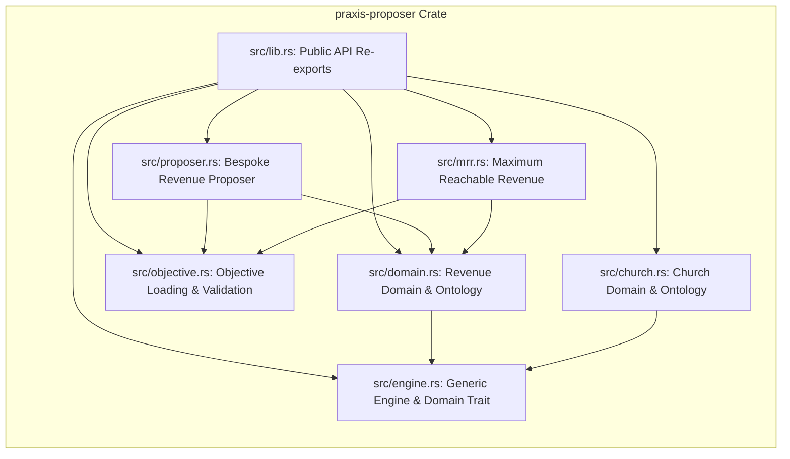
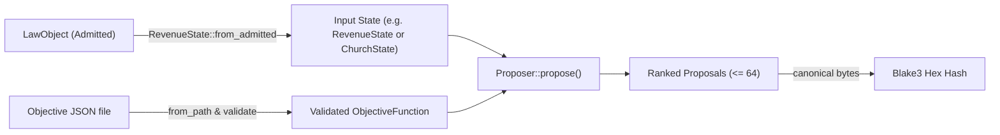
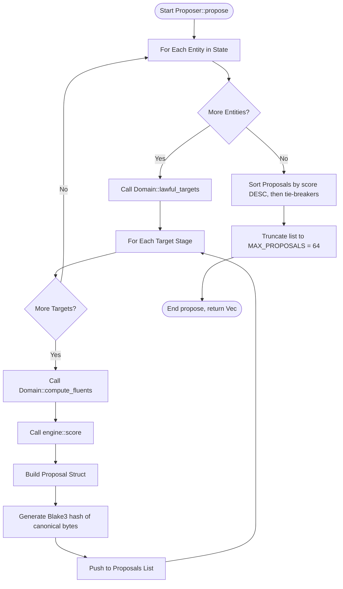

# Crate: `praxis-proposer`

The `praxis-proposer` crate implements the proposal generation and ranking layer of the Praxis workspace (PR-14). It acts as an algorithmic bridge between observed system/pipeline states and domain-authored objective functions, producing ranked candidate goals with deterministic scoring, auditable rationales, and stable cryptographic hashes.

---

## 1. Theory and Logic Design

### 1.1 Boundary Protection Doctrine (AR-9)
The `praxis-proposer` crate operates strictly **outside** the admission boundary of the system. 
* **Observations ($O$), not Authorities ($O^*$):** The proposals generated by the proposer engine are untrusted observations. They represent suggestions for goal states, not commands or assertions of authority.
* **Admission Obligation:** No proposal from this crate has any effect on the state of the system until it passes through Rice quarantine and admission gates (managed by `praxis-core`).
* **Provability & Receipts:** Each proposal contains a `proposal_hash` (a `blake3` hex digest of its canonical UTF-8 byte serialization). Downstream, the admission receipt binds back to this hash, proving exactly which proposal was validated and admitted.
* **Admitted-Reality Observation:** Rather than observing raw, unvalidated input, the proposer observes admitted reality via `from_admitted` helpers, which deserialize the payload of a `LawObject<serde_json::Value, Admitted, _>`. Because the `Admitted` state is only reachable through `Judge`/`Admit` lifecycle stages, this guarantees that the proposer is acting on verified workspace states.

### 1.2 Non-Goal of Value Discovery (Non-Goal 1)
The proposer layer does not invent values or formulate opinions on what states are desirable.
* **Authored Data:** The objective function is purely static data authored by the domain owner (e.g., `revenue_objective.json` and `church_objective.json`).
* **Algebraic Substrate:** The proposer contributes only the algebra—specifically, a weighted linear scoring of candidates—and the enumeration of lawful states.
* **Validation & Defaulting:** If a fluent's weight is not specified in the authored objective function, it defaults to `0.0` (ignored). Strict validation rules reject NaN/infinite weights and unrecognized fluent names to enforce total ordering and prevent runtime anomalies.

### 1.3 Day 6 Doctrine: Domain Independence
The core proposer substrate is fully domain-independent. This is proven by the presence of a generic proposer engine in `src/engine.rs` that accepts any type implementing the `Domain` trait.
* **Ontology and Objective:** A domain is defined entirely by its **ontology** (the types representing entities, stages, and lawfulness rules) and its **authored objective** (fluent weights).
* **Verbatim Reuse:** The algebra, the sorting/tie-breaking rules, the rationale generation, and the hashing mechanism are written once in the generic substrate and reused across multiple domains.
* **Supported Domains:**
  1. **Revenue Domain:** Legacy bespoke structures exist for backward compatibility, but it also implements `engine::Domain` via `domain::RevenueDomain`.
  2. **Church Domain:** Runs entirely on the generic substrate. Its proposer is `engine::Proposer<church::ChurchDomain>`, utilizing the `church_objective.json` objective.

### 1.4 Maximum Reachable Revenue (MRR) Physics
MRR calculates the absolute upper bound of realizable revenue for a given state.
* **Objective Independence:** Realizable revenue is defined by the physical limits of the pipeline, not the authored weights of the objective function. Thus, the MRR calculation is invariant to the objective function, and `maximum_reachable_revenue` does not accept an objective argument.
* **Additive Separation (Boundedness Claim):** Evaluating the joint maximum across the combinatorial space of all account actions would result in exponential search complexity $\prod_{a} (1 + |lawful\_targets(a)|)$. However, because accounts are independent—they share no resources, and their evidence gates depend strictly on their own flags—the global maximum collapses into a linear sum of individual account maximums:
  $$\max_{\text{joint plan}} \sum_{a} \text{realized}(a) = \sum_{a} \max_{t \in \text{lawful\_targets}(a)} \text{realized}(a)$$
  This reduces the computation complexity from exponential to $O(N)$ linear sum, where $N$ is the number of accounts.

---

## 2. Internal Architecture

### 2.1 File Map & Structural Relationships
The crate contains the following modules:
1. `src/lib.rs`: Root module that exposes public APIs and re-exports key domain and engine types.
2. `src/domain.rs`: Contains the data representation of the revenue pipeline (accounts, pipeline stages, evidence gates, and the `RevenueDomain` marker).
3. `src/objective.rs`: Manages loading and validating domain-authored objectives, and computing the numeric fluents for revenue.
4. `src/engine.rs`: The generic domain-independent proposer engine defining the `Domain` trait, the generic `Proposer<D>` and `Proposal<D>`, and the shared scoring logic.
5. `src/proposer.rs`: Bespoke implementation of the revenue proposer and proposal structures for legacy compatibility.
6. `src/mrr.rs`: Implements the objective-independent Maximum Reachable Revenue (MRR) report and account attribution.
7. `src/church.rs`: Implements the welcome-team / assimilation ontology, running entirely on the generic engine substrate.



### 2.2 Data Flow
The process of generating, validating, and hashing proposals proceeds as follows:



### 2.3 Proposer Execution Loop
The `Proposer::propose()` execution flow iterates over all entities, filters candidates using evidence gates, scores valid moves, and ranks them:



---

## 3. API Signatures & Examples

### 3.1 Key Public API Signatures

#### 3.1.1 The `Domain` Trait (`src/engine.rs`)
Defines the schema, vocabulary, and lawfulness rules that map any domain to the generic proposer.
```rust
pub trait Domain: Sized {
    /// Ordered stage type (an enum). Ordering is load-bearing: candidate
    /// goals move an entity strictly *forward*, and evidence gates key off
    /// the target stage.
    type Stage: Copy + Eq + std::fmt::Debug + 'static;
    
    /// Per-entity observation (e.g. revenue `Account`, church `Person`).
    type Entity;
    
    /// Whole-domain snapshot the proposer observes.
    type State;

    /// Domain-pack identifier, e.g. "revenue" or "church".
    fn pack_name() -> &'static str;
    
    /// The fixed fluent vocabulary, in canonical evaluation order.
    fn fluent_names() -> &'static [&'static str];
    
    /// PDDL goal predicate name emitted into goal atoms.
    fn goal_predicate() -> &'static str {
        "stage"
    }

    /// Retrieve entities to enumerate over.
    fn entities(state: &Self::State) -> &[Self::Entity];
    
    /// Stable identifier of an entity.
    fn entity_id(entity: &Self::Entity) -> &str;
    
    /// Current stage of an entity.
    fn entity_stage(entity: &Self::Entity) -> Self::Stage;
    
    /// Zero-based pipeline index of a stage (for tie-breaking and fluents).
    fn stage_index(stage: Self::Stage) -> u32;
    
    /// Lower-kebab PDDL/ontology name for a stage.
    fn stage_pddl_name(stage: Self::Stage) -> &'static str;

    /// The lawfulness gate. Forward stages an entity may lawfully be proposed into.
    fn lawful_targets(entity: &Self::Entity) -> Vec<Self::Stage>;
    
    /// Fluent values for the candidate move `entity -> target`, in `fluent_names` order.
    fn compute_fluents(entity: &Self::Entity, target: Self::Stage) -> Vec<f64>;
    
    /// Per-candidate description line cited in the rationale.
    fn candidate_description(entity: &Self::Entity, target: Self::Stage) -> String;
}
```

#### 3.1.2 Generic `Proposal` and `Proposer` (`src/engine.rs`)
```rust
pub struct Proposal<D: Domain> {
    pub goal_description: String,
    pub target_id: String,
    pub target_stage: D::Stage,
    pub score: f64,
    pub rationale: Vec<String>,
    pub proposal_hash: String,
}

impl<D: Domain> Proposal<D> {
    /// Emit the goal as a PDDL goal-atom text line:
    /// `(<goal_predicate> <target_id> <target-stage-name>)`.
    pub fn pddl_goal(&self) -> String;

    /// Canonical byte encoding hashed into `proposal_hash`.
    pub fn canonical_bytes(&self) -> Vec<u8>;
}

pub struct Proposer<D: Domain> {
    objective: ObjectiveFunction,
    _marker: PhantomData<fn() -> D>,
}

impl<D: Domain> Proposer<D> {
    /// Build a proposer around an authored (already-validated) objective.
    pub fn new(objective: ObjectiveFunction) -> Self;

    /// The objective this proposer scores with.
    pub fn objective(&self) -> &ObjectiveFunction;

    /// Enumerate lawful forward candidates, score each, and rank.
    pub fn propose(&self, state: &D::State) -> Vec<Proposal<D>>;
}
```

#### 3.1.3 Bespoke Revenue Ontology (`src/domain.rs`)
```rust
#[derive(Debug, Clone, Copy, PartialEq, Eq, PartialOrd, Ord, Hash, Serialize, Deserialize)]
#[serde(rename_all = "snake_case")]
pub enum Stage {
    Lead = 0,
    Qualified = 1,
    Proposal = 2,
    Procurement = 3,
    ClosedWon = 4,
}

#[derive(Debug, Clone, PartialEq, Serialize, Deserialize)]
#[serde(deny_unknown_fields)]
pub struct Account {
    pub id: String,
    pub stage: Stage,
    pub amount_cents: i64,
    pub security_review_done: bool,
    pub legal_approved: bool,
    pub exec_sponsor: bool,
    pub days_in_stage: u32,
}

#[derive(Debug, Clone, PartialEq, Serialize, Deserialize)]
#[serde(deny_unknown_fields)]
pub struct RevenueState {
    pub accounts: Vec<Account>,
}

impl RevenueState {
    /// Observe an admitted revenue snapshot.
    pub fn from_admitted<Law>(
        admitted: &praxis_core::LawObject<
            serde_json::Value,
            praxis_core::lifecycle::Admitted,
            Law,
        >,
    ) -> Result<RevenueState, serde_json::Error>;
}
```

#### 3.1.4 Maximum Reachable Revenue Types & Functions (`src/mrr.rs`)
```rust
#[derive(Debug, Clone, PartialEq, Serialize, Deserialize)]
pub struct AccountRevenue {
    pub account_id: String,
    pub amount_cents: i64,
    pub max_realizable_cents: i64,
    pub already_closed: bool,
    pub closeable: bool,
    #[serde(skip_serializing_if = "Option::is_none")]
    pub blocked_on: Option<Vec<String>>,
}

#[derive(Debug, Clone, PartialEq, Serialize, Deserialize)]
pub struct MrrReport {
    pub max_reachable_revenue_cents: i64,
    pub actual_closed_cents: i64,
    pub revenue_opportunity_cents: i64,
    pub revenue_utilization: f64,
    pub accounts_considered: usize,
    pub accounts: Vec<AccountRevenue>,
}

/// Compute the MrrReport for an observed revenue snapshot.
pub fn maximum_reachable_revenue(state: &RevenueState) -> MrrReport;
```

---

### 3.2 Concrete Usage Examples

#### Example 1: Bespoke Revenue Proposer Usage
This example demonstrates how to parse a state, load a revenue objective from disk, generate proposals, and print their PDDL representation.

```rust
use std::path::Path;
use praxis_proposer::domain::Account;
use praxis_proposer::{ObjectiveFunction, Proposer, RevenueState, Stage};

fn main() -> Result<(), Box<dyn std::error::Error>> {
    // 1. Construct a mock state representing the current pipeline
    let state = RevenueState {
        accounts: vec![
            Account {
                id: "acct-alpha".to_string(),
                stage: Stage::Procurement,
                amount_cents: 1_200_000, // $12,000.00
                security_review_done: true,
                legal_approved: true,
                exec_sponsor: true,
                days_in_stage: 5,
            },
            Account {
                id: "acct-beta".to_string(),
                stage: Stage::Qualified,
                amount_cents: 500_000,  // $5,000.00
                security_review_done: false,
                legal_approved: true,
                exec_sponsor: false,
                days_in_stage: 30,
            },
        ],
    };

    // 2. Load the domain-authored objective function
    let objective_path = Path::new("revenue_objective.json");
    let objective = ObjectiveFunction::from_path(&objective_path)?;

    // 3. Instantiate the proposer and generate ranked candidate goal states
    let proposer = Proposer::new(objective);
    let proposals = proposer.propose(&state);

    // 4. Output the results
    println!("Ranked Revenue Proposals:");
    for (i, p) in proposals.iter().enumerate() {
        println!("#{} Target: {}", i + 1, p.target_account);
        println!("  Score: {}", p.score);
        println!("  PDDL Goal: {}", p.pddl_goal()); // e.g. "(stage acct-alpha closed-won)"
        println!("  Blake3 Hash: {}", p.proposal_hash);
        println!("  Rationale:");
        for line in &p.rationale {
            println!("    | {}", line);
        }
    }

    Ok(())
}
```

#### Example 2: Generic Engine Proposer Usage (Church Domain)
This example demonstrates utilizing the generic proposer engine with the church ontology.

```rust
use std::path::Path;
use praxis_proposer::church::{self, ChurchDomain, ChurchState, Person, Stage};
use praxis_proposer::engine::Proposer as GenericProposer;

fn main() -> Result<(), Box<dyn std::error::Error>> {
    // 1. Construct a church welcome team snapshot
    let state = ChurchState {
        people: vec![
            Person {
                id: "person-1".to_string(),
                stage: Stage::Connected,
                welcomed: true,
                followed_up: true,
                in_small_group: true,
                care_assigned: true,
                days_in_stage: 15,
            },
        ],
    };

    // 2. Load the church welcome-team objective function
    let objective_path = Path::new("church_objective.json");
    let objective = church::objective_from_path(&objective_path)?;

    // 3. Use the generic Proposer parameterized by ChurchDomain
    let proposer = GenericProposer::<ChurchDomain>::new(objective);
    let proposals = proposer.propose(&state);

    // 4. Output the results
    println!("Ranked Church Assimilation Proposals:");
    for (i, p) in proposals.iter().enumerate() {
        println!("#{} Target: {}", i + 1, p.target_id);
        println!("  Target Stage: {:?}", p.target_stage);
        println!("  PDDL Goal: {}", p.pddl_goal()); // e.g. "(stage person-1 leading)"
        println!("  Blake3 Hash: {}", p.proposal_hash);
    }

    Ok(())
}
```

#### Example 3: Maximum Reachable Revenue (MRR) Calculation
This example demonstrates generating the objective-independent MRR report for the pipeline.

```rust
use praxis_proposer::domain::Account;
use praxis_proposer::{maximum_reachable_revenue, RevenueState, Stage};

fn main() {
    let state = RevenueState {
        accounts: vec![
            // Closeable (full evidence present)
            Account {
                id: "acct-apex".to_string(),
                stage: Stage::Proposal,
                amount_cents: 5_000_000,
                security_review_done: true,
                legal_approved: true,
                exec_sponsor: true,
                days_in_stage: 10,
            },
            // Blocked: missing legal approval
            Account {
                id: "acct-blocked".to_string(),
                stage: Stage::Qualified,
                amount_cents: 3_000_000,
                security_review_done: true,
                legal_approved: false,
                exec_sponsor: true,
                days_in_stage: 20,
            },
            // Already closed-won (realized)
            Account {
                id: "acct-won".to_string(),
                stage: Stage::ClosedWon,
                amount_cents: 500_000,
                security_review_done: true,
                legal_approved: true,
                exec_sponsor: true,
                days_in_stage: 2,
            },
        ],
    };

    let report = maximum_reachable_revenue(&state);

    println!("Maximum Reachable Revenue: ${:.2}", report.max_reachable_revenue_cents as f64 / 100.0);
    println!("Actual Closed Revenue: ${:.2}", report.actual_closed_cents as f64 / 100.0);
    println!("Revenue Opportunity: ${:.2}", report.revenue_opportunity_cents as f64 / 100.0);
    println!("Revenue Utilization: {:.2}%", report.revenue_utilization * 100.0);

    for acct_rev in &report.accounts {
        println!("Account: {}", acct_rev.account_id);
        println!("  Max Realizable: ${:.2}", acct_rev.max_realizable_cents as f64 / 100.0);
        if let Some(ref blocked_reasons) = acct_rev.blocked_on {
            println!("  Blocked On: {:?}", blocked_reasons);
        }
    }
}
```
