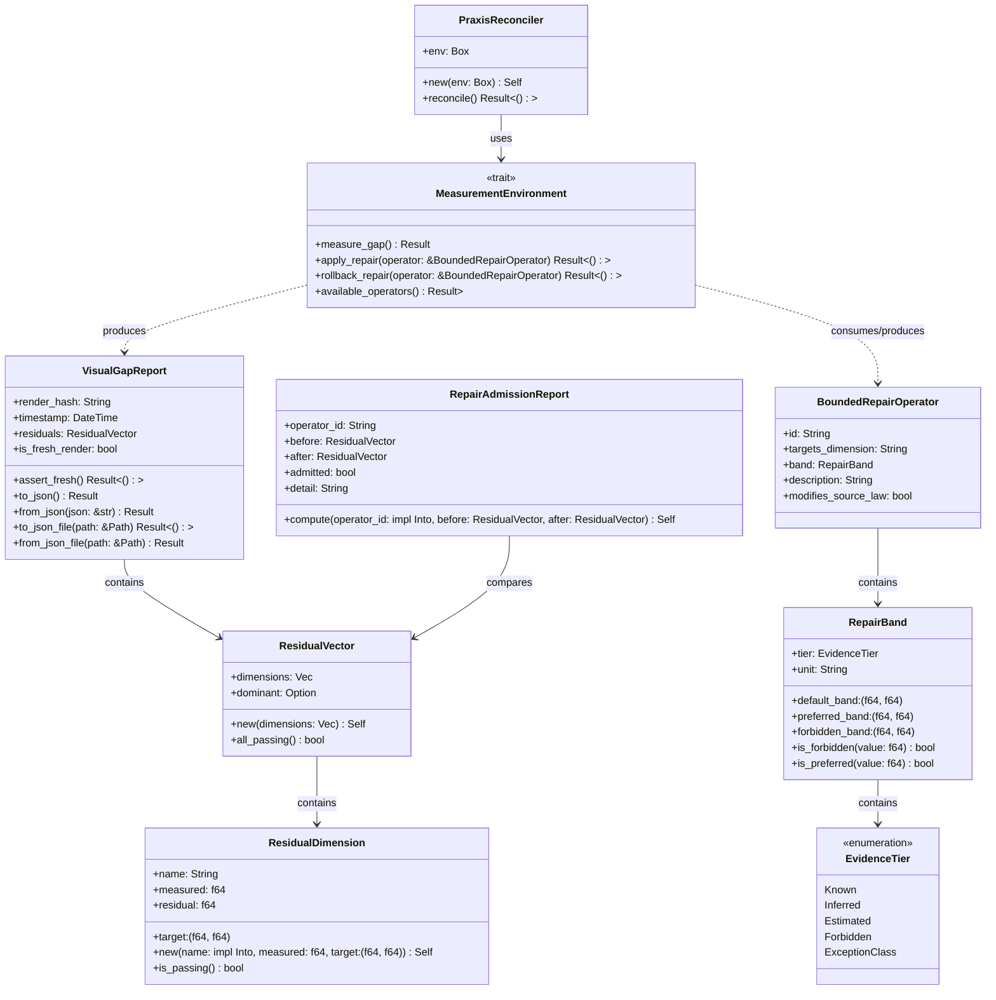

# Crate: `praxis-reconciler`

This crate implements state reconciliation mechanisms for maintaining structural and behavioral consistency. It provides a dual approach to reconciliation: a formal autonomic control loop based on the Chatman Equation for correcting system-level drift, and a configuration-and-document synchronizer loop for maintaining local project files in alignment with master templates.

---

## 1. Theory and Logic Design

### A. The Chatman Equation Autonomic Loop
At the core of the state reconciliation library lies a closed-loop controller that satisfies the **Chatman Equation**:

$$A = \mu(O)$$

Where:
- $A$ represents the target artifact or desired state of the system (the "Source of Truth" or target law specification).
- $O$ represents the actual environmental observations (the observed physical/digital states of the system).
- $\mu$ is the measurement function that projects the raw environment observations into a standardized report comparing them against the target artifact.

When $A \neq \mu(O)$, the system has experienced **structural drift**. The `praxis-reconciler` acts as an autonomic computing feedback loop to correct this drift and restore the system to equilibrium:

```
                  +-----------------------------------+
                  |      Target State/Artifact (A)    |
                  +-----------------+-----------------+
                                    |
                                    v
  +----------------+      +---------+---------+      +----------------+
  | Observations   | ---> |   Measurement     | ---> | Residual Vector |
  |      (O)       |      |  Function (\mu)   |      |      (R)       |
  +----------------+      +-------------------+      +--------+-------+
                                                              |
                                                              v
  +----------------+      +-------------------+      +--------+-------+
  | Target State   | <--- |   Bounded Repair  | <--- | Identify Max   |
  |  Reconciliation|      |      Operator     |      |    Deviation   |
  +----------------+      +-------------------+      +----------------+
```

1. **Measurement via `ResidualVector` and `ResidualDimension`**:
   The measurement function projects the observed environmental state against target ranges for multiple metrics. This results in a `ResidualVector`, which contains a collection of `ResidualDimension` elements. Each `ResidualDimension` tracks:
   - `name`: The identifier of the metric being monitored.
   - `measured`: The raw floating-point value extracted from the environment.
   - `target`: The acceptable range specified as a closed interval `(min, max)`.
   - `residual`: The signed distance of the measured value from the midpoint of the target range. Specifically:
     $$\text{residual} = \text{measured} - \text{midpoint}(\text{target})$$
     Where:
     $$\text{midpoint}(\text{target}) = \frac{\text{target.0} + \text{target.1}}{2}$$
     A dimension is considered **passing** if `measured` falls within `(min, max)`, in which case the absolute value of the residual is low. If the measured value falls outside this range, a non-zero residual indicates structural drift.

2. **Dominant Dimension Selection**:
   When drift is detected, the reconciler must decide where to focus its corrective resources. It selects the **dominant dimension**, which is defined as the dimension with the largest absolute residual deviation:
   $$\text{dominant} = \arg\max_{d \in D} |d.\text{residual}|$$
   Focusing on the dominant dimension ensures that the reconciler addresses the largest systemic error first, avoiding fine-tuning stable parameters when major deviations exist.

3. **Bounded Repair Operators and `RepairBand`**:
   Once the dominant dimension is identified, the reconciler queries the environment for available `BoundedRepairOperator`s that target the failing dimension. Each repair operator is strictly bounded by a `RepairBand` to prevent actions that could destabilize other parts of the system or introduce unsafe values.
   A `RepairBand` contains:
   - `default_band`: The overall safe boundary of execution `(min, max)`.
   - `preferred_band`: The target quality range `(min, max)` within which the repaired value should ideally land.
   - `forbidden_band`: A forbidden range of values `(min, max)` that the operator must never produce. For example, if a value lies in this band, it violates safety, identity, or intellectual property constraints.
   - `tier`: An `EvidenceTier` classifying the empirical certainty of the bounds (`Known`, `Inferred`, `Estimated`, `Forbidden`, `ExceptionClass`).
   - `unit`: The physical or logical unit label (e.g., `"ratio"`, `"meters"`, `"count"`).

4. **Boundary Crossing**:
   Executing a repair is a boundary-crossing operation. The reconciler applies the chosen operator, which alters the physical or digital configuration of the target environment to move the measured state back towards the target band.

5. **Fresh Render Validation**:
   After applying a repair operator, the reconciler must verify its real-world effect. It triggers a fresh state rendering or sampling and obtains a `VisualGapReport`. To prevent stale data cycles (where the reconciler acts on cached or pre-rendered outputs), the loop enforces **fresh render validation**. The `VisualGapReport` contains an `is_fresh_render` flag. The reconciler calls `assert_fresh()`, which rejects any report where `is_fresh_render` is false. This ensures that every feedback iteration is based on fresh, real-time measurements.

6. **Admission Check and Rollback**:
   The reconciler evaluates the outcome using a `RepairAdmissionReport`. A repair action is admitted only if it satisfies one of the following conditions:
   - **Absolute Equilibrium**: All monitored dimensions are now passing (`after.all_passing() == true`).
   - **Monotonic Improvement**: The absolute number of failing dimensions has strictly decreased (`after_failing < before_failing`).
   If the repair does not meet these criteria, it is rejected. The reconciler immediately executes a rollback using the environment's `rollback_repair` method, restoring the pre-repair state. It then tries the next available repair operator. If all operators for the dominant dimension are exhausted without successful admission, the loop terminates with a reconciliation error.

---

### B. Configuration and Document Synchronization Loop
The CLI tool utility implements a file-level reconciler designed to eliminate configuration drift in active workspaces. It maintains continuous parity between a set of critical files (`MONITORED_FILES`) in the project directory and a master template directory.

1. **Monitored Configuration Targets**:
   The tool monitors the following files:
   - `deny.toml` (license and cargo-deny settings)
   - `typos.toml` (spelling checks)
   - `rustfmt.toml` (formatting standards)
   - `rust-toolchain.toml` (rust compiler toolchain pin)
   - `SECURITY.md` (security disclosure policies)
   - `.github/workflows/ci.yml` (continuous integration pipeline)
   - `.github/workflows/release.yml` (delivery pipeline)
   - `.github/dependabot.yml` (dependency update schedule)
   - `.editorconfig` (IDE layout configuration)

2. **Dual-Trigger Synchronization Loop**:
   To ensure immediate correction of unauthorized changes while maintaining a failsafe check, the tool employs a dual-trigger architecture:
   - **Proactive Polling**: A background thread runs continuously, waking up every second to check all monitored files.
   - **Event-Driven Watcher**: A file system watcher (leveraging the `notify` crate) monitors the project directory recursively. Any file modification or deletion event immediately triggers a reconciliation check, bypassing the polling delay.

3. **Deterministic Healing**:
   For each monitored file, the tool performs the following checks:
   - **Existence**: If a file is deleted or missing from the project directory, it triggers healing.
   - **Content Parity**: If the file exists, its content is compared byte-for-byte against the copy in the template directory.
   - **Heal Action**: If any mismatch or omission is detected, the tool copies the file from the template directory to the project directory, automatically creating any missing parent directories.

---

## 2. Internal Architecture

### A. Component and Type Relationships
The following class diagram shows the structural relationships between the reconciler, the environment, and the data structures defined in the KNHK type system (`genesis-types-v2`):



---

### B. Autonomic Loop Control Flow
The autonomic control loop executes a continuous feedback cycle, applying repair actions to correct the dominant residual dimension and validating the outcome using fresh renders:

```mermaid
graph TD
    Start([Start Reconciler Loop]) --> Measure[Measure Current State: env.measure_gap()]
    Measure --> AssertFresh{Assert Fresh Render: report.assert_fresh()?}
    AssertFresh -- Ok --> AllPass{All Dimensions Pass?}
    AssertFresh -- Err/Stale --> StopErr([Stop with Error])
    AllPass -- Yes --> StopOk([Stop: System in Equilibrium])
    AllPass -- No --> IdentifyDominant[Identify Dominant Dimension]
    IdentifyDominant --> FindOps[Find Applicable BoundedRepairOperators]
    FindOps --> CheckOpsExist{Operators Available?}
    CheckOpsExist -- No --> StopErr
    CheckOpsExist -- Yes --> LoopOps[Iterate BoundedRepairOperators]
    LoopOps --> ApplyOp[Apply BoundedRepairOperator]
    ApplyOp --> MeasureNew[Measure New State: env.measure_gap()]
    MeasureNew --> AssertFreshNew{Assert Fresh Render?}
    AssertFreshNew -- Ok --> ComputeAdmission[Compute Admission: RepairAdmissionReport::compute()]
    AssertFreshNew -- Err/Stale --> Rollback[Rollback Repair]
    ComputeAdmission --> Admitted{Repair Admitted?}
    Admitted -- Yes --> NextLoop[Loop to Start of Next Iteration]
    NextLoop --> Start
    Admitted -- No --> Rollback[Rollback: env.rollback_repair()]
    Rollback --> TryNext{More Operators?}
    TryNext -- Yes --> LoopOps
    TryNext -- No --> StopErr
```

---

### C. Configuration Synchronizer Loop
The configuration reconciler runs a proactive background poller and reactive event-driven watcher to guarantee file parity:

```mermaid
graph TD
    Start([Start configuration sync tool]) --> InitialSync[Initial Sync: reconcile_all()]
    InitialSync --> SpawnPoll[Spawn background polling thread]
    InitialSync --> InitWatcher[Initialize notify RecommendedWatcher]
    
    subgraph Polling Thread [Background Polling Loop]
        PollSleep[Sleep for 1 second] --> PollSync[Execute reconcile_all()]
        PollSync --> PollSleep
    end
    
    subgraph Watcher Loop [Event-Driven Watcher Loop]
        WaitEvent[Wait for File System Event] --> MatchPaths{Any path in MONITORED_FILES?}
        MatchPaths -- Yes --> EventSync[Execute reconcile_all()]
        MatchPaths -- No --> WaitEvent
        EventSync --> WaitEvent
    end
    
    SpawnPoll --> PollSleep
    InitWatcher --> WaitEvent
```

---

## 3. API Signatures & Examples

This section details the primary traits, structs, and enumerations of the reconciliation system.

### A. Key Signatures

#### `MeasurementEnvironment`
```rust
#[async_trait::async_trait]
pub trait MeasurementEnvironment {
    /// Compute \mu(O) against A and return the freshness-guaranteed gap report.
    async fn measure_gap(&self) -> Result<VisualGapReport>;

    /// Apply a specific BoundedRepairOperator to the artifact A.
    /// Must cross a real boundary (e.g., execute a deterministic change).
    async fn apply_repair(&self, operator: &BoundedRepairOperator) -> Result<()>;

    /// Rollback the last repair if it was not admitted.
    async fn rollback_repair(&self, operator: &BoundedRepairOperator) -> Result<()>;

    /// Fetch available repair operators.
    async fn available_operators(&self) -> Result<Vec<BoundedRepairOperator>>;
}
```

#### `PraxisReconciler`
```rust
pub struct PraxisReconciler {
    pub env: Box<dyn MeasurementEnvironment + Send + Sync>,
}

impl PraxisReconciler {
    pub fn new(env: Box<dyn MeasurementEnvironment + Send + Sync>) -> Self {
        Self { env }
    }

    /// Executes the autonomic repair loop.
    /// Evaluates the Chatman Equation and applies repairs until the residual vector is 0 (all passing)
    /// or repair potential is exhausted.
    pub async fn reconcile(&self) -> Result<()> { ... }
}
```

#### `VisualGapReport`
```rust
#[derive(Debug, Clone, Serialize, Deserialize)]
pub struct VisualGapReport {
    /// BLAKE3 hash of the render image that was scored.
    pub render_hash: String,
    /// RFC-3339 timestamp of when the render was produced.
    pub timestamp: chrono::DateTime<chrono::Utc>,
    /// All residuals computed from this render.
    pub residuals: ResidualVector,
    /// Whether this report comes from a fresh render.
    pub is_fresh_render: bool,
}

impl VisualGapReport {
    /// Returns Err if is_fresh_render is false — stale reports must be rejected.
    pub fn assert_fresh(&self) -> Result<()> { ... }
}
```

#### `ResidualVector`
```rust
#[derive(Debug, Clone, Serialize, Deserialize)]
pub struct ResidualVector {
    pub dimensions: Vec<ResidualDimension>,
    /// Name of the dimension with the largest |residual|. None if empty.
    pub dominant: Option<String>,
}

impl ResidualVector {
    /// Construct from dimensions, computing the dominant dimension automatically.
    pub fn new(dimensions: Vec<ResidualDimension>) -> Self { ... }

    /// Returns true when all dimensions are passing.
    pub fn all_passing(&self) -> bool { ... }
}
```

#### `ResidualDimension`
```rust
#[derive(Debug, Clone, Serialize, Deserialize)]
pub struct ResidualDimension {
    /// Dimension name.
    pub name: String,
    /// Measured value.
    pub measured: f64,
    /// Target range (min, max).
    pub target: (f64, f64),
    /// Signed residual: measured - midpoint(target).
    pub residual: f64,
}

impl ResidualDimension {
    /// Construct a ResidualDimension, computing residual automatically.
    pub fn new(name: impl Into<String>, measured: f64, target: (f64, f64)) -> Self { ... }

    /// Returns true when measured is within the target range (passing).
    pub fn is_passing(&self) -> bool { ... }
}
```

#### `BoundedRepairOperator`
```rust
#[derive(Debug, Clone, Serialize, Deserialize)]
pub struct BoundedRepairOperator {
    pub id: String,
    pub targets_dimension: String,
    pub band: RepairBand,
    pub description: String,
    pub modifies_source_law: bool,
}
```

#### `RepairBand`
```rust
#[derive(Debug, Clone, Serialize, Deserialize)]
pub struct RepairBand {
    pub default_band: (f64, f64),
    pub preferred_band: (f64, f64),
    pub forbidden_band: (f64, f64),
    pub tier: EvidenceTier,
    pub unit: String,
}

impl RepairBand {
    /// Returns true if value is within the forbidden band (exclusive bounds).
    pub fn is_forbidden(&self, value: f64) -> bool { ... }

    /// Returns true if value is within the preferred band (inclusive bounds).
    pub fn is_preferred(&self, value: f64) -> bool { ... }
}
```

#### `EvidenceTier`
```rust
#[derive(Debug, Clone, Copy, PartialEq, Eq, Serialize, Deserialize)]
pub enum EvidenceTier {
    Known,
    Inferred,
    Estimated,
    Forbidden,
    ExceptionClass,
}
```

#### `RepairAdmissionReport`
```rust
#[derive(Debug, Clone, Serialize, Deserialize)]
pub struct RepairAdmissionReport {
    pub operator_id: String,
    pub before: ResidualVector,
    pub after: ResidualVector,
    pub admitted: bool,
    pub detail: String,
}

impl RepairAdmissionReport {
    /// Compute admission: admitted if after has fewer failing dimensions than before,
    /// or if all dimensions are now passing.
    pub fn compute(
        operator_id: impl Into<String>,
        before: ResidualVector,
        after: ResidualVector,
    ) -> Self { ... }
}
```

---

### B. End-to-End Simulation Example

The following example implements a custom `MeasurementEnvironment` simulating a physical asset with failing contrast and resolution, feeds it to a `PraxisReconciler`, and executes the autonomic reconciliation loop.

```rust
use async_trait::async_trait;
use std::sync::Mutex;
use std::collections::HashMap;
use genesis_types_v2::{
    BoundedRepairOperator, Error, RepairAdmissionReport, ResidualVector,
    ResidualDimension, Result, VisualGapReport, RepairBand, EvidenceTier,
};
use praxis_reconciler::{MeasurementEnvironment, PraxisReconciler};

pub struct MockEnvironment {
    // Current internal simulated measurements of the system
    state: Mutex<HashMap<String, f64>>,
    history: Mutex<Vec<HashMap<String, f64>>>,
}

impl MockEnvironment {
    pub fn new() -> Self {
        let mut initial = HashMap::new();
        // Contrast is failing: 0.15 is below target range (0.50, 0.80)
        initial.insert("contrast".to_string(), 0.15);
        // Resolution is passing: 1024.0 is within target range (1000.0, 2000.0)
        initial.insert("resolution".to_string(), 1024.0);
        Self {
            state: Mutex::new(initial),
            history: Mutex::new(Vec::new()),
        }
    }
}

#[async_trait]
impl MeasurementEnvironment for MockEnvironment {
    async fn measure_gap(&self) -> Result<VisualGapReport> {
        let state = self.state.lock().unwrap().clone();
        
        let contrast_val = *state.get("contrast").unwrap();
        let resolution_val = *state.get("resolution").unwrap();
        
        let residuals = vec![
            ResidualDimension::new("contrast", contrast_val, (0.50, 0.80)),
            ResidualDimension::new("resolution", resolution_val, (1000.0, 2000.0)),
        ];

        Ok(VisualGapReport {
            render_hash: format!("mock-hash-{}", contrast_val),
            timestamp: chrono::Utc::now(),
            residuals: ResidualVector::new(residuals),
            is_fresh_render: true, // Crucial for fresh render validation
        })
    }

    async fn apply_repair(&self, operator: &BoundedRepairOperator) -> Result<()> {
        let mut state = self.state.lock().unwrap();
        let mut history = self.history.lock().unwrap();
        
        // Save current state history for potential rollback
        history.push(state.clone());

        if operator.id == "boost_contrast" {
            if let Some(val) = state.get_mut("contrast") {
                *val += 0.40; // Brings contrast to 0.55, which is inside target range
            }
        }
        
        Ok(())
    }

    async fn rollback_repair(&self, _operator: &BoundedRepairOperator) -> Result<()> {
        let mut state = self.state.lock().unwrap();
        let mut history = self.history.lock().unwrap();
        if let Some(prev) = history.pop() {
            *state = prev; // Restore state from history
        }
        Ok(())
    }

    async fn available_operators(&self) -> Result<Vec<BoundedRepairOperator>> {
        Ok(vec![BoundedRepairOperator {
            id: "boost_contrast".to_string(),
            targets_dimension: "contrast".to_string(),
            band: RepairBand {
                default_band: (0.0, 1.0),
                preferred_band: (0.50, 0.80),
                forbidden_band: (0.95, 1.00),
                tier: EvidenceTier::Inferred,
                unit: "ratio".to_string(),
            },
            description: "Applies a digital contrast multiplier".to_string(),
            modifies_source_law: false,
        }])
    }
}

#[tokio::main]
async fn main() -> Result<()> {
    // 1. Initialize environment with mock state
    let env = Box::new(MockEnvironment::new());
    
    // 2. Wrap environment in PraxisReconciler
    let reconciler = PraxisReconciler::new(env);
    
    println!("Starting reconciliation loop...");
    // 3. Execute autonomic repair loop to reach equilibrium
    reconciler.reconcile().await?;
    println!("Reconciliation successful: System reached equilibrium!");
    
    Ok(())
}
```
