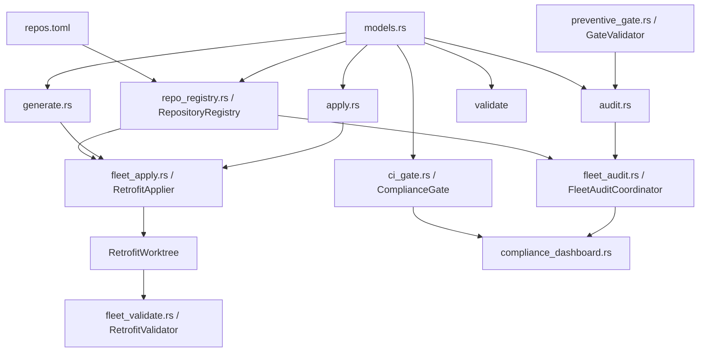
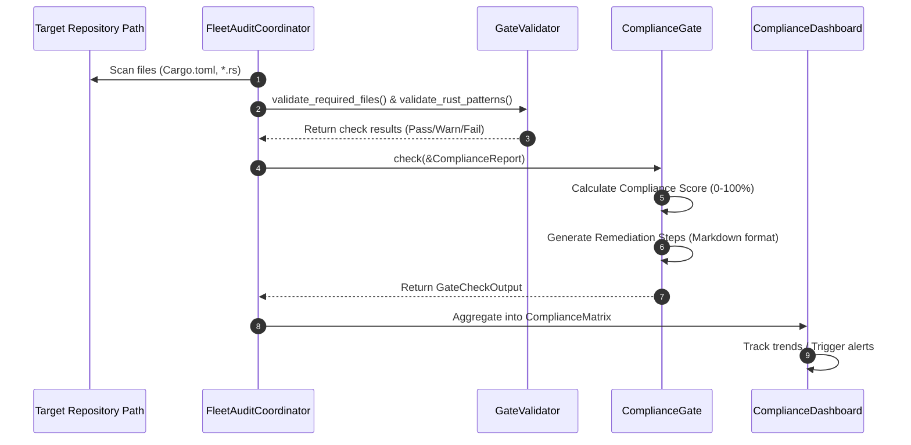
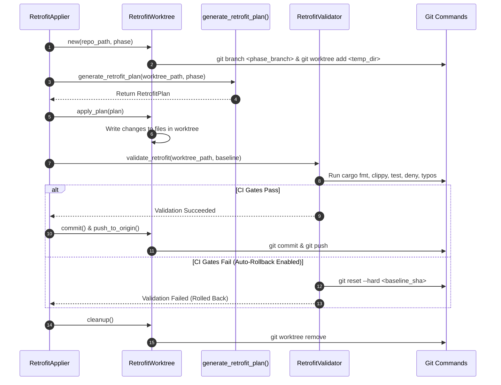

# Crate: `praxis-retrofit`

The `praxis-retrofit` crate is a core infrastructure component within the `seanchatmangpt` ecosystem. Its primary objective is to automate the auditing, planning, execution, and validation of standardized development rules (known as "Praxis standards") across a fleet of legacy Rust repositories. It ensures that standard configurations, lints, license constraints, dependency limits, task runners, and contributor manuals are uniformly applied and strictly maintained.

---

## 1. Theory and Logic Design

### CLI Noun-Verb Pattern Design Philosophy
To present a clean, predictable command-line interface (CLI) to ecosystem operators, `praxis-retrofit` adheres to the **Noun-Verb Command Pattern**. Instead of nested flags or sequential options, the CLI structures command execution via distinct resources (Nouns) and actions targeting those resources (Verbs):
$$\text{Command Syntax: } \texttt{praxis-retrofit <noun> <verb> <arguments>}$$

This pattern yields several benefits:
- **Low Cognitive Overhead**: The operator identifies the target concept first (e.g., `audit` or `apply`), then specifies the operation (e.g., `scan` or `retrofit`).
- **Isolation of Command Domains**: CLI parsing logic is divided into self-contained sub-commands that map directly to the crate's internal modules.
- **RESTful CLI Translation**: It models actions in a REST-like manner (Noun = Resource, Verb = Method/Action), ensuring logical consistency as command scope expands.

The command routing structure is implemented as follows:
- `audit` (Noun)
  - `scan` (Verb): Scans a repository and returns a raw JSON payload of compliance results.
  - `report` (Verb): Scans a repository and outputs a pretty-printed, human-readable compliance table.
- `apply` (Noun)
  - `retrofit` (Verb): Automatically generates and applies standard modifications to the workspace on disk.
  - `validate` (Verb): Executes CI gate simulation to verify code compilation and linting correctness post-retrofit.
- `generate` (Noun)
  - `templates` (Verb): Dumps standard template configurations for `Cargo.toml` lints, `typos.toml`, and `justfile` configurations.
  - `plan` (Verb): Generates a dry-run JSON blueprint of proposed modifications for inspection.
- `validate` (Noun)
  - `compliance` (Verb): Runs the CI gate rules to determine whether a target repository complies with production readiness standards.

### Repository Registry (`repo_registry.rs`)
The fleet configuration is driven by `repos.toml`, a central catalog defining metadata for the 18 surveyed repositories in the ecosystem. 

#### Validation and Invariants
During initialization, `RepositoryRegistry` reads this file using `star-toml` loaders and enforces strict data validation using Chicago TDD Tools' invariants (poka-yoke error-proofing helpers):
1. **`PositiveUsize`**: Validates the `crate_count` field of each repository entry. It ensures that the repository contains at least one publishable crate, failing early if the count is zero or negative.
2. **`BoundedU32`**: Validates the `priority_score` field. It restricts the score to a range of $0 \le x \le 100$ (representing execution urgency), preventing out-of-bounds weightings from skewing batch processing orders.

#### Recommended Retrofit Order
The registry computes a recommended retrofit sequence based on downstream dependencies. Libraries that are heavily utilized by other crates (e.g., `clap-noun-verb` or shared configuration components) are ordered first. This allows changes to propagate cleanly from upstream dependencies to downstream consumers, minimizing compilation breakage:

```
Upstream Libraries (e.g., clap-noun-verb) ──► Middle Tier (e.g., ggen) ──► Downstream Applications (e.g., clnrm)
```

### Layered Config Path Resolution
The location of the repository registry (`repos.toml`) is determined dynamically at runtime using a three-tier layered resolution scheme:
1. **Environment Variable**: The runtime checks for `PRAXIS_REGISTRY_PATH`. If defined and non-empty, this path is immediately returned.
2. **Upward Directory Config Scanning**: If the environment variable is absent, the resolver starts at the current working directory (CWD) and traverses parent directories up to 5 levels. At each step, it checks for a file named `repos.toml`. If found, it returns the resolved path.
3. **Fallback**: If neither search succeeds, the resolver defaults to a pre-defined path parameter (usually `./repos.toml`).

This mechanism permits operators to execute `praxis-retrofit` from deep within subdirectories of a multi-crate workspace without explicitly specifying the path to the ecosystem's registry.

### Isolated Fleet Modifications via Git Worktrees (`fleet_apply.rs`)
Modifying multiple repositories concurrently presents significant concurrency hazards: parallel cargo processes lock target directories, local working files become polluted, and concurrent git operations can corrupt working trees. 

To eliminate these conflicts, `fleet_apply.rs` implements **isolated git worktrees** for all modifications:
1. The applier creates a temporary directory path under `std::env::temp_dir()/praxis-retrofit/<name>-<uuid>`.
2. It checks out a temporary phase branch (e.g., `retrofit/phase-1-lints`) from the default main/master branch.
3. It runs `git worktree add <temp_path> <branch>` to spawn a decoupled, secondary working directory sharing the main repository's `.git` database.
4. All file modifications, compilation checks, clippy warnings, and test suites are run inside this isolated temporary directory.
5. If the retrofit passes validation, the changes are committed, and the branch is pushed to origin directly from the worktree.
6. The worktree is cleaned up via `git worktree remove` and the temporary directory is deleted. The operator's main working branch remains untouched and clean.

### CI Gate Simulation and Auto-Rollback (`fleet_validate.rs`)
To protect production branches from regressions, `fleet_validate.rs` performs a local simulation of the primary continuous integration (CI) pipeline gates. When a repository undergoes retrofitting, the validator launches the following validation tools in sequence:
- **Formatting**: `cargo fmt --check`
- **Linting**: `cargo clippy --all-targets --all-features -- -D warnings`
- **Unit Testing**: `cargo test --all-features`
- **Dependency Audit**: `cargo deny check`
- **Spell Check**: `typos`

#### Auto-Rollback Protocol
Before applying any modifications, the validator captures the initial git state (HEAD SHA and current branch). If any of the simulated CI gates fail and `auto_rollback` is enabled in `ValidationConfig`, the validator automatically triggers a rollback:
1. Reverts all uncommitted changes.
2. Runs `git reset --hard <sha>` inside the repository directory to restore the workspace to the exact baseline commit captured prior to the retrofit attempt.
3. Returns a validation report detailing which gate failed and attesting that the workspace was successfully reverted.

### Preventive AST/Pattern Gates (`preventive_gate.rs`)
`preventive_gate.rs` implements static linting and path validation checks on manifests and source code to prevent legacy patterns from creeping back into standard workspaces:
- **CalVer Compliance**: Enforces that package versions match the CalVer format (`YY.M.patch`, e.g., `26.6.0`). It parses the version string and validates that it has exactly three integer components and that the year part ($YY$) is within the valid range of $0 \le YY \le 99$.
- **License Uniformity**: Verifies that the package license matches the house preference (`MIT OR Apache-2.0`). Allowed licenses must be strictly defined in a license allowlist.
- **Lint Inheritance**: Verifies that individual crates in a workspace inherit the root workspace's lint suite via `lints.workspace = true`.
- **MSRV Enforcer**: Ensures that `rust-version` is specified in `Cargo.toml` and that it is equal to or greater than the house minimum (currently `1.82`).
- **Disallowed Macro Inspection**: Performs an AST-like line scan of production `.rs` source files (excluding `tests`, `examples`, and `benches` directories). It flags and rejects any un-commented occurrences of development helper macros:
  - `dbg!`
  - `todo!`
  - `unimplemented!`
- **Absence of Backup Files**: Scans the workspace directory structure and fails validation if any residual editor backup files (matching `**/*.rs.backup`) are found.

---

## 2. Internal Architecture

### Structural Module Relationships
The diagram below shows the structural dependency graph of the modules within the `praxis-retrofit` crate.



### Audit and Validation Flow
This diagram details the sequence of events during a parallel audit run where compliance status and remediation steps are computed for the dashboard.



### Retrofit and Apply Flow
This diagram details the lifecycle of an isolated retrofit application within a temporary worktree, simulating CI gates and managing auto-rollback.



---

## 3. API Signatures & Examples

This section provides the signatures for the key public structs, traits, and associated types, followed by realistic examples demonstrating how to use them.

### Key API Signatures

#### `RepositoryRegistry` (`src/repo_registry.rs`)
```rust
pub struct RepositoryRegistry {
    repos: HashMap<String, RepositoryEntry>,
    pub metadata: EcosystemMetadata,
}

impl RepositoryRegistry {
    /// Loads the registry from a TOML file, resolving its path layered on the filesystem.
    pub async fn load(path: impl AsRef<std::path::Path>) -> crate::Result<Self>;

    /// Parses the registry from a raw TOML string and runs poka-yoke validations.
    pub async fn load_str(contents: &str) -> crate::Result<Self>;

    /// Returns a list of references to all loaded repositories.
    pub fn all(&self) -> Vec<&RepositoryEntry>;

    /// Retrieves a single repository entry by its unique slug name.
    pub fn get(&self, name: &str) -> Option<&RepositoryEntry>;

    /// Returns repositories sorted by their priority score (highest first).
    pub fn sorted_by_priority(&self) -> Vec<&RepositoryEntry>;

    /// Returns repositories sorted by estimated effort (ascending).
    pub fn sorted_by_effort(&self) -> Vec<(&RepositoryEntry, f32)>;

    /// Returns the recommended ordering list based on downstream dependency count.
    pub fn recommended_retrofit_order(&self) -> Vec<&RepositoryEntry>;

    /// Finds and returns all repositories that depend directly on the specified repo.
    pub fn downstream_consumers(&self, repo_name: &str) -> Vec<&RepositoryEntry>;

    /// Generates a summary report of ecosystem readiness.
    pub fn readiness_summary(&self) -> String;
}
```

#### `FleetAuditCoordinator` (`src/fleet_audit.rs`)
```rust
pub struct FleetAuditCoordinator {
    max_agents: usize,
    spec: PraxisSpec,
    observer: Option<std::sync::Arc<dyn AuditObserver>>,
}

impl FleetAuditCoordinator {
    /// Instantiates a coordinator with a concurrency limit and praxis standard specifications.
    pub fn new(max_agents: usize, spec: PraxisSpec) -> Self;

    /// Registers a progress tracker to observe the parallel scan execution.
    pub fn set_observer(&mut self, observer: std::sync::Arc<dyn AuditObserver>);

    /// Discovers all Cargo projects under the root path and audits them concurrently.
    pub async fn audit_fleet(&self, fleet_root: &std::path::Path) -> crate::Result<ComplianceMatrix>;

    /// Runs audits against a specific, pre-filtered subset of repository directories.
    pub async fn audit_with_filter(&self, repos: Vec<std::path::PathBuf>) -> crate::Result<ComplianceMatrix>;
}
```

#### `RetrofitWorktree` (`src/fleet_apply.rs`)
```rust
pub struct RetrofitWorktree {
    original_path: std::path::PathBuf,
    worktree_path: std::path::PathBuf,
    name: String,
    remote_url: Option<String>,
    current_branch: String,
}

impl RetrofitWorktree {
    /// Spawns a secondary worktree in a temporary directory for a specific retrofit phase branch.
    pub fn new(repo_path: &std::path::Path, phase: RetrofitPhase) -> crate::Result<Self>;

    /// Gets the temporary path to the worktree filesystem.
    pub fn path(&self) -> &std::path::Path;

    /// Executes the changes contained in the retrofit blueprint.
    pub async fn apply_plan(&self, plan: &RetrofitPlan) -> crate::Result<Vec<String>>;

    /// Runs internal validation assertions.
    pub async fn validate(&self) -> crate::Result<bool>;

    /// Stages and commits all modifications within the worktree.
    pub fn commit(&self, message: &str) -> crate::Result<String>;

    /// Pushes the branch changes to the remote repository.
    pub fn push_to_origin(&self) -> crate::Result<()>;

    /// Removes the git worktree and deletes the temporary files.
    pub fn cleanup(&self) -> crate::Result<()>;
}
```

#### `RetrofitApplier` (`src/fleet_apply.rs`)
```rust
pub struct RetrofitApplier {
    spec: PraxisSpec,
    repositories: Vec<(std::path::PathBuf, RetrofitPhase)>,
    concurrent_limit: usize,
}

impl RetrofitApplier {
    /// Creates a new fleet applier with the specified standard spec.
    pub fn new(spec: PraxisSpec) -> crate::Result<Self>;

    /// Registers a repository target and its intended target phase.
    pub fn add_repository(&mut self, repo_path: impl AsRef<std::path::Path>, phase: RetrofitPhase) -> crate::Result<()>;

    /// Sequentially retrofits all registered repositories.
    pub async fn apply_all(&self) -> crate::Result<Vec<ApplyResult>>;
}
```

#### `RetrofitValidator` (`src/fleet_validate.rs`)
```rust
pub struct RetrofitValidator {
    config: ValidationConfig,
    spec: PraxisSpec,
}

impl RetrofitValidator {
    /// Creates a validator with default configurations.
    pub fn new() -> Self;

    /// Creates a validator with a custom validation profile configuration.
    pub fn with_config(config: ValidationConfig) -> Self;

    /// Attaches a custom Praxis specification profile.
    pub fn with_spec(mut self, spec: PraxisSpec) -> Self;

    /// Runs CI simulation on disk and rolls back the repository on failure.
    pub async fn validate_retrofit(&self, repo_path: &std::path::Path, pre_report: &ComplianceReport) -> crate::Result<ValidationReport>;
}
```

#### `GateValidator` (`src/preventive_gate.rs`)
```rust
pub struct GateValidator {
    allowed_licenses: Vec<String>,
    min_msrv: String,
    house_defaults: HouseDefaults,
}

impl GateValidator {
    /// Creates a new validator loaded with default house lints and rule sets.
    pub fn new() -> Self;

    /// Asserts that Cargo.toml structures inherit lints and declare standard version formats.
    pub fn validate_cargo_toml(&self, path: &std::path::Path) -> anyhow::Result<Vec<ValidationResult>>;

    /// Recursively scans all codebase .rs files for dbg!, todo!, or unimplemented! macro calls.
    pub fn validate_rust_patterns(&self, path: &std::path::Path) -> anyhow::Result<Vec<ValidationResult>>;

    /// Verifies the presence of required LICENSE and toolchain configuration files.
    pub fn validate_required_files(&self, repo_root: &std::path::Path) -> anyhow::Result<Vec<ValidationResult>>;
}
```

---

### Code Examples

#### Example 1: Loading Repository Registry and Resolving Order
The following example shows how to load the ecosystem catalog from `repos.toml`, locate dependencies using upward path resolution, print recommended retrofit orders, and find downstream dependents.

```rust
use std::path::Path;
use praxis_retrofit::repo_registry::RepositoryRegistry;

#[tokio::main]
async fn main() -> anyhow::Result<()> {
    // 1. Load repos.toml using resolution rules (checks env var or scans CWD parents up to 5 levels)
    let fallback_path = Path::new("repos.toml");
    let registry = RepositoryRegistry::load(fallback_path).await?;
    
    println!("Loaded ecosystem: {}", registry.metadata.ecosystem_name);
    
    // 2. Query recommended retrofit order (highest adoption / upstream libs first)
    let order = registry.recommended_retrofit_order();
    println!("Total repositories registered: {}", order.len());
    for (i, repo) in order.iter().take(5).enumerate() {
        println!("{}. Repo: {} (readiness: {}, phase: {})", 
                 i + 1, 
                 repo.name, 
                 repo.retrofit_readiness,
                 repo.retrofit_phase_complete);
    }
    
    // 3. Find downstream consumers that depend on "clap-noun-verb"
    let dependents = registry.downstream_consumers("clap-noun-verb");
    println!("\nDownstream consumers of 'clap-noun-verb':");
    for dep in dependents {
        println!("  - Name: {} (priority: {}, effort: {} weeks)", 
                 dep.name, 
                 dep.priority_score,
                 dep.estimated_effort_weeks());
    }
    
    Ok(())
}
```

#### Example 2: Performing a Parallel Fleet Audit
This example demonstrates how to configure the `FleetAuditCoordinator` to scan multiple repositories concurrently using Tokio tasks and a custom observer.

```rust
use std::path::Path;
use std::sync::Arc;
use praxis_retrofit::{
    fleet_audit::{ComplianceMatrix, FleetAuditCoordinator, AuditObserver},
    models::ComplianceReport,
    PraxisSpec,
};

// Implement progress tracking observer for the coordination engine
struct ProgressTracker;

impl AuditObserver for ProgressTracker {
    fn on_audit_start(&self, repo_count: usize, max_agents: usize) {
        println!("Starting parallel audit of {} repositories using {} worker threads.", repo_count, max_agents);
    }
    fn on_repo_scan_start(&self, name: &str) {
        println!("  [Scan Start] Auditing repository: {}", name);
    }
    fn on_repo_scan_complete(&self, name: &str, report: &ComplianceReport) {
        println!("  [Scan Done]  Repository: {} | Score: {:.1}% | Compliant: {}", 
                 name, report.score(), report.is_compliant());
    }
    fn on_repo_scan_error(&self, name: &str, err: &str) {
        eprintln!("  [Scan Error] Repository: {} | Reason: {}", name, err);
    }
    fn on_fleet_complete(&self, matrix: &ComplianceMatrix) {
        println!("\nFleet Audit Completed successfully!");
        println!("Average Compliance Score: {:.2}%", matrix.compliance_score());
    }
}

#[tokio::main]
async fn main() -> anyhow::Result<()> {
    let spec = PraxisSpec::default();
    
    // Instantiate with a concurrency limit of 10 workers
    let mut coordinator = FleetAuditCoordinator::new(10, spec);
    coordinator.set_observer(Arc::new(ProgressTracker));

    let fleet_root = Path::new("./repos");
    let matrix = coordinator.audit_fleet(fleet_root).await?;
    
    // Serialize and write out the compliance matrix as JSON
    let json_matrix = matrix.to_json()?;
    std::fs::write("fleet_compliance_matrix.json", json_matrix)?;
    println!("Compliance matrix exported to 'fleet_compliance_matrix.json'.");
    
    Ok(())
}
```

#### Example 3: Running a Validation and Auto-Rollback on Failure
The following example establishes a baseline audit, configures a strict validation profile, applies changes, and executes simulated CI checks. If any check fails, the repository is reverted to the baseline git commit state.

```rust
use std::path::Path;
use praxis_retrofit::{
    fleet_validate::{RetrofitValidator, ValidationConfig},
    validate_compliance,
};

#[tokio::main]
async fn main() -> anyhow::Result<()> {
    let repo_path = Path::new("./my-target-repo");
    
    // 1. Establish the baseline compliance score of the target repository
    let baseline_report = validate_compliance(repo_path).await?;
    println!("Baseline Compliance Score: {:.1}%", baseline_report.score());
    
    // 2. Configure a strict validation configuration with auto_rollback enabled
    let config = ValidationConfig {
        run_tests: true,
        run_clippy: true,
        check_fmt: true,
        check_deny: true,
        check_typos: true,
        auto_rollback: true,
        keep_report: true,
        max_output_size: 8192,
    };
    
    let validator = RetrofitValidator::with_config(config);
    
    // 3. Execute validation (if tests/clippy fail, changes are reverted)
    println!("Executing post-retrofit CI simulation gates...");
    let report = validator.validate_retrofit(repo_path, &baseline_report).await?;
    
    if report.is_successful() {
        println!("Validation Passed!");
        println!("Score Improvement: {:.1}% (New Score: {:.1}%)", report.delta, report.post_score);
    } else {
        println!("Validation Failed! Repository was automatically rolled back: {}", report.rolled_back);
        eprintln!("\nCI Failure Details:");
        for message in report.messages {
            eprintln!("  - {}", message);
        }
    }
    
    Ok(())
}
```

#### Example 4: Custom Remediation PR Generation
This example demonstrates generating conventional commit messages and Markdown pull request templates based on the applied retrofit phase.

```rust
use std::path::PathBuf;
use praxis_retrofit::{
    models::{RepositoryMetadata, RetrofitPhase},
    pr_generator::{PullRequestGenerator, PullRequestGeneratorConfig},
};

fn main() -> anyhow::Result<()> {
    // Define the PR engine options
    let config = PullRequestGeneratorConfig {
        github_owner: "seanchatmangpt".to_string(),
        create_as_draft: true,
        auto_assign_reviewers: vec!["@reviewer-1".to_string()],
        labels: vec!["retrofit".to_string(), "lints".to_string()],
        base_branch: "main".to_string(),
        branch_prefix: "praxis/retrofit".to_string(),
    };
    
    let generator = PullRequestGenerator::new(config);
    
    let repo = RepositoryMetadata {
        path: PathBuf::from("./repos/wasm4pm"),
        name: "wasm4pm".to_string(),
        workspace_root: PathBuf::from("./repos/wasm4pm"),
        crate_count: 1,
        has_workspace: false,
    };
    
    // 1. Generate the standardized PR branch name
    let branch_name = generator.branch_name(&repo.name, RetrofitPhase::Phase1Lints);
    println!("Branch Name to Create: {}", branch_name);
    
    // 2. Generate a standard, conventional PR title & detailed markdown body
    let template = PullRequestGenerator::template_for_phase(RetrofitPhase::Phase1Lints, &repo, 3);
    println!("\nPR Title: {}", template.title);
    println!("PR Body:\n{}", template.body);
    
    Ok(())
}
```
