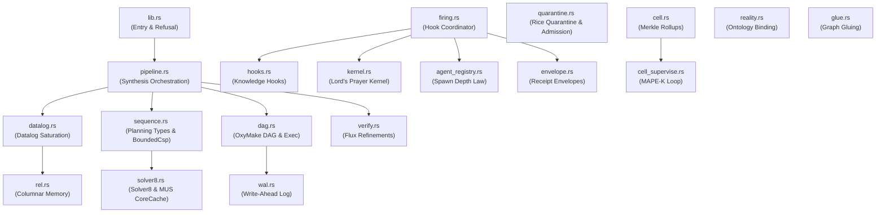
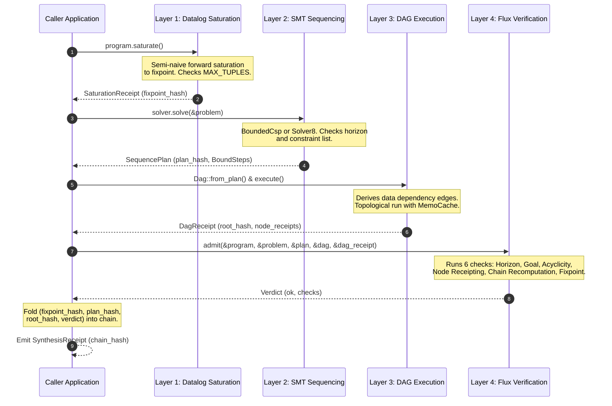

# Crate: `praxis-synthesis`

`praxis-synthesis` is the integration crate that composes the Google Antigravity deep-research stack into a single, bounded, and auditable pipeline. It translates raw facts and Horn rules through stratified Datalog saturation, SMT-style capability sequencing, content-addressed DAG execution, and refinement-style admission verification into a rolling BLAKE3 hash receipt.

---

## 1. Theory and Logic Design

### 1.1 Crate Purpose and Objective
The fundamental goal of the `praxis-synthesis` crate is to execute and certify deep-research workflows in a deterministic, auditable, and bounded environment. To achieve this, it integrates four distinct logical layers:

1. **Stratified Datalog Saturation (Nemo):** Resolves recursive relations forward to a closed-world fixpoint. Storage is optimized using sorted columnar spaces where the tuple itself is the key (arity $\le 8$). Joins are planned greedily using bound-prefix ranges and most-bound-first heuristics.
2. **SMT-style Capability Sequencing (SMT):** Automatically discovers step ordering and parameter bindings from declared capabilities (preconditions, add effects, del effects, and cost) under named constraints. This eliminates the need for hand-authored PDDL files and separates constraint formulation from the solver implementation.
3. **Content-Addressed DAG Execution (OxyMake):** Executes the planning steps as a data-dependency DAG rather than a linear sequence. Node identities are determined by the hashes of their action and inputs, allowing order-independent root hashes and memoized replay.
4. **Refinement-Style Admission (Flux):** Executes machine-checkable refinements over the pipeline's own execution artifacts (the plan, the DAG structure, and the node receipts), producing a structured verdict that certifies invariant conformance.

The pipeline threads these four layers together:
$$\text{Facts} \xrightarrow{\text{Saturate}} \text{Fixpoint DB} \xrightarrow{\text{Sequence}} \text{Linear Plan} \xrightarrow{\text{DAG Convert}} \text{Topological Exec} \xrightarrow{\text{Refine}} \text{Synthesis Receipt}$$

---

### 1.2 Core Doctrine and Invariants

#### 1.2.1 Bounded Limits
To prevent infinite loops, memory exhaustion, and denial-of-service, the crate enforces hard limits across all execution phases. These bounds are evaluated incrementally and will trigger structured refusals rather than silent truncation or runtime panics:
* **`MAX_TUPLES` (100,000,000):** The global limit on the number of EDB and derived tuples in the Datalog database. Checks are performed during insertion inside `RelStore`.
* **`MAX_ITERATIONS` (10,000):** The maximum loop count allowed during Datalog saturation rounds per stratum or incremental assertions.
* **`MAX_STRATA` (8):** The maximum number of stratified negation layers allowed in Datalog program analysis. Negation cycles are detected upfront.
* **`MAX_VARS` (8):** The variable cap for Datalog rules and capability parameter lists. Rules or capability definitions referencing variables outside `Var(0..7)` are refused.
* **`MAX_STEPS` (16):** The maximum plan length allowed for the constraint sequencing solver.
* **`MAX_BINDINGS_PER_STEP` (256):** The cap on parameter bindings considered per capability step.
* **`MAX_NODES` (100,000):** The maximum search nodes explored by the sequencing solver.
* **`MAX_HOOKS` (12):** The maximum number of registered Knowledge Hooks allowed in the graph.
* **`MAX_AGENTS` (8):** The maximum number of declared agent profiles allowed in the registry.

#### 1.2.2 First-Class Refusals
When an invariant, boundary, or budget is violated, the system does not crash. Instead, it emits a `Refusal` enum. The refusal captures the exact context of the failure along with salvage data. This ensures that failures are receipted and can be audited. For example, if a plan is unsatisfiable, the solver can return a certified minimal unsatisfiable core (MUS) indicating which constraints conflicted.

#### 1.2.3 Content-Addressing vs. Order-Addressing
The execution state is fully content-addressed. Nodes in the DAG are identified by:
$$\text{Node ID} = \text{BLAKE3}(\text{BoundAction} \mathbin{\|} \text{OccurrenceIndex})$$
Each node's execution is memoized in a `MemoCache` using a key derived from the action hash and the BLAKE3 hashes of its inputs:
$$\text{Memo Key} = \text{BLAKE3}(\text{ActionHash} \mathbin{\|} \text{InputHashes})$$
Because node execution is deterministic, any order-independent topological traversal of the DAG produces the identical outputs, same cache hits, and the same final root hash.

---

### 1.3 Core Concepts

#### 1.3.1 Lord's Prayer Kernel (Surrender Boundary)
The Lord's Prayer kernel represents a closed-world configuration of 11 canonical scriptural clauses. These clauses are extracted as data from the admitted graph and map onto three distinct delegation boundaries:
* `"human-only"`
* `"automatable-support"`
* `"god-receives-unbounded"`

The **surrender boundary** is a critical runtime law. Any clause marked `"god-receives-unbounded"` must map to a knowledge hook with a `Refuse` effect. Furthermore, no other ground-action hook in the graph is permitted to watch the variables or predicates associated with this surrendered clause. This guarantees that unbounded or transcendent operations are surrendered rather than computed.

#### 1.3.2 Knowledge Hooks
Knowledge hooks are trigger-check-act units defined inside the admitted graph under the `hook:` namespace.
* **Triggers (Gating):** Hooks can trigger `on` `"assert"` (only additions), `"retract"` (only removals), or `"any"`.
* **Conditions (Checks):** Evaluated against the post-state or delta:
  * `Datalog`: True if a goal predicate is derivable under rule program saturation.
  * `Delta`: True if the delta touches a watched predicate.
  * `Threshold`: True if the post-state count of triples matching a predicate meets a condition.
  * `Count`: True if the number of occurrences of a predicate in the delta meets a condition.
  * `Window`: True if the sum of occurrences of a predicate in the delta and preceding history window meets a condition.
* **Effects (Acts):** The consequence of hook firing:
  * `EmitDelta`: Produces a candidate delta that re-enters the quarantine door.
  * `GroundAction`: Grounds a declared workflow fragment and executes it.
  * `Refuse`: Aborts the event and emits a receipted refusal detailing the reason.

#### 1.3.3 Reality Addressing
Rather than inventing private coordinates, `praxis-synthesis` binds graph referents to public-ontology anchors:
* **OWL-Time (`http://www.w3.org/2006/time#inXSDDateTimeStamp`):** Time coordinates.
* **GeoSPARQL (`http://www.opengis.net/ont/geosparql#asWKT`):** Spatial geometry coordinates in Well-Known Text format.
* **PROV-O (`http://www.w3.org/ns/prov#wasAttributedTo`):** Attribution and provenance coordinates.

A referent with none of these three anchors cannot be resolved as a reality address, and attempts to bind it will return a `RealityAddressIllFormed` refusal.

#### 1.3.4 Hierarchical Merkle Cell Rollups
To scale verification, the system organizes agents into hierarchical Merkle rollups:
1. **Agent Level:** Emits status bytes and terminal hashes (receipt hash if admitted, refusal hash if refused) inside a `MemberRecord`.
2. **Group Level:** Aggregates a shard of members. Emits a `GroupReceipt` containing a `replay_root` (a BLAKE3 hash over sorted member terminal hashes).
3. **Cell Level:** Composes $G$ group receipts. Emits a `CellReceipt` containing a `cell_hash` (a rolling fold over the group roots).

This allows a remote verifier to verify the state of a cell and selectively replay individual member nodes without reading every interior event.

#### 1.3.5 Write-Ahead Log (WAL)
To survive process crashes, a durable append-only binary log journals the `MemoCache`. The WAL uses length-prefixed, BLAKE3-hashed binary frames:
```text
+-------------------+--------------------+---------------------------------------+
|  Length (u32 LE)  |  Hash (32 B BLAKE3) |  Payload: [KeyLen][KeyBytes][ValBytes] |
+-------------------+--------------------+---------------------------------------+
```
If the process dies mid-write, the recovery path detects the torn frame by checking the length and verifying the BLAKE3 hash against the payload. The torn frame is safely ignored, recovery halts at the last intact frame, and execution deterministically resumes.

---

## 2. Internal Architecture

### 2.1 Crate Module Walkthrough
* **`lib.rs`:** The library entry point. Exposes public traits and defines the `Refusal` enum.
* **`pipeline.rs`:** Implements `Synthesis` which orchestrates the four layers into a single execution.
* **`datalog.rs`:** Columnar relation storage (`RelStore`), rule parsing, and forward semi-naive saturation.
* **`rel.rs`:** Binary tuple storage, sorted relations, and prefix range queries.
* **`sequence.rs`:** Capability and constraint definitions, sequencing problem construction, and the branch-and-bound `BoundedCsp` backtracking solver.
* **`solver8.rs`:** Implements the `Solver8` kernel with AC-3-style mask propagation, mandatory analysis, minimal unsatisfiable core (MUS) extraction, and `CoreCache` sharing.
* **`dag.rs`:** Derives dependency edges, sorts DAGs topologically, and executes nodes.
* **`verify.rs`:** Defines the Flux refinements `admit` function which checks the 6 invariants.
* **`quarantine.rs`:** Decidable `RiceQuarantine` and reference-updating `Admission` gates.
* **`reality.rs`:** Derives `RealityAddressRecord` from public ontology triples.
* **`kernel.rs`:** Validates Lord's Prayer kernel clauses and enforces the surrender boundary law.
* **`hooks.rs`:** Hook registry extractor and hook condition evaluation engine.
* **`envelope.rs`:** Pure additive wrapper `ReceiptEnvelope` that Merkle-chains receipts for cross-domain exchange.
* **`firing.rs`:** Coordinates event admission, agent validation, hook evaluation, and action grounding.
* **`agent_registry.rs`:** Enforces agent tool bounds and the terminal depth-5 spawn law.
* **`geometry.rs`:** Classifies planning failures into structured geometries (e.g., `AuthorityVacuum`).
* **`cell.rs` & `cell_supervise.rs`:** Handles Merkle sharding rollups and MAPE-K loop supervision.
* **`wal.rs`:** Append-only binary log for memo cache recovery.
* **`glue.rs`:** Merges workflow fragments and checks for functional predicate conflicts.

---

### 2.2 System Architecture Diagrams

#### 2.2.1 Crate Module Structure
The following diagram illustrates the dependency relationship and structure of modules within `praxis-synthesis`:



#### 2.2.2 Core Synthesis Pipeline Data Flow
This diagram details the path of input data through the core pipeline layers inside `Synthesis::run`:



#### 2.2.3 Hook Firing and Event Admission Pipeline
This diagram traces the flow of a proposed state delta through the quarantine gate, agent checks, hook evaluations, and grounding:

```mermaid
flowchart TD
    Raw[MeaningSource] -->|1. Quarantine| QR[RiceQuarantine::inspect]
    QR -->|Reject: Lexical/Shape Refusal| Fail[Refusal]
    QR -->|Pass: GraphDelta| ADM[Admission::admit]
    
    ADM -->|Check post-state vocab| ADM_CHK{Vocab check?}
    ADM_CHK -->|No| Fail
    ADM_CHK -->|Yes| Evt[AdmittedEvent]
    
    Evt -->|2. Kernel Guard| PK[enforce_surrender_boundary]
    PK -->|Boundary Violation| Fail
    
    Evt -->|3. Agent Guard| AG[spawn_depth_law]
    AG -->|Depth-5 Spawn Violation| Fail
    
    Evt -->|4. Hook Registry| HK[evaluate_hooks]
    Note over HK: Evaluates Datalog, Delta, Threshold,<br/>Count, and Window conditions.
    HK -->|All hooks evaluated| Rec[HookVerdictRecords]
    
    Rec -->|5. Effect Routing| Eff{EffectKind}
    Eff -->|Refuse| RefRec[FiringOutcome::Refused]
    Eff -->|EmitDelta| Raw
    Eff -->|GroundAction| Ground[ground_fired_action]
    
    Ground -->|Run Workflow DAG| WF[WorkflowReceipt]
    WF -->|Chain Folds| Receipt[HookFiringReceipt]
```

---

## 3. API Signatures, Types, and Code Examples

### 3.1 Key Public Types and API Signatures

#### 3.1.1 The `Refusal` Enum
Declares all failure conditions in a structured, serializable enum:
```rust
pub enum Refusal {
    BudgetExceeded { what: String, budget: u64, spent: u64, salvage: String },
    TupleCapExceeded { derived: u64, cap: u64, iteration: u64 },
    Unstratifiable { detail: String },
    Unsatisfiable { detail: String, nodes_explored: u64 },
    UnsatProof { detail: String, core: Vec<String>, replayed: bool },
    InvalidInput { detail: String },
    GraphMalformed { line: usize, column: usize, detail: String },
    UnknownPredicate { predicate: String, subject: String },
    WorkflowIllFormed { subject: String, detail: String },
    GraphCapExceeded { what: String, cap: u64, actual: u64 },
    VerificationFailed { failed: Vec<String> },
    GlueConflict { subject: String, predicate: String, values: Vec<String> },
    AdmissionRefused { subject: String, detail: String },
    ConditionUnsupported { kind: String, subject: String, supported_analog: String },
    HookIllFormed { subject: String, detail: String },
    KernelIllFormed { subject: String, detail: String },
    UnknownHandler { capability: String, handler: String, known: Vec<String> },
    DelegabilityViolation { capability: String, required: String, declared: String },
    BoundaryViolation { subject: String, detail: String },
    EnvelopeChainBroken { index: usize, detail: String },
    AgentIllFormed { subject: String, detail: String },
    RealityAddressIllFormed { subject: String, detail: String },
}
```

#### 3.1.2 Layer 1: Datalog Saturation
```rust
pub struct Program {
    pub dict: Dict,
    // contains internal rels, rules, derived count, and rolling chain hash
}

impl Program {
    pub fn new() -> Self;
    pub fn intern(&mut self, name: &str) -> SymId;
    pub fn add_fact(&mut self, pred: SymId, args: &[SymId]) -> Result<bool, Refusal>;
    pub fn add_rule(&mut self, rule: DlRule) -> Result<(), Refusal>;
    pub fn saturate(&mut self) -> Result<SaturationReceipt, Refusal>;
    pub fn assert_facts(&mut self, facts: &[(SymId, Vec<SymId>)]) -> Result<IncrementReceipt, Refusal>;
    pub fn is_closed(&mut self) -> Result<bool, Refusal>;
    pub fn fixpoint_hash(&self) -> String;
}
```

#### 3.1.3 Layer 2: Sequencing
```rust
pub struct SequenceProblem {
    // Problem inputs: capabilities, goal atoms, horizon, constraints
}

pub struct SequencePlan {
    pub steps: Vec<BoundStep>,
    pub cost: u32,
    pub receipt: SolveReceipt,
}

pub trait Solver {
    fn solve(&self, problem: &SequenceProblem) -> Result<SequencePlan, Refusal>;
}
```

#### 3.1.4 Layer 3: Content-Addressed Workflows
```rust
pub struct Dag {
    pub nodes: BTreeMap<String, DagNode>,
}

impl Dag {
    pub fn from_plan(plan: &SequencePlan, problem: &SequenceProblem) -> Self;
    pub fn execute(&self, runner: &mut dyn NodeRunner, cache: &mut MemoCache) -> Result<DagReceipt, Refusal>;
    pub fn topo_order(&self) -> Result<Vec<String>, Refusal>;
}

pub trait NodeRunner {
    fn run(&mut self, node: &DagNode, inputs: &[Vec<u8>]) -> Vec<u8>;
}
```

#### 3.1.5 Layer 4: Flux Refinement
```rust
pub struct CheckOutcome {
    pub name: String,
    pub ok: bool,
    pub witness: String,
}

pub struct Verdict {
    pub ok: bool,
    pub checks: Vec<CheckOutcome>,
}

pub fn admit(
    program: &mut Program,
    problem: &SequenceProblem,
    plan: &SequencePlan,
    dag: &Dag,
    receipt: &DagReceipt,
) -> Verdict;
```

#### 3.1.6 Lord's Prayer Kernel
```rust
pub struct PrayerClause {
    pub iri: String,
    pub name: String,
    pub problem_class: String,
    pub boundary: String,
    pub action: Option<String>,
}

pub fn extract_kernel(triples: &[Triple]) -> Result<Vec<PrayerClause>, Refusal>;
pub fn enforce_surrender_boundary(triples: &[Triple], hooks: &[KnowledgeHook]) -> Result<(), Refusal>;
pub fn kernel_hash(clauses: &[PrayerClause]) -> String;
```

#### 3.1.7 Knowledge Hooks
```rust
pub struct KnowledgeHook {
    pub iri: String,
    pub name: String,
    pub on: String,
    pub condition: HookCondition,
    pub effect: EffectKind,
    pub action: Option<String>,
    pub reason: Option<String>,
    pub priority: u8,
}

pub fn extract_hooks(triples: &[Triple]) -> Result<Vec<KnowledgeHook>, Refusal>;
pub fn evaluate_hooks(hooks: &[KnowledgeHook], event: &AdmittedEvent, history: &[GraphDelta]) -> Result<Vec<HookVerdictRecord>, Refusal>;
```

#### 3.1.8 Reality Addressing
```rust
pub struct RealityAddressRecord {
    subject: String,
    time_anchor: Option<String>,
    space_anchor: Option<String>,
    provenance_anchor: Option<String>,
}

impl RealityAddressRecord {
    pub fn bind(triples: &[Triple], subject: &str) -> Result<Self, Refusal>;
    pub fn reality_hash(&self) -> Result<String, Refusal>;
}
```

---

### 3.2 Concrete, Runnable Rust Examples

#### Example 3.2.1: Executing the Core Synthesis Pipeline
This example demonstrates constructing a Datalog database, defining capabilities and a target goal, running the sequencing solver, executing the resulting DAG with a memo cache, verifying invariants via Flux refinements, and emitting the synthesis receipt.

```rust
use praxis_synthesis::{
    Program, Atom, Term, Capability, BoundedCsp, HashRunner, MemoCache, Synthesis
};

fn main() -> Result<(), Box<dyn std::error::Error>> {
    // 1. Initialize the Datalog program and populate EDB facts
    let mut program = Program::new();
    let raw = program.intern("raw");
    let evidence = program.intern("evidence");
    let clear = program.intern("clear");
    let validated = program.intern("validated");
    let admitted = program.intern("admitted");
    let receipted = program.intern("receipted");
    let o1 = program.intern("o1");
    
    program.add_fact(raw, &[o1])?;

    // Helper closure to create capabilities
    let v0 = Term::Var(0);
    let make_cap = |name: &str, pre: Atom, add: Atom| Capability {
        name: name.to_string(),
        params: 1,
        pre: vec![pre],
        add: vec![add],
        del: vec![],
        cost: 1,
    };

    // 2. Define the capability domain
    let capabilities = vec![
        make_cap("supply-evidence", Atom::new(raw, vec![v0]), Atom::new(evidence, vec![v0])),
        make_cap("clear-obligations", Atom::new(evidence, vec![v0]), Atom::new(clear, vec![v0])),
        make_cap("judge", Atom::new(clear, vec![v0]), Atom::new(validated, vec![v0])),
        make_cap("admit", Atom::new(validated, vec![v0]), Atom::new(admitted, vec![v0])),
        make_cap("receipt", Atom::new(admitted, vec![v0]), Atom::new(receipted, vec![v0])),
    ];

    // 3. Define the goal
    let goal = vec![Atom::new(receipted, vec![Term::Const(o1)])];
    let horizon = 6;

    // 4. Run the combined pipeline
    let mut cache = MemoCache::new();
    let receipt = Synthesis::run(
        &mut program,
        capabilities,
        goal,
        horizon,
        &BoundedCsp,
        &mut HashRunner,
        &mut cache,
    )?;

    println!("Pipeline saturated and verified successfully.");
    println!("Final Synthesis Receipt hash: {}", receipt.chain);
    println!("DAG Root Hash: {}", receipt.dag.root_hash);
    println!("Step count: {}", receipt.plan_steps);
    println!("Verification passed: {}", receipt.verdict.ok);
    
    Ok(())
}
```

#### Example 3.2.2: Quarantining, Admitting, and Evaluating Hooks
This example models the lifecycle of raw input: parsing through the decidable `RiceQuarantine` gate, judging it against the reference graph, extracting the Lord's Prayer kernel, enforcing the surrender boundary, and evaluating knowledge hooks.

```rust
use praxis_synthesis::{
    RiceQuarantine, Admission, Reference, MeaningSource, Origin,
    extract_hooks, evaluate_hooks, HookVerdict
};
use praxis_synthesis::kernel::enforce_surrender_boundary;

fn main() -> Result<(), Box<dyn std::error::Error>> {
    // 1. Define the genesis graph (with our Lord's Prayer ontology kernel)
    let genesis_ttl = r#"
        @prefix pk: <http://seanchatmangpt.github.io/praxis/prayer-kernel#> .
        @prefix hook: <http://seanchatmangpt.github.io/praxis/hook#> .
        @prefix ex: <http://seanchatmangpt.github.io/praxis/prayer#> .

        # Kernel Declaration
        ex:prayerKernel a pk:Kernel ;
            pk:clause ex:c1 .

        ex:c1 a pk:Clause ;
            pk:name "deliverance" ;
            pk:problemClass "unbounded-threat" ;
            pk:boundary "god-receives-unbounded" ;
            pk:action ex:refuseHook .

        # Surrender Hook
        ex:refuseHook a hook:Hook ;
            hook:name "deliverance" ;
            hook:on "assert" ;
            hook:kind "delta" ;
            hook:var "http://seanchatmangpt.github.io/praxis/life#hasUnboundedThreat" ;
            hook:effect "refuse" ;
            hook:reason "Unbounded threat surrendered to God" ;
            hook:priority 0 .
    "#;

    let reference = Reference::genesis(genesis_ttl)?;

    // 2. Propose a new delta (representing an incoming threat event)
    let proposal = MeaningSource {
        origin: Origin::Proposer,
        adds_ttl: r#"
            <http://seanchatmangpt.github.io/praxis/life#threat1> 
            <http://seanchatmangpt.github.io/praxis/life#hasUnboundedThreat> 1 .
        "#.to_string(),
        removes_ttl: String::new(),
    };

    // 3. Inspect via Rice Quarantine (decidable check only)
    let delta = RiceQuarantine::inspect(&proposal)?;

    // 4. Judge against Reference for Admission
    let admitted = Admission::admit(&reference, &delta)?;
    let post_triples = admitted.post();

    // 5. Extract hooks and enforce surrender boundary invariants
    let hooks = extract_hooks(post_triples)?;
    enforce_surrender_boundary(post_triples, &hooks)?;

    // 6. Evaluate hooks against the event
    let verdicts = evaluate_hooks(&hooks, &admitted, &[])?;
    for record in &verdicts {
        println!(
            "Hook <{}> evaluated verdict: {:?}, effect: {:?}",
            record.hook_name, record.verdict, record.effect
        );
        if record.verdict == HookVerdict::Fired && record.effect == praxis_synthesis::hooks::EffectKind::Refuse {
            println!("Refusal triggered: {}", record.action_iri.as_deref().unwrap_or("No handler"));
        }
    }

    Ok(())
}
```

#### Example 3.2.3: Durable WAL Replay and Recovery
This example demonstrates how execution state is durable. We write memo cached items to the `Wal` on disk, mock a crash recovery path by reconstructing the cache, and ensure subsequent executions achieve byte-identity.

```rust
use std::path::Path;
use praxis_synthesis::{MemoCache, wal::Wal};

fn main() -> Result<(), Box<dyn std::error::Error>> {
    let wal_path = Path::new("temp_cache.wal");

    // Scope A: Simulate execution and append to WAL
    {
        let mut wal = Wal::open(wal_path)?;
        let key1 = "b3:action1_inputs_hash";
        let output1 = b"serialized_node_output_bytes_1";
        
        wal.append(key1, output1)?;
        println!("Appended memo entry 1 to WAL.");
    }

    // Scope B: Recover cache from WAL after a simulated process restart
    {
        let (recovered_cache, count, torn) = Wal::recover(wal_path)?;
        println!("Recovered {} entries. Torn tail found: {}", count, torn);
        
        assert_eq!(recovered_cache.len(), 1);
        assert!(!recovered_cache.is_empty());
    }

    // Clean up
    if wal_path.exists() {
        std::fs::remove_file(wal_path)?;
    }
    Ok(())
}
```

#### Example 3.2.4: Hierarchical Cell Rollup and Selective Replay
This example shows how group receipts rollup into a cell receipt, and how a verifier can inspect the cell hash and selectively replay a single member record without evaluating the rest.

```rust
use praxis_synthesis::cell::{CellReceipt, GroupReceipt, MemberRecord};

fn main() -> Result<(), Box<dyn std::error::Error>> {
    // 1. Construct Member Records (represented by status bytes and terminal hashes)
    let member_1 = MemberRecord {
        agent: 0,
        byte: 0, // Admitted status
        terminal_hash: "blake3:8f438a0f91a0c0e7bde83764c7811f0a1c1d815774a382e8e9e1c12df874e4c2".to_string(),
        refusal: String::new(),
        restarts: 0,
    };

    let member_2 = MemberRecord {
        agent: 1,
        byte: 1, // Refused status
        terminal_hash: "blake3:deadbeefbde83764c7811f0a1c1d815774a382e8e9e1c12df874e4c2ffffff".to_string(),
        refusal: "Unknown predicate on subject".to_string(),
        restarts: 1,
    };

    // 2. Rollup members into a Group Receipt
    let group = GroupReceipt {
        group: 0,
        admitted: 1,
        refused: 1,
        top_refusals: vec![("Unknown predicate".to_string(), 1)],
        replay_root: "blake3:group0_root_hash_value_placeholder".to_string(),
        members: vec![member_1, member_2],
        recovered: 0,
        parked: 0,
        geometry_gaps: 0,
        restarts: 1,
    };

    // 3. Rollup groups into a Cell Receipt
    // The cell hash is computed from group roots, avoiding interior reads.
    let cell_hash = chatman_common::provenance::content_address(group.replay_root.as_bytes());
    
    let cell = CellReceipt {
        n: 2,
        g: 1,
        admitted: 1,
        refused: 1,
        refusal_register: [("Unknown predicate".to_string(), 1)].into_iter().collect(),
        cell_hash: cell_hash.clone(),
        recovered: 0,
        parked: 0,
        restarts: 1,
    };

    println!("Cell rollup hash: {}", cell.cell_hash);
    println!("Selective Replay check: Agent 1 has terminal hash: {}", group.members[1].terminal_hash);
    
    Ok(())
}
```
