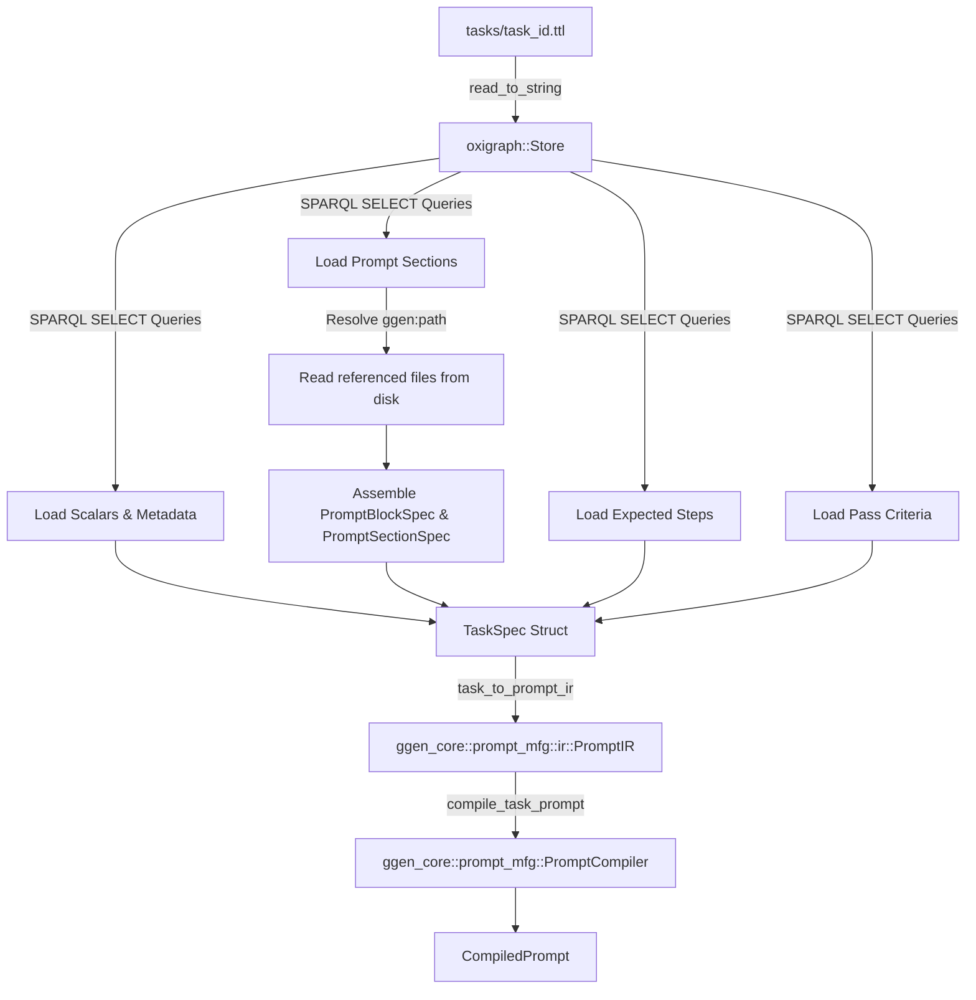
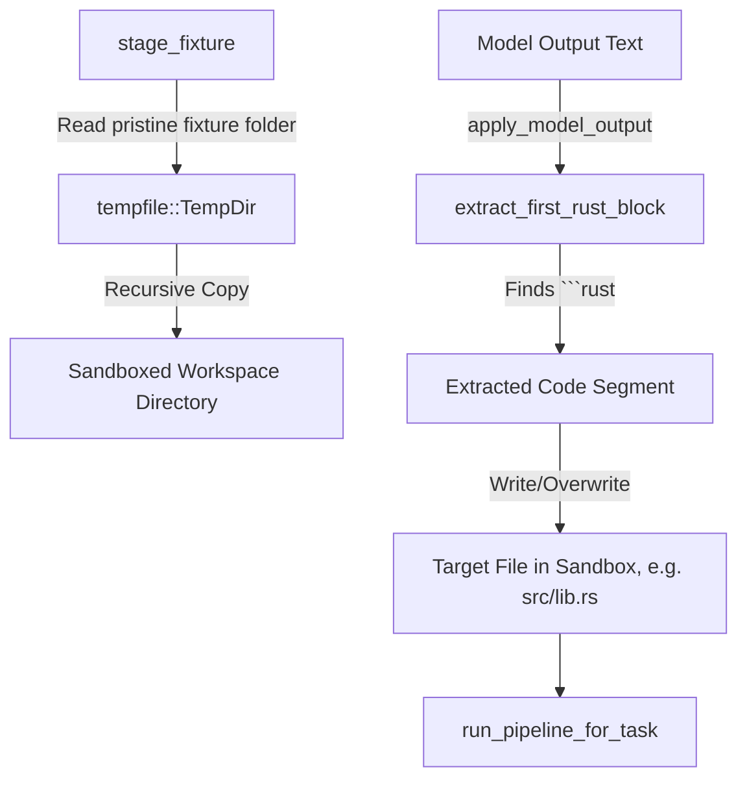
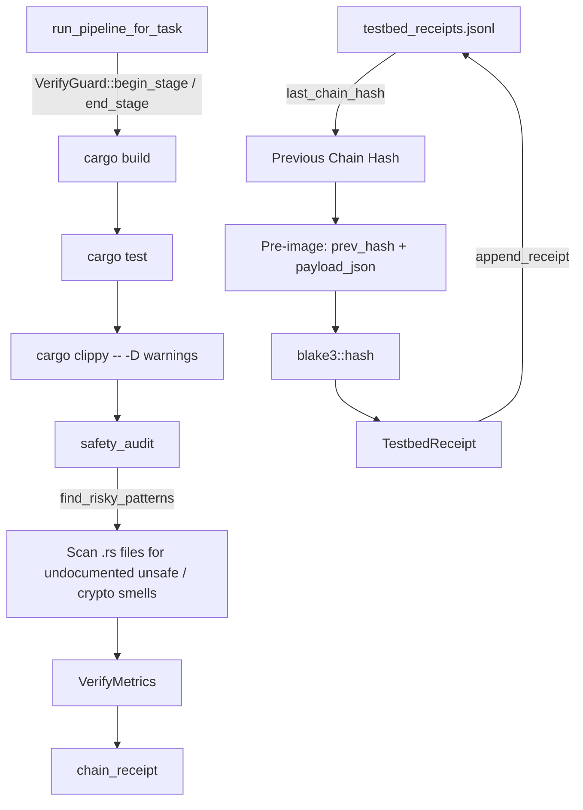

# Crate: `rust-fable-testbed`

Deterministic Rust-eval pipeline designed to test Claude models against real-world, sandboxed Rust scenarios. It acts as both an automated evaluation harness and a human-in-the-loop spec-driven development tool.

---

## 1. Theory and Logic Design

### 1.1 Purpose and Dual-Entry Design
The `rust-fable-testbed` crate is built to evaluate large language models (LLMs) on their ability to reason about, modify, and audit Rust code. It implements a unified, spec-driven workflow where a single declarative task ontology, authored in RDF/Turtle (`.ttl`) format, serves a dual purpose:

1. **Automated Evaluation Harness**: For automated model evaluations, the task ontology is parsed and compiled into a deterministic, hash-addressed prompt. This prompt is dispatched to an LLM. The model's response is captured, parsed for fenced Rust blocks, applied to a isolated and sandboxed workspace staged from a template project, and subjected to a 4-stage build and audit verification pipeline. Results are cryptographically chained and appended to an append-only JSONL ledger.
2. **Spec-Driven Development (Spec-driven-dev)**: For human-in-the-loop or model-driven development workflows, the same task ontology is used to render a human-readable spec brief (`spec.md`) and a checklist of validation tasks (`tasks.md`). The identical verification codebase is executed to check off tasks as compilation and test suites pass, ensuring parity between manual development and automated evaluations.

```
                  ┌──────────────────────┐
                  │  Task Ontology (.ttl)│
                  └──────────┬───────────┘
                             │
              ┌──────────────┴──────────────┐
              ▼                             ▼
   ┌────────────────────┐        ┌────────────────────┐
   │    Eval Harness    │        │  Spec-driven Dev   │
   │      Pipeline      │        │      Workflow      │
   └──────────┬─────────┘        └──────────┬─────────┘
              │                             │
              ▼                             ▼
   ┌────────────────────┐        ┌────────────────────┐
   │Compiled Prompt & IR│        │ spec.md Brief &    │
   │Deterministic Hash  │        │ tasks.md Checklist │
   └──────────┬─────────┘        └──────────┬─────────┘
              │                             │
              └──────────────┬──────────────┘
                             ▼
                 ┌──────────────────────┐
                 │ Verification Sandbox │
                 │ (Cargo + Audits)     │
                 └──────────────────────┘
```

---

### 1.2 Core Concepts

#### 1.2.1 Spec-Driven Validation
All tasks are declared using RDF triples in Turtle format. The ontology relies on two key namespaces:
*   `tb:` (`http://praxis.dev/ns/testbed#`): Defines task-specific terms including the task identifier (`tb:id`), type (`tb:taskType`), difficulty (`tb:difficulty`), default model target (`tb:model`), task description (`tb:description`), source project templates (`tb:fixture`), optional destination write path (`tb:targetPath`), list of pipeline verification stages (`tb:expectedSteps`), and pass conditions (`tb:passCriteria`).
*   `ggen:` (`http://praxis.dev/ns/ggen-prompt#`): Mirrors structures in the `ggen_core` prompt-manufacturing library. It maps the prompt's layout directly in the triples, declaring prompt sections (`role`, `priority`) and content blocks (`Instruction` text, or `Code` pointing to external source files via `ggen:path`).

An in-memory `oxigraph::Store` parses the Turtle file. Real SPARQL SELECT queries walk the loaded graph to extract task properties, resolve blank nodes, traverse RDF lists, and load referenced source file contents. This walked structure is mapped into a `PromptIR` representation.

#### 1.2.2 The Four Task Categories
The crate simulates four realistic, narrative Rust engineering scenarios to evaluate models across different reasoning domains:

1.  **`FunctionLevelBugfix`**: Isolated logic defects localized within a single function. A typical task challenges the model to fix an off-by-one error or boundary condition in a classic algorithm, such as adapting a standard binary search implementation to return the leftmost index when encountering duplicate keys.
2.  **`RepoLevelTranslation`**: Cross-module changes requiring the model to comprehend semantic links and structural definitions across multiple files in a repository. The model must analyze context files provided in the prompt (e.g., a struct definition in `lib.rs` and usage patterns in `area.rs`) to correctly implement or update logic in a separate target file (e.g., `describe.rs`).
3.  **`UnsafeAudit`**: Soundness audits of unsafe Rust code. The task checks if the model can locate and resolve unsound pointer manipulations (such as out-of-bounds pointer offsets or unsafe aliasing) while leaving sound, documented unsafe blocks untouched. The evaluation harness enforces that sound unsafe blocks must be prefixed with a `SAFETY:` or `AUDITED:` comment; undocumented unsafe blocks will trigger audit failures.
4.  **`CryptoCodegen`**: Cryptographic implementation safety. The model is tested on its ability to identify and replace insecure cryptographic practices (such as static initialization vectors, reused nonces in AEAD ciphers like AES-256-GCM, insecure cipher modes like ECB, or weak hash algorithms like MD5/SHA-1) with secure alternatives like cryptographically random nonces sourced from OS entropy.

#### 1.2.3 Mock Model Membrane Interfaces
To allow robust, deterministic integration testing without incurring API latency, network dependencies, or API key requirements, the crate implements a `MockModelClient`. It mimics the Claude model response membrane, allowing tests to configure:
*   A successful text response (e.g., wrapping a corrected source file inside a fenced markdown block).
*   A pre-output refusal response (carrying `stop_reason: "refusal"` and `stop_details` outlining the category and explanation of the refusal).

This mock interface ensures that error recovery, parsing routines, and pipeline gates are fully tested locally.

#### 1.2.4 Sandboxed Execution Environment
To prevent evaluation runs from contaminating the host environment or mutating the original source fixtures, the crate uses an execution sandbox:
1.  **Staging**: The target fixture directory is copied recursively to a unique, temporary folder managed via `tempfile::TempDir`.
2.  **Extraction**: The system searches the model's response for the first fenced markdown block matching `` ```rust ``.
3.  **Application**: The extracted code block is written verbatim to the target path within the temporary directory, overwriting the buggy file.
4.  **Gated Verification**: Cargo build, test, clippy, and safety checks are run entirely within the temporary directory, isolating the host filesystem.

---

## 2. Internal Architecture

### 2.1 File and Module Structure

*   `src/lib.rs`: The entry point for the library. It exposes submodules and defines the shared `Error` enum and `Result<T>` type.
*   `src/spec.rs`: The task-spec loader. It reads `.ttl` files, parses them into an `oxigraph::Store`, runs SPARQL queries to extract fields, reads referenced external files, and constructs a `PromptIR` struct.
*   `src/prompt.rs`: Compiles the `PromptIR` built by `spec.rs` into a `CompiledPrompt` utilizing `ggen_core`. It produces the final prompt content string and its corresponding BLAKE3 hash.
*   `src/model_client.rs`: The HTTP client layer. Defines the `ModelClient` trait and implements `AnthropicClient` (using blocking `reqwest` calls to `POST /v1/messages`) and `MockModelClient`. For Fable-5-class models, it injects adaptive thinking options (`thinking: {"type": "adaptive"}`), server-side fallback arrays (`fallbacks`), and the `anthropic-beta: server-side-fallback-2026-06-01` header.
*   `src/sandbox.rs`: Handles filesystem isolation and patching. Stages copies of fixture folders into temporary directories and overwrites target files with fenced markdown blocks extracted from LLM responses.
*   `src/pipeline.rs`: Runs a verification pipeline containing four sequential steps: `cargo_build`, `cargo_test`, `cargo_clippy`, and `safety_audit`. The stages are monitored by a `VerifyGuard` (from `praxis_core`), which measures duration and outcome. The `safety_audit` stage runs a grep scan to catch undocumented `unsafe` blocks or hardcoded cryptographic smells.
*   `src/receipt.rs`: Implements the BLAKE3 receipt ledger. It chains the verification metrics of the current run to the previous ledger entry using a hash chaining pattern: `chain_hash = blake3(prev_chain_hash || json_payload)`. Appends records to a flat JSONL ledger.
*   `src/specdriven.rs`: Formats the `TaskSpec` and pipeline metrics into markdown files (`spec.md` and `tasks.md`).
*   `src/bin/testbed.rs`: The command-line interface driver. Exposes the `run` command to load, compile, execute, verify, and log evaluation results.

---

### 2.2 Mermaid Architecture Diagrams

#### Diagram 1: Task Spec Loading & Prompt Compilation Flow
Shows how Turtle files are parsed using SPARQL, merged with local code files, and compiled into a deterministic prompt.



#### Diagram 2: Execution Sandbox & Code Patching Flow
Illustrates the isolated staging, parsing of the model output, patching of the sandbox target, and verification.



#### Diagram 3: Pipeline & Receipt Chaining Flow
Traces how sandboxed code is validated through cargo and greppers, then logged to a BLAKE3-hashed chain ledger.



---

## 3. API Signatures, Types, and Code Examples

### 3.1 Public Types and API Signatures

#### 3.1.1 Spec Module Types (`src/spec.rs`)
```rust
use std::path::PathBuf;

/// The four task-type buckets identified by the Rust/Claude research corpus.
#[derive(Debug, Clone, Copy, PartialEq, Eq, PartialOrd, Ord, Hash)]
pub enum TaskType {
    /// Fix a bug confined to a single function.
    FunctionLevelBugfix,
    /// Translate/port a whole repository or module between languages/idioms.
    RepoLevelTranslation,
    /// Audit `unsafe` usage for soundness.
    UnsafeAudit,
    /// Generate cryptographic code.
    CryptoCodegen,
}

/// `tb:passCriteria` — machine-checkable pass conditions for a task.
#[derive(Debug, Clone, Default, PartialEq, Eq)]
pub struct PassCriteria {
    /// `tb:cargoTest` — the exact `cargo test` invocation that must succeed.
    pub cargo_test: Option<String>,
    /// `tb:clippyDenyWarnings` — whether clippy must be run with `-D warnings`.
    pub clippy_deny_warnings: bool,
}

/// The kind of a single prompt content block, plus its resolved textual content.
#[derive(Debug, Clone, PartialEq, Eq)]
pub enum PromptBlockKind {
    /// Free-form instruction text (`ggen:Instruction`).
    Instruction,
    /// A source-code excerpt (`ggen:Code`), tagged with its language.
    Code { language: String },
}

/// One resolved content block within a prompt section.
#[derive(Debug, Clone, PartialEq, Eq)]
pub struct PromptBlockSpec {
    pub kind: PromptBlockKind,
    pub content: String,
    pub source_path: Option<String>,
}

/// One `tb:promptSection` — a role (`system`/`user`/`assistant`/custom) plus its content blocks.
#[derive(Debug, Clone, PartialEq, Eq)]
pub struct PromptSectionSpec {
    pub role: String,
    pub blocks: Vec<PromptBlockSpec>,
}

/// A fully-loaded task specification.
#[derive(Debug, Clone, PartialEq, Eq)]
pub struct TaskSpec {
    pub id: String,
    pub task_type: TaskType,
    pub difficulty: String,
    pub model: String,
    pub description: String,
    pub fixture: PathBuf,
    pub target_path: Option<PathBuf>,
    pub expected_steps: Vec<String>,
    pub pass_criteria: PassCriteria,
    pub prompt_sections: Vec<PromptSectionSpec>,
}

/// Load and fully resolve a task spec from a `.ttl` file.
pub fn load_task(ttl_path: &std::path::Path) -> Result<TaskSpec, SpecError>;

/// Build a `ggen_core::prompt_mfg::ir::PromptIR` from a loaded `TaskSpec`.
pub fn task_to_prompt_ir(task: &TaskSpec) -> ggen_core::prompt_mfg::ir::PromptIR;
```

#### 3.1.2 Prompt Module Types (`src/prompt.rs`)
```rust
/// Compile a task spec's sections into a deterministic CompiledPrompt.
pub fn compile_task_prompt(task: &TaskSpec) -> Result<ggen_core::prompt_mfg::CompiledPrompt>;
```

#### 3.1.3 Model Client Module Types (`src/model_client.rs`)
```rust
use serde::{Deserialize, Serialize};

/// Message turn in a MessageRequest.
#[derive(Debug, Clone, Serialize, Deserialize)]
pub struct Message {
    pub role: String,
    pub content: String,
}

impl Message {
    pub fn user(content: impl Into<String>) -> Self;
}

/// A request structured for the Anthropic Messages API.
#[derive(Debug, Clone)]
pub struct MessageRequest<'a> {
    pub model: &'a str,
    pub max_tokens: u32,
    pub system: Option<&'a str>,
    pub messages: Vec<Message>,
    pub effort: Option<&'a str>,
}

/// A content block in the model response.
#[derive(Debug, Clone, Deserialize)]
pub struct ContentBlock {
    #[serde(rename = "type")]
    pub block_type: String,
    #[serde(default)]
    pub text: Option<String>,
}

/// Refusal details present when stop_reason is "refusal".
#[derive(Debug, Clone, Deserialize)]
pub struct StopDetails {
    #[serde(default)]
    pub category: Option<String>,
    #[serde(default)]
    pub explanation: Option<String>,
}

/// Parsed response from the Messages API.
#[derive(Debug, Clone, Deserialize)]
pub struct ModelResponse {
    #[serde(default)]
    pub model: String,
    pub stop_reason: Option<String>,
    #[serde(default)]
    pub stop_details: Option<StopDetails>,
    #[serde(default)]
    pub content: Vec<ContentBlock>,
}

impl ModelResponse {
    /// Extracts and joins all text content blocks, returning an error on refusals.
    pub fn text(&self) -> Result<String, ModelError>;
}

/// Common trait for sending messages to a model (live or mocked).
pub trait ModelClient {
    fn send(&self, req: &MessageRequest<'_>) -> Result<ModelResponse, ModelError>;
}

/// Blocking, reqwest-based client for the live Anthropic API.
pub struct AnthropicClient { /* private fields */ }

impl AnthropicClient {
    pub fn new(api_key: impl Into<String>) -> Result<Self, ModelError>;
    pub fn from_env() -> Result<Self, ModelError>;
}

/// Mock client for local verification.
pub struct MockModelClient { /* private fields */ }

impl MockModelClient {
    pub fn ok_text(text: &str) -> Self;
    pub fn refusal() -> Self;
}
```

#### 3.1.4 Sandbox Module Types (`src/sandbox.rs`)
```rust
/// Recursively copies a fixture directory to a temporary folder.
pub fn stage_fixture(fixture_dir: &std::path::Path) -> Result<tempfile::TempDir, SandboxError>;

/// Extracts the first fenced ```rust block from model_output and writes it to target_rel_path.
pub fn apply_model_output(
    dir: &std::path::Path,
    target_rel_path: &std::path::Path,
    model_output: &str,
) -> Result<(), SandboxError>;
```

#### 3.1.5 Pipeline Module Types (`src/pipeline.rs`)
```rust
use std::path::PathBuf;

/// Diagnostic finding representing a risky pattern matched in code files.
#[derive(Debug, Clone)]
pub struct RiskyFinding {
    pub file: PathBuf,
    pub line: usize,
    pub pattern: &'static str,
    pub snippet: String,
}

/// Run full cargo build, test, clippy, and safety checks (gated by task type).
pub fn run_pipeline_for_task(
    dir: &std::path::Path,
    task_type: Option<TaskType>,
) -> praxis_core::verify::VerifyMetrics;

/// Non-gated wrapper running all pipeline checks (safety audit always passes).
pub fn run_pipeline(dir: &std::path::Path) -> praxis_core::verify::VerifyMetrics;

/// Walk directory to find undocumented unsafe or suspicious cryptographic code patterns.
pub fn find_risky_patterns(dir: &std::path::Path) -> Vec<RiskyFinding>;
```

#### 3.1.6 Receipt Module Types (`src/receipt.rs`)
```rust
use serde::{Deserialize, Serialize};

/// Ledger record containing evaluation details, metrics, and BLAKE3 hashes.
#[derive(Debug, Clone, PartialEq, Eq, Serialize, Deserialize)]
pub struct TestbedReceipt {
    pub task_id: String,
    pub prompt_hash: String,
    pub model: String,
    pub metrics_summary: String,
    pub prev_chain_hash: String,
    pub chain_hash: String,
}

/// Returns the initial hash for a new ledger chain ("0" repeated 64 times).
pub fn genesis_chain_hash() -> String;

/// Constructs a new receipt chaining to a previous hash, computing the BLAKE3 digest.
pub fn chain_receipt(
    prev_chain_hash: &str,
    task_id: &str,
    prompt_hash: &str,
    model: &str,
    metrics: &praxis_core::verify::VerifyMetrics,
) -> Result<TestbedReceipt, Error>;

/// Appends a receipt as a JSON line to a ledger file.
pub fn append_receipt(ledger_path: &std::path::Path, receipt: &TestbedReceipt) -> Result<(), Error>;

/// Recovers the latest chain hash from an existing ledger, returning genesis if empty.
pub fn last_chain_hash(ledger_path: &std::path::Path) -> Result<String, Error>;
```

#### 3.1.7 SpecDriven Module Types (`src/specdriven.rs`)
```rust
/// Formats a TaskSpec as a markdown document brief (spec.md).
pub fn render_spec_md(task: &TaskSpec) -> String;

/// Renders verification metrics as a markdown checklist (tasks.md).
pub fn render_tasks_md(metrics: &praxis_core::verify::VerifyMetrics) -> String;
```

---

### 3.2 Concrete, Runnable Rust Code Examples

This example illustrates the end-to-end evaluation lifecycle: loading a Turtle spec, generating a prompt, staging a sandbox, applying a mocked model patch, running the test pipeline, and writing a chained audit ledger receipt.

```rust
use std::path::Path;
use rust_fable_testbed::spec::{load_task, TaskType};
use rust_fable_testbed::prompt::compile_task_prompt;
use rust_fable_testbed::model_client::{Message, MessageRequest, MockModelClient, ModelClient};
use rust_fable_testbed::sandbox::{stage_fixture, apply_model_output};
use rust_fable_testbed::pipeline::run_pipeline_for_task;
use rust_fable_testbed::receipt::{chain_receipt, append_receipt, last_chain_hash};

fn main() -> Result<(), Box<dyn std::error::Error>> {
    // 1. Load the Turtle task ontology and compile its prompt.
    // In practice, this ttl file is located in the tasks/ directory.
    let ttl_path = Path::new("crates/rust-fable-testbed/tasks/function_bugfix_001.ttl");
    let task = load_task(ttl_path)?;
    let compiled = compile_task_prompt(&task)?;
    
    println!("Task Loaded: {}", task.id);
    println!("Prompt BLAKE3 Hash: {}", compiled.hash());

    // 2. Initialize a MockModelClient to generate a deterministic patched code output.
    let simulated_response = r#"
Here is the corrected implementation for src/lib.rs:

```rust
/// Search arr (must be sorted ascending) for target, returning the leftmost matching index.
pub fn binary_search(arr: &[i32], target: i32) -> Option<usize> {
    let mut lo = 0;
    let mut hi = arr.len();
    let mut found = None;

    while lo < hi {
        let mid = lo + (hi - lo) / 2;
        if arr[mid] == target {
            found = Some(mid);
            hi = mid; // Narrow search to the left for leftmost index.
        } else if arr[mid] < target {
            lo = mid + 1;
        } else {
            hi = mid;
        }
    }
    found
}
```
"#;
    let client = MockModelClient::ok_text(simulated_response);
    
    // Simulate sending the compiled prompt payload.
    let req = MessageRequest {
        model: &task.model,
        max_tokens: 4096,
        system: None,
        messages: vec![Message::user(compiled.content())],
        effort: None,
    };
    let response = client.send(&req)?;
    let model_text = response.text()?;

    // 3. Stage the task's project template in a clean temporary directory.
    let base_dir = ttl_path.parent().ok_or("Invalid TTL path parent")?;
    let fixture_dir = base_dir.join(&task.fixture);
    let sandbox = stage_fixture(&fixture_dir)?;
    
    // Determine the target file relative to the staged workspace.
    // The model's patch will overwrite the contents of this target file.
    let target_file = Path::new("src/lib.rs");

    // 4. Overwrite the file inside the sandbox using the model output.
    apply_model_output(sandbox.path(), target_file, &model_text)?;

    // 5. Run the verification pipeline (build, test, clippy, safety checks).
    // Gating pipeline stages with task.task_type ensures audits check unsafe rules.
    let metrics = run_pipeline_for_task(sandbox.path(), Some(task.task_type));
    println!("Evaluation results: {}", metrics.summary_line());
    
    if metrics.failed_count > 0 {
        return Err(format!(
            "Pipeline failed at stage: {:?}", 
            metrics.first_failure_stage()
        ).into());
    }

    // 6. Chain the evaluation run to the ledger append log using BLAKE3.
    let ledger_path = Path::new("testbed_receipts.jsonl");
    let prev_hash = last_chain_hash(ledger_path)?;
    let receipt = chain_receipt(
        &prev_hash,
        &task.id,
        compiled.hash(),
        &task.model,
        &metrics,
    )?;
    
    append_receipt(ledger_path, &receipt)?;
    println!("Chained receipt appended. Current Chain Hash: {}", receipt.chain_hash);

    Ok(())
}
```
