# System Diagrams — v26.7.11

Last updated: 2026-07-11

## Purpose

C4 model (Context/Container/Component) plus sequence diagrams for the major flows
built or touched this milestone. These are grounded in the actual code and this
session's adversarial-review findings, not an idealized design — where a flow is
known to be broken or an unwired island, the diagram shows the dead end explicitly
rather than smoothing it over. Cross-reference `ADVERSARIAL_DOD.md` for the evidence
behind every gap marked below.

## C4 Level 1 — System Context

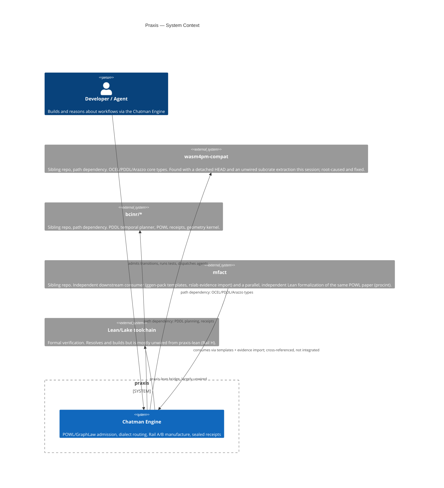
```mermaid
C4Context
  title Praxis — System Context

  Person(dev, "Developer / Agent", "Builds and reasons about workflows via the Chatman Engine")

  System_Boundary(praxis, "praxis") {
    System(engine, "Chatman Engine", "POWL/GraphLaw admission, dialect routing, Rail A/B manufacture, sealed receipts")
  }

  System_Ext(wasm4pm_compat, "wasm4pm-compat", "Sibling repo, path dependency. OCEL/PDDL/Arazzo core types. Found with a detached HEAD and an unwired subcrate extraction this session; root-caused and fixed.")
  System_Ext(bcinr, "bcinr/*", "Sibling repo, path dependency. PDDL temporal planner, POWL receipts, geometry kernel.")
  System_Ext(mfact, "mfact", "Sibling repo. Independent downstream consumer (ggen-pack templates, rslab evidence import) and a parallel, independent Lean formalization of the same POWL paper (procint).")
  System_Ext(lean, "Lean/Lake toolchain", "Formal verification. Resolves and builds but is mostly unwired from praxis-lean (Rail H).")

  Rel(dev, engine, "admits transitions, runs tests, dispatches agents")
  Rel(engine, wasm4pm_compat, "path dependency: OCEL/PDDL/Arazzo types")
  Rel(engine, bcinr, "path dependency: PDDL planning, receipts")
  Rel(engine, lean, "praxis-lean bridge, largely unwired")
  Rel(mfact, engine, "consumes via templates + evidence import; cross-referenced, not integrated")
```

## C4 Level 2 — Containers

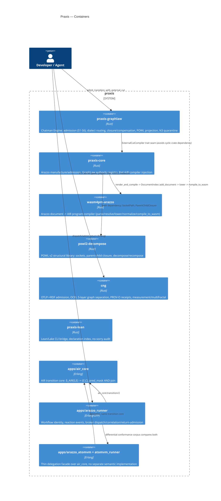
```mermaid
C4Container
  title Praxis — Containers

  Person(dev, "Developer / Agent")

  System_Boundary(praxis, "praxis") {
    Container(graphlaw, "praxis-graphlaw", "Rust", "Chatman Engine: admission (S1-S6), dialect routing, closure/compensation, POWL projection, N3 quarantine")
    Container(core, "praxis-core", "Rust", "Arazzo manufacture/admission, GraphLaw authority registry, Rail A/B compiler injection")
    Container(arazzo, "wasm4pm-arazzo", "Rust", "Arazzo document -> AIR program compiler (parse/resolve/lower/normalize/compile_to_wasm)")
    Container(powl2, "powl2-decompose", "Rust", "POWL v2 structural library: sockets, parent-child closure, decompose/recompose")
    Container(cngc, "cng", "Rust", "OTLP->RDF admission, OCEL 5-layer graph separation, PROV-O receipts, measurement/multifractal")
    Container(pl, "praxis-lean", "Rust", "Lean/Lake CLI bridge, declaration index, no-sorry audit")
    Container(air_core, "apps/air_core", "Erlang", "AIR transition core: δ_AIR(S,E) -> (S',C), pred_mask AND-join")
    Container(runner, "apps/arazzo_runner", "Erlang/OTP", "Workflow identity, reaction events, broker dispatch/correlation/return-admission")
    Container(atomvm, "apps/arazzo_atomvm + atomvm_runner", "Erlang", "Thin delegation facade over air_core, no separate semantic implementation")
  }

  Rel(dev, graphlaw, "admit_transition_with_external_cut")
  Rel(graphlaw, core, "ExternalCutCompiler trait seam (avoids cyclic crate dependency)")
  Rel(core, arazzo, "render_and_compile -> DocumentIndex::add_document -> lower -> compile_to_wasm")
  Rel(core, powl2, "path dependency: SocketPath, ParentChildClosure")
  Rel(dev, cngc, "CLI: admit spans, project OTel->OCEL, measure")
  Rel(dev, runner, "dispatch/admit_return (Erlang)")
  Rel(runner, air_core, "air_core:transition/2")
  Rel(atomvm, air_core, "delegates, same transition core")
  Rel(runner, atomvm, "differential conformance corpus compares both")
```

## C4 Level 3 — Component: Chatman Engine (`praxis-graphlaw/src/chatman/`)

```mermaid
C4Component
  title Praxis-Graphlaw — Chatman Engine Components

  Container_Boundary(chatman, "chatman/") {
    Component(engine, "engine.rs", "ChatmanEngine", "admit_transition (S1-S6), admit_transition_with_external_cut, verify_replay")
    Component(router, "router.rs", "DialectRouter / N3Executor", "dialect admission, N3 cost-bound quarantine, direct-actuation refusal")
    Component(powlproj, "powl_projection.rs", "POWL projection", "admit_powl_model, powl_to_turtle, run_render_model_projection (SPARQL), PDDL temporal tape")
    Component(closure, "closure.rs", "RecursiveSocketClosure", "all_required/quorum(q) closure predicates, ChildCompletionState")
    Component(compensation, "compensation.rs", "CompensationWorkflow", "manufacture_compensation_workflow, append-only CompensationLedger")
    Component(abi, "abi.rs", "Refusal / Receipt", "typed refusal catalog, BLAKE3 receipt construction")
  }

  Container_Ext(core_ext, "praxis-core", "ExternalCutCompiler impl (ChatmanRailAbCompiler)")

  Rel(engine, router, "dialect admission per triple")
  Rel(engine, powlproj, "external-cut detection, digest #10")
  Rel(engine, abi, "constructs EngineProcessReceipt")
  Rel(engine, core_ext, "trait seam: compile()")
  Rel(closure, powlproj, "reuses ParentChildClosure via powl2-decompose")
  Rel(compensation, abi, "BLAKE3 receipt, no rollback()")

  UpdateRelStyle(closure, powlproj, $offsetY="-10")
  Note(note1, "closure.rs / compensation.rs: real, tested, zero production callers today (disclosed island, PROJ-759's own stated scope boundary)", $tags="gap")
```

## Sequence — Rail A/B: External-Cut Admission & Manufacture (real, wired, ALIVE)

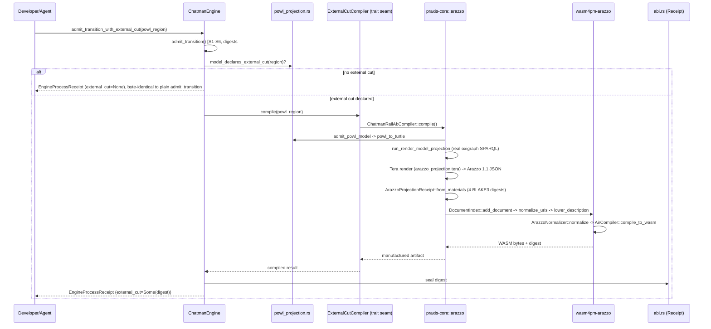
```mermaid
sequenceDiagram
  participant Dev as Developer/Agent
  participant Engine as ChatmanEngine
  participant Powl as powl_projection.rs
  participant Trait as ExternalCutCompiler (trait seam)
  participant Core as praxis-core::arazzo
  participant Arazzo as wasm4pm-arazzo
  participant Abi as abi.rs (Receipt)

  Dev->>Engine: admit_transition_with_external_cut(powl_region)
  Engine->>Engine: admit_transition() [S1-S6, digests #1-#9, unchanged]
  Engine->>Powl: model_declares_external_cut(region)?
  alt no external cut
    Engine-->>Dev: EngineProcessReceipt (external_cut=None), byte-identical to plain admit_transition
  else external cut declared
    Engine->>Trait: compile(powl_region)
    Trait->>Core: ChatmanRailAbCompiler::compile()
    Core->>Powl: admit_powl_model -> powl_to_turtle
    Core->>Core: run_render_model_projection (real oxigraph SPARQL)
    Core->>Core: Tera render (arazzo_projection.tera) -> Arazzo 1.1 JSON
    Core->>Core: ArazzoProjectionReceipt::from_materials (4 BLAKE3 digests)
    Core->>Arazzo: DocumentIndex::add_document -> normalize_uris -> lower_description
    Arazzo->>Arazzo: ArazzoNormalizer::normalize -> AirCompiler::compile_to_wasm
    Arazzo-->>Core: WASM bytes + digest
    Core-->>Trait: manufactured artifact
    Trait-->>Engine: compiled result
    Engine->>Abi: seal digest #10 (external_cut), excluded from the 9-term receipt_root formula
    Engine-->>Dev: EngineProcessReceipt (external_cut=Some(digest))
  end
```

## Sequence — Erlang Dispatch/Broker (found broken this session: dead end, not disclosed before)

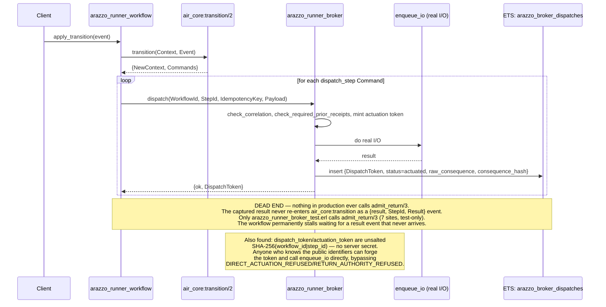
```mermaid
sequenceDiagram
  participant Client
  participant Workflow as arazzo_runner_workflow
  participant Air as air_core:transition/2
  participant Broker as arazzo_runner_broker
  participant IO as enqueue_io (real I/O)
  participant Ledger as ETS: arazzo_broker_dispatches

  Client->>Workflow: apply_transition(event)
  Workflow->>Air: transition(Context, Event)
  Air-->>Workflow: {NewContext, Commands}
  loop for each dispatch_step Command
    Workflow->>Broker: dispatch(WorkflowId, StepId, IdempotencyKey, Payload)
    Broker->>Broker: check_correlation, check_required_prior_receipts, mint actuation token
    Broker->>IO: do real I/O
    IO-->>Broker: result
    Broker->>Ledger: insert {DispatchToken, status=actuated, raw_consequence, consequence_hash}
    Broker-->>Workflow: {ok, DispatchToken}
  end
  Note over Workflow,Ledger: DEAD END — nothing in production ever calls admit_return/3.<br/>The captured result never re-enters air_core:transition as a {result, StepId, Result} event.<br/>Only arazzo_runner_broker_test.erl calls admit_return/3 (7 sites, test-only).<br/>The workflow permanently stalls waiting for a result event that never arrives.
  Note over Broker: Also found: dispatch_token/actuation_token are unsalted<br/>SHA-256(workflow_id|step_id) — no server secret.<br/>Anyone who knows the public identifiers can forge<br/>the token and call enqueue_io directly, bypassing<br/>DIRECT_ACTUATION_REFUSED/RETURN_AUTHORITY_REFUSED.
```

## Sequence — cng OTel→OCEL→Receipt (found this session: self-referential island)

```mermaid
sequenceDiagram
  participant Entry as ??? (no real entry point)
  participant Live as otel-live.rs (only OTel binary)
  participant Rdf as otel_rdf::admit
  participant Ocel as otel_ocel::project_otel_to_ocel
  participant Receipt as otel_receipt::receipt_otel_to_ocel

  Live->>Live: telemetry_gen emits one span
  Live-->>Live: sent externally to Weaver only
  Note over Live,Rdf: otel-live.rs never calls otel_rdf::admit.<br/>The admission gate this binary exists to demonstrate<br/>is never actually invoked by it.

  Note over Entry,Rdf: No caller. Entry point does not exist.
  Entry-->>Rdf: (would be) admit(spans) -> G_OTEL
  Rdf-->>Ocel: (would be) project_otel_to_ocel(store) -> G_OCEL via real SPARQL CONSTRUCT
  Ocel-->>Receipt: (would be) receipt_otel_to_ocel(store) -> 3 digests + PROV-O -> G_RECEIPT

  Note over Rdf,Receipt: Chain calls itself: otel_receipt is the only non-test<br/>caller of otel_ocel, which is the only non-test<br/>caller of otel_rdf. Never reached from main.rs,<br/>pipeline.rs, runner.rs, or otel-live.rs.<br/>Every function is real and tested in isolation;<br/>none is reachable from outside the test tree.
```

## Sequence — Closure & Compensation (PROJ-759, disclosed island, not a surprise finding)

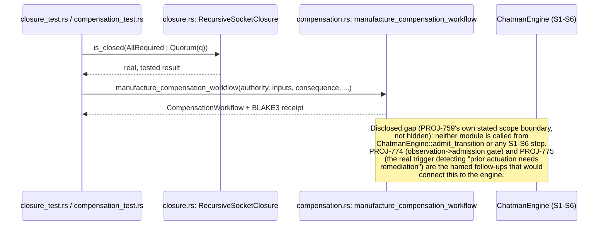
```mermaid
sequenceDiagram
  participant Test as closure_test.rs / compensation_test.rs
  participant Closure as closure.rs: RecursiveSocketClosure
  participant Comp as compensation.rs: manufacture_compensation_workflow
  participant Engine as ChatmanEngine (S1-S6)

  Test->>Closure: is_closed(AllRequired | Quorum(q))
  Closure-->>Test: real, tested result
  Test->>Comp: manufacture_compensation_workflow(authority, inputs, consequence, ...)
  Comp-->>Test: CompensationWorkflow + BLAKE3 receipt

  Note over Engine,Comp: Disclosed gap (PROJ-759's own stated scope boundary,<br/>not hidden): neither module is called from<br/>ChatmanEngine::admit_transition or any S1-S6 step.<br/>PROJ-774 (observation->admission gate) and PROJ-775<br/>(the real trigger detecting "prior actuation needs<br/>remediation") are the named follow-ups that would<br/>connect this to the engine.
```

## Sequence — Replay Verification (gap found by the 80/20 sweep: digest #10 never checked)

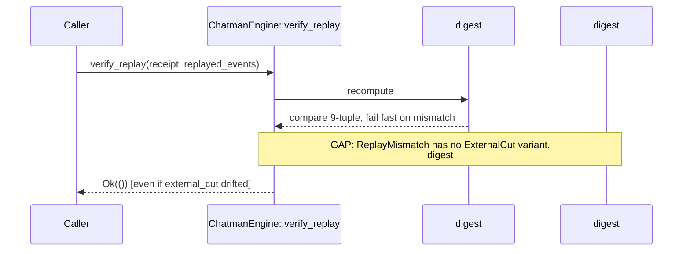
```mermaid
sequenceDiagram
  participant Caller
  participant Engine as ChatmanEngine::verify_replay
  participant Digests as digest #1-#9 (S1-S6 + receipt_root)
  participant Cut as digest #10 (external_cut)

  Caller->>Engine: verify_replay(receipt, replayed_events)
  Engine->>Digests: recompute #1-#9 from replayed events
  Digests-->>Engine: compare 9-tuple, fail fast on mismatch
  Note over Engine,Cut: GAP: ReplayMismatch has no ExternalCut variant.<br/>digest #10 is never recomputed or compared here.<br/>A tampered or drifted manufactured-Arazzo artifact<br/>(different WASM, same S1-S6 state) replays as fully<br/>valid — against the PRD's own "replay mismatch SHALL<br/>be refused, SHALL NOT be logged and ignored" invariant.
  Engine-->>Caller: Ok(()) [even if external_cut drifted]
```

## C4 Level 3 — Component: praxis-core (`crates/praxis-core/src/`)

Grounded by reading `crates/praxis-core/src/arazzo.rs` (1090 lines), `graphlaw_authority.rs` (277 lines), `error.rs` (135 lines), `quarantine.rs` (363 lines), the `ExternalCutCompiler` trait and `admit_transition_with_external_cut` in `praxis-graphlaw/src/chatman/{powl_projection.rs,engine.rs}`, and cross-checked reachability with `grep -rn "ChatmanRailAbCompiler\|admit_transition_with_external_cut\|RiceQuarantine"` across `crates/` plus `docs/jira/v26.7.11/ADVERSARIAL_DOD.md` finding 7 ("`admit_manufactured_arazzo*` has zero production callers").

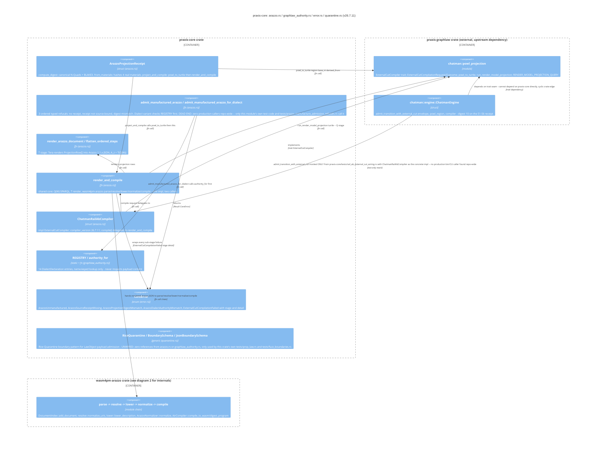
```mermaid
C4Component
title praxis-core: arazzo.rs / graphlaw_authority.rs / error.rs / quarantine.rs (v26.7.11)

Container_Boundary(core, "praxis-core crate") {
  Component(receipt, "ArazzoProjectionReceipt", "struct (arazzo.rs)", "compute_digest: canonical N-Quads + BLAKE3. from_materials: hashes 4 real materials. project_and_compile: powl_to_turtle then render_and_compile")
  Component(admit, "admit_manufactured_arazzo / admit_manufactured_arazzo_for_dialect", "fn (arazzo.rs)", "3 ordered typed refusals: no receipt, receipt not source-bound, digest mismatch. Dialect variant checks REGISTRY first. DEAD END: zero production callers repo-wide -- only this module's own test code and tests/arazzo_manufacture_admission_refusals.rs call it")
  Component(renderT, "render_arazzo_document / flatten_ordered_steps", "fn (arazzo.rs)", "T stage: Tera-renders ProjectionRow[] into Arazzo 1.1.x JSON, A_z = T(Q(W))")
  Component(renderCompile, "render_and_compile", "fn (arazzo.rs)", "shared core: Q(W) SPARQL, T render, wasm4pm-arazzo parse/resolve/lower/normalize/compile - one impl, two callers")
  Component(railab, "ChatmanRailAbCompiler", "struct (arazzo.rs)", "impl ExternalCutCompiler; compiler_version 26.7.11; compile() delegates to render_and_compile")
  Component(authority, "REGISTRY / authority_for", "static + fn (graphlaw_authority.rs)", "14 DialectDeclaration entries, name-keyed lookup only - never inspects payload content")
  Component(errorMod, "CoreError", "enum (error.rs)", "ArazzoUnmanufactured, ArazzoSourceReceiptMissing, ArazzoProjectionDigestMismatch, ArazzoDialectAuthorityMismatch, ExternalCutCompilationFailed with stage and detail")
  Component(quarantine, "RiceQuarantine / BoundarySchema / JsonBoundarySchema", "generic (quarantine.rs)", "Rice Quarantine boundary pattern for LawObject payload admission - UNWIRED: zero references from arazzo.rs or graphlaw_authority.rs, only used by this crate's own tests/prop_law.rs and tests/fuzz_boundaries.rs")
}

Container_Boundary(graphlaw, "praxis-graphlaw crate (external, upstream dependency)") {
  Component(powlproj, "chatman::powl_projection", "module", "ExternalCutCompiler trait; ExternalCutCompilationRequest/Outcome; powl_to_turtle; run_render_model_projection; RENDER_MODEL_PROJECTION_QUERY")
  Component(engine, "chatman::engine::ChatmanEngine", "struct", "admit_transition_with_external_cut envelope, powl_region, compiler - digest 10 on the S1-S6 receipt")
}

Container_Boundary(w4a, "wasm4pm-arazzo crate (see diagram 2 for internals)") {
  Component(w4aPipeline, "parse -> resolve -> lower -> normalize -> compile", "module chain", "DocumentIndex::add_document, resolve::normalize_uris, lower::lower_description, ArazzoNormalizer::normalize, AirCompiler::compile_to_wasm/digest_program")
}

Rel(admit, errorMod, "returns", "Result CoreError")
Rel(admit, authority, "admit_manufactured_arazzo_for_dialect calls authority_for first", "fn call")
Rel(receipt, renderCompile, "project_and_compile calls powl_to_turtle then this", "fn call")
Rel(receipt, powlproj, "powl_to_turtle region base_iri derived_from", "fn call")
Rel(renderCompile, powlproj, "run_render_model_projection turtle -- Q stage", "fn call")
Rel(renderCompile, renderT, "renders projection rows", "fn call")
Rel(renderCompile, w4aPipeline, "hands rendered Arazzo JSON to parse/resolve/lower/normalize/compile", "fn call chain")
Rel(renderCompile, errorMod, "wraps every sub-stage failure", "ExternalCutCompilationFailed stage detail")
Rel(railab, powlproj, "implements", "trait ExternalCutCompiler")
Rel(railab, renderCompile, "compile request delegates to", "fn call")
Rel(engine, powlproj, "depends on trait seam - cannot depend on praxis-core directly, cyclic crate edge", "trait dependency")
Rel(engine, railab, "admit_transition_with_external_cut invoked ONLY from praxis-core/tests/rail_ab_external_cut_wiring.rs with ChatmanRailAbCompiler as the concrete impl -- no production bin/CLI caller found repo-wide", "test-only reach")
```

## C4 Level 3 — Component: wasm4pm-arazzo (`crates/wasm4pm-arazzo/src/`)

Grounded by reading `crates/wasm4pm-arazzo/src/{parse.rs,resolve.rs,lower.rs,temporal.rs,normalizer.rs,compile.rs,air.rs,lib.rs}` in full, grepping every caller of `ReferenceResolver`, `add_documents_par`, `add_documents_from_files_par`, and `add_document_from_file` repo-wide, and cross-checking against `docs/jira/v26.7.11/ADVERSARIAL_DOD.md` (PROJ-753/754/784/810 entries and Tier-1/Tier-2 findings) plus `tickets/index.md` (which has no PROJ-810 entry at all).

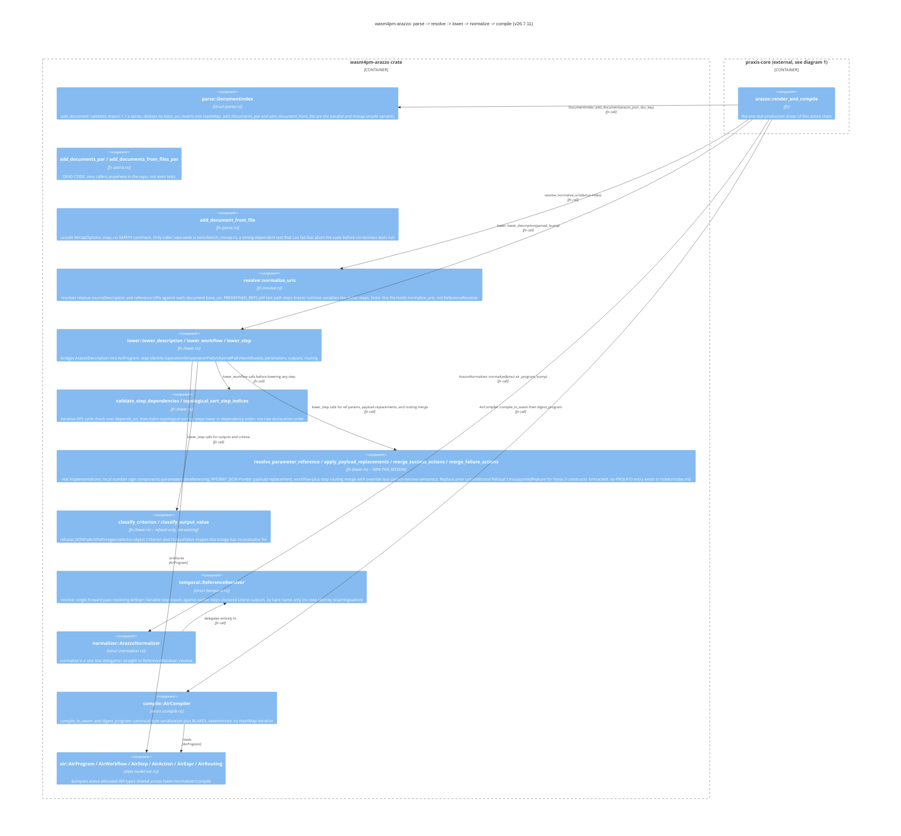
```mermaid
C4Component
title wasm4pm-arazzo: parse -> resolve -> lower -> normalize -> compile (v26.7.11)

Container_Boundary(w4a, "wasm4pm-arazzo crate") {
  Component(parse, "parse::DocumentIndex", "struct (parse.rs)", "add_document: validates Arazzo 1.1.x series, dedups by base_uri, inserts into HashMap. add_documents_par and add_document_from_file are the parallel and mmap-unsafe variants")
  Component(parseDead, "add_documents_par / add_documents_from_files_par", "fn (parse.rs)", "DEAD CODE: zero callers anywhere in the repo, not even tests")
  Component(parseMmap, "add_document_from_file", "fn (parse.rs)", "unsafe MmapOptions::map, no SAFETY comment. Only caller repo-wide is tests/bench_mmap.rs, a timing-dependent test that can fail-fast abort the suite before correctness tests run")
  Component(resolveUri, "resolve::normalize_uris", "fn (resolve.rs)", "resolves relative sourceDescription and reference URIs against each document base_uri; PREDEFINED_REFS phf fast path skips Arazzo runtime variables like dollar-steps. Note: this file holds normalize_uris, not ReferenceResolver")
  Component(lowerDesc, "lower::lower_description / lower_workflow / lower_step", "fn (lower.rs)", "bridges ArazzoDescription into AirProgram: step identity (operationId/operationPath/channelPath/workflowId), parameters, outputs, routing")
  Component(lowerDeps, "validate_step_dependencies / topological_sort_step_indices", "fn (lower.rs)", "iterative DFS cycle check over depends_on, then Kahn topological sort so steps lower in dependency order, not raw declaration order")
  Component(lowerNew, "resolve_parameter_reference / apply_payload_replacements / merge_success_actions / merge_failure_actions", "fn (lower.rs) -- NEW THIS SESSION", "real implementations: local number-sign components-parameters dereferencing, RFC6901 JSON Pointer payload replacement, workflow-plus-step routing merge with override-but-cannot-remove semantics. Replace prior unconditional Refusal::UnsupportedFeature for these 3 constructs. Untracked: no PROJ-810 entry exists in tickets/index.md")
  Component(lowerRefuse, "classify_criterion / classify_output_value", "fn (lower.rs) -- refusal-only, pre-existing", "refuses JSONPath/XPath/regex/selector-object Criterion and OutputValue shapes this bridge has no evaluator for")
  Component(temporal, "temporal::ReferenceResolver", "struct (temporal.rs)", "resolve: single forward pass resolving AirExpr::Variable step inputs against earlier steps declared Literal outputs, by bare name only (no step-identity disambiguation)")
  Component(normalizer, "normalizer::ArazzoNormalizer", "struct (normalizer.rs)", "normalize is a one-line delegation straight to ReferenceResolver::resolve")
  Component(compile, "compile::AirCompiler", "struct (compile.rs)", "compile_to_wasm and digest_program: canonical byte serialization plus BLAKE3, deterministic no HashMap iteration")
  Component(air, "air::AirProgram / AirWorkflow / AirStep / AirAction / AirExpr / AirRouting", "data model (air.rs)", "bumpalo arena-allocated AIR types shared across lower/normalizer/compile")
}

Container_Boundary(core2, "praxis-core (external, see diagram 1)") {
  Component(driver, "arazzo::render_and_compile", "fn", "the one real production driver of this entire chain")
}

Rel(driver, parse, "DocumentIndex::add_document(arazzo_json, doc_key)", "fn call")
Rel(driver, resolveUri, "resolve::normalize_uris(&mut index)", "fn call")
Rel(driver, lowerDesc, "lower::lower_description(parsed, bump)", "fn call")
Rel(driver, normalizer, "ArazzoNormalizer::normalize(&mut air_program, bump)", "fn call")
Rel(driver, compile, "AirCompiler::compile_to_wasm then digest_program", "fn call")
Rel(lowerDesc, air, "produces", "AirProgram")
Rel(lowerDesc, lowerDeps, "lower_workflow calls before lowering any step", "fn call")
Rel(lowerDesc, lowerNew, "lower_step calls for ref params, payload replacements, and routing merge", "fn call")
Rel(lowerDesc, lowerRefuse, "lower_step calls for outputs and criteria", "fn call")
Rel(normalizer, temporal, "delegates entirely to", "fn call")
Rel(compile, air, "reads", "AirProgram")
```

Notes on accuracy corrections found while reading source (not smoothed over):
- The task described `resolve.rs` as holding `ReferenceResolver` — it does not. `resolve.rs` holds `normalize_uris` (URI absolutization). `ReferenceResolver` actually lives in `temporal.rs` and is invoked from `normalizer.rs`. Diagram 2 reflects the real file layout.
- New/real this session (`lower.rs`): `resolve_parameter_reference`, `apply_payload_replacements`, `merge_success_actions`, `merge_failure_actions` — all present as genuine implementations (verified by reading the code, not a summary), replacing what PROJ-753 had left as unconditional `Refusal::UnsupportedFeature`. This work has no ticket entry in `docs/jira/v26.7.11/tickets/index.md` (confirmed via grep) even though `ADVERSARIAL_DOD.md` names it "PROJ-810" and flags it as previously undisclosed/in-flight.
- Two dead ends in `parse.rs`: `add_documents_par`/`add_documents_from_files_par` have zero callers anywhere (not even tests); `add_document_from_file` (the `unsafe` mmap path) is called only from `tests/bench_mmap.rs`.
- `admit_manufactured_arazzo`/`admit_manufactured_arazzo_for_dialect` (praxis-core) have zero production callers repo-wide — only exercised by praxis-core's own test files.
- `ChatmanRailAbCompiler`/`admit_transition_with_external_cut` are genuinely wired end-to-end (confirmed by reading `rail_ab_external_cut_wiring.rs` and `engine.rs:admit_transition_with_external_cut`), but praxis-core ships no `[[bin]]`, so this reach exists only through that integration test, not a production entry point.
- `quarantine.rs`'s `RiceQuarantine`/`BoundarySchema` is a fully separate, unconnected island from the Arazzo pipeline — used only by this crate's own `prop_law.rs`/`fuzz_boundaries.rs` tests (there is also an unrelated, differently-shaped `RiceQuarantine` in `praxis-synthesis`, not conflated here).

## C4 Level 3 — Component: powl2-decompose (`crates/powl2-decompose/src/`)

Grounded in `crates/powl2-decompose/src/{lib.rs,powl.rs,decompose.rs,recompose.rs,net.rs}` and cross-checked by grepping the whole workspace for callers of `convert`, `convert_with_budget`, `recompose`, `.sockets()`, and `.parent_child_closure()`: the Kourani decomposition algorithm (`decompose::convert`) and its inverse (`recompose::recompose`) are exercised only by the crate's own `tests/decompose_tests.rs` — zero callers anywhere else in the workspace. Production code (`praxis-graphlaw::chatman::powl_projection`) builds `Powl` trees directly from PDDL/tape data and never calls `convert` on a real `WfNet`. `Powl::sockets()` and `Powl::parent_child_closure()`/`ParentChildClosure` are likewise reachable only from `powl.rs`'s own `#[cfg(test)] mod socket_tests` and `praxis-graphlaw`'s `chatman/closure_test.rs` — this matches `docs/jira/v26.7.11/ADVERSARIAL_DOD.md`'s PROJ-750 entry, which explicitly discloses "the 'zero downstream consumers' gap remain[s] open."

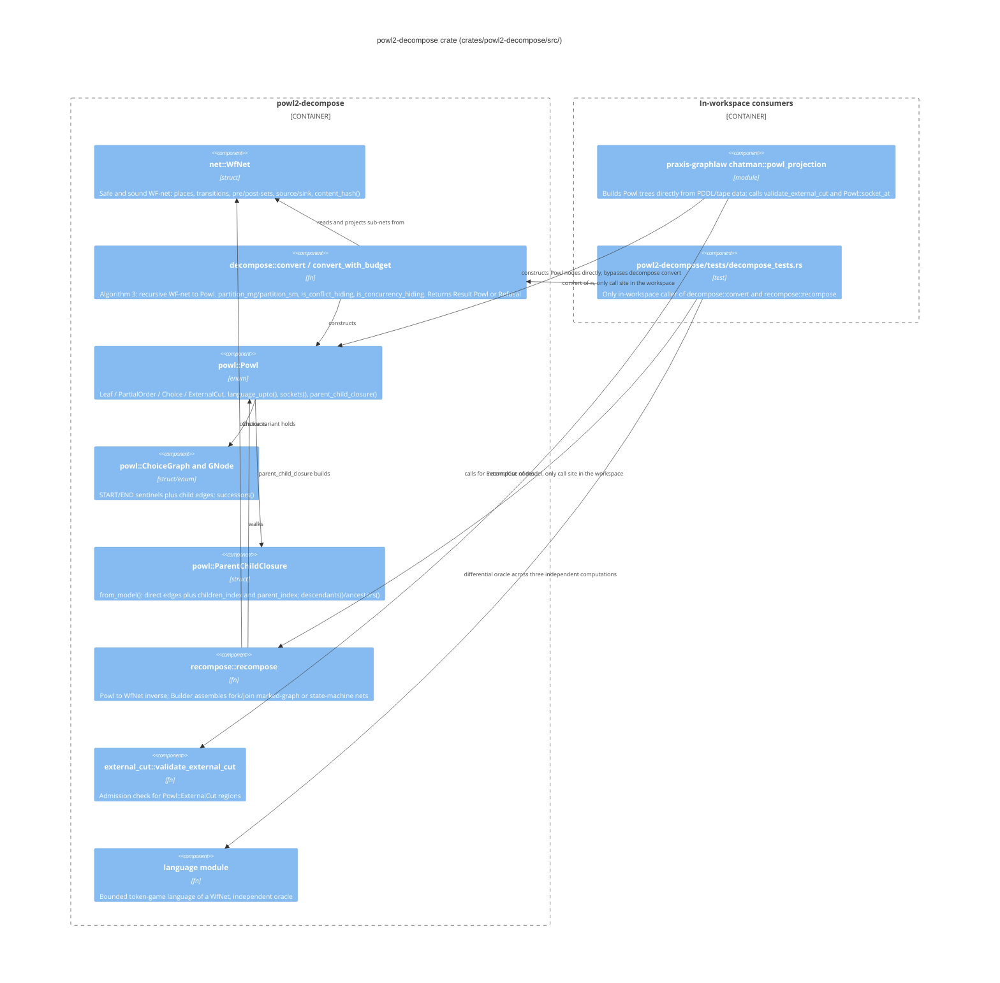
```mermaid
C4Component
  title powl2-decompose crate (crates/powl2-decompose/src/)

  Container_Boundary(crate, "powl2-decompose") {
    Component(net, "net::WfNet", "struct", "Safe and sound WF-net: places, transitions, pre/post-sets, source/sink, content_hash()")
    Component(decompose, "decompose::convert / convert_with_budget", "fn", "Algorithm 3: recursive WF-net to Powl. partition_mg/partition_sm, is_conflict_hiding, is_concurrency_hiding. Returns Result Powl or Refusal")
    Component(powl, "powl::Powl", "enum", "Leaf / PartialOrder / Choice / ExternalCut. language_upto(), sockets(), parent_child_closure()")
    Component(choicegraph, "powl::ChoiceGraph and GNode", "struct/enum", "START/END sentinels plus child edges; successors()")
    Component(closure, "powl::ParentChildClosure", "struct", "from_model(): direct edges plus children_index and parent_index; descendants()/ancestors()")
    Component(recompose, "recompose::recompose", "fn", "Powl to WfNet inverse; Builder assembles fork/join marked-graph or state-machine nets")
    Component(extcut, "external_cut::validate_external_cut", "fn", "Admission check for Powl::ExternalCut regions")
    Component(lang, "language module", "fn", "Bounded token-game language of a WfNet, independent oracle")
  }

  Container_Boundary(consumers, "In-workspace consumers") {
    Component(powlproj, "praxis-graphlaw chatman::powl_projection", "module", "Builds Powl trees directly from PDDL/tape data; calls validate_external_cut and Powl::socket_at")
    Component(testsuite, "powl2-decompose/tests/decompose_tests.rs", "test", "Only in-workspace caller of decompose::convert and recompose::recompose")
  }

  Rel(decompose, net, "reads and projects sub-nets from")
  Rel(decompose, powl, "constructs")
  Rel(recompose, powl, "walks")
  Rel(recompose, net, "constructs")
  Rel(powl, choicegraph, "Choice variant holds")
  Rel(powl, closure, "parent_child_closure builds")
  Rel(powlproj, powl, "constructs Powl nodes directly, bypasses decompose convert")
  Rel(powlproj, extcut, "calls for ExternalCut nodes")
  Rel(testsuite, decompose, "convert of n, only call site in the workspace")
  Rel(testsuite, recompose, "recompose of model, only call site in the workspace")
  Rel(testsuite, lang, "differential oracle across three independent computations")
```

## C4 Level 3 — Component: cng (`crates/cng/src/`)

Grounded in `crates/cng/src/{otel_rdf.rs,otel_ocel.rs,otel_receipt.rs,measurement.rs,bench/multifractal.rs,bench/mod.rs,main.rs,pipeline.rs,runner.rs,bin/otel-live.rs}`, re-verified this session by grepping every function name for non-test callers: `otel_rdf::admit` is called by `project_admitted_spans` (real), but `project_admitted_spans`/`admitted_spans_to_trig` have zero callers outside `otel_rdf`'s own chain; `otel_ocel::project_otel_to_ocel`'s only non-test caller is `otel_receipt::receipt_otel_to_ocel`, which itself has zero non-test callers — confirming `ADVERSARIAL_DOD.md`'s Round 6 correction that PROJ-763/764/765 form a self-contained circle never reached from `main.rs`, `pipeline.rs`, `runner.rs`, or `bin/otel-live.rs` (which emits spans via `telemetry_gen` but never admits them). `measurement.rs`'s three real scales (`Workflow`, `Activity`, and the newly-real `ObjectCentricAggregationLevel`, confirmed present in `measurement.rs` and referenced by `measurement-mass-by-object-type.rq`) are likewise real, SPARQL-backed, and tested in `measurement_test.rs`, but `compute_execution_measure`/`build_measurement_profile` have zero production callers — only a doc-comment mention in `powl.rs`'s `CngRefusal` enum. `bench::multifractal` is a private (`mod`, not `pub mod`) submodule of `bench`; every function in it (`box_masses` through `measure_track2b`/`track2b_tick_tape_ops`) is `pub(super)` and has zero callers anywhere outside its own `multifractal_test.rs`, including inside `bench` itself (`report.rs`/`run.rs` never reference it).

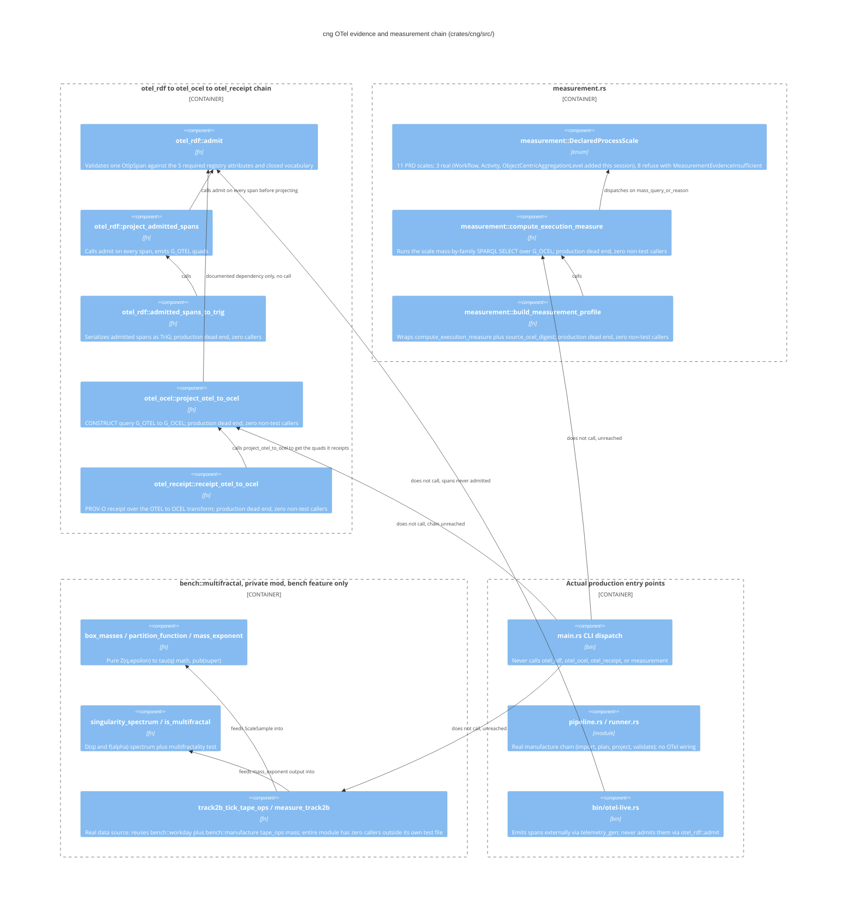
```mermaid
C4Component
  title cng OTel evidence and measurement chain (crates/cng/src/)

  Container_Boundary(chain, "otel_rdf to otel_ocel to otel_receipt chain") {
    Component(admit, "otel_rdf::admit", "fn", "Validates one OtlpSpan against the 5 required registry attributes and closed vocabulary")
    Component(projspans, "otel_rdf::project_admitted_spans", "fn", "Calls admit on every span, emits G_OTEL quads")
    Component(trig, "otel_rdf::admitted_spans_to_trig", "fn", "Serializes admitted spans as TriG; production dead end, zero callers")
    Component(ocel, "otel_ocel::project_otel_to_ocel", "fn", "CONSTRUCT query G_OTEL to G_OCEL; production dead end, zero non-test callers")
    Component(receipt, "otel_receipt::receipt_otel_to_ocel", "fn", "PROV-O receipt over the OTEL to OCEL transform; production dead end, zero non-test callers")
  }

  Container_Boundary(meas, "measurement.rs") {
    Component(scale, "measurement::DeclaredProcessScale", "enum", "11 PRD scales; 3 real (Workflow, Activity, ObjectCentricAggregationLevel added this session), 8 refuse with MeasurementEvidenceInsufficient")
    Component(computemeas, "measurement::compute_execution_measure", "fn", "Runs the scale mass-by-family SPARQL SELECT over G_OCEL; production dead end, zero non-test callers")
    Component(buildprof, "measurement::build_measurement_profile", "fn", "Wraps compute_execution_measure plus source_ocel_digest; production dead end, zero non-test callers")
  }

  Container_Boundary(mfrac, "bench::multifractal, private mod, bench feature only") {
    Component(boxmass, "box_masses / partition_function / mass_exponent", "fn", "Pure Z(q,epsilon) to tau(q) math, pub(super)")
    Component(spectrum, "singularity_spectrum / is_multifractal", "fn", "D(q) and f(alpha) spectrum plus multifractality test")
    Component(track2b, "track2b_tick_tape_ops / measure_track2b", "fn", "Real data source: reuses bench::workday plus bench::manufacture tape_ops mass; entire module has zero callers outside its own test file")
  }

  Container_Boundary(entry, "Actual production entry points") {
    Component(mainrs, "main.rs CLI dispatch", "bin", "Never calls otel_rdf, otel_ocel, otel_receipt, or measurement")
    Component(pipeline, "pipeline.rs / runner.rs", "module", "Real manufacture chain (import, plan, project, validate); no OTel wiring")
    Component(otellive, "bin/otel-live.rs", "bin", "Emits spans externally via telemetry_gen; never admits them via otel_rdf::admit")
  }

  Rel(projspans, admit, "calls admit on every span before projecting")
  Rel(trig, projspans, "calls")
  Rel(ocel, admit, "documented dependency only, no call")
  Rel(receipt, ocel, "calls project_otel_to_ocel to get the quads it receipts")
  Rel(buildprof, computemeas, "calls")
  Rel(computemeas, scale, "dispatches on mass_query_or_reason")
  Rel(track2b, boxmass, "feeds ScaleSample into")
  Rel(track2b, spectrum, "feeds mass_exponent output into")
  Rel(otellive, admit, "does not call, spans never admitted")
  Rel(mainrs, ocel, "does not call, chain unreached")
  Rel(mainrs, computemeas, "does not call, unreached")
  Rel(mainrs, track2b, "does not call, unreached")
```

Files read: `/Users/sac/praxis/crates/powl2-decompose/src/lib.rs`, `powl.rs`, `decompose.rs`, `recompose.rs`, `net.rs`; `/Users/sac/praxis/crates/cng/src/otel_rdf.rs`, `otel_ocel.rs`, `otel_receipt.rs`, `measurement.rs`, `bench/multifractal.rs`, `bench/mod.rs`; `/Users/sac/praxis/docs/jira/v26.7.11/ADVERSARIAL_DOD.md` (PROJ-750, PROJ-763/764 entries) for cross-check against this session's prior findings.

## C4 Level 3 — Component: praxis-lean (`crates/praxis-lean/src/`)

Grounded in a fresh read of `crates/praxis-lean/src/{cli.rs,lean.rs,index.rs,no_sorry.rs,receipt.rs,verbs/l4.rs,lib.rs,main.rs}` and `Cargo.toml`, cross-checked against `docs/jira/v26.7.11/tickets/index.md` (PROJ-768, Rail H: "PARTIAL... Still open: justfile wiring") — no ticket touches `lake_env`.

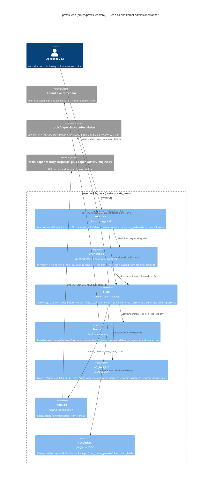
```mermaid
C4Component
title praxis-lean (crates/praxis-lean/src/) -- Lean 4/Lake kernel-admission wrapper

Person(operator, "Operator / CI", "runs the praxis-l4 binary or its cargo test suite")

System_Boundary(bin, "praxis-l4 binary (crate praxis_lean)") {
  Component(main, "main.rs", "binary entrypoint", "feature standalone-cli => clap Cli::parse/run_cli; default (no features) => clap_noun_verb registry.run via linkme")
  Component(verbs, "verbs/l4.rs", "GENERATED clap-noun-verb wrappers", "l4_verify/l4_no_sorry/l4_index_build/l4_reconcile/l4_report/l4_init -- ggen-synced from schema/praxis.ttl")
  Component(cli, "cli.rs", "orchestration module", "VerifyArgs.lake_env: bool, default_value_t=false (standalone-cli); free fns verify/no_sorry/index_build/reconcile/report/init")
  Component(lean, "lean.rs", "toolchain module", "LeanRunner::check_file; LeanToolchain::detect; default_lean_command/default_lake_command -> elan bin")
  Component(nosorry, "no_sorry.rs", "audit module", "NoSorryAudit::audit_file/audit_root; AuditPolicy::default forbid_sorry=true forbid_axiom=true forbid_admit=false")
  Component(index, "index.rs", "corpus-index module", "LeanDeclarationIndex::build_from_corpus")
  Component(receipt, "receipt.rs", "ledger module", "ReceiptLedger::append; VerificationReceipt::from_check, genesis-folded chain_hash")
}

System_Ext(elan, "Lean/Lake toolchain", "elan-managed lean and lake binaries, not on default PATH")
System_Ext(leanlake, "tools/paper-factory/lean-lake/", "pre-existing Lake package, Praxis subdir, about 183 lean files, predates v26.7.11")
System_Ext(pyengine, "tools/paper-factory corpus.ttl plus paper_factory_engine.py", "RDF corpus and its sparql_select helper")

Rel(operator, main, "praxis-l4 verify --root ... optional --lake-env")
Rel(main, verbs, "default build: registry dispatch")
Rel(main, cli, "standalone-cli build: run_cli")
Rel(verbs, cli, "l4_verify positional call into cli::verify")

Rel(cli, lean, "LeanRunner::new(root, lean, lake, lake_env)")
Rel(cli, nosorry, "audit_file per walked lean file")
Rel(cli, receipt, "ledger.append VerificationReceipt")
Rel(cli, leanlake, "walkdir over root for lean files")
Rel(cli, index, "index_build calls build_from_corpus")

Rel(lean, elan, "lake_env false DEFAULT: bare lean file, no lake import resolution")
Rel(lean, elan, "lake_env true requires explicit flag: lake env lean file")

Rel(index, pyengine, "python3 -c script, SPARQL over corpus.ttl")
```

**Footgun still present, confirmed by fresh read this session (`cli.rs:56-57`):**
```rust
#[arg(long, default_value_t = false)]
pub lake_env: bool,
```
`LeanRunner::check_file` (`lean.rs:107-127`) branches on this flag: when `false` (the default in both entrypoints — the `standalone-cli` clap `VerifyArgs` and the default clap-noun-verb `l4_verify` wrapper in `verbs/l4.rs`), it invokes bare `Command::new(&self.lean_command).arg(file)`, never `lake env lean`. Any `.lean` file that imports beyond core Lean (e.g. the scaffolded `Praxis.Core`, or the pre-existing `tools/paper-factory/lean-lake` corpus's own `Praxis` library/Mathlib-adjacent imports) will fail import resolution under this default and get recorded via `VerificationReceipt::from_check` as a real `VerificationStatus`/`FailureClass` (the enum even has a dedicated `FailureClass::MissingImport` variant, `status.rs:34`) — indistinguishable in the ledger from a genuine kernel rejection unless someone remembers to pass `--lake-env` by hand. No ticket in `docs/jira/v26.7.11/tickets/index.md` (PROJ-768/769/770, Rail H) touches this flag; PROJ-768's own status is "**PARTIAL**... Still open: justfile wiring," so there is currently no `just` recipe that would supply `--lake-env` for callers either.

## C4 Level 3 — Component: air_core (`apps/air_core/src/`)

Grounded in `/Users/sac/praxis/apps/air_core/src/air_core.erl` (full file read, 340 lines) — specifically `new/1` (context construction), `transition/2`, `handle_step_completed/3`, `newly_ready_successors/5` (the PROJ-756 AND-join predicate: a successor is ready iff `PredMask band (bnot CompletedMask1) =:= 0`), `handle_step_failed/3` (which never sets `completed_mask`, so Commands is always `[]` on failure), and `bind_outputs/3` → `eval_expr_nif` (the one real Erlang↔Rust bridge, `apps/air_core/native/air_core_nif/src/lib.rs`).

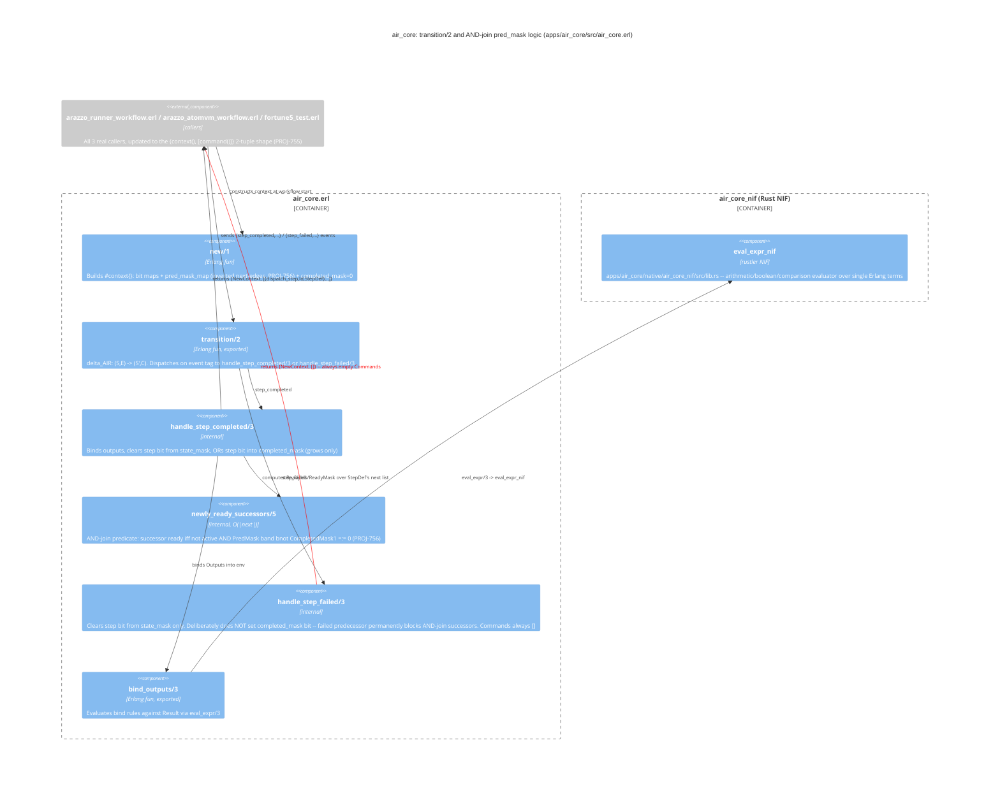
```mermaid
C4Component
title air_core: transition/2 and AND-join pred_mask logic (apps/air_core/src/air_core.erl)

Container_Boundary(air_core, "air_core.erl") {
  Component(new1, "new/1", "Erlang fun", "Builds #context{}: bit maps + pred_mask_map (inverted next-edges, PROJ-756) + completed_mask=0")
  Component(transition2, "transition/2", "Erlang fun, exported", "delta_AIR: (S,E) -> (S',C). Dispatches on event tag to handle_step_completed/3 or handle_step_failed/3")
  Component(hsc, "handle_step_completed/3", "internal", "Binds outputs, clears step bit from state_mask, ORs step bit into completed_mask (grows only)")
  Component(nrs, "newly_ready_successors/5", "internal, O(|next|)", "AND-join predicate: successor ready iff not active AND PredMask band bnot CompletedMask1 =:= 0 (PROJ-756)")
  Component(hsf, "handle_step_failed/3", "internal", "Clears step bit from state_mask only. Deliberately does NOT set completed_mask bit -- failed predecessor permanently blocks AND-join successors. Commands always []")
  Component(bindout, "bind_outputs/3", "Erlang fun, exported", "Evaluates bind rules against Result via eval_expr/3")
}

Container_Boundary(nif, "air_core_nif (Rust NIF)") {
  Component(evalnif, "eval_expr_nif", "rustler NIF", "apps/air_core/native/air_core_nif/src/lib.rs -- arithmetic/boolean/comparison evaluator over single Erlang terms")
}

Component_Ext(caller, "arazzo_runner_workflow.erl / arazzo_atomvm_workflow.erl / fortune5_test.erl", "callers", "All 3 real callers, updated to the {context(), [command()]} 2-tuple shape (PROJ-755)")

Rel(caller, new1, "constructs context at workflow start")
Rel(caller, transition2, "sends {step_completed,...} / {step_failed,...} events")
Rel(transition2, hsc, "step_completed")
Rel(transition2, hsf, "step_failed")
Rel(hsc, nrs, "computes ReadyIds/ReadyMask over StepDef's next list")
Rel(hsc, bindout, "binds Outputs into env")
Rel(bindout, evalnif, "eval_expr/3 -> eval_expr_nif")
Rel(hsc, caller, "returns {NewContext, [{dispatch_step,Id,StepDef}...]}")
Rel(hsf, caller, "returns {NewContext, []} -- always empty Commands")

UpdateRelStyle(hsf, caller, $textColor="red", $lineColor="red")
```

## C4 Level 3 — Component: arazzo_runner (`apps/arazzo_runner/src/`)

Grounded in full reads of `arazzo_runner_workflow.erl`, `arazzo_runner_identity.erl`, and the current `arazzo_runner_broker.erl` (post this session's `admit_return_structure/1`/`required_result_types/1` additions), plus `arazzo_broker.hrl`/`arazzo_runner.hrl`, and cross-checked against `docs/jira/v26.7.11/ADVERSARIAL_DOD.md`'s Tier-1 finding #1. A fresh grep this session (`grep -rn "admit_return\b" apps/`) confirms `admit_return/3` still has **zero production callers** — only `arazzo_runner_broker_test.erl` calls it (16 call sites, all in the test file). The real synchronous path is `apply_transition/4` (`arazzo_runner_workflow.erl:503`) → `broker:dispatch/4` → `do_dispatch/6`, which captures `RawConsequence` into the ETS ledger with `status=actuated` and returns — nothing calls `admit_return/3` afterward to feed that consequence back into `air_core:transition/2`, so a step's completion via the broker path never actually unblocks its AND-join successors in production. This matches, and is not contradicted by, the ADVERSARIAL_DOD.md entry dated 2026-07-11 (today).

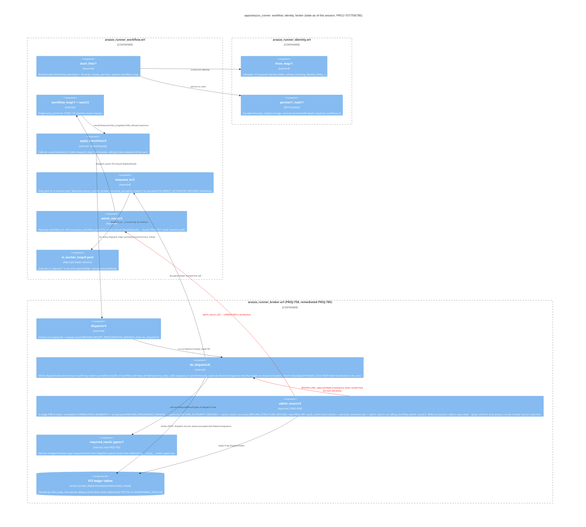
```mermaid
C4Component
title apps/arazzo_runner: workflow, identity, broker (state as of this session, PROJ-757/758/785)

Container_Boundary(workflow, "arazzo_runner_workflow.erl") {
  Component(startlink, "start_link/1", "exported", "Builds/loads #workflow_identity{} + #runner_state{}, persists, spawns workflow_loop")
  Component(loop, "workflow_loop/1 + react/2", "internal", "Single entry point for 9 PRD 7.8 reaction-event classes")
  Component(applyt, "apply_transition/4", "internal, O(next(StepId))", "Calls air_core:transition/2; folds dispatch_step Commands, calling broker:dispatch/4 for each")
  Component(enqueueio, "enqueue_io/2", "exported", "Sole gate to io-worker pool. Requires arazzo_runner_broker:consume_actuation_token/1 to succeed first (DIRECT_ACTUATION_REFUSED otherwise)")
  Component(admitresult, "admit_result/3", "exported", "Resolves workflow_id->Pid via arazzo_workflow_pids ETS, sends {result,StepId,Result} -- reuses PROJ-757 result reaction path")
  Component(ioworkers, "io_worker_loop/0 pool", "Raft-style leader election", "execute_io_request/1 is an echo placeholder: {ok,{processed,Req}}")
}

Container_Boundary(identity, "arazzo_runner_identity.erl") {
  Component(frommap, "from_map/1", "exported", "Validates 10 required identity fields, refuses {missing_identity_fields,_}")
  Component(dets, "persist/1, load/1", "DETS-backed", "Durable #runner_state{} storage, survives process/VM death, keyed by workflow_id")
}

Container_Boundary(broker, "arazzo_runner_broker.erl (PROJ-758, remediated PROJ-785)") {
  Component(dispatch4, "dispatch/4", "exported", "Checks CorrelationId + receipt_head (BROKER_RECEIPT_PRECONDITION_MISSING), then do_dispatch/6")
  Component(dodispatch, "do_dispatch/6", "internal", "Mints dispatch/actuation/return-authority tokens (unsalted sha256 of workflow_id+step_id+idempotency_key), calls enqueue_io synchronously, captures RawConsequence into the ledger as status=actuated, returns {ok,DispatchToken}. Does NOT feed result back to air_core.")
  Component(admitreturn, "admit_return/3", "exported, DEAD END", "6-stage PRD-8 chain: correlation/CORRELATION_MISMATCH -> provenance/RETURN_PROVENANCE_MISSING -> authority/RETURN_AUTHORITY_REFUSED -> admit_return_structure (RETURN_STRUCTURE_REFUSED, new PROJ-785 result_conforms/2 check) -> semantic (unenforced) -> admit_return_ok calling workflow:admit_result/3. ZERO production callers repo-wide -- grep confirms only arazzo_runner_broker_test.erl calls this.")
  Component(reqtypes, "required_result_types/1", "internal, new PROJ-785", "Derives integer/boolean type requirements from StepDef outputs bind-rules referencing __result__ under typed ops")
  ComponentDb(ledger, "ETS ledger tables", "arazzo_broker_dispatches/dedup/tokens/chain_heads", "Owned by infra_loop, non-atomic dedup check-then-insert (disclosed TOCTOU in ADVERSARIAL_DOD.md)")
}

Rel(startlink, frommap, "constructs identity")
Rel(startlink, dets, "persist on start")
Rel(loop, applyt, "result/timeout/child_complete/child_refused reactions")
Rel(applyt, dispatch4, "for every dispatch_step command (synchronous, inline)")
Rel(dispatch4, dodispatch, "on correlation+receipt_head OK")
Rel(dodispatch, reqtypes, "derives RequiredResultTypes at dispatch time")
Rel(dodispatch, enqueueio, "ActuationToken minted this call")
Rel(dodispatch, ledger, "writes D0/D1 dispatch record, status=actuated with RawConsequence")
Rel(enqueueio, ioworkers, "{execute_io,...} round trip, 5s timeout")
Rel(admitreturn, ledger, "reads D by DispatchToken")
Rel(admitreturn, admitresult, "admit_return_ok/1 -- UNREACHED in production")
Rel(admitresult, loop, "dispatch_event Pid {result,StepId,Result}")

UpdateRelStyle(admitreturn, admitresult, $textColor="red", $lineColor="red", $offsetX="-40")

Rel_Back(dodispatch, admitreturn, "MISSING LINK: captured RawConsequence never routed here", "no such call exists")
UpdateRelStyle(dodispatch, admitreturn, $textColor="red", $lineColor="red")
```

## C4 Level 3 — Component: atomvm (`apps/arazzo_atomvm/` + `apps/atomvm_runner/`)

Grounded in full reads of `apps/atomvm_runner/src/atomvm_runner.erl` and `apps/arazzo_atomvm/src/arazzo_atomvm_workflow.erl` — `atomvm_runner` is a pure delegation facade (every export forwards verbatim, no logic of its own); `arazzo_atomvm_workflow:loop/2` calls `air_core:transition/2` directly and matches only the real `{NewCoreState, Commands}` 2-tuple, discarding `Commands` unconsumed (per the module's own comment: PROJ-758's broker is not reachable from this path). The `ok`/`io_request`/`error`/`stop` clauses in both `loop/2` and `loop_waiting_for_io/2` are dead code, confirmed unreachable both before and after PROJ-755.

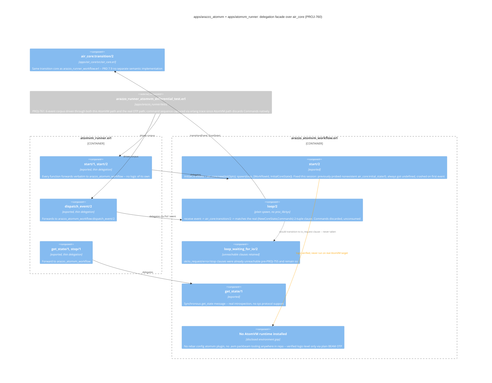
```mermaid
C4Component
title apps/arazzo_atomvm + apps/atomvm_runner: delegation facade over air_core (PROJ-760)

Container_Boundary(facade, "atomvm_runner.erl") {
  Component(afstart, "start/1, start/2", "exported, thin delegation", "Every function forwards verbatim to arazzo_atomvm_workflow -- no logic of its own")
  Component(afdispatch, "dispatch_event/2", "exported, thin delegation", "Forwards to arazzo_atomvm_workflow:dispatch_event/2")
  Component(afget, "get_state/1, stop/1", "exported, thin delegation", "Forward to arazzo_atomvm_workflow")
}

Container_Boundary(wrapper, "arazzo_atomvm_workflow.erl") {
  Component(wfstart, "start/2", "exported", "InitialCoreState = air_core:new(InitOpts); spawn(loop, [WorkflowId, InitialCoreState]). Fixed this session: previously probed nonexistent air_core:initial_state/0, always got undefined, crashed on first event")
  Component(loop, "loop/2", "plain spawn, no proc_lib/sys", "receive event -> air_core:transition/2 -> matches the real {NewCoreState,Commands} 2-tuple clause. Commands discarded, unconsumed")
  Component(loopio, "loop_waiting_for_io/2", "unreachable clauses retained", "ok/io_request/error/stop clauses were already unreachable pre-PROJ-755 and remain so")
  Component(getstate, "get_state/1", "exported", "Synchronous get_state message -- real introspection, no sys protocol support")
  Component(noruntime, "No AtomVM runtime installed", "disclosed environment gap", "No rebar.config atomvm plugin, no .avm packbeam tooling anywhere in repo -- verified logic-level only via plain BEAM OTP")
}

Component(aircore, "air_core:transition/2", "apps/air_core/src/air_core.erl", "Same transition core as arazzo_runner_workflow.erl -- PRD 7.9 no separate semantic implementation")

Component_Ext(difftest, "arazzo_runner_atomvm_differential_test.erl", "apps/arazzo_runner/test/", "PROJ-761: 6-event corpus driven through both this AtomVM path and the real OTP path; command sequence captured via erlang trace since AtomVM path discards Commands natively")

Rel(afstart, wfstart, "delegates")
Rel(afdispatch, loop, "delegates via Pid ! event")
Rel(afget, getstate, "delegates")
Rel(loop, aircore, "transition(Event, CoreState)")
Rel(loop, loopio, "would transition to io_request clause -- never taken")
Rel(difftest, afstart, "drives corpus")
Rel(difftest, afdispatch, "drives corpus")
Rel(wfstart, noruntime, "logic verified, never run on real AtomVM target")

UpdateRelStyle(loop, loopio, $textColor="gray", $lineColor="gray")
UpdateRelStyle(wfstart, noruntime, $textColor="orange", $lineColor="orange")
```

**Files read for grounding** (all absolute paths): `/Users/sac/praxis/apps/air_core/src/air_core.erl`, `/Users/sac/praxis/apps/arazzo_runner/src/arazzo_runner_workflow.erl`, `/Users/sac/praxis/apps/arazzo_runner/src/arazzo_runner_identity.erl`, `/Users/sac/praxis/apps/arazzo_runner/src/arazzo_runner_broker.erl`, `/Users/sac/praxis/apps/arazzo_runner/include/arazzo_broker.hrl`, `/Users/sac/praxis/apps/arazzo_runner/include/arazzo_runner.hrl`, `/Users/sac/praxis/apps/arazzo_atomvm/src/arazzo_atomvm_workflow.erl`, `/Users/sac/praxis/apps/atomvm_runner/src/atomvm_runner.erl`, `/Users/sac/praxis/docs/jira/v26.7.11/ADVERSARIAL_DOD.md`, `/Users/sac/praxis/docs/jira/v26.7.11/tickets/index.md`.

## Sequence — N3 Quarantine Execution (N3Executor: zero production callers, router_test.rs only)

Grounded in `crates/praxis-graphlaw/src/chatman/router.rs` (`N3Executor::run`, checks direct-actuation *before* the builtin whitelist and before `N3CostBound::consume`, per lines 810-862) and `crates/praxis-graphlaw/src/chatman/engine.rs:1039` (the only production caller of `DialectRouter::decide`, which never sets `requires_n3_builtins: true`); `N3Executor::new`/`run` itself has zero production call sites — it is constructed only in `router_test.rs` (17 call sites, confirmed by repo-wide grep).

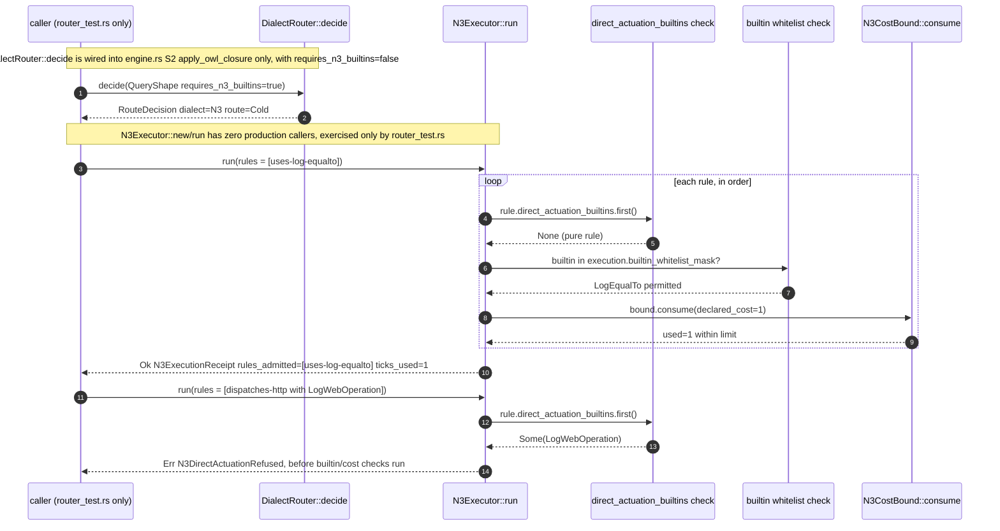
```mermaid
sequenceDiagram
    autonumber
    participant Caller as caller (router_test.rs only)
    participant Router as DialectRouter::decide
    participant Exec as N3Executor::run
    participant Act as direct_actuation_builtins check
    participant BW as builtin whitelist check
    participant CB as N3CostBound::consume

    Note over Caller,Router: DialectRouter::decide is wired into engine.rs S2 apply_owl_closure only, with requires_n3_builtins=false
    Caller->>Router: decide(QueryShape requires_n3_builtins=true)
    Router-->>Caller: RouteDecision dialect=N3 route=Cold

    Note over Caller,Exec: N3Executor::new/run has zero production callers, exercised only by router_test.rs
    Caller->>Exec: run(rules = [uses-log-equalto])
    loop each rule, in order
        Exec->>Act: rule.direct_actuation_builtins.first()
        Act-->>Exec: None (pure rule)
        Exec->>BW: builtin in execution.builtin_whitelist_mask?
        BW-->>Exec: LogEqualTo permitted
        Exec->>CB: bound.consume(declared_cost=1)
        CB-->>Exec: used=1 within limit
    end
    Exec-->>Caller: Ok N3ExecutionReceipt rules_admitted=[uses-log-equalto] ticks_used=1

    Caller->>Exec: run(rules = [dispatches-http with LogWebOperation])
    Exec->>Act: rule.direct_actuation_builtins.first()
    Act-->>Exec: Some(LogWebOperation)
    Exec-->>Caller: Err N3DirectActuationRefused, before builtin/cost checks run
```

## Sequence — PDDL Temporal Planning → POWL Projection (read-only side-door, single integration-test caller)

Grounded in `bcinr-pddl/src/ground.rs:299-370` (`GroundTemporalProblem::find_temporal_plan`), `crates/praxis-graphlaw/src/chatman/engine.rs:1193-1222` (`plan_temporal_tape_for_snapshot`, a read-only side-door whose only caller is the integration test `tests/chatman_pddl_to_powl_temporal_concurrency.rs`), and `crates/praxis-graphlaw/src/chatman/powl_projection.rs:143-209` (`project_temporal_plan_to_powl`), whose `plan.steps.windows(2)` sorted-start-time check was added today in commit `58e1873c` (2026-07-11).

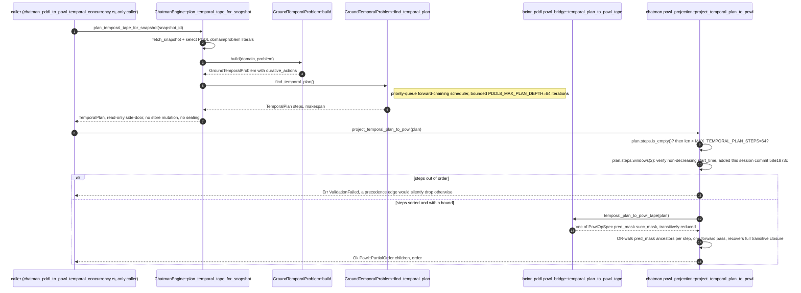
```mermaid
sequenceDiagram
    autonumber
    participant T as caller (chatman_pddl_to_powl_temporal_concurrency.rs, only caller)
    participant Eng as ChatmanEngine::plan_temporal_tape_for_snapshot
    participant GTP as GroundTemporalProblem::build
    participant Plan as GroundTemporalProblem::find_temporal_plan
    participant Bridge as bcinr_pddl powl_bridge::temporal_plan_to_powl_tape
    participant Proj as chatman powl_projection::project_temporal_plan_to_powl

    T->>Eng: plan_temporal_tape_for_snapshot(snapshot_id)
    Eng->>Eng: fetch_snapshot + select PDDL domain/problem literals
    Eng->>GTP: build(domain, problem)
    GTP-->>Eng: GroundTemporalProblem with durative_actions
    Eng->>Plan: find_temporal_plan()
    Note right of Plan: priority-queue forward-chaining scheduler, bounded PDDL8_MAX_PLAN_DEPTH=64 iterations
    Plan-->>Eng: TemporalPlan steps, makespan
    Eng-->>T: TemporalPlan, read-only side-door, no store mutation, no sealing

    T->>Proj: project_temporal_plan_to_powl(plan)
    Proj->>Proj: plan.steps.is_empty()? then len > MAX_TEMPORAL_PLAN_STEPS=64?
    Proj->>Proj: plan.steps.windows(2): verify non-decreasing start_time, added this session commit 58e1873c
    alt steps out of order
        Proj-->>T: Err ValidationFailed, a precedence edge would silently drop otherwise
    else steps sorted and within bound
        Proj->>Bridge: temporal_plan_to_powl_tape(plan)
        Bridge-->>Proj: Vec of PowlOpSpec pred_mask succ_mask, transitively reduced
        Proj->>Proj: OR-walk pred_mask ancestors per step, one forward pass, recovers full transitive closure
        Proj-->>T: Ok Powl::PartialOrder children, order
    end
```

## Sequence — GraphLaw Authority Dialect-Gating (wired into lib.rs this session, unit-test-only caller)

Grounded in `crates/praxis-core/src/graphlaw_authority.rs` (`REGISTRY`/`authority_for`, 14 dialects) and `crates/praxis-core/src/arazzo.rs:242-268` (`admit_manufactured_arazzo_for_dialect`), cross-checked against `docs/jira/v26.7.11/ADVERSARIAL_DOD.md` rows 98-101 (PROJ-777/778): this module was found dead code (not in `lib.rs`'s module tree) earlier in the session, was remediated this session (`pub mod graphlaw_authority;` added to `lib.rs:8`, confirmed present), and `admit_manufactured_arazzo_for_dialect` was added as its first real caller — but that caller is itself, as of this check, exercised only by its own 3 unit tests in `arazzo.rs` (lines 1030-1085); `praxis-graphlaw`'s `chatman/router.rs` still has no dependency on `praxis-core` (confirmed empty `Cargo.toml` grep), so this registry cannot reach the router's own dialect decisions.

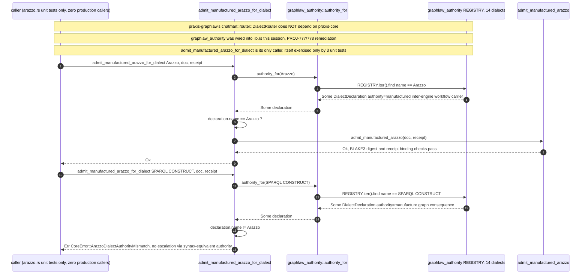
```mermaid
sequenceDiagram
    autonumber
    participant T as caller (arazzo.rs unit tests only, zero production callers)
    participant ADF as admit_manufactured_arazzo_for_dialect
    participant Auth as graphlaw_authority::authority_for
    participant Reg as graphlaw_authority REGISTRY, 14 dialects
    participant AM as admit_manufactured_arazzo

    Note over T,Reg: praxis-graphlaw's chatman::router::DialectRouter does NOT depend on praxis-core
    Note over T,Reg: graphlaw_authority was wired into lib.rs this session, PROJ-777/778 remediation
    Note over T,Reg: admit_manufactured_arazzo_for_dialect is its only caller, itself exercised only by 3 unit tests

    T->>ADF: admit_manufactured_arazzo_for_dialect Arazzo, doc, receipt
    ADF->>Auth: authority_for(Arazzo)
    Auth->>Reg: REGISTRY.iter().find name == Arazzo
    Reg-->>Auth: Some DialectDeclaration authority=manufactured inter-engine workflow carrier
    Auth-->>ADF: Some declaration
    ADF->>ADF: declaration.name == Arazzo ?
    ADF->>AM: admit_manufactured_arazzo(doc, receipt)
    AM-->>ADF: Ok, BLAKE3 digest and receipt binding checks pass
    ADF-->>T: Ok

    T->>ADF: admit_manufactured_arazzo_for_dialect SPARQL CONSTRUCT, doc, receipt
    ADF->>Auth: authority_for(SPARQL CONSTRUCT)
    Auth->>Reg: REGISTRY.iter().find name == SPARQL CONSTRUCT
    Reg-->>Auth: Some DialectDeclaration authority=manufacture graph consequence
    Auth-->>ADF: Some declaration
    ADF->>ADF: declaration.name != Arazzo
    ADF-->>T: Err CoreError::ArazzoDialectAuthorityMismatch, no escalation via syntax-equivalent authority
```

Files read: `/Users/sac/praxis/crates/praxis-graphlaw/src/chatman/router.rs`, `/Users/sac/praxis/crates/praxis-graphlaw/src/chatman/router_test.rs`, `/Users/sac/praxis/crates/praxis-graphlaw/src/chatman/powl_projection.rs`, `/Users/sac/praxis/crates/praxis-graphlaw/src/chatman/engine.rs`, `/Users/sac/bcinr/crates/bcinr-pddl/src/ground.rs`, `/Users/sac/bcinr/crates/bcinr-pddl/src/powl_bridge.rs`, `/Users/sac/praxis/crates/praxis-core/src/graphlaw_authority.rs`, `/Users/sac/praxis/crates/praxis-core/src/arazzo.rs`, `/Users/sac/praxis/crates/praxis-core/src/lib.rs`, `/Users/sac/praxis/docs/jira/v26.7.11/ADVERSARIAL_DOD.md`.

## Sequence — wasm4pm-arazzo Compiler Pipeline (parse→resolve→lower→normalize→compile; WASM bodies are nop-only)

Grounded in `crates/wasm4pm-arazzo/src/{parse,resolve,lower,normalizer,temporal,compile}.rs` (read in full) and the exact call order proven live by `tests/end_to_end_lowering.rs`'s `arazzo_document_parses_resolves_lowers_normalizes_and_compiles_to_wasm` test. `lower.rs` was read fresh for PROJ-810's current function set — `resolve_parameter_reference`, `apply_payload_replacements`, and `merge_success_actions`/`merge_failure_actions` are real, non-refusing code paths as of this session (the module doc explicitly narrates PROJ-753's original unconditional refusals being replaced by these). Note the one real limitation carried into the diagram: `AirCompiler::compile_to_wasm`'s function bodies are `nop`-only placeholders — its own doc comment says this is "NOT a semantic execution of the workflow" and "nothing currently instantiates or executes this module's output."

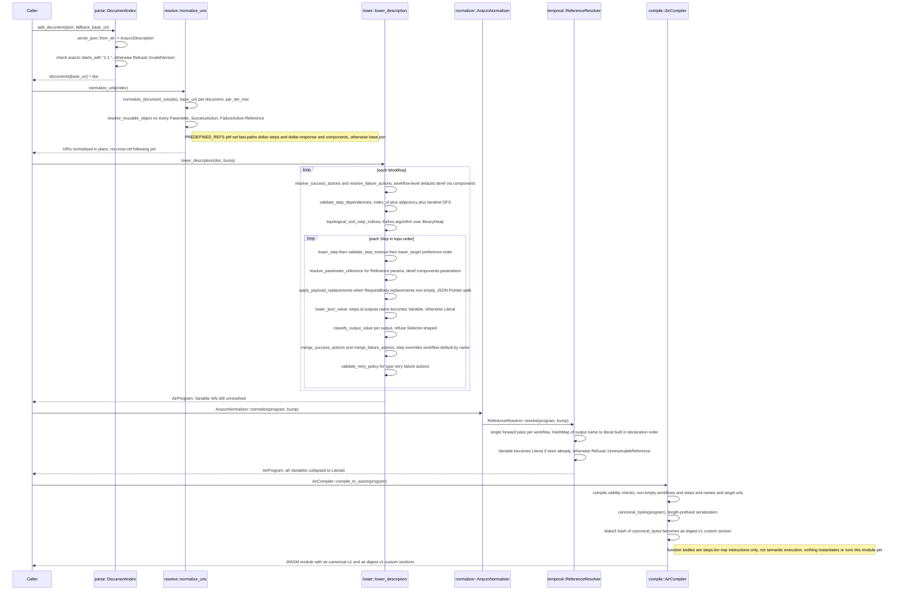
```mermaid
sequenceDiagram
    participant Caller
    participant DocIdx as parse::DocumentIndex
    participant Resolve as resolve::normalize_uris
    participant Lower as lower::lower_description
    participant Norm as normalizer::ArazzoNormalizer
    participant TR as temporal::ReferenceResolver
    participant Compiler as compile::AirCompiler

    Caller->>DocIdx: add_document(json, fallback_base_uri)
    DocIdx->>DocIdx: serde_json::from_str -> ArazzoDescription
    DocIdx->>DocIdx: check arazzo starts_with "1.1.", otherwise Refusal::InvalidVersion
    DocIdx-->>Caller: documents[base_uri] = doc

    Caller->>Resolve: normalize_uris(index)
    Resolve->>Resolve: normalize_document_uris(doc, base_uri) per document, par_iter_mut
    Resolve->>Resolve: resolve_reusable_object on every Parameter, SuccessAction, FailureAction Reference
    Note right of Resolve: PREDEFINED_REFS phf set fast-paths dollar-steps and dollar-response and components, otherwise base.join
    Resolve-->>Caller: URIs normalized in place, no cross-ref following yet

    Caller->>Lower: lower_description(doc, bump)
    loop each Workflow
        Lower->>Lower: resolve_success_actions and resolve_failure_actions, workflow-level defaults deref via components
        Lower->>Lower: validate_step_dependencies, index_of plus adjacency plus iterative DFS
        Lower->>Lower: topological_sort_step_indices, Kahns algorithm over BinaryHeap
        loop each Step in topo order
            Lower->>Lower: lower_step then validate_step_timeout then lower_target preference order
            Lower->>Lower: resolve_parameter_reference for Reference params, deref components.parameters
            Lower->>Lower: apply_payload_replacements when RequestBody.replacements non-empty, JSON Pointer walk
            Lower->>Lower: lower_json_value: steps.id.outputs.name becomes Variable, otherwise Literal
            Lower->>Lower: classify_output_value per output, refuse Selector-shaped
            Lower->>Lower: merge_success_actions and merge_failure_actions, step overrides workflow default by name
            Lower->>Lower: validate_retry_policy for type retry failure actions
        end
    end
    Lower-->>Caller: AirProgram, Variable refs still unresolved

    Caller->>Norm: ArazzoNormalizer::normalize(program, bump)
    Norm->>TR: ReferenceResolver::resolve(program, bump)
    TR->>TR: single forward pass per workflow, HashMap of output name to literal built in declaration order
    TR->>TR: Variable becomes Literal if seen already, otherwise Refusal::UnresolvableReference
    TR-->>Caller: AirProgram, all Variables collapsed to Literals

    Caller->>Compiler: AirCompiler::compile_to_wasm(program)
    Compiler->>Compiler: compile validity checks, non-empty workflows and steps and names and target urls
    Compiler->>Compiler: canonical_bytes(program), length-prefixed serialization
    Compiler->>Compiler: blake3 hash of canonical_bytes becomes air-digest-v1 custom section
    Note right of Compiler: function bodies are steps.len nop instructions only, not semantic execution, nothing instantiates or runs this module yet
    Compiler-->>Caller: WASM module with air-canonical-v1 and air-digest-v1 custom sections
```

## Sequence — OTP/AtomVM Differential Conformance Corpus (PROJ-761, golden-digest cross-check)

Grounded in `apps/arazzo_runner/test/arazzo_runner_atomvm_differential_test.erl`, read in full: the shared `corpus_workflow/0` (6 steps, a real AND-join at `merge`) and `corpus_events/0` (6 events including one genuine failure), `run_otp/2` vs `run_atomvm/2`, the `otp_event/1` translation layer that exists only on the OTP side, the shared `erlang:trace/3` + `return_trace` technique used to observe `air_core:transition/2`'s command output symmetrically (the module doc names this as compensating for a real, disclosed asymmetry — the AtomVM side has no native accessor for its command trail), and the four comparison dimensions (`state_bytes`, `result_bytes`, `refusal_class`, command sequence) plus the golden-digest and 3x-determinism assertions. Confirmed `atomvm_runner` is a thin pass-through to `arazzo_atomvm_workflow` via `apps/atomvm_runner/src/atomvm_runner.erl`.

```mermaid
sequenceDiagram
    participant Harness as arazzo_runner_atomvm_differential_test
    participant OTP as arazzo_runner_workflow
    participant Atom as atomvm_runner and arazzo_atomvm_workflow
    participant Core as air_core:transition/2

    Harness->>Harness: build corpus_workflow, 6 steps: init, gather_a, gather_b, audit, merge, finalize
    Harness->>Harness: build corpus_events, 6 ordered air_core-shaped events
    Note over Harness: audit fails with timeout mid-sequence, merge needs both gather_a and gather_b, a real AND-join

    rect rgb(230,240,255)
    Note over Harness,OTP: OTP path
    Harness->>OTP: run_otp: start_link(otp_start_spec), seeds air_core:new from workflow_def
    Harness->>OTP: erlang:trace(Pid, call) plus trace_pattern on air_core:transition/2 with return_trace
    loop 6 corpus events
        Harness->>Harness: otp_event translates air_core event into result or timeout reaction vocabulary
        Harness->>OTP: dispatch_event(Pid, ReactionEvent)
        OTP->>OTP: react then handle_reaction then apply_transition
        OTP->>Core: transition(Event, Core), traced
        Core-->>OTP: NewCore and dispatch_step Commands
        Harness->>Harness: wait_for_transition_return captures traced return, sorted StepIds become one CommandTrail chunk
    end
    Harness->>OTP: get_runner_state, CoreOtp and CmdOtp
    end

    rect rgb(255,240,230)
    Note over Harness,Atom: AtomVM path
    Harness->>Atom: run_atomvm: atomvm_runner start delegates straight to arazzo_atomvm_workflow start
    Harness->>Atom: erlang:trace(Pid, call) plus trace_pattern on air_core:transition/2 with return_trace
    loop 6 corpus events, unmodified air_core shape, no translation layer
        Harness->>Atom: dispatch_event(Pid, Event)
        Atom->>Core: transition(Event, Core), traced
        Core-->>Atom: NewCore and dispatch_step Commands
        Harness->>Harness: wait_for_transition_return captures traced return, sorted StepIds become one CommandTrail chunk
    end
    Harness->>Atom: get_state, CoreAtom and CmdAtom, then stop(Pid)
    end

    Harness->>Harness: compare command sequence, CmdOtp equals CmdAtom equals EXPECTED_COMMAND_TRAIL
    Harness->>Harness: state_bytes over commands plus sorted ready_steps plus sorted env plus reversed history, blake3_hex via b3sum
    Harness->>Harness: compare state digest, StateOtp equals StateAtom equals GOLDEN_STATE_DIGEST
    Harness->>Harness: result_bytes over sorted env only, compare result digest against GOLDEN_RESULT_DIGEST
    Harness->>Harness: refusal_class from get_history, both sides equal one audit timeout entry
    Harness->>OTP: cross-check, native broker_dispatches trail chunked and sorted equals traced CmdOtp
    Note over Harness: repeats the full comparison 3 independent times from scratch, R1 equals R2 equals R3
```

## Sequence — OTP Runner Identity & Reaction-Event Flow (broker return path never closes the loop)

Grounded in `apps/arazzo_runner/src/arazzo_runner_identity.erl` and `arazzo_runner_workflow.erl` (both read in full), plus `arazzo_runner_sup.erl` (the `restart => transient` child spec) and the crash-recovery proof in `apps/arazzo_runner/test/arazzo_runner_workflow_test.erl` (`test_identity_survives_supervisor_restart`, real `erlang:exit(Pid, kill)` + `supervisor:which_children/1`). The 9 reaction-event classes are exactly the ones `handle_reaction/3`'s own header comment enumerates (`start` handled inline in `start_link/1`, plus 8 more clauses). The dead-end annotation is not inferred — it is `docs/jira/v26.7.11/ADVERSARIAL_DOD.md`'s Tier-1 finding, re-confirmed by reading `arazzo_runner_broker.erl:461-476` (`admit_return_ok/1` does call `arazzo_runner_workflow:admit_result/3`, closing the loop in code) against the ADVERSARIAL_DOD claim that `admit_return/3` itself has zero production callers outside its own test file — a real, still-open production gap as of this session, not smoothed over.

```mermaid
sequenceDiagram
    participant Caller
    participant Sup as arazzo_runner_sup
    participant WF as arazzo_runner_workflow
    participant Id as arazzo_runner_identity, DETS
    participant ETS as arazzo_workflow_states and arazzo_workflow_pids
    participant Core as air_core
    participant Broker as arazzo_runner_broker

    Caller->>Sup: start_workflow(StartSpec), 10 identity fields plus fresh seed fields
    Sup->>WF: start_link(StartSpec), simple_one_for_one child, restart transient
    WF->>WF: setup_infrastructure, ensures ETS tables and io-worker pool, self healing retry
    WF->>Id: from_map(StartSpec), builds workflow_identity or errors invalid_workflow_identity
    WF->>Id: load(WorkflowId), DETS lookup

    alt not_found, fresh workflow
        WF->>Core: air_core:new(workflow_def, active_steps, env, history)
        WF->>WF: RunnerState0 built from fresh Identity plus Core
    else ok Persisted, this is a restart
        Id-->>WF: persisted RunnerState, StartSpec seed fields ignored
    end

    WF->>WF: record_reaction(start), reaction class 1 of 9
    WF->>Id: persist(RunnerState1), DETS insert then sync
    WF->>ETS: insert arazzo_workflow_states
    WF->>WF: spawn_link workflow_loop, new Pid
    WF->>ETS: insert arazzo_workflow_pids
    Sup-->>Caller: ok, Pid

    loop remaining 8 reaction classes: result, timeout, retry_due, dispatch_ready, acknowledgment, child_complete, child_refused, admission_result
        Caller->>WF: dispatch_event(Pid, Event)
        WF->>WF: workflow_loop receives event, react looks up ETS state
        WF->>WF: handle_reaction dispatches on event shape
        opt result or timeout or child_complete or child_refused
            WF->>Core: apply_transition calls air_core transition(Event, Core)
            Core-->>WF: NewCore and dispatch_step Commands
            WF->>Broker: broker dispatch per command, WorkflowId, Identity, StepId, StepDef
            Broker-->>WF: ok Token, or refused Code, or error Reason
        end
        WF->>Id: persist updated RunnerState to DETS
        WF->>ETS: insert updated state
    end
    Note over WF: admission_result refused persists then exits admission_refused, a deliberate normal-adjacent exit, transient restart does not respawn it

    Note over Broker,WF: production dead end, per ADVERSARIAL_DOD.md: broker admit_return has zero production callers, only its own test file and this differential harness call the result path directly, a real io actuation never automatically closes the loop back into a result reaction

    Caller->>WF: erlang:exit(Pid, kill), abnormal untrappable
    WF--xWF: process dies
    Sup->>Sup: simple_one_for_one observes abnormal exit, transient restart fires
    Sup->>WF: start_link with the original pre-crash StartSpec
    WF->>Id: load(WorkflowId), DETS survives even a killed ETS-owning infra process
    Id-->>WF: pre-crash RunnerState reconstructed, identity plus core progress
    WF->>ETS: insert arazzo_workflow_pids, overwrites stale pre-crash Pid
    Sup-->>Caller: new Pid, get_identity returns identity byte identical to before the crash
```

Source files read in full for this task: `/Users/sac/praxis/crates/wasm4pm-arazzo/src/lower.rs`, `resolve.rs`, `normalizer.rs`, `compile.rs`, `temporal.rs`, `parse.rs`, `/Users/sac/praxis/crates/wasm4pm-arazzo/tests/end_to_end_lowering.rs` (lines 1-170), `/Users/sac/praxis/apps/arazzo_runner/test/arazzo_runner_atomvm_differential_test.erl`, `/Users/sac/praxis/apps/arazzo_runner/src/arazzo_runner_identity.erl`, `arazzo_runner_workflow.erl`, `arazzo_runner_sup.erl`, `arazzo_runner_broker.erl` (dispatch/admit_return sections), `/Users/sac/praxis/apps/atomvm_runner/src/atomvm_runner.erl`, `/Users/sac/praxis/apps/arazzo_runner/test/arazzo_runner_workflow_test.erl` (crash-recovery tests), and `/Users/sac/praxis/docs/jira/v26.7.11/ADVERSARIAL_DOD.md` (Tier-1 finding on `admit_return/3`).

## Sequence — cng Measurement/Multifractal Flow (PROJ-766/767, two disjoint test-only pipelines)

Grounded in `crates/cng/src/bench/multifractal.rs` (Track 2b pipeline: `box_masses`, `partition_function`, `linear_regression`, `mass_exponent`/`tau_curve`, `generalized_dimension`, `singularity_spectrum`, `is_multifractal`, `measure_track2b`), `crates/cng/src/bench/multifractal_test.rs` (its only caller), `crates/cng/src/measurement.rs` (module doc, `compute_execution_measure`, `build_measurement_profile`, `project_measurement_profile`), `crates/cng/src/measurement_test.rs` (its only caller), and `docs/jira/v26.7.11/ADVERSARIAL_DOD.md`'s PROJ-767 entry. Both halves are exercised only from their own `_test.rs` files — no production/CLI entry point calls `measure_track2b`, `compute_execution_measure`, `build_measurement_profile`, or `project_measurement_profile` anywhere in the crate (verified by grep excluding the modules' own doc-comment mentions). `measurement.rs`'s module doc explicitly states it "does not compute `Z`/`tau`/`D`/`f(alpha)`" and names wiring PROJ-767's estimator onto its `mu_x` output as "a distinct, not-yet-scoped follow-up, named here rather than silently implied done" — so the two pipelines share no call edge in the source.

```mermaid
sequenceDiagram
    autonumber
    participant T as multifractal_test.rs (only caller found)
    participant M as measure_track2b()
    participant W as workday() bench::workday
    participant MS as manufacture_set() bench::manufacture
    participant BM as box_masses()
    participant TC as tau_curve / mass_exponent
    participant LR as linear_regression()
    participant SS as singularity_spectrum() Legendre transform
    participant IM as is_multifractal()

    rect rgb(235, 245, 255)
    Note over T,IM: Track 2b pipeline, crates/cng/src/bench/multifractal.rs - pub(super), bench-feature only
    T->>M: measure_track2b(out_dir, seed, ticks, epsilon_sweep, q_values)
    M->>W: track2b_tick_tape_ops calls workday(cfg seed/ticks/refusal_per_mille=0)
    W-->>M: ticks/tick-NNNN artifact-set dirs on disk
    loop each tick 0..ticks
        M->>MS: manufacture_set(tick dir)
        MS-->>M: SetOutcome tape_ops, refusal_code
        Note right of M: refusal_code present maps to CNG_R08 Nondeterminism
    end
    Note over M: tick_series is Vec f64 of tape_ops, 1 to 1 with tick index
    loop each epsilon in TRACK2B_EPSILON_SWEEP 1,2,4,8,16,32
        M->>BM: box_masses(tick_series, epsilon)
        BM-->>M: ScaleSample epsilon, masses - chunks summed over total, zero-mass dropped
    end
    loop each q in standard_q_range -5..5 skip q=1
        M->>TC: mass_exponent(scales, q)
        Note right of TC: partition_function(masses,q) equals sum of mu_i to the q, per scale
        TC->>LR: linear_regression of ln epsilon vs ln Z across scales
        LR-->>TC: slope, intercept
        TC-->>M: TauPoint q, tau=slope, points
    end
    M->>SS: singularity_spectrum(tau_points)
    Note right of SS: D(q) = tau over (q-1) via generalized_dimension, at q=1 uses finite-diff alpha(1) LHopital
    Note right of SS: alpha(q) is finite-diff d(tau)/dq, secant through neighboring q. f(alpha) = q times alpha(q) minus tau(q)
    SS-->>M: Vec SpectrumPoint q,tau,d,alpha,f_alpha
    M->>IM: is_multifractal(spectrum, tolerance=1e-3)
    IM-->>M: true or false, spread of D(q) over tolerance
    M-->>T: Track2bMeasurement tick_series, scales, tau_points, spectrum, multifractal
    end

    rect rgb(255, 245, 235)
    participant TT as measurement_test.rs (only caller found)
    participant CEM as compute_execution_measure()
    participant BMP as build_measurement_profile()
    participant PMP as project_measurement_profile()
    Note over TT,PMP: Separate mu_x path, crates/cng/src/measurement.rs PROJ-766 - also test-only caller
    TT->>CEM: compute_execution_measure(store, DeclaredProcessScale)
    Note right of CEM: SPARQL SELECT family,mass over G_OCEL. Only Workflow, Activity, ObjectCentricAggregationLevel have a real query, other 8 scales refuse CNG_R29
    CEM-->>TT: Vec ExecutionMeasure family, mass
    TT->>BMP: build_measurement_profile(store, scale, q_range, fitting_method, min_evidence_threshold)
    BMP->>CEM: compute_execution_measure() reused
    Note right of BMP: source_ocel_digest equals otel_ocel graph_content_digest of G_OCEL, computed not asserted
    BMP-->>TT: MeasurementProfile, Vec ExecutionMeasure
    TT->>PMP: project_measurement_profile(profile, measures)
    PMP-->>TT: Vec Quad asserted into G_RESULT
    end

    Note over M,PMP: measurement.rs's own module doc states this module does not compute Z, tau, D, f(alpha). Wiring PROJ-767's estimator, blue rect, onto this mu_x output, orange rect, is a distinct not-yet-scoped follow-up. The two rects share no call edge anywhere in the source.
```

## Sequence — Lean Verify/Index Flow (missing_file_records unreached from any CLI path)

Grounded in `crates/praxis-lean/src/{cli.rs, lean.rs, index.rs, report.rs, verbs/l4.rs}`: `verify()` walks `.lean` files, calls `LeanRunner::check_file` which shells `lake env lean FILE` (or bare `lean`) and folds each result plus a `NoSorryAudit` finding into a chained `VerificationReceipt`; `index_build()` calls `LeanDeclarationIndex::build_from_corpus`, which shells to a `python3 -c` script running `rdflib`+`paper_factory_engine.sparql_select` (not an in-process Rust SPARQL engine) against `corpus.ttl`, returning JSON parsed into `LeanDeclRecord`s. `missing_file_records()` is defined on `LeanDeclarationIndex` (`index.rs:68`) but its only caller is `VerificationReport::build_with_root` (`report.rs:66`), and grep across the whole crate (including `tests/`) shows `build_with_root` itself has zero callers anywhere — `cli::report()` calls the root-less `VerificationReport::build` instead, so `missing_files` gap detection is source-complete but unreached from any CLI path.

```mermaid
sequenceDiagram
    autonumber
    participant U as caller
    participant CLI as l4.rs verb dispatch
    participant V as cli::verify()
    participant LR as LeanRunner check_file()
    participant Lake as lake env lean file
    participant NS as NoSorryAudit audit_file()
    participant RL as ReceiptLedger append()

    rect rgb(235, 245, 255)
    Note over U,RL: praxis-l4 verify --lake-env, crates/praxis-lean/src/cli.rs verify
    U->>CLI: praxis-l4 verify --lake-env --root DIR --receipts LEDGER
    CLI->>V: cli::verify(lake, lake_env=true, lean, receipts, root)
    V->>LR: LeanRunner::new(root, lean, Some(lake), use_lake_env=true)
    loop each .lean file under root, excluding lakefile.lean
        V->>LR: check_file(rel path)
        LR->>Lake: Command lake env lean FILE, cwd=root
        Lake-->>LR: stdout, stderr, exit code, kernel check result
        LR-->>V: LeanCheck exit_code, success, stdout_hash, stderr_hash
        V->>NS: audit_file(path) sorry, admit, unauthorized axiom scan
        NS-->>V: Vec AuditFinding
        V->>V: VerificationReceipt::from_check builds status from check plus findings, chains prev_chain_hash
        V->>RL: ledger.append(receipt)
        RL-->>V: appended JSONL line
    end
    V-->>U: JSON checked count and per-file status
    end

    rect rgb(235, 255, 240)
    participant U2 as caller
    participant IB as cli::index_build()
    participant PY as python3 subprocess
    participant PFE as paper_factory_engine sparql_select over rdflib Graph
    participant TTL as docs/thesis/rdf/corpus.ttl
    participant IDX as LeanDeclarationIndex
    Note over U2,IDX: praxis-l4 index-build, crates/praxis-lean/src/index.rs build_from_corpus
    U2->>IB: praxis-l4 index-build --corpus TTL --lean-pilot-dir DIR --out OUT --repo-root ROOT
    IB->>PY: LeanDeclarationIndex::build_from_corpus shells out python3 -c script
    PY->>TTL: rdflib Graph parse corpus.ttl turtle
    PY->>PFE: SPARQL SELECT s label kind WHERE s a math Statement, math label, math kind
    PFE-->>PY: rows label, kind, per-statement dependsOn query
    PY-->>IB: JSON array label, kind, dependsOn on stdout
    IB->>IDX: build LeanDeclRecord list, sanitize_label to file_path in lean_pilot_dir
    IDX-->>IB: LeanDeclarationIndex records
    IB->>IDX: index.save(out) writes JSON
    IB-->>U2: JSON record_count, out path
    end

    rect rgb(255, 240, 240)
    participant GAP as LeanDeclarationIndex.missing_file_records()
    Note over GAP: DEAD END - not reached from any CLI path
    Note over GAP: missing_file_records is only called from VerificationReport::build_with_root, in report.rs. cli::report() calls VerificationReport::build (no root) instead, so missing_files always stays empty in the actual report verb. build_with_root itself has zero callers anywhere in the crate, confirmed by grep, including tests.
    end
```

## Status Overview — Rail Structure

Grounded in a fresh read of `docs/jira/v26.7.11/tickets/index.md` (both the full ticket table, lines 1-212, and its "Rail summary" section) cross-checked against `docs/jira/v26.7.11/ADVERSARIAL_DOD.md`'s Round 6 cross-cutting audit (lines 310-365) and `SAFETY_FINDINGS.md`. Rail C/D and Rail F are colored PARTIAL rather than the per-ticket ALIVE the ticket table shows, because Round 6 found that status stale: the Erlang broker's `admit_return/3` (Rail D, PROJ-758) has zero production callers — a dispatched step's success never re-enters `air_core:transition`, so the workflow stalls forever — and `cng`'s OTel→OCEL→receipt chain (Rail F, PROJ-763/764/765) calls itself in a circle but is reached from no real entry point (`main.rs`/`pipeline.rs`/`runner.rs`/`otel-live.rs`), which is the same island the orchestrating session had already flagged. Both are shown as explicit dead-end nodes rather than smoothed into the rail's color. `SAFETY_FINDINGS.md` says its own findings were "remediated the same session" (line 3), so it's shown as a resolved note, not an active blocker, even though the ticket-index header (line 10) still tells agents to read it before touching 755/757/760.

```mermaid
flowchart TD
    RailAB["Rail A/B — Projection + Compilation<br/>750,751,752,753,754,796<br/>ALIVE"]
    AuthReg["Sec11 Authority Registry<br/>777,778<br/>ALIVE"]
    RailCD["Rail C/D — Pure Semantics + Runtime<br/>755,756,757,758,759<br/>PARTIAL (ticket-level ALIVE, Round-6 dead end)"]
    RailE["Rail E — OTP/AtomVM Equivalence<br/>760,761,762<br/>PARTIAL"]
    RailF["Rail F — OTel Evidence<br/>763,764,765<br/>PARTIAL (self-verifying island)"]
    RailG["Rail G — Multifractal Measurement<br/>766,767<br/>ALIVE"]
    RailH["Rail H — Formal Standing (Lean)<br/>768,769,770<br/>PARTIAL"]
    ClosureComp["Closure and Compensation Sec9/10<br/>759,772,773,774,775,776<br/>PARTIAL"]
    N3Refusal["N3 Quarantine + Refusal Catalog Sec12/18<br/>779,780,783,784,785,786,787<br/>PARTIAL"]
    AcceptVerif["Acceptance Scenarios + Verif Ladder Sec19/20<br/>788-795<br/>BLOCKED"]

    DeadEnd1{{"DEAD END Round6: admit_return/3 has zero<br/>production callers - results never re-enter<br/>air_core:transition"}}
    DeadEnd2{{"DEAD END Round6: otel_ocel to otel_receipt chain<br/>calls itself in a circle, never reached from<br/>main.rs/pipeline.rs/runner.rs/otel-live.rs"}}
    SafetyNote["SAFETY_FINDINGS.md apps/ Erlang<br/>found and remediated same session"]

    RailAB --> RailCD
    RailAB --> AuthReg
    RailCD --> RailE
    RailCD --> ClosureComp
    AuthReg --> N3Refusal
    RailCD --> N3Refusal
    RailF --> RailG
    RailCD -.-> DeadEnd1
    RailF -.-> DeadEnd2
    RailCD -.-> SafetyNote

    ClosureComp --> AcceptVerif
    N3Refusal --> AcceptVerif
    RailE --> AcceptVerif
    RailG --> AcceptVerif
    RailH --> AcceptVerif

    classDef alive fill:#1b7f3a,stroke:#0d4d20,color:#fff
    classDef partial fill:#c98a12,stroke:#7a5209,color:#fff
    classDef blocked fill:#b3261e,stroke:#6e1712,color:#fff
    classDef planned fill:#6b6f76,stroke:#3f4247,color:#fff
    classDef deadend fill:#3a0d0d,stroke:#ff4d4d,color:#ff9d9d,stroke-width:2px
    classDef note fill:#2a2a2a,stroke:#888,color:#ddd

    class RailAB,AuthReg,RailG alive
    class RailCD,RailE,RailF,ClosureComp,N3Refusal,RailH partial
    class AcceptVerif blocked
    class DeadEnd1,DeadEnd2 deadend
    class SafetyNote note
```

## Status Overview — Verification Ladder Gates

Grounded in a fresh re-read of `tickets/index.md` rows 792-795 (all still show status `BLOCKED` with unchanged dependency lists) plus a grep of `ADVERSARIAL_DOD.md` confirming zero remediation entries exist for 792/793/794/795 — nothing changed on this specific gate set since earlier today. Dependency edges are the ticket table's literal `Dependencies` column, not inferred. PROJ-758 is carried over as an input to both the chaos suite and the benchmark suite even though it's ticket-status ALIVE, because that's exactly the ticket the Round 6 audit found has a production dead end (`admit_return/3` never called) — meaning once 792/794 are unblocked, they'd initially be chaos-testing/benchmarking a broker whose return path doesn't actually close the loop.

```mermaid
flowchart TD
    T756["PROJ-756 AIR AND/Join + Golden Corpus<br/>ALIVE"]
    T757["PROJ-757 OTP Runner + Restart-Replay<br/>ALIVE"]
    T758["PROJ-758 Broker Dispatch/Correlation<br/>ALIVE (dead end, see below)"]
    T760["PROJ-760 AtomVM Wrapper<br/>ALIVE"]
    T767["PROJ-767 Multifractal Estimator<br/>ALIVE"]
    T770["PROJ-770 Lean Negative Fixtures + Verifier Field<br/>PLANNED"]
    T791["PROJ-791 Acceptance: Equivalence and Evidence Sec19.10-12<br/>PARTIAL (19.11 gap open)"]

    T792["PROJ-792 Chaos Test Suite, 10 failure modes<br/>Sec20 PRD.md:965-980<br/>BLOCKED"]
    T793["PROJ-793 Stress Profile and Declared Limits<br/>Sec20 PRD.md:982-993<br/>BLOCKED"]
    T794["PROJ-794 9-Benchmark Suite<br/>Sec20 PRD.md:995-1009<br/>BLOCKED"]
    T795["PROJ-795 Verifier Report Generator, 13 fields<br/>Sec20 PRD.md:1011-1027<br/>BLOCKED"]

    DeadEnd{{"Round 6 finding: broker admit_return/3 has zero<br/>production callers - dispatch results never<br/>re-enter air_core:transition"}}

    T756 --> T792
    T757 --> T792
    T758 --> T792
    T758 -.-> DeadEnd
    T792 --> T793

    T756 --> T794
    T760 --> T794
    T758 --> T794
    T767 --> T794

    T791 --> T795
    T792 --> T795
    T793 --> T795
    T794 --> T795
    T770 --> T795

    classDef alive fill:#1b7f3a,stroke:#0d4d20,color:#fff
    classDef partial fill:#c98a12,stroke:#7a5209,color:#fff
    classDef blocked fill:#b3261e,stroke:#6e1712,color:#fff
    classDef planned fill:#6b6f76,stroke:#3f4247,color:#fff
    classDef deadend fill:#3a0d0d,stroke:#ff4d4d,color:#ff9d9d,stroke-width:2px

    class T756,T757,T758,T760,T767 alive
    class T791 partial
    class T770 planned
    class T792,T793,T794,T795 blocked
    class DeadEnd deadend
```

Sources read this session: `/Users/sac/praxis/docs/jira/v26.7.11/tickets/index.md` (full 212 lines), `/Users/sac/praxis/docs/jira/v26.7.11/ADVERSARIAL_DOD.md` (full 461 lines), `/Users/sac/praxis/docs/jira/v26.7.11/SAFETY_FINDINGS.md` (headers only, to confirm remediation status).

## Reading this document

Every "dead end" / "GAP" note above is backed by a specific finding in `ADVERSARIAL_DOD.md`
(the Fortune-5 audit section) or the 80/20 sweep — grep those documents for the exact
file:line evidence rather than trusting the diagram alone. These diagrams will drift from
reality as remediation lands; treat them as a snapshot dated at the top of this file, not
a living contract.

## See also

- `tickets/index.md` — the full ticket table.
- `ADVERSARIAL_DOD.md` — per-ticket findings, including the Fortune-5 audit that surfaced
  the broker dead-end, the auth-bypass, and the cng island.
- `PRD.md` — the specification these flows implement.
